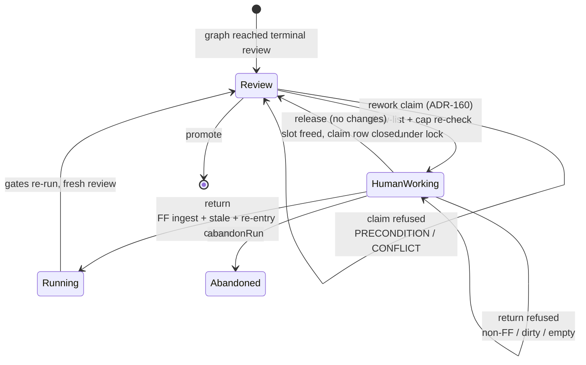
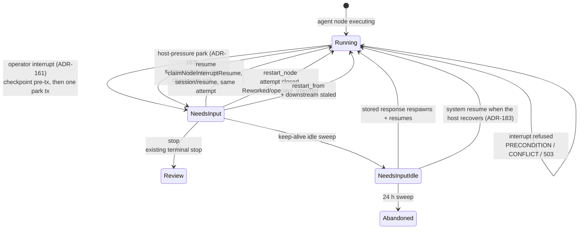
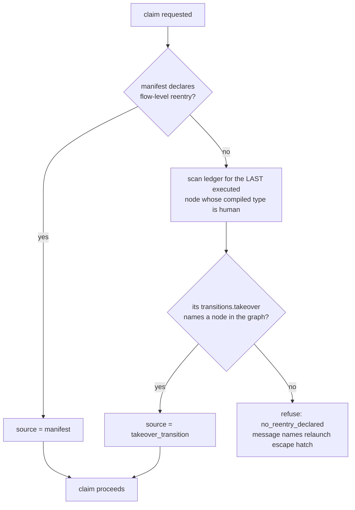
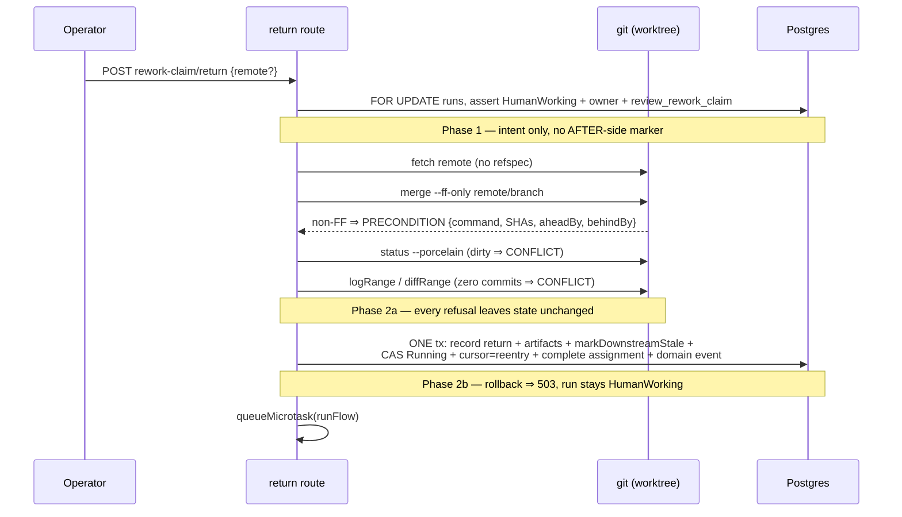
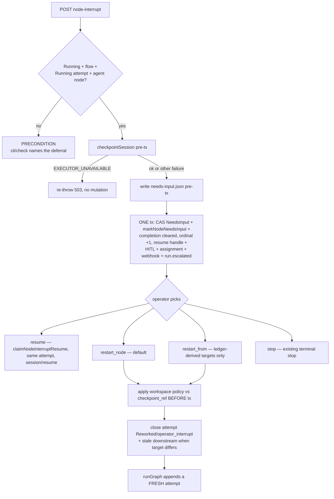
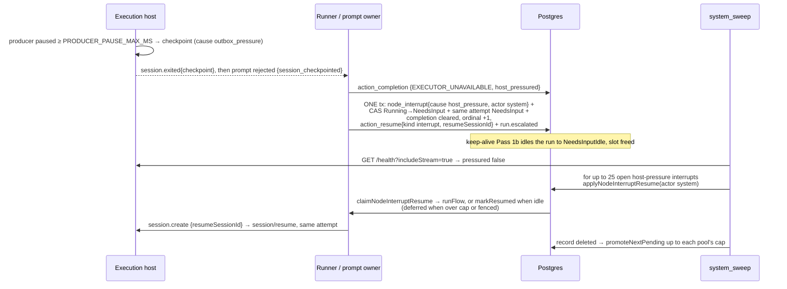

# Run continuation domain

> **Status: Implemented (ADR-160 / ADR-161).** Both halves are shipped — the
> `Review` rework claim (eligibility, claim/return/release, fast-forward-only
> ingest, re-entry resolution, the owner carve-out, and the claim/return domain
> events behind migration `0125`) and the operator node interrupt (the
> `node_interrupt` HITL, the server-owned option matrix, the corrective
> restart, and the accounting rules that keep it out of the rework budget and
> both correction counters).

## Purpose

**Run continuation** covers the two operator-initiated ways to put an already-
launched flow run back under the graph's control after it has left the agent's
hands. **(A) Rework claim** (Implemented — [ADR-160](../decisions.md#adr-160-review-run-rework-claim-with-fast-forward-only-handoff-round-trip))
takes a run that reached `Review`, hands its existing worktree to a human, ingests
whatever they push back by fast-forward only, and re-enters the graph at a
server-resolved node so the flow's own gates re-validate the new commits.
**(B) Node interrupt** (Implemented — [ADR-161](../decisions.md#adr-161-operator-node-interrupt-with-corrective-restart))
pauses one live agent node mid-turn and offers a corrective restart. The domain
boundary is the operator's re-entry into a run's own graph: eligibility, the claim
ledger row, the fast-forward ingest, re-entry resolution, the interrupt option
matrix, and the accounting rules that keep both invisible to rework budgets and
correction metrics. It does **not** cover the `NeedsInput`-parked reviewer handoff
([`manual-takeover.md`](manual-takeover.md) — ADR-030, Implemented), branch
rebase/merge onto a moved target ([`branch-sync.md`](branch-sync.md) — ADR-141,
Implemented), promotion ([`readiness.md`](readiness.md)), or workspace removal
([`workbench-lifecycle.md`](workbench-lifecycle.md)).

## Domain entities

- **Rework claim** (Implemented) — a run transition `Review → HumanWorking`
  (`runs.status`). Session-less; **acquires** a concurrency slot, because
  `countLiveRuns` counts `Running|NeedsInput|HumanWorking` and `Review` is
  slot-free.
- **Claim attempt row** (Implemented) — a takeover-shaped `node_attempts` row
  appended at the **last executed node**, carrying `owner_user_id` and
  `decision='review_rework_claim'`. That `decision` value is the only thing
  distinguishing it from an ADR-030 takeover row. Persisted in
  [`db/runs-domain.md`](../db/runs-domain.md).
- **Re-entry node** (Implemented) — the graph node the run resumes at, resolved
  server-side by the ordered chain in *Process flows*. Never operator-chosen.
- **Flow-level `reentry` field** (Implemented) — an optional manifest key beside
  `nodes`, engine floor `3.5.0`, compile-validated against the graph. Compile-time
  only; never persisted to a DB column. See [`flow-dsl.md`](../flow-dsl.md).
- **Node interrupt request** (Implemented) — a `hitl_requests` row with
  `kind='node_interrupt'` plus its `assignments` row with
  `action_kind='node_interrupt'`. Neither column has a DB CHECK; both enums live
  in the Drizzle `text(..., { enum: [...] })` type.
  Its `schema` jsonb carries `cause` (`operator | host_pressure`) and `actor`
  (`{type: "user", id}` or `{type: "system"}`); a `resume` answer's `response`
  records `{optionId, actor, cause}` (Implemented — ADR-183). The option matrix
  is still computed on every read, so the extra keys are inert.
- **Interrupt resume handle** (Implemented — ADR-183) — every interrupt park
  clears `action_completion` and advances `action_prompt_ordinal`; when the
  parked prompt ran on a session incarnation it also writes
  `node_attempts.action_resume = {version: 1, kind: "interrupt", cause,
  sourceCommandId, sourceAssignmentId, assignmentId, promptOrdinal,
  resumeSessionId}` on the parked attempt, so a `resume` re-enters the node with
  `session/resume` on the same ACP session. With no incarnation (a refused
  create or prompt) it writes no handle and the resume starts fresh.
- **Operator restart attempt** (Implemented) — a `node_attempts` row closed
  `Reworked` with `decision='operator_interrupt'`. Excluded from
  `rework.maxLoops` accounting and from both Observatory correction counters.
- **Domain events** (Implemented for ADR-160; ADR-161 reuses `run.escalated`) — `run.rework_claimed` and `run.rework_returned`
  (migration `0125` extends `domain_events_kind_check` to 13 kinds). The interrupt
  reuses the existing `run.escalated` with `reason='node_interrupt'`. See
  [`domain-events.md`](domain-events.md).

## State machine

Feature A — the rework claim round-trip (Implemented):

```mermaid
stateDiagram-v2
    [*] --> Review: graph reached terminal review
    Review --> HumanWorking: rework claim (ADR-160)<br/>allow-list + cap re-check under lock
    Review --> Review: claim refused<br/>PRECONDITION / CONFLICT
    HumanWorking --> Running: return<br/>FF ingest + stale + re-entry cursor
    HumanWorking --> Review: release (no changes)<br/>slot freed, claim row closed
    HumanWorking --> HumanWorking: return refused<br/>non-FF / dirty / empty
    HumanWorking --> Abandoned: abandonRun
    Running --> Review: gates re-run, fresh review
    Review --> [*]: promote
```

Feature B — the soft node interrupt (Implemented):

```mermaid
stateDiagram-v2
    [*] --> Running: agent node executing
    Running --> NeedsInput: operator interrupt (ADR-161)<br/>checkpoint pre-tx, then one park tx
    Running --> NeedsInput: host-pressure park (ADR-183)<br/>system interrupt, no checkpoint call
    Running --> Running: interrupt refused<br/>PRECONDITION / CONFLICT / 503
    NeedsInput --> Running: resume<br/>claimNodeInterruptResume, session/resume, same attempt
    NeedsInput --> Running: restart_node<br/>attempt closed Reworked/operator_interrupt
    NeedsInput --> Running: restart_from<br/>+ downstream staled
    NeedsInput --> Review: stop<br/>existing terminal stop
    NeedsInput --> NeedsInputIdle: keep-alive idle sweep
    NeedsInputIdle --> Running: stored response respawns + resumes
    NeedsInputIdle --> Running: system resume when the host recovers (ADR-183)
    NeedsInputIdle --> Abandoned: 24 h sweep
```

## Process flows

Re-entry resolution — ordered, server-state only (Implemented). It is ledger-derived
because `runGraph` writes `current_step_id: null` on reaching `Review`:

```mermaid
flowchart TD
    A[claim requested] --> B{manifest declares<br/>flow-level reentry?}
    B -- yes --> C[source = manifest]
    B -- no --> D[scan ledger for the LAST executed<br/>node whose compiled type is human]
    D --> E{its transitions.takeover<br/>names a node in the graph?}
    E -- yes --> F[source = takeover_transition]
    E -- no --> G[refuse: no_reentry_declared<br/>message names relaunch escape hatch]
    C --> H[claim proceeds]
    F --> H
```

Return — two-phase commit, all git reads and refusals before any ledger write
(Implemented):

```mermaid
sequenceDiagram
    participant U as Operator
    participant R as return route
    participant G as git (worktree)
    participant D as Postgres
    U->>R: POST rework-claim/return {remote?}
    R->>D: FOR UPDATE runs, assert HumanWorking + owner + review_rework_claim
    Note over R,D: Phase 1 — intent only, no AFTER-side marker
    R->>G: fetch remote (no refspec)
    R->>G: merge --ff-only remote/branch
    G-->>R: non-FF ⇒ PRECONDITION {command, SHAs, aheadBy, behindBy}
    R->>G: status --porcelain (dirty ⇒ CONFLICT)
    R->>G: logRange / diffRange (zero commits ⇒ CONFLICT)
    Note over R,G: Phase 2a — every refusal leaves state unchanged
    R->>D: ONE tx: record return + artifacts + markDownstreamStale +<br/>CAS Running + cursor=reentry + complete assignment + domain event
    Note over R,D: Phase 2b — rollback ⇒ 503, run stays HumanWorking
    R->>R: queueMicrotask(runFlow)
```

Node interrupt and its option matrix (Implemented). The option set is server-owned
and delivered on the existing `availableOptions` channel:

```mermaid
flowchart TD
    A[POST node-interrupt] --> B{Running + flow +<br/>Running attempt + agent node?}
    B -- no --> C[PRECONDITION<br/>cli/check names the deferral]
    B -- yes --> D[checkpointSession pre-tx]
    D -- EXECUTOR_UNAVAILABLE --> E[re-throw 503, no mutation]
    D -- ok or other failure --> F[write needs-input.json pre-tx]
    F --> G[ONE tx: CAS NeedsInput + markNodeNeedsInput +<br/>completion cleared, ordinal +1, resume handle +<br/>HITL + assignment + webhook + run.escalated]
    G --> H{operator picks}
    H --> I[resume — claimNodeInterruptResume, same attempt, session/resume]
    H --> J[restart_node — default]
    H --> K[restart_from — ledger-derived targets only]
    H --> L[stop — existing terminal stop]
    J --> M[apply workspace policy vs checkpoint_ref BEFORE tx]
    K --> M
    M --> N[close attempt Reworked/operator_interrupt<br/>+ stale downstream when target differs]
    N --> O[runGraph appends a FRESH attempt]
```

## Host-pressure park (Implemented — ADR-183)

When the execution host parks a node's session under outbox pressure (the
pause bound checkpoints it with `cause: "outbox_pressure"`) or refuses the
node's `session.create` / first `session.prompt` with `event_outbox_backpressure`,
the node is parked, not failed. The classification is persisted where both the
live driver and a replaying continuation worker read it: the prompt owner maps
a host-pressure failure (`isHostPressureFailure`: a `session_checkpointed`
rejection with `cause: "outbox_pressure"`, or a refused admission) to the
node's `action_completion.result = {ok: false, errorCode:
"EXECUTOR_UNAVAILABLE", reason: "host_pressured"}` before its `turn_lost` arm,
and the runner's common failure branch parks on `reason === "host_pressured"`
before `markNodeFailed`. A create refusal reaches the same park from the live
catch. A park the driver cannot commit becomes a driver yield (`parkOrYield`),
replayed by the flow continuation worker from the stored completion.

```mermaid
sequenceDiagram
    participant H as Execution host
    participant R as Runner / prompt owner
    participant D as Postgres
    participant S as system_sweep
    H->>H: producer paused ≥ PRODUCER_PAUSE_MAX_MS → checkpoint (cause outbox_pressure)
    H-->>R: session.exited{checkpoint}, then prompt rejected {session_checkpointed}
    R->>D: action_completion {EXECUTOR_UNAVAILABLE, host_pressured}
    R->>D: ONE tx: node_interrupt{cause host_pressure, actor system} +<br/>CAS Running→NeedsInput + same attempt NeedsInput +<br/>completion cleared, ordinal +1,<br/>action_resume{kind interrupt, resumeSessionId} + run.escalated
    Note over D: keep-alive Pass 1b idles the run to NeedsInputIdle, slot freed
    S->>H: GET /health?includeStream=true → pressured false
    S->>D: for up to 25 open host-pressure interrupts<br/>applyNodeInterruptResume(actor system)
    D->>R: claimNodeInterruptResume → runFlow, or markResumed when idle<br/>(deferred when over cap or fenced)
    R->>H: session.create {resumeSessionId} → session/resume, same attempt
    S->>D: record deleted → promoteNextPending up to each pool's cap
```

The system answer is a server-internal call of `applyNodeInterruptResume`, the
same application the operator's `resume` reaches through `respondToHitl`: it
locks the row, sets `responded_at` and `response = {optionId: "resume", actor:
{type: "system"}, cause}`, closes the open assignment, and claims through
`claimNodeInterruptResume`: a `NeedsInput` run is re-driven with `runFlow`; a
`NeedsInputIdle` run mints a `resume` generation through `markResumed` under
the fenced flow cap, whose hook `authorizeNodeInterruptResume` rebinds the
parked attempt and its handle; over cap or fenced the claim is deferred —
never `resume_requested_at`, whose promotion re-enters through crash recovery.
On any `pressured: false` sample the sweep answers only rows whose
`schema.cause` is `host_pressure`, at most `HOST_PRESSURE_RESUME_BATCH = 25`
per tick oldest first; a row the operator answered meanwhile is skipped by the
`responded_at` guard. Every sample it also re-claims up to 25 interrupts
already answered `resume` whose run is still parked (operator answers
included). A throwing claim logs `run-host-pressure-resume-failed` and is
retried next tick; a row failing three times in this process is left to the
operator. The
operator keeps every option (`stop`, `restart_node`, `restart_from`, `resume`)
with unchanged semantics; the card reads `nodeInterrupt.hostPaused`.

Recovery windows (normative — the implementation must satisfy each):

| # | State after the crash or gap | Owner that finishes it |
| --- | --- | --- |
| W1 | Host parked; `session.exited{cause}` and the rejection not yet ingested | catch-up ingest → lifecycle projector → prompt owner classifies |
| W2 | Rejection folded, park transaction not committed | the driver yields (`parkOrYield`); the flow continuation worker replays the stored `action_completion` into the park |
| W3 | `NeedsInput` interrupt, incarnation `checkpointed`, not yet idled | keep-alive Pass 1b (idempotent CAS). When the rejection was applied before `session.created` projected, the create is judged stale and the incarnation projects `lost`: no Pass 1b, and the run keeps its slot in `NeedsInput` until the auto-resume or Pass 1 at `keepalive_until`; a refusal park (no incarnation) idles at `keepalive_until` |
| W4 | Auto-resume answered (`responded_at` set), claim not taken | the `system_sweep` re-drives `claimNodeInterruptResume` every tick (a same-payload retry also re-claims); over cap or fenced the claim stays deferred — never `resume_requested_at` |
| W5 | Host pressured again during the resumed create | a new park (a new interrupt row), logged per cycle |
| W6 | Operator answered `stop` / `restart_*` before the auto-resume | the operator's arm; the auto-resume finds no open row |
| W7 | Manager restart with open host-pressure interrupts and a stale record | the next sweep re-samples health: clears and resumes, or keeps them parked |
| W9 | Refusal set the record; the host cleared within the sweep interval | at most one sweep of unnecessary queueing |

(W8 is the agent park — [agents](agents.md).)

## Expectations

- A rework claim MUST be admitted only when `runs.status='Review'`,
  `run_kind='flow'`, `parent_run_id IS NULL`, `workspace_mode <> 'shared'`, the
  run is not a launched evaluation participant, and the workspace exists with
  `removed_at IS NULL`; any status not named here is refused by default. *(Implemented)*
- The claim MUST re-check the global concurrency cap inside the claim transaction
  under the run-row lock and return `MaisterError("CONFLICT")` when full; it MUST
  NEVER queue the run as `Pending`. *(Implemented)*
- The `Review → HumanWorking` CAS MUST commit before the claim row insert, so a
  concurrent loser is refused at the CAS and never reaches the
  `UNIQUE(run_id, node_id, attempt)` violation. *(Implemented)*
- The re-entry node MUST be resolved from server state only — manifest `reentry`,
  else the last executed `human` node's compiled `transitions.takeover`, else
  refuse — and MUST NEVER be accepted from the request body. *(Implemented)*
- While `runs.status='HumanWorking'`, `exportBranch` MUST be available to the
  actor matching `owner_user_id` and to no one else; every other lifecycle action
  MUST stay refused with `human-owned`. *(Implemented)*
- Return ingest MUST be fetch plus `merge --ff-only`; divergence MUST refuse
  `MaisterError("PRECONDITION")` and leave branch, ledger, and `runs.status`
  unchanged, and a missing remote or absent upstream MUST be a no-op success. *(Implemented)*
- Return MUST write no AFTER-side marker until `recordTakeoverReturn`, the
  artifacts, `markDownstreamStale`, the `Running` CAS, and the re-entry cursor all
  commit in one transaction; a rollback MUST surface
  `MaisterError("EXECUTOR_UNAVAILABLE")` with the run still `HumanWorking`. *(Implemented)*
- `markDownstreamStale` MUST select, per node, the latest `node_attempts` row with
  `owner_user_id IS NULL`, so a claim row NEVER shields a node's real last
  execution from gate staling — for every caller, unconditionally. *(Implemented)*
- Release without changes MUST return the run to `Review` (never `NeedsInput`),
  close the claim row, and free the slot via `promoteNextPending`. *(Implemented)*
- "Did the operator commit anything" MUST be measured from
  `node_attempts.claim_head_sha` — the branch HEAD recorded when the claim row
  was appended (migration `0126`) — NOT from the project merge-base. A run that
  reached `Review` already carries every commit its flow made, so the merge-base
  count is positive for a claim where nothing changed, which made the
  "no commits to return — release instead" refusal unreachable in production.
  The merge-base range stays the REVIEW evidence (the reviewer wants the whole
  branch); only the decision and the reported `returnedCommitCount` move.
  A null `claim_head_sha` — a row claimed before the column existed, or one
  whose SHA git could not resolve — MUST fall back to the merge-base count: a
  wrong zero would refuse a return that really did carry work. The ADR-030
  takeover return shares this rule, because `claimTakeover` is the single writer
  of both claim shapes. *(Implemented)*
- A node interrupt MUST be admitted only on a `Running` flow run whose current node
  has a `status='Running'` attempt and is `ai_coding | judge | orchestrator`;
  `cli` and `check` MUST refuse `MaisterError("PRECONDITION")`. *(Implemented)*
- The admission CAS MUST re-assert BOTH `runs.current_step_id` and the observed
  attempt's `Running` status inside the transaction, because the checkpoint call
  is a cross-process await during which the observed node can finish while the
  run stays `Running`. A lost race MUST roll the whole transaction back with
  `CONFLICT` — never rewind the cursor onto a finished node, and never overwrite
  a `Succeeded` attempt with `NeedsInput`. *(Implemented)*
- The interrupt response MUST commit the HITL marker BEFORE applying any
  workspace policy, and only the request that WON the row may apply it. A
  request that arrives after the row was answered MUST re-drive the policy only
  when its payload is byte-identical to the stored decision; a conflicting
  payload MUST mutate nothing. `reset --hard` + `git clean -fd` on a request that
  turned out to be a replay is unrecoverable data loss. *(Implemented)*
- Answering an interrupt MUST wake the run through a cap-safe claim, not a
  bare `runFlow` dispatch — `restart_*` through `claimGraphResumeSlot`,
  `resume` (the operator's or the host-pressure sweep's) through
  `claimNodeInterruptResume` (`NeedsInput` → `runFlow`; `NeedsInputIdle` →
  `markResumed` under the fenced cap, deferred otherwise, never
  `resume_requested_at`): the keep-alive sweeper can idle the run to
  `NeedsInputIdle` while the answer is pending, and `runFlow` claims only
  `NeedsInput`. *(Implemented — `resume` widened by ADR-183)*
- A `restart_from` MUST stale the target AND everything reachable from it in the
  pinned graph. `markDownstreamStale` stales exactly the ids it is given and
  derives nothing, so passing the target alone leaves the nodes between the
  target and the interrupt `Succeeded` with `passed` gates. *(Implemented)*
- The claim's cap gate MUST take `takeSchedulerLock` BEFORE `countLiveRuns`. The
  invariant spans rows, so a transaction alone does not serialize it: two claims
  on different runs never conflict and would both take the same free slot.
  *(Implemented)*
- The two irreversible interrupt options MUST be confirmed before they fire:
  `stop` (terminalizes the run) and a restart under a non-`keep` workspace
  policy (`reset --hard` + `git clean -fd`). `resume` and a `keep` restart stay
  one-click, so the default action keeps its low friction. *(Implemented)*
- `restart_from` targets MUST be ledger-derived — nodes with at least one prior
  attempt in this run — and a target with no prior attempt MUST be refused; the
  operator correction MUST reach the agent as a fenced prompt append, never through
  `commentsVar` and never through Mustache. *(Implemented)*
- `node_attempts` rows closed with `decision='operator_interrupt'` MUST be excluded
  from the `rework.maxLoops` effective count and from **both** Observatory
  counters, and MUST be bounded per run by `MAISTER_MAX_OPERATOR_RESTARTS`. *(Implemented)*

## Edge cases

Refusal matrix — each row is phrased as the allow-list the code uses (Implemented):

| Condition | Code | HTTP | Surface |
| --- | --- | --- | --- |
| `runs.status` not in `{Review}` at claim | `PRECONDITION` | 409 | claim |
| `run_kind` not in `{flow}` | `PRECONDITION` | 409 | claim — message names branch sync / relaunch |
| `parent_run_id` set (orchestrator child) | `PRECONDITION` | 409 | claim — protects `SETTLED_RUN_STATUSES` |
| `workspace_mode='shared'` / launched evaluation lineage | `PRECONDITION` | 409 | claim |
| workspace absent or `removed_at` set | `PRECONDITION` | 409 | claim |
| re-entry unresolved | `PRECONDITION` | 409 | claim — message names relaunch |
| concurrency cap full | `CONFLICT` | 409 | claim — never `Pending` |
| `Review → HumanWorking` CAS lost | `CONFLICT` | 409 | claim |
| actor is not `owner_user_id` | `UNAUTHORIZED` | 403 | return / release |
| claim is an ADR-030 takeover, not `review_rework_claim` | `PRECONDITION` | 409 | return — use the ADR-030 takeover route |
| `remote` not in the `listRemotes()` allow-list | `PRECONDITION` | 409 | return |
| branch not fast-forwardable | `PRECONDITION` | 409 | return — carries `{command, localSha, remoteSha, aheadBy, behindBy, instructions[]}` |
| worktree dirty / zero-commit return | `CONFLICT` | 409 | return — no ledger write |
| return ledger tx failed | `EXECUTOR_UNAVAILABLE` | 503 | return — retryable, still `HumanWorking` |
| `reentry` below engine floor `3.5.0` or naming an unknown node | `CONFIG` | 400 | manifest compile |
| interrupt admission term unmet (`cli`/`check` names the deferral) | `PRECONDITION` | 409 | node-interrupt |
| `Running → NeedsInput` CAS lost to node completion | `CONFLICT` | 409 | node-interrupt |
| `checkpointSession` undeliverable | `EXECUTOR_UNAVAILABLE` | 503 | node-interrupt — re-thrown, no mutation |
| machine/agent actor answering `node_interrupt` | `UNAUTHORIZED` | 403 | `respondToHitl` chokepoint |
| `restart_from` target has no prior attempt in this run | `PRECONDITION` | 409 | hitl respond — no forward skips |
| `MAISTER_MAX_OPERATOR_RESTARTS` reached | `CONFLICT` | 409 | hitl respond |

The machine-actor row has no system exception (ADR-183): the host-pressure
auto-resume never goes through `respondToHitl` — the `system_sweep` calls
`applyNodeInterruptResume` directly — so no token, route or body field can
answer a `node_interrupt` as `system`.

Crash windows — accepted residuals, each recovered rather than prevented (Implemented):

| Window | Durable state | Recovery |
| --- | --- | --- |
| **CA1** claim tx committed, response lost | `HumanWorking`, open claim row | None needed — the claim is the durable intent; a retry loses the CAS → `CONFLICT`. |
| **CA2** fetch/FF done, ledger tx not started | `HumanWorking`, worktree advanced | Idempotent — the FF is a no-op on retry; the operator re-clicks Return. |
| **CA3** return committed, `runFlow` never dispatched | `Running`, cursor at re-entry, gates `stale` | The existing `runTakeoverReturnRecoverySweep` covers it unchanged; its predicate is agnostic to the takeover row's own node. |
| **CA4** partial ledger write | impossible | All return writes are ONE transaction; rollback ⇒ `EXECUTOR_UNAVAILABLE` 503. |
| **CB1** checkpoint delivered, park tx not committed | `Running`, agent SIGTERMed | `needs-input.json` unlinked in the catch; the runner's `STEP_CHECKPOINTED` path parks on the same state. |
| **CB2** checkpoint `EXECUTOR_UNAVAILABLE` | no mutation | Re-thrown 503; run stays `Running`. No split-brain. |
| **CB3** restart recorded, `runFlow` not dispatched | `NeedsInput`, attempt `Reworked` | The HITL already-delivered self-heal branch re-drives `scheduleResume`. |
| **CB4** workspace policy applied, ledger tx not committed | worktree rewound | Idempotent — re-deciding re-applies against the same `checkpoint_ref`. |
| **CB5** interrupted run idled then abandoned at 24 h | terminal | Inherited `hook_trip` behaviour; both sweeper passes include `node_interrupt`. |
| **CB6** host-pressure rejection folded, park tx not committed (ADR-183 W2) | node attempt `Running`, `action_completion` holds `host_pressured` | The driver yields; the continuation worker's replay of the stored completion reaches the same park branch. |
| **CB7** auto-resume answered, claim not taken (ADR-183 W4) | `responded_at` set, run `NeedsInputIdle` | The `system_sweep` re-drives `claimNodeInterruptResume` every tick; over cap or fenced the claim stays deferred (never `resume_requested_at`). |

Degradations that are not refusals (Implemented): a `checkpoint_ref` missing at
restart time degrades to workspace policy `keep` with a WARN and is never guessed;
gates staled by a return move through the ordinary `gate_results` lifecycle and
throw nothing.

## Linked artifacts

- **ADRs** — [ADR-160](../decisions.md#adr-160-review-run-rework-claim-with-fast-forward-only-handoff-round-trip),
  [ADR-161](../decisions.md#adr-161-operator-node-interrupt-with-corrective-restart);
  precedents [ADR-030](../decisions.md#adr-030-manual-takeover-as-a-local-worktree-handoff-humanworking-status)
  manual takeover, [ADR-141](../decisions.md#adr-141-branch-sync-with-ai-conflict-resolver-and-reopen) branch sync,
  [ADR-086](../decisions.md#adr-086-domain-event-outbox-as-the-shared-trigger-bus) domain events.
- **Spec** — `.ai-factory/specs/run-continuation-controls.spec.md` (REQ / AC / test-id matrix).
- **Analytics** — [`runs.md`](runs.md), [`manual-takeover.md`](manual-takeover.md),
  [`hitl.md`](hitl.md), [`workbench-lifecycle.md`](workbench-lifecycle.md),
  [`flow-graph.md`](flow-graph.md), [`domain-events.md`](domain-events.md),
  [`branch-sync.md`](branch-sync.md).
- **API** — [`api/web.openapi.yaml`](../api/web.openapi.yaml) (`run-continuation` tag),
  [`api/async/web-runs.asyncapi.yaml`](../api/async/web-runs.asyncapi.yaml),
  [`api/async/outbound-webhooks.asyncapi.yaml`](../api/async/outbound-webhooks.asyncapi.yaml).
- **DB** — [`database-schema.md`](../database-schema.md), [`db/domain-events.md`](../db/domain-events.md),
  [`db/runs-domain.md`](../db/runs-domain.md); migration `0125`.
- **DSL** — [`flow-dsl.md`](../flow-dsl.md), `web/lib/config.schema.ts`,
  `web/lib/flows/flow-dsl-grammar.ts`.
- **Errors** — [`error-taxonomy.md`](../error-taxonomy.md) (no new code; cell entries only).
