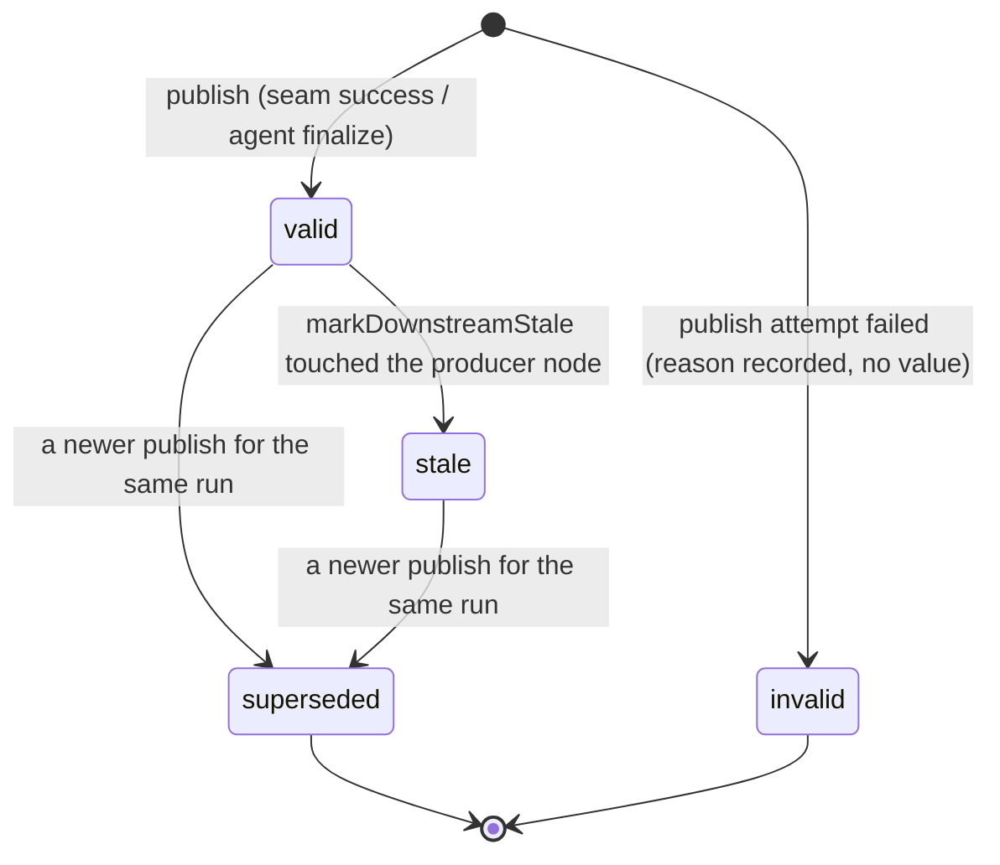
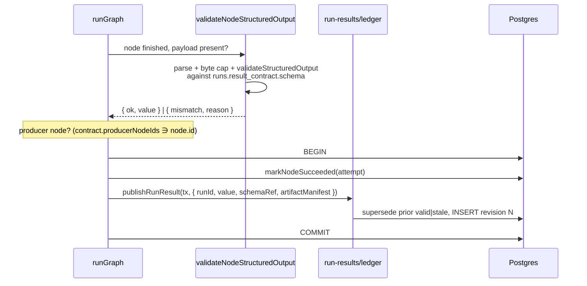
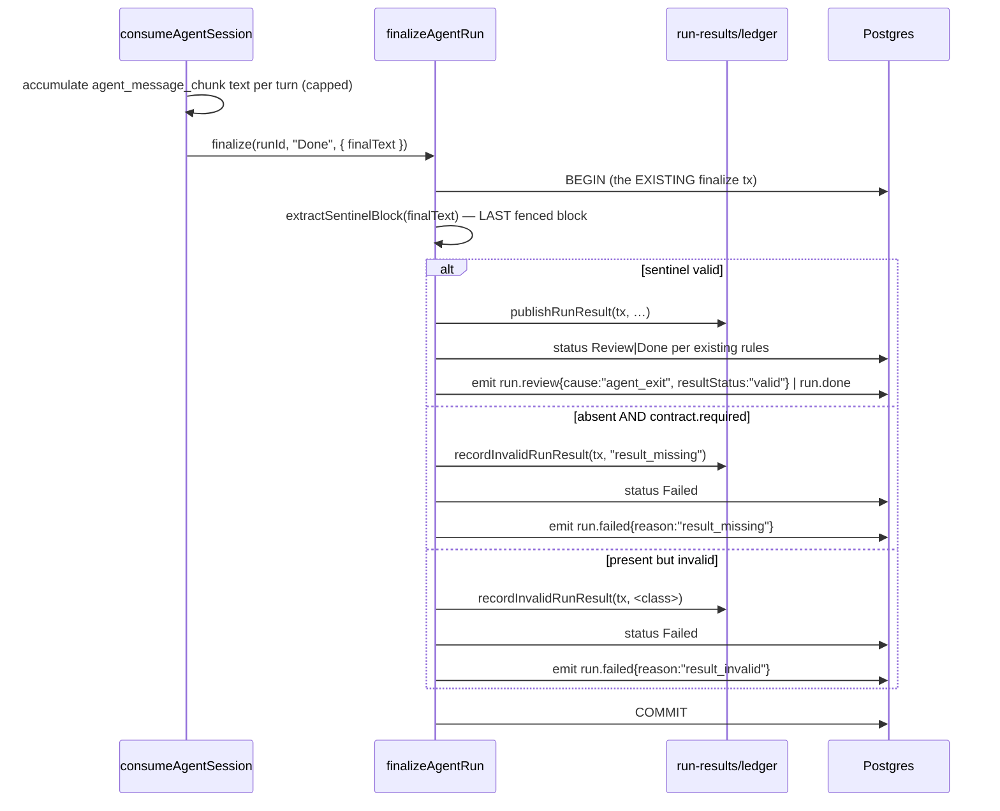
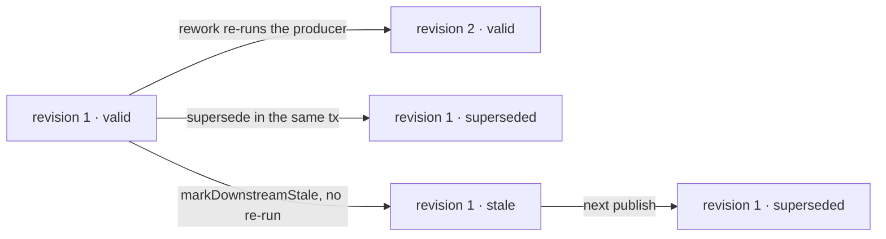
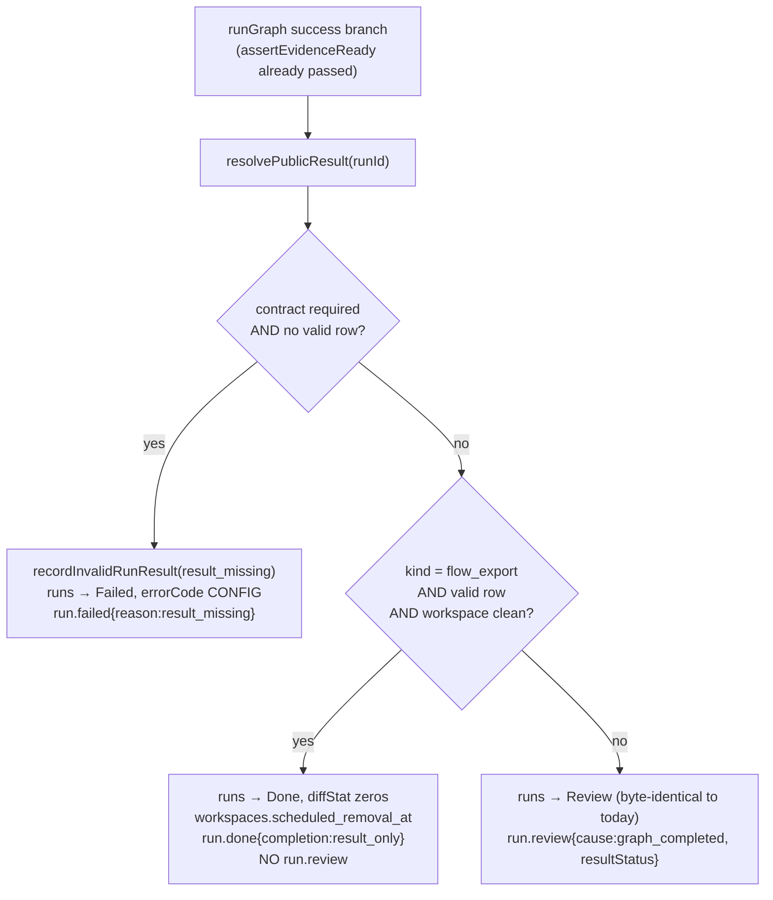
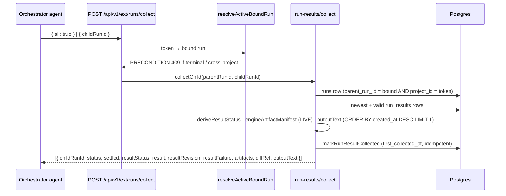
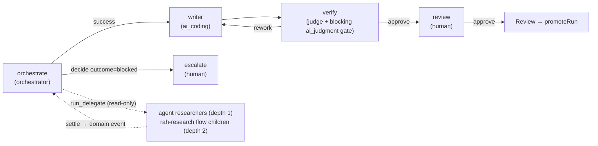

# Run results — the public result plane (Implemented — ADR-165)

## Purpose

A **run result** is the one governed, engine-owned answer to "what did this run
produce?", independent of run kind. It is the contract a delegating orchestrator
reads through `run_collect`, the value the Evaluation Lab measures, and the fact
that lets a flow run finish without a human review step. This domain owns the
result envelope, its revision/validity lifecycle, the launch-time contract
snapshot that decides which schema a run is held to, and the effective
recursion bounds recorded beside it. It does **not** own evidence
([`artifacts.md`](artifacts.md)), node-level structured output
([`flow-graph.md`](flow-graph.md)), promotion ([`workspaces.md`](workspaces.md)),
or the delegation toolset itself ([`orchestrator.md`](orchestrator.md)).

## Domain entities

- **Run result contract** — `runs.result_contract` (jsonb, NULL = none). Written
  by the launcher in the run-insert transaction: for a flow run from the pinned
  revision's `result.export`; for an agent child from the parent's
  `flow_revisions.result_profiles`. Terminal and collection paths read **only**
  this snapshot, never a live catalog row.
  ([ERD](../db/runs-domain.md), [schema](../database-schema.md#runs))
- **Run result** — a row of `run_results`, one per result **revision** including
  `invalid` ones. Carries the engine-owned identity (schema, producer, attempt,
  revision), the validated `value`, the validity state, the supersession link,
  and `artifact_manifest` — the engine artifact manifest **at publish**, kept for
  audit. (`run_collect.artifacts` is the LIVE manifest, deliberately.)
  ([ERD](../db/runs-domain.md#run_results), [schema](../database-schema.md#run_results))
- **Delegation bounds** — `runs.delegation_bounds` (jsonb, NULL = env-only). The
  effective depth / fan-out / active-children / budget an orchestrator node
  computed at its start, keyed by `nodeAttemptId`.
- **Result profiles** — `flow_revisions.result_profiles` (jsonb, NULL = none).
  The package's named agent result contracts, resolved at install for every
  member flow.
- **Result envelope** — the wire shape `{ schemaRef, value }`. The producer
  supplies only `value`.
- **`schemaRef`** — `<flowRefId>@<resolvedRevision[:12]>:<schemaStem>`, derived
  from server state alone.

## State machine

Validity of a `run_results` row:

`invalid` and `superseded` are terminal. A publish supersedes every prior
`valid | stale` row for the run in the same transaction; at most one `valid` row
per run exists at any time (`run_results_one_valid_per_run_uq`).

### `resultStatus` derivation

ONE predicate — `deriveResultStatus({ runStatus, contract, newestRow, validRow })`
in `lib/run-results/status.ts` — is consumed by the collect route, the run DTO
and the Evaluation Lab. There is no second derivation anywhere.

| Run status | Rows / contract | `resultStatus` |
| --- | --- | --- |
| `Pending`, `Running`, `NeedsInput`, `NeedsInputIdle`, `HumanWorking`, `WaitingOnChildren` | any | `pending` |
| `Review`, `Done` | a `valid` row | `valid` |
| `Review`, `Done` | no row; contract NULL or `required: false` | `absent` |
| `Review`, `Done` | no `valid` row; contract `required: true` (human-resolved Review only) | `missing` |
| `Review`, `Done` | newest row `stale` | `stale` |
| `Review`, `Done` | newest row `invalid` | `invalid` |
| `Failed`, `Crashed`, `Abandoned` | any | `unavailable` (+ `resultFailure` from the newest `invalid` row, else null) |

## Process flows

### (a) Flow-node publish at the seam

A non-producer node's `output.result` keeps ADR-162 semantics untouched: it
validates, merges into `node_attempts.vars`, and publishes nothing.

### (b) Agent-run publish at finalize

`Failed` and `Crashed` outcomes never publish. A NULL `result_contract` means
nothing is parsed at all.

### (c) Supersession on rework

### (d) Flow terminal gate — three exits

"Workspace clean" is `diffNameStatus(base_commit..branch)` empty **and**
`diffWorkingTree(HEAD)` empty; a NULL `base_commit` is not clean. All three
exits happen inside the existing terminal transaction.

### (e) `run_collect` v2

Only DIRECT children are visible. A missing row is existence-hidden: `409`.

### (f) Reference RAH workflow

The `writer` node is the only worktree writer. Research flow children publish
`result.export` and finish `Done` by result-only completion; the coordinator only
collects. Hidden adapter subagents are excluded by `enforcement.tools: strict`
plus a `tools` allow-list that omits the subagent tool
([`guardrail-hooks.md`](guardrail-hooks.md), ADR-130).

## Expectations

1. `run_results` MUST hold at most one `valid` row per run
   (`run_results_one_valid_per_run_uq`); every publish MUST supersede prior
   `valid | stale` rows in the same transaction. *(AC-08)*
2. A result row MUST be committed in the SAME transaction as the attempt close
   (flow) or the terminal flip (agent finalize, completeness gate, result-only
   `Done`) that makes it collectable; `orchestrator_resume` MUST never observe a
   settle without its row. *(AC-13, AC-15, AC-16, AC-23)*
3. `runs.result_contract` MUST be written by the launcher from the pinned
   revision / the parent's pinned profiles, and MUST be the only schema the seam,
   the finalizer and the collect route read. *(AC-11, AC-12, AC-19, AC-20)*
4. `required` MUST excuse absence only; a present-but-invalid payload MUST record
   an `invalid` row and fail the run (`result_invalid`); a required absence MUST
   record `result_missing` and fail the run — never on a human-resolved `Review`
   flip. *(AC-15, AC-17, AC-23)*
5. A flow run MUST finalize `Running → Done` (result-only completion) iff it
   declares `result.export`, holds a `valid` current result, and its workspace is
   clean (`base_commit..branch` empty AND working tree clean); any other success
   exit MUST be `Review`, byte-identical to today. *(AC-16)*
6. `run_collect` MUST return only DIRECT children of the bound orchestrator, MUST
   be idempotent (identical bodies; `first_collected_at` set once), MUST derive
   `artifacts` from `artifact_instances`, and MUST refuse a terminal-orchestrator
   token with `MaisterError("PRECONDITION")`. *(AC-31, AC-32)*
7. `resultStatus` MUST be derived by ONE predicate (`deriveResultStatus`) on
   every surface. *(AC-09)*
8. Effective bounds MUST be `min(instance policy, active node declaration)` for
   `engine_min ≥ 3.7.0` and env-only below, snapshotted on the orchestrator run
   per node attempt and read by admission and the scheduler; env changes after
   the snapshot MUST NOT change a running tree's bounds. *(AC-25–AC-27)*
9. `max_child_runs` MUST bind at every ancestor (subtree count under the
   per-orchestrator lock); token / wall-clock / failure budgets MUST bind at the
   tree root via the existing meters. *(AC-28, AC-30)*
10. A child over its parent's active-children cap MUST stay `Pending` (never
    refused) and MUST start on the next `promoteNextPending` after a sibling
    leaves a slot-holding status. *(AC-29)*
11. `resultProfile` MUST resolve only from the parent's pinned
    `flow_revisions.result_profiles`, MUST be refused on flow targets and with
    `persistent`, and MUST be snapshotted on all three creation edges.
    *(AC-19, AC-20)*
12. `ralph_loop` MUST NOT relaunch a run with `parent_run_id`. *(AC-18)*

## Edge cases

Every refusal below is stated as the code gates it. Parameterized form: the
condition, the site that gates it, the `MaisterError` code and HTTP status, and
what rows it leaves behind.

| # | Condition | Where | Code / HTTP | Rows |
| --- | --- | --- | --- | --- |
| R1 | `resultProfile` on a FLOW target | `refuseUnsupportedDelegationOption` (route, pre-lookup) | [`CONFIG`](../error-taxonomy.md) 422 | none |
| R2 | `resultProfile` with `persistent: true` | route refinement (allow-list: `resultProfile` iff agent ∧ ¬persistent) | [`CONFIG`](../error-taxonomy.md) 422 | none |
| R3 | `resultProfile` not a key of the parent's pinned `flow_revisions.result_profiles` | `resolveResultProfile` | [`CONFIG`](../error-taxonomy.md) 422 | none |
| R4 | `resultProfile` while the parent flow's `engine_min < 3.7.0` | `resolveResultProfile` (explicit guard) | [`CONFIG`](../error-taxonomy.md) 422 | none |
| R5 | effective depth reached (`depth ≥ min(env, root.maxDepth, parent.maxDepth)`) | `admitDelegatedChild` (under the lock) | [`CONFIG`](../error-taxonomy.md) 422 | none |
| R6 | effective fan-out reached (`live + incoming > min(env, parent.maxFanout)`) | `admitDelegatedChild` | [`CONFIG`](../error-taxonomy.md) 422 | none |
| R7 | any ancestor's child-count budget exhausted (`subtree(ancestor) + incoming > ancestor.budget.maxChildRuns`) | `admitDelegatedChild` (recursive CTE per ancestor) | [`CONFIG`](../error-taxonomy.md) 422 | none |
| R8 | load: `result.export.from[]` names an unknown node, a `human`/`form` node, a node without `output.result`, or a node whose `output.result.schema` ≠ the export `schema` | `validateGraphManifest` | [`CONFIG`](../error-taxonomy.md) at load | — |
| R9 | load: `result.export` / `max_active_children` / `budget` below `engine_min` 3.7.0 | `validateGraphManifest` | [`CONFIG`](../error-taxonomy.md) at load | — |
| R10 | load: orchestrator node in a ≥ 3.7.0 manifest without a complete `delegation.budget` | `validateGraphManifest` | [`CONFIG`](../error-taxonomy.md) at load | — |
| R11 | install: `result_profiles.<name>.schema` not a package-root `./schemas/*.json`, unreadable, malformed, or using `json`/`items` below a member flow's floor | `validatePackageRootSchemaReferences` | [`FLOW_INSTALL`](../error-taxonomy.md) | revision `Failed` |
| R12 | launch (flow): export schema unresolvable from the pinned `installedPath` | `launchRunStaged`, pre-worktree | [`CONFIG`](../error-taxonomy.md) 422 | none (delegation path: carrier compensated as today) |
| R13 | agent child completes, required profile, sentinel absent | `finalizeAgentRun` | `invalid` row (`result_missing`) + `Failed` | one tx |
| R14 | agent child completes, sentinel oversize / malformed / structurally unsafe / schema mismatch | `finalizeAgentRun` | `invalid` row (class reason) + `Failed{result_invalid}` | one tx |
| R15 | flow `graph_completed`, required export, no current `valid` row | `runGraph` terminal branch | `invalid` row (`result_missing`) + `Failed{result_missing}` | one tx |
| R16 | `run_collect` for a run that is not a DIRECT child of the bound orchestrator | collect route | [`PRECONDITION`](../error-taxonomy.md) 409 | none |
| R17 | `run_collect` / `run_delegate` / `run_plan` from a token whose orchestrator is terminal | `resolveActiveBoundRun` | [`PRECONDITION`](../error-taxonomy.md) 409 | none |
| R18 | child over the active-children cap | scheduler | not a refusal — stays `Pending`; `run_delegate` returns `status: "Pending"` | run row exists |
| R19 | `run.failed` for a run with `parent_run_id` under a `ralph_loop` policy | `ralphLoopConsumer` | skipped (logged), never relaunched | none |

## Crash-window matrix

| # | Window | Reachable state | Recovery |
| --- | --- | --- | --- |
| W1 | Flow producer close: `markNodeSucceeded` + result INSERT + supersede | one tx — none | — |
| W2 | Flow terminal: completeness gate / result-only `Done` / `Review` flip + emit | one tx (the existing terminal tx) — none | — |
| W3 | Agent finalize: parse + validate + INSERT + CAS + emit | one tx — none | — |
| W4 | Death after `session.exited` is observed, before the finalize tx | run `Running`, no live session | existing reconcile → `Crashed` → `run.crashed{parentRunId}` wakes the parent; NO result row (documented) |
| W5 | Bounds snapshot written, death before `createSession` | node attempt fails via existing paths; the snapshot is retained (attempt-keyed, idempotent) | next attempt rewrites it |
| W6 | `first_collected_at` tx commits, death before the HTTP response | marker set, caller never saw the body | caller retries — the read is idempotent |
| W7 | Install: revision row written without `result_profiles` | impossible — same statement | — |
| W8 | Launch: `result_contract` snapshot | run-insert tx | — |
| W9 | Child queued by the active cap; nothing re-promotes | cannot occur — every settle path calls `promoteNextPending` | pinned by test |
| W10 | Result-only completion: the clean check is a READ before the tx; no session is live at the terminal branch; `Done` + `scheduled_removal_at` + emits in ONE tx | none | — |

## Wake events

A parent in `WaitingOnChildren` is woken by `orchestrator_resume` on exactly
these `domain_events` kinds, routed by `payload.parentRunId`:

- `run.review` (cause-tagged)
- `run.done` (including `completion: "result_only"`)
- `run.failed`
- `run.crashed`
- `run.abandoned`

Failure kinds wake unconditionally; success-side kinds wake at
`pendingChildCount === 0`. The child's `run_results` row is committed in the SAME
transaction as the settle flip that emits the event, so a woken parent's
`run_collect` never observes a half-published result.

Payload widening (additive; no new kinds, no CHECK change):
`run.review | run.done | run.failed` gain `resultStatus`; `run.done` gains
`completion ∈ {promoted, result_only}`; `run.failed.reason` gains
`result_missing | result_invalid`.

## Limits

The result value reuses the ADR-162 limits through ONE validator
(`lib/run-results/validate.ts` composes `parsePayload` and
`validateStructuredOutput`; there is no second validator):

- byte cap `MAISTER_NODE_OUTPUT_MAX_BYTES` (256 KiB default)
- structural caps: depth ≤ 64, keys ≤ 10 000, array length ≤ 10 000
- unsafe-key rejection (`__proto__`, `constructor`, `prototype`)
- open JSON substructures: `json` fields and recursive `items` preserve unknown
  nested keys **exactly**; the declared spine is what is validated

## Observability

- The run inspector renders a **public result panel** for any run with a contract
  or rows: `schemaRef`, validity glyph, revision, collected marker, and a JSON
  viewer of the value. Nothing renders for a run without one.
- Child run rows carry a result glyph per `resultStatus`.
- `GET /api/runs/{runId}/cost-summary` gains an optional `tree` object for a tree
  root with children: token totals by kind and model plus tree wall-clock.
- Structured log namespaces (`[run-result.*]`, `[delegation.*]`,
  `[budget.tree.*]`) carry **keys only**. Result values, prompts, artifact
  bodies, token secrets and `acp_session_id` are never logged.
- No second evidence subsystem: readiness, gates and artifacts are untouched.

## Linked artifacts

- ADR: [ADR-165](../decisions.md#adr-165-governed-recursive-agent-harness--public-run-results-result-profiles-effective-recursion-bounds-result-only-completion)
  (full record: [`decisions/adr-165.md`](../decisions/adr-165.md)) ·
  [ADR-162](../decisions.md#adr-162-universal-structured-node-result--transport-matrix-open-json-grammar-schema-identity) ·
  [ADR-163](../decisions.md#adr-163-flow-target-delegation--carrier-task-shared-admission-canonical-flow-launcher)
- Domains: [`orchestrator.md`](orchestrator.md) · [`runs.md`](runs.md) ·
  [`workspaces.md`](workspaces.md) · [`flow-graph.md`](flow-graph.md) ·
  [`readiness.md`](readiness.md) · [`domain-events.md`](domain-events.md) ·
  [`scheduler.md`](scheduler.md) · [`execution-policy.md`](execution-policy.md) ·
  [`evaluations.md`](evaluations.md)
- DB: [`../db/runs-domain.md`](../db/runs-domain.md) ·
  [`../database-schema.md`](../database-schema.md)
- API: [`../api/external/operations.openapi.yaml`](../api/external/operations.openapi.yaml) ·
  [`../api/web.openapi.yaml`](../api/web.openapi.yaml)
- DSL: [`../flow-dsl.md`](../flow-dsl.md) · [`../configuration.md`](../configuration.md)
- Source: `web/lib/run-results/` · `web/lib/orchestrator/bounds.ts` ·
  `web/lib/flows/runner-graph.ts` · `web/lib/agents/launch.ts` ·
  `web/app/api/v1/ext/runs/collect/route.ts`
