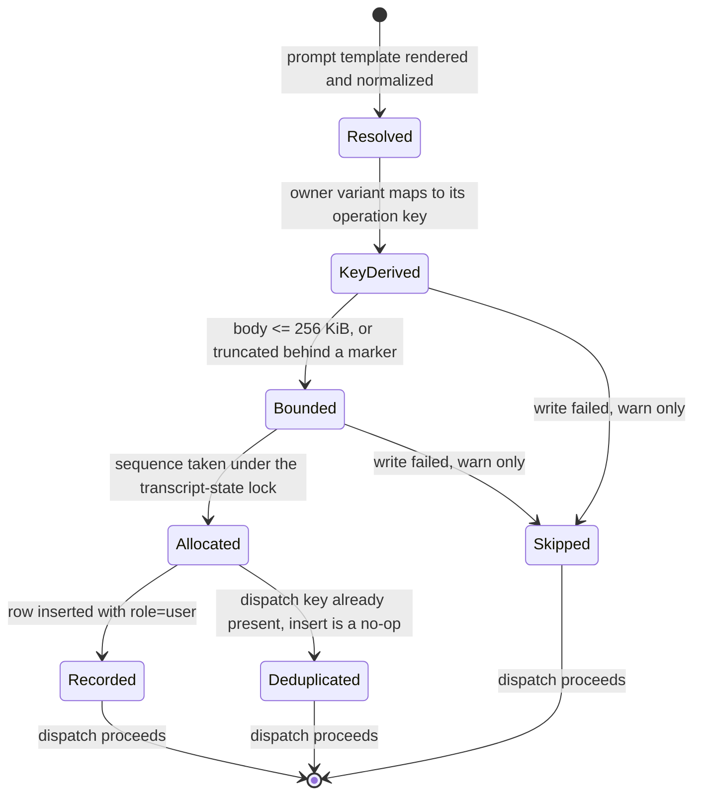
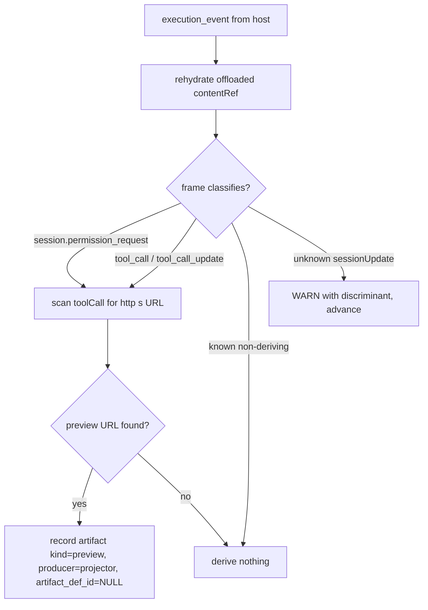
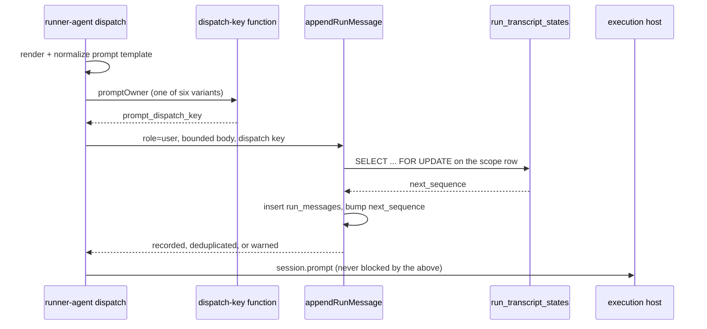

# Run trace

> **Status:** Implemented. The `TRC` requirement set below is the acceptance
> contract for the run-trace plane; per-requirement status lives in the
> traceability matrix at the end of this file. Runs created before this landed
> are untouched by design (TRC-12) and keep their projector `log` artifacts.

## Purpose

A run answers three different questions from three different planes, and this
document owns the boundary between them. The **Evidence** plane
(`artifact_instances`) answers *what did this run produce that a gate or a
reviewer consumes*. The **Trace** plane (`run_messages`, projected from
`execution_events`) answers *what did the agent actually do* — the prompt it was
given, its reasoning, its tool calls, its replies. The **Ledger** plane
(`node_attempts` + `gate_results` + `assignment_events`) answers *how did the run
move through the graph*. Tool activity belongs to Trace, never to Evidence: a
projector-derived `log` artifact is a strictly lossier duplicate of a transcript
row that already carries the tool's name, kind, status, arguments and result. The
boundary this document draws is therefore one-directional — the artifact
projector derives only what a reviewer can open (a preview URL), and every prompt
the flow graph driver dispatches is recorded once, in Trace, as the `user`
message that opens the turn it paid for. The scope word is *flow*: a standalone
agent run (`run_kind = 'agent'`) dispatches through its own launcher and records
no prompt row, which the Prompt owner entity below states precisely.

## Domain entities

- **`artifact_instances`** — the Evidence plane. A projector-derived row carries
  `producer = 'projector'` and `artifact_def_id = NULL`, which is what keeps it
  unreachable by any gate or artifact binding. See
  [`artifacts.md`](artifacts.md) and [`../db/erd.dbml`](../db/erd.dbml).
- **`run_messages`** — the Trace plane: one row per transcript position, keyed
  `(run_id, node_attempt_id, sequence)` NULLS NOT DISTINCT, with roles
  `user | assistant | tool | system`. A `user` row carries a dispatched prompt.
- **`run_messages.prompt_dispatch_key`** — nullable; the per-dispatch identity of
  a recorded prompt, derived from the owner's existing operation-key function.
  Rows written by the transcript projector leave it `NULL`.
- **`run_transcript_states`** — the per-scope sequence allocator
  (`next_sequence`) plus the projector's coalescing pointers
  (`open_text_sequence`, `open_thought_sequence`, `usage_sequence`). One row per
  `(run_id, node_attempt_id)` scope; it is the lock both writers take.
- **Prompt owner** — the durable owner of a dispatch, a six-variant union:
  `node`, `permission_resume`, `gate_ai`, `gate_skill`, `consensus_verifier`,
  `consensus_synthesis`. These six are exactly the owners this contract covers,
  because the recorder is called from exactly one place — the flow dispatch in
  [`runner-agent.ts`](../../web/lib/flows/runner-agent.ts). A seventh owner
  exists on the command plane: the standalone-agent create owner `agent`, whose
  turns are dispatched by
  [`agents/launch.ts`](../../web/lib/agents/launch.ts). That path writes no
  `run_messages` row, so a standalone agent run's transcript carries no `user`
  prompt and its dispatches are keyed only on the command ledger
  (Phase 2 — extending the recorder to it is unclaimed work).
- **Derivation** — the artifact projector's classification of one ACP frame:
  a `preview` or nothing. See
  [`../../web/lib/projector/artifact-projector.ts`](../../web/lib/projector/artifact-projector.ts).

## State machine

A recorded prompt has no mutable lifecycle — it is allocated, written and then
immutable. What does have states is the *attempt* to record one, because the
write is best-effort and must never hold up the dispatch it describes.

## Process flows

Artifact derivation — one ACP frame in, at most one `preview` out:

Prompt recording, beside the existing `resolved_prompt` persist:

## Expectations

- **TRC-01:** The artifact projector derives an artifact from a tool surface only when that surface carries an `http(s)` preview URL; a tool surface without one derives nothing.
- **TRC-02:** No projector-derived artifact is reachable by a gate or an artifact binding — projector rows carry `artifact_def_id = NULL` and every `artifact_required` / `input.requires` / `output.produces` resolution keys on `artifact_def_id`.
- **TRC-03:** An ACP frame the artifact projector cannot classify warns with its discriminant and advances; it never poisons a run's projection.
- **TRC-04:** A child run's legacy `outputText` is composed only from artifacts a producer deliberately recorded, never from a projector-derived row.
- **TRC-05:** Every prompt the flow graph driver dispatches is recorded as a `user` message in `run_messages`, for each of the six flow prompt-owner variants and for every dispatch within one node attempt; a standalone agent run's turns are outside this contract (Phase 2).
- **TRC-06:** Prompt recording is idempotent per dispatch, enforced by a database constraint rather than by application ordering alone.
- **TRC-07:** A prompt row's dispatch identity is derived from the existing owner operation-key functions; no parallel identity scheme is introduced.
- **TRC-08:** Prompt recording is best-effort — a failed prompt-row write warns and never blocks, delays, or fails dispatch.
- **TRC-09:** A recorded prompt body is bounded at 256 KiB; a longer body is stored truncated behind an explicit marker naming the unabridged source.
- **TRC-10:** `run_messages` sequence allocation is serialized on a single per-scope lock, so a projector write and a prompt write can never collide on a sequence.
- **TRC-11:** Prompt text in `run_messages` is served only behind `readRepoFiles` and adds no exposure surface beyond the one `node_attempts.resolved_prompt` already crosses.
- **TRC-12:** A run created before this change is not modified — no backfill, no read-side filter, no retention change.

## Edge cases

- **EDGE-TRC-01:** A `session.permission_request` carrying a preview URL still derives a
  `preview`; without one it derives nothing.
- **EDGE-TRC-02:** A payload offloaded to a host-private object is rehydrated before
  classification, so an offloaded preview URL is not lost.
- **EDGE-TRC-03:** The dispatch-key index declares `nulls not distinct`, matching its
  sequence-key sibling, so it stays effective for a row whose `node_attempt_id`
  is `NULL`; no flow dispatch produces such a row today, so `IT-EDGE-TRC-03`
  pins the constraint directly rather than through a producer.
- **EDGE-TRC-04:** A `consensus_verifier` / `consensus_synthesis` dispatch records its
  prompt like any other owner.
- **EDGE-TRC-05:** A prompt over 256 KiB is stored truncated with the marker and the
  dispatch still proceeds.
- **EDGE-TRC-06:** A concurrent duplicate dispatch writes exactly one row; the losing
  insert is a no-op, not an error surfaced to the caller
  (`MaisterError` is NOT raised — the write is best-effort per TRC-08).
- **EDGE-TRC-07:** With `runs.context_mounts` non-empty the row carries exactly one
  appended line naming the mounted slugs; with no mounts the row is byte-exact.

## Linked artifacts

- [`artifacts.md`](artifacts.md) — the Evidence plane and the artifact validity FSM.
- [`execution-event-plane.md`](execution-event-plane.md) — event ingest and the
  canonical projection consumers that feed both planes.
- [`execution-prompt-lifecycle.md`](execution-prompt-lifecycle.md) — the command
  plane's own prompt record (`execution_commands.request_canonical_json`),
  distinct from this read model.
- [`run-results.md`](run-results.md) — `run_collect` and the legacy `outputText`
  field narrowed by TRC-04.
- [`runs.md`](runs.md) — run transparency surfaces and the run-centre prompt
  disclosure.
- [`../database-schema.md`](../database-schema.md) and
  [`../db/erd.dbml`](../db/erd.dbml) — `run_messages.prompt_dispatch_key`.
- [`../api/web.openapi.yaml`](../api/web.openapi.yaml) — `TranscriptMessage` and
  `GET /api/runs/{runId}/transcript`.
- [`../decisions/adr-052.md`](../decisions/adr-052.md) — run event stream, with
  the dated amendment recording its post-ADR-167 shape.
- [`../../web/lib/projector/artifact-projector.ts`](../../web/lib/projector/artifact-projector.ts)
  — derivation.
- [`../../web/lib/execution-host/events/transcript-projector.ts`](../../web/lib/execution-host/events/transcript-projector.ts)
  — the projector writer and the shared sequence allocator.
- [`../../web/lib/flows/runner-agent.ts`](../../web/lib/flows/runner-agent.ts)
  — the dispatch site that records each prompt.
- [`../../web/lib/run-results/collect.ts`](../../web/lib/run-results/collect.ts)
  — the producer predicate behind TRC-04.

### TRC requirement traceability

| Requirement | Contract/schema | Enforcement/task | Primary test | Status |
| --- | --- | --- | --- | --- |
| TRC-01 | `deriveFromToolCall` returns null without a preview URL | T2.3 | `UT-TRC-01` | Implemented |
| TRC-02 | `artifact_instances.artifact_def_id` null on projector rows | T2.3 | `IT-TRC-02` | Implemented |
| TRC-03 | `UnknownSessionUpdateShape` warn-and-advance | T2.3 | `UT-TRC-03` | Implemented |
| TRC-04 | `outputTextFromArtifacts` producer predicate | T2.4 | `UT-TRC-04` | Implemented |
| TRC-05 | `run_messages.role='user'` on dispatch | T2.5 | `IT-TRC-05` | Implemented |
| TRC-06 | `run_messages_prompt_dispatch_key_uq` | T2.1, T2.5 | `IT-TRC-06` | Implemented |
| TRC-07 | `createOperationKey` / `gatePromptOperationKey` reuse | T2.5 | `UT-TRC-07` | Implemented |
| TRC-08 | best-effort write contract | T2.5 | `UT-TRC-08` | Implemented |
| TRC-09 | 256 KiB bound + truncation marker | T2.5 | `UT-TRC-09` | Implemented |
| TRC-10 | `run_transcript_states` `SELECT ... FOR UPDATE` | T2.2 | `IT-TRC-10` | Implemented |
| TRC-11 | transcript route `readRepoFiles` | T0.3 | `CT-TRC-11` | Implemented |
| TRC-12 | absence of migration/query predicate touching prior runs | T3.3 | `CT-TRC-12` | Implemented |
| EDGE-TRC-01 | permission-request derivation path | T2.3 | `UT-EDGE-TRC-01` | Implemented |
| EDGE-TRC-02 | `prepareArtifactContent` rehydration | T2.3 | `IT-EDGE-TRC-02` | Implemented |
| EDGE-TRC-03 | `nulls not distinct` scope | T2.1, T2.2 | `IT-EDGE-TRC-03` | Implemented |
| EDGE-TRC-04 | consensus owner variants | T2.5 | `IT-EDGE-TRC-04` | Implemented |
| EDGE-TRC-05 | truncation marker | T2.5 | `UT-EDGE-TRC-05` | Implemented |
| EDGE-TRC-06 | concurrent duplicate dispatch | T2.1, T2.5 | `IT-EDGE-TRC-06` | Implemented |
| EDGE-TRC-07 | context-mount suffix | T2.5 | `UT-EDGE-TRC-07` | Implemented |
