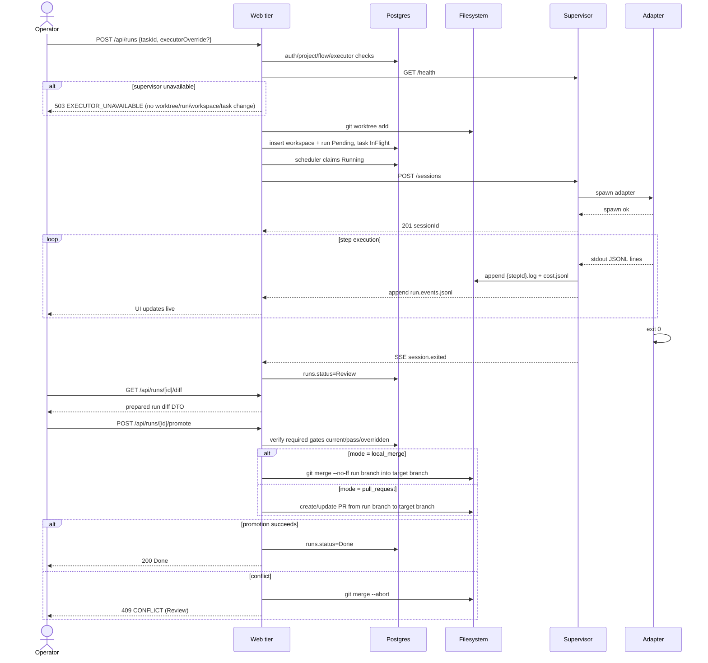
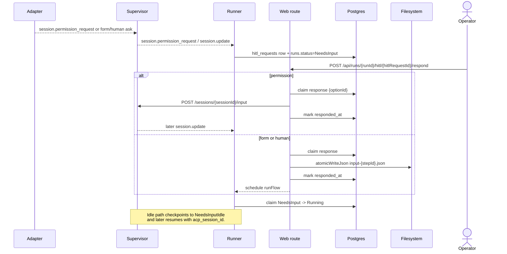
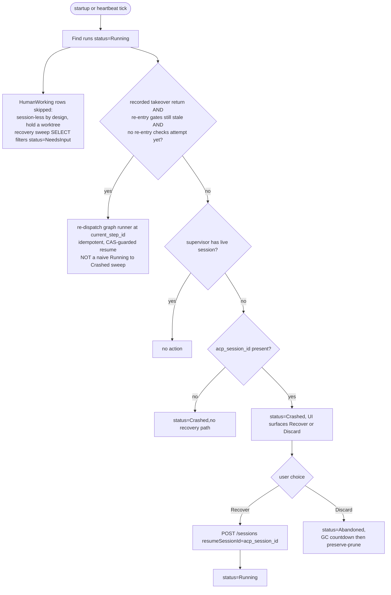
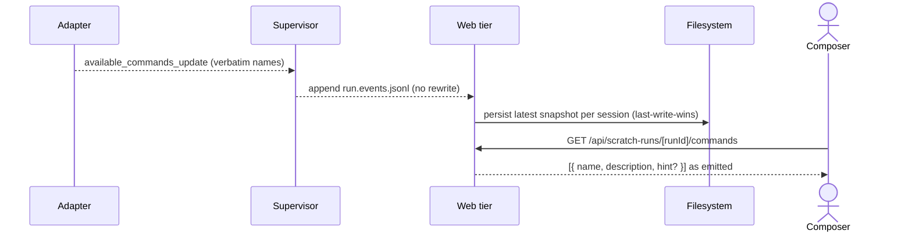
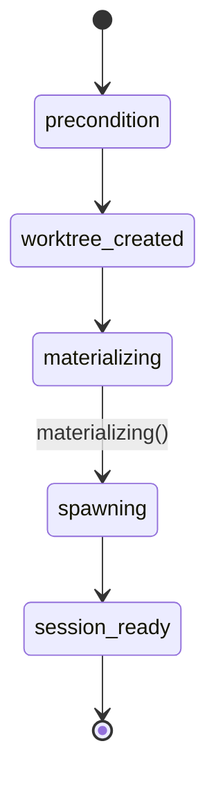
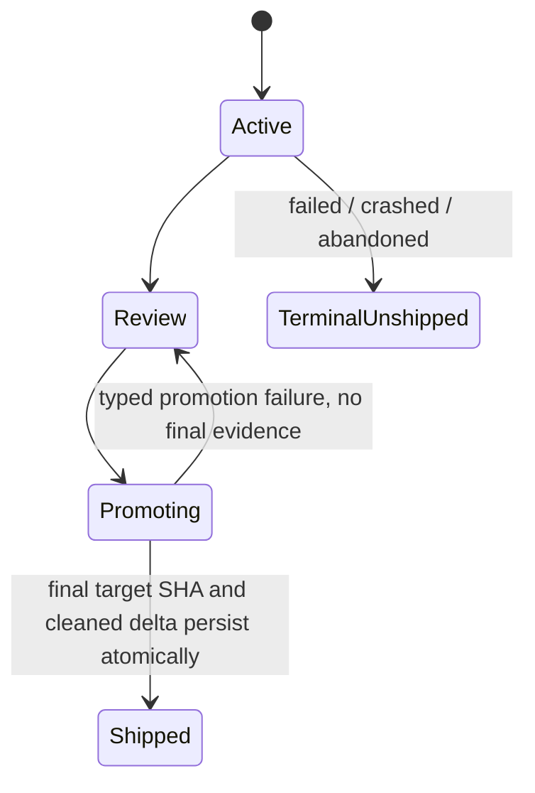

# Runs domain

## Purpose

A **run** is one execution attempt of a task through a Flow. It owns
the ACP session, the worktree, and the per-run artifacts on disk. The
runs domain is the heart of MAIster's state machine; every other
domain projects state onto it.

## ADR-148 workspace-presence guard (Implemented)

`runs.status` remains the execution-history source of truth. If the associated
workspace has `removed_at`, the retained run is historical only: Recover,
respond/review, gate chat, takeover, rework, export, diff, and promotion must
refuse server-side with `PRECONDITION` before any Git or supervisor access.
Archive preserves the original `Review`, `Crashed`, or `Failed` status while
removing the workspace; board/launchability then treats the task as relaunchable
without hiding the historical run. Discard changes non-`Done` runs to
`Abandoned`. This does not delete evidence, transcript, cost, or runtime JSONL.

## Cut-over upgrade terminalization (ADR-131 — Implemented)

Migration 0094 changes legacy Flow runs in Pending, Running, NeedsInput,
NeedsInputIdle, HumanWorking, WaitingOnChildren, Review, or Crashed to Failed
in one transaction. The terminal event has reason
legacy_steps_engine_3_cutover and source upgrade_cutover. Done, Failed and
Abandoned history, graph runs, workspaces, evidence and run rows are retained.
The transition releases scheduler capacity and removes user-visible recovery,
resume, response, promotion and retry actions. Follow-on migration 0095 clears
only a task C2 claim that predates its durable D2 event, so an interrupted
pre-upgrade claim cannot block other scheduler admission after restart; it
leaves later claims intact and does not create a run or event. The shared C2
poll/gate then treats that latest D2 run as a one-time terminal hold: it flags
the task and clears auto-launch without a claim or new run. Only human
re-triage after the event creates a later arm eligible for C2. Migration 0096
adds partial `domain_events` indexes for the exact D2 reason/source predicate,
so list/detail/reconcile reads remain bounded as the immutable event log grows.

> **Unified runner & session model (Implemented — ADR-114).** Run runner state
> (`runner_id`, `runner_resolution_tier`, `capability_agent`, `runner_snapshot`,
> `acp_session_id`) moved OFF the `runs` row (dropped in migration `0082`) into the per-session `run_sessions`
> table (sole source of truth; exactly one `default` row for `scratch`/`agent`
> runs). A flow run hosts N **sequential** sessions sharing one worktree.
> Canonical: [`sessions.md`](sessions.md) /
> [ADR-114](../decisions.md#adr-114-unified-flow-runner-config-first-class-sessions-per-project-connect-time-bindings-and-run_sessions-as-the-sole-run-runner-source-of-truth).
> Flipped to as-built in the ADR-114 implementation (Phase 7).

## Domain entities

- **Run** — `runs` row. FK to `tasks`, `projects`, and `flows`.
  `run_kind ∈ {flow, scratch, agent}`; per-session runner identity is held in
  `run_sessions`.
  - **`run_kind = scratch` — project-less local-package variant** (Implemented —
    ADR-097): a scratch run rooted at a local-package `working_dir` with **no
    project and no `workspaces` row**. `runs.project_id` is **NULL** and
    `runs.local_package_id` is the launch snapshot; `scratch_runs` carries the
    owner under a DB CHECK (exactly one of `project_id` / `local_package_id`).
    Every project-scoped consumer either excludes it by query construction or
    narrows `project_id` via `requireRunProjectId`. See
    [`studio-ai-assistant.md`](studio-ai-assistant.md) and the consumer
    checklist in [`../decisions.md#adr-096`](../decisions.md).
- **Assignment** — ownership row (ADR-040) for pending human-visible work. It points
  at a run for inbox/read-model purposes but does not add run statuses and does
  not participate in scheduler caps.
- **ACP session id** — opaque resume handle, per session on
  `run_sessions.acp_session_id` (moved off `runs` — ADR-114).
  Lifecycle described in [`../decisions.md#adr-006-hybrid-hitl-keep-alive--checkpointresume`](../decisions.md#adr-006-hybrid-hitl-keep-alive--checkpointresume).
- **Workspace** — git worktree under
  `.maister/<slug>/runs/<runId>/`. See [`workspaces.md`](workspaces.md).
- **Per-run artifacts on disk**:
  - `<stepId>.log` — append-only stdout of each node attempt; `stepId` remains
    the stable supervisor wire field for the node id.
  - `cost.jsonl` — token usage records.
  - `needs-input.json` — present while the run waits for structured
    form input.
  - `input-<stepId>.json` — atomic-written response payload.

## Run detail UI hierarchy (Implemented)

The run detail screen does not add run statuses or mutate the run state
machine. It projects the existing run, workspace, graph, evidence, timeline,
diff, and lifecycle read models into three stable regions:

- **Non-scratch Flow runs** land on Flow results and selected-node outputs.
  The graph/list, current node, gates, artifacts, HITL context, token/cost
  contribution, and review entry point are the primary page center.
- **Standalone agent runs** without a pinned Flow manifest land on an agent
  activity/result center. They still expose evidence, timeline, diff, branch,
  and lifecycle actions, but they do not fabricate Flow nodes.
- **Secondary workbench** tabs are Files, Diff, Evidence, and Timeline. Files
  remain `readRepoFiles`; Diff remains run-scoped and uses the existing
  `readBoard`/`readScratchRun` gates.
- **Right inspector** is shared by Flow, agent, and scratch runs. It summarizes
  change size, branch/worktree facts, run status, Flow/session mini-map, and
  server-derived action availability.

## Runs ledger UI (Implemented)

`/runs` is the read-only run ledger reached from the Active workspaces rail
**See all** link. It does not create a new state machine or write model. It
projects existing rows from `runs`, `projects`, optional `tasks`, `flows`,
`workspaces`, `run_cost_rollups`, and the `run_schedules.last_run_id` link into
a URL-filtered table.

Filters are project, state, source, runner, and inclusive start-date range.
Global admins see every non-archived project's runs; other users see only runs
for projects where they have `project_members` visibility. Flow and standalone
agent rows open `/runs/{runId}`; scratch rows open `/scratch-runs/{runId}`.

## State machine — execution axis

```mermaid
stateDiagram-v2
    [*] --> Pending: created, awaiting slot
    Pending --> Running: scheduler promotes<br/>(cap has free slot)

    Running --> NeedsInput: agent requests permission<br/>or writes needs-input.json
    NeedsInput --> NeedsInput: web activity bumps<br/>keepalive_until +30min
    NeedsInput --> NeedsInputIdle: now > keepalive_until<br/>(sweeper-driven checkpoint)
    NeedsInput --> NeedsInputIdle: runner observes<br/>session.exited.reason=checkpoint
    NeedsInput --> Running: user submits input<br/>(supervisor delivers via ACP)
    NeedsInputIdle --> Running: user submits input<br/>(respawn + session/resume)
    NeedsInputIdle --> Abandoned: 24h elapsed<br/>without response

    NeedsInput --> HumanWorking: takeover claim<br/>(human_review takeover decision)
    HumanWorking --> Running: return<br/>(rerun validation path)
    HumanWorking --> NeedsInput: release<br/>(no changes, review HITL re-opens)
    HumanWorking --> Abandoned: abandon

    Review --> HumanWorking: rework claim<br/>(ADR-160, cap-gated, top-level flow runs only)
    HumanWorking --> Review: release of a rework claim<br/>(ADR-160, no review HITL to re-open)
    Running --> NeedsInput: operator node interrupt<br/>(ADR-161, node_interrupt HITL)

    Running --> Review: agent exits 0
    Running --> Done: result-only completion<br/>(ADR-165: valid result.export + clean workspace)
    Running --> Failed: required result missing<br/>(ADR-165 completeness gate)
    Running --> Review: operator stop<br/>(workbench lifecycle)
    Running --> Crashed: heartbeat dead<br/>no checkpoint
    Running --> Failed: agent exits non-zero<br/>(no recovery path)

    Crashed --> Running: Recover click<br/>(session/resume with acp_session_id)
    Crashed --> Abandoned: Discard click<br/>(GC countdown, no sync removal)

    Review --> Done: promotion succeeds
    Review --> Review: local promotion conflict<br/>(stays in Review)
    Review --> Abandoned: Abandon click

    Review --> Running: markSyncFromReview<br/>(ADR-141 AI conflict resolver, cap-gated)
    Running --> Review: markSyncReviewFromRunning<br/>(resolver finalized or recovered)
    Done --> Review: markReopenFromDone<br/>(ADR-141 reopen; promotion_state=reopened)

    Failed --> [*]: task returns to Backlog
    Done --> [*]: unless reopened
    Abandoned --> [*]: task returns to Backlog (or stays Abandoned)
```



Status names exactly match the `runs.status` enum in
`web/lib/db/schema.ts`. `Done` is therefore NOT a terminal node: ADR-141's reopen
returns a `Done` run to `Review` so its stale or conflicted PR can be re-synced
and re-promoted (`markReopenFromDone`).

### Result-only completion (Implemented — ADR-165)

`Running → Done` is a new flow-run edge that skips `Review` entirely. It fires in
`runGraph`'s success branch, inside the existing terminal transaction, iff **all
three** hold:

1. `runs.result_contract.kind === "flow_export"`,
2. a `valid` current `run_results` row exists, and
3. the workspace is clean — `diffNameStatus(base_commit..branch)` empty AND
   `diffWorkingTree(HEAD)` empty. A NULL `workspaces.base_commit` is **not** clean.

What it writes:

| Store | Write |
| --- | --- |
| `runs` | `status='Done'`, `ended_at`, `current_step_id=NULL`, `diff_stat={files:0,additions:0,deletions:0}`; `promoted_head_sha` and `merge_commit_sha` stay NULL |
| `workspaces` | `scheduled_removal_at = now + gcAgeDays`; `promotion_state` stays `'none'` |
| assignments | `systemCloseActiveAssignmentsForRun` |
| events | webhook `run.done{}` + domain `run.done{completion:"result_only", resultStatus:"valid", parentRunId}` — and **no** `run.review` |

What it does **not** do: no promotion, no git side effect, no `run.promoted`, no
`tasks` write (the board derives the Done column from the run), no
`deliverRunIfAutoReady`, and `workspaces.promotion_hold` is never consulted.
`assertEvidenceReady(runId, "review")` still gates it — it runs before the
branch. Mounts are released and the token revoked by the existing post-transaction
tail; `promoteNextPending` runs through the existing exit.

Any other success exit — a committed diff, a dirty working tree, an
optional-absent result, or a flow with no `result.export` — behaves
**byte-identically to today** and lands in `Review`. A run that reaches `Done`
this way is distinguishable in the UI by `promotion_state = 'none'` with no
`promoted_head_sha`; nothing else in the system branches on it. Details:
[`run-results.md`](run-results.md).

### Graph rework loop (Implemented)

The review-driven rework loop does **not** add a run status. It is a
**node-pointer move inside `Running`**: a `review` node finishes `human` and the
run enters `NeedsInput` (same as any HITL); when the reviewer's `rework`
decision is resumed, the runner marks downstream gates stale, moves the node
pointer back to the rework target, opens attempt N+1, and continues — all within
`Running`. Three invariants hold so the run machine is not over-claimed:

1. **No new status.** Rework is a pointer move within `Running`; there is **no
   `HumanWorking`** status in the rework loop (that is manual takeover —
   ADR-030). The only HITL-driven status is
   the existing `NeedsInput`/`NeedsInputIdle` pair.
2. **`current_step_id` carries the node id.** `runs.current_step_id` holds the
   compiled-graph **node id**. The existing fail-closed resume check (unknown id
   in the pinned manifest → `Crashed` + `MaisterError("CONFIG")`) applies to the
   graph.
3. **Gates feed, do not gate promotion.** The graph engine writes `gate_results`
   but they do **not** block promotion. The promote sequence's "verify required
   gates" step is the **readiness enforcement** policy (ADR-048/ADR-058), not the
   graph engine — see the note on the happy-path
   diagram below and [`flow-graph.md`](flow-graph.md).

### Operator stop to `Review` (Implemented)

The workbench lifecycle surface can intentionally stop a live Flow run and park
it in `Review` without deleting the worktree. This broadens `Review`: it can
mean "agent completed" or "operator stopped and wants to inspect, preserve, or
handoff partial work". Promotion still re-gates readiness at promote time, so a
stopped run is not treated as completed merely because it is reviewable. Full
stop, archive, drop, snapshot, export, and handoff semantics live in
[`workbench-lifecycle.md`](workbench-lifecycle.md).

### Manual-takeover status `HumanWorking` (Implemented)

Manual takeover ([ADR-030](../decisions.md#adr-030-manual-takeover-as-a-local-worktree-handoff-humanworking-status))
adds the real `runs.status` value `HumanWorking`. A reviewer parked at a
`human_review` node claims the run (`NeedsInput → HumanWorking`), edits the
existing worktree in place on the same host, and returns it
(`HumanWorking → Running`, the runner reruns the declared validation path) or
releases it (`HumanWorking → NeedsInput`, the original review HITL re-opens) or
abandons it (`HumanWorking → Abandoned`). Full domain detail lives in
[`manual-takeover.md`](manual-takeover.md). Four invariants bind it to the run
machine:

1. **`HumanWorking` is a REAL run status**, unlike the graph rework loop above
   (a node-pointer move *within* `Running`). A claimed run leaves the
   `Running`/`NeedsInput` machine and renders a distinct board surface.
2. **It counts against the global cap exactly like `Running`/`NeedsInput`**
   ([ADR-009](../decisions.md#adr-009-global-concurrency-cap--3)) — a claimed
   worktree holds a real slot through **both** scheduler cap-check predicates
   (`web/lib/scheduler.ts`, the initial-promote and under-advisory-lock-recheck
   counts of `status IN ('Running','NeedsInput','HumanWorking')`).
3. **The takeover branch IS `workspaces.branch`** — no new branch, target, base
   selection, or PR is created (that is **promotion** — ADR-058). The claim
   exposes the existing
   `worktree_path` + branch only.
4. **`HumanWorking` is session-less BY DESIGN** (the human edits locally; there
   is no live ACP session) yet HOLDS a worktree, so it is **EXCLUDED from the
   startup recovery sweep classification** and never mis-flagged `Crashed`. The
   orphan→`Crashed` path is `runResumeRecoverySweep` in
   `web/lib/runs/resume-recovery.ts`, whose SELECT filters
   `runs.status='NeedsInput'` and then resolves the acp handle post-query via
   `loadActiveRunSessionsByRunId` (`run_sessions`), skipping rows with no active
   `acp_session_id` — so `HumanWorking` is excluded by construction.

### ADR-160 `HumanWorking` gains a second provenance: the Review rework claim (Implemented)

`HumanWorking` is now reachable from **two** statuses. The ADR-030 claim above
enters from `NeedsInput` at a parked `human_review` node; the ADR-160 **rework
claim** enters from `Review`, after the graph has already finished. The status,
its fences, and its cap accounting are identical — only the provenance differs,
and it is carried on the ledger, not on a new status value. Full domain detail
lives in [`run-continuation.md`](run-continuation.md). Four invariants bind the
new provenance to the run machine:

1. **The provenance marker is `node_attempts.decision`.** A rework claim appends
   a takeover-shaped row at the **last executed node** carrying
   `decision='review_rework_claim'`; an ADR-030 takeover writes no `decision` on its
   claim row. Every `HumanWorking` consumer that needs to tell them apart reads
   that column — never the entry status, which is not retained.
2. **`Review → HumanWorking` ACQUIRES a slot.** `Review` is slot-free
   (`countLiveRuns` counts `Running|NeedsInput|HumanWorking`), so unlike the ADR-030
   claim — which enters from the already-counted `NeedsInput` — a rework claim
   can be refused when the host is saturated. The cap is therefore re-checked
   **inside** the claim transaction under the run-row lock, and a cap-full claim
   returns `MaisterError("CONFLICT")` and is **never** queued as `Pending`.
3. **Only top-level flow runs are eligible.** `SETTLED_RUN_STATUSES` includes
   `Review`, so claiming a delegated child would un-settle an orchestrator parent
   that may already have completed; `parent_run_id IS NULL` is what prevents it.
   `run_kind='agent'` is refused explicitly because agent runs carry no
   `node_attempts` rows at all, leaving nothing to anchor the claim on.
4. **Release returns to `Review`, not `NeedsInput`.** There is no review HITL to
   re-open in this provenance, so the release target is the status the run came
   from, and the freed slot is handed to `promoteNextPending`.

### ADR-161 `Running → NeedsInput` by operator node interrupt (Implemented)

An operator may pause a live agent node mid-turn. The transition is the ordinary
`Running → NeedsInput` park — the same one an agent-requested permission takes —
entered by an operator instead of the agent, and carrying a `node_interrupt` HITL
whose option set is server-owned. It reuses `escalateHookTrip`'s mechanics
verbatim (checkpoint pre-transaction, one park transaction) and adds no
`runs.status` value and no `node_attempts` status value. The keep-alive idle path,
the 24 h `NeedsInputIdle → Abandoned` sweep, and the reconcile classifier treat it
exactly like a `hook_trip` park. See [`hitl.md`](hitl.md) for the kind and
[`run-continuation.md`](run-continuation.md) for the option matrix.

### Reconcile-driven `Running → Crashed` + hybrid Recover (Implemented)

Reconciliation ([ADR-033](../decisions.md#adr-033), [ADR-034](../decisions.md#adr-034))
adds an out-of-band **reconcile sweep** (startup + periodic) that classifies a
stranded `Running` run into re-attach / re-dispatch / skip / `Crashed`. This is
the **`Running → Crashed`** transition that did not previously exist (only
`NeedsInput → Crashed` did, via `crashResumedRun`); it adds `crashRunningRun`
(CAS `WHERE status='Running'`). The full classification table and the GC
lifecycle live in [`reconciliation-gc.md`](reconciliation-gc.md). Four
invariants bind it to the run machine:

1. **Allow-list `Running`-only.** Reconcile NEVER touches a non-`Running` row;
   `NeedsInput`/`NeedsInputIdle`/`HumanWorking`/terminal stay owned by the
   `resume-recovery`, `takeover-return`, and idle sweeps. Candidate sets are
   disjoint by construction. The one supervisor-side exception
   **(Implemented — ADR-163 amendment)**: a live session whose run row is
   already `Abandoned` is the orphan of a cascade whose best-effort session
   teardown did not complete, and the sweep stops it (`orphanSessionsReaped`)
   without writing the row.
2. **Grace guard.** A `Running` agent run with no live session is SKIPPED while
   `runs.resume_started_at` OR the latest `node_attempts.started_at` is within
   `MAISTER_RECONCILE_GRACE_SECONDS` (default 90); only past grace is it
   `Crashed`. This protects in-flight launches and Recovers.
3. **Retry-safety split.** No-live-session `check`/`judge` gate nodes
   re-dispatch (read-only, CAS-guarded no-op when a runner still holds the run);
   a `cli` node is `Crashed` (`cli-not-retry-safe`) and never auto-re-dispatched.
4. **Hybrid Recover.** `POST /api/runs/{runId}/recover` flips `Crashed → Running`
   and stamps `runs.resume_started_at` BEFORE the supervisor side-effect, then
   resumes an agent node (ACP `session/resume`) or re-dispatches a session-less gate node. It
   re-admits through the global cap (a `Crashed` run already released its slot):
   slot-free resumes now, cap-full queues as `Pending` (202) and the scheduler
   resumes it on slot-free. `POST /api/runs/{runId}/discard` marks `Abandoned`
   and enters the GC countdown (no synchronous worktree removal).

### Flow-run `Review → Done` promotion (Implemented)

Originally a **flow** run dead-ended at `Review` (`Running→Review` is
CAS-guarded; no promote path flipped it terminal — only scratch runs promoted).
[ADR-058](../decisions.md#adr-058-branch-targeting-at-launch-shared-promotion-service-promote-time-readiness-re-gate-m18m15-carve)
wires the **existing** `Review → Done` edge for flow runs through a **shared
`promoteRun` service** that drives both run kinds. This adds **NO new
`runs.status` value** — `local_merge` terminates at the existing `Done`. The
`pull_request` mode (which also lands at `Done` and records `pr_url`/`pr_number`
on the workspace but is not tracked to merge) is **Implemented**.
The full claim → side-effect → finalize contract (the durable
`promotion_state` claim + per-attempt `promotion_attempt_id` token, idempotency,
and the crash windows) lives in [`workspaces.md`](workspaces.md). Four
invariants bind it to the run machine:

1. **No new status.** Both modes land on the existing terminal `Done`; the
   `Review → Review` self-edge still absorbs a `local_merge` conflict (run stays
   `Review` + a manual-resolution assignment is created). This deliberately
   avoids the new-status consumer fan-out.
2. **Promote-time readiness re-gate.** The promote service calls
   `assertEvidenceReady(runId, "review")` a **second** time, at promote time —
   the Review chokepoint (ADR-045) already enforces it once at Review-entry, but gates can go
   stale between Review-entry and the promote click. A not-ready/stale gate
   refuses promotion `PRECONDITION` (run stays `Review`, no side-effect);
   **overridden** gates satisfy it via the existing `{passed, overridden}`
   allow-list (`isExternalGateReady`). This **reuses that chokepoint, with no
   dependency on the readiness layer (ADR-048)** — an ADR-045-consistent
   promotion carve, not a readiness implementation.
3. **Allow-list guard.** The promote guard is `status ∈ {Review}` (flow) /
   `dialogStatus = "Review"` (scratch), NOT `if (!terminal)` — a future status is
   rejected by default.
4. **Terminal write is atomic + idempotent.** `Review → Done` is one finalize
   transaction keyed on the attempt token; a retry after success returns `409`
   (already `Done`), never a second promotion.

### Delegated flow-run child (Implemented — ADR-163)

A `run_delegate` / `run_plan` target may name a **Flow** instead of a catalog
agent. The child is an ordinary `run_kind='flow'` run launched through the
canonical pipeline (`launchRunStaged`) — same worktree, graph state, session set,
capability materialization, and executor resolution as a board Launch — plus
delegation provenance. Four things distinguish it from a board flow run:

1. **A carrier task.** A flow run cannot exist without a task
   (`assertFlowRunInvariant` requires `taskId && flowId`, `loadRun` throws
   `PRECONDITION` without one, and the flow prompt entry point IS `task.prompt`),
   so the delegation seam mints one server-side: `launch_mode='manual'` for
   `run_delegate` (an as-plan `run_plan` entry's task is `auto`),
   `flowId` = the SELECTED child flow (never inherited from the orchestrator's
   task), prompt = the delegated prompt, always linked `parent_of` under the
   orchestrator's task in BOTH delegation modes. `mode` is therefore not a
   board-visibility switch for flow targets.
2. **Delegation provenance.** `parent_run_id`, `root_run_id`, `launch_mode`, and
   a `delegation_snapshot` with `kind: 'flow'` carrying the flow ref, the pinned
   `flowRevisionId`, the engine range evaluated AT LAUNCH, the carrier task id,
   the requested mode, the runner override, and the resolved
   `baseBranch`/`targetBranch` — both of which are `project.mainBranch` (a
   delegated child never branches off its parent). Recovery and terminal paths
   read the snapshot, never a live projection.
3. **The flow scheduler pool.** `poolForRunKind` gives it `MAISTER_MAX_CONCURRENT_RUNS`
   while an agent sibling draws `MAISTER_MAX_CONCURRENT_AGENTS` — two budgets,
   one tree. Only the per-orchestrator fan-out cap is shared across kinds.
4. **It always parks in `Review`.** A flow run always provisions a worktree, so
   unlike an agent child (which may be `workspace: none` and reach `Done`
   directly) it always produces a diff a coordinator must promote. Reaching
   `Review` emits the `run.review` DOMAIN event gated on `parent_run_id != null`,
   which is what wakes a parent parked in `WaitingOnChildren`. `run_rework` and
   `run_message` are refused (`PRECONDITION`) — a flow child owns its own
   `human`/`rework` loop. `run_cancel` ENDS a flow child (`Abandoned`; owner
   decision at the 2026-09-02 review) while a human stop keeps the operator
   semantic `Review` — every Review flip of a delegated child emits `run.review`
   through one helper, tagged with its `cause`; the stop's `operator_stop` wakes
   the parent but is never auto-promoted (only `graph_completed` /
   `agent_exit` are). If the coordinator exits without promoting, the child
   parks indefinitely: it holds no scheduler slot, but its worktree and branch
   are retained and nothing reclaims them (ADR-163 residual W12).

5. **Result semantics per terminal path (Implemented — ADR-165).** Once flow runs
   carry a public result the "always parks in `Review`" rule above narrows: a
   child whose flow declares `result.export`, published a `valid` result and
   changed nothing finishes `Done` by result-only completion, so residual W12
   applies only to flows WITHOUT an export. What each terminal path reports to
   `run_collect`:

   | Terminal path | `runs.status` | `resultStatus` | Domain event |
   | --- | --- | --- | --- |
   | graph completed, valid result, clean workspace | `Done` | `valid` | `run.done{completion:"result_only"}` |
   | graph completed, valid result, a diff | `Review` | `valid` | `run.review{cause:"graph_completed"}` |
   | graph completed, required export, no valid row | `Failed` | `unavailable` (+ `resultFailure.reason="result_missing"`) | `run.failed{reason:"result_missing"}` |
   | graph completed, optional export, absent | `Review` | `absent` | `run.review{cause:"graph_completed"}` |
   | operator stop / rework release / sync return | `Review` | `missing` or `stale` — never failed | `run.review{cause}` |
   | `run_cancel` | `Abandoned` | `unavailable` | `run.abandoned` |
   | crash after `session.exited`, before finalize (W4) | `Crashed` | `unavailable`, `resultFailure: null` | `run.crashed` |
   | promoted after `Review` | `Done` | `valid` \| `absent` | `run.done{completion:"promoted"}` |

See [orchestrator.md](orchestrator.md) for the delegation contract, the refusal
table, and the shared-dispatcher enumeration; [run-results.md](run-results.md)
for the result plane itself.

### Multi-run launch overrides (Implemented, ADR-087)

Manual task launches are no longer limited to Backlog retry. The manual
surface uses a positive allow-list from [`tasks.md`](tasks.md):
`Done`, `Review`, `Failed`, `Abandoned`, and `Crashed` are launchable through
"Run again"; active/busy states and relation blockers remain disabled with a
visible reason.

`launchRun` stays the single creation service for internal UI, task page,
board card, and any future dispatcher. It accepts only server-validated
overrides:

- `flowId` — optional, must be an enabled Flow on the task's project. Default
  is the task's Flow.
- `runnerId` — optional, resolved through the existing ADR-076 runner/model
  chain for the selected Flow. The route returns configured model and model
  application metadata for display; secret provider fields are never returned.
- `baseBranch` and `targetBranch` — optional, both validated against
  server-derived branch lists. The worktree forks from the resolved
  launch-time base commit; target is the promotion target snapshot.
- `deliveryPolicy` — optional launch override, resolved against the project
  default and snapshotted on the run.
- `executionPolicy` — optional launch override, resolved against the task and
  project defaults and snapshotted on the run. Budget ceilings are sparse:
  omitted fields mean unlimited.

The branch naming summary is deterministic:
`<project.branchPrefix>task-<taskId>/attempt-<nextAttempt>` unless a later
ADR changes branch identity. The launch dialog displays the branch name and
base branch before POST. Every displayed override is marked as a deviation from
the default.

### Scheduled one-time launch handoff (Implemented, ADR-139)

A one-time automation reaches this same `launchRun` seam only after its
dispatcher has committed a server-owned reservation. The reservation supplies
the preallocated Run ID, task attempt number, branch, worktree path, request
hash, and fence; `launchRun` must not silently allocate alternates. Its ordinary
Run transaction writes the unique `runs.scheduled_launch_id` and retains the
same runner/capability/policy/workspace snapshots and compensation as a manual
launch. The scheduler does not call the supervisor or insert Runs directly.

An active dispatcher renews its fenced lease every minute while the handoff is
in progress; `launchRun` rechecks that ownership before it creates the
worktree and inside the Run transaction. If a process dies before that
transaction, recovery uses the reservation and
verified worktree provenance to converge to that one Run or a safe terminal
outcome. An unverifiable path or branch is never removed. `trigger_source`
therefore gains `scheduled` as a first-class source in all read models; it is
not equivalent to the existing recurring `cron` source. See
[project-automations.md](project-automations.md).

#### Atomic attempt-number allocation + concurrent runs per task (Implemented, ADR-119)

The force-relaunch entry point (see `tasks.md`) allows **>1 non-terminal run per
task** — a new run can start while a prior run is still `Running`. That makes a
previously-unreachable branch-name race reachable: `nextAttempt` was derived from
a **stale read** of `tasks.attempt_number`, with the increment committing later
in the main launch transaction, so two concurrent launches both computed
`attempt-N` and the second `git worktree add -b` collided (`CONFLICT`). Worktree
*paths* are `runId`-keyed and never collide — only branch names did.

The fix: `attempt_number` is bumped atomically with
`UPDATE tasks SET attempt_number = attempt_number + 1 WHERE id = $taskId
RETURNING attempt_number`, and that allocation is the **sole** writer of
`attempt_number` (the write is removed from the main launch transaction, which
still sets `tasks.status = "InFlight"`). It runs **after every cheap
precondition** (the launchability gate, the branch allow-list validation, and
base-commit resolution) and immediately before `addWorktree`, so a validation
refusal never burns a number. Each concurrent launch reserves a distinct
`attempt_number` ⇒ distinct branch ⇒ no collision. (`attempt_number` doubles as
the ralph-loop retry high-water mark, so burning it must stay rare — hence the
late allocation, after all input-driven refusals.)

Crash windows are clean retryable non-states:

- Any cheap-precondition refusal — the `blocked`/`flagged` gate, an unknown
  base/target branch, or base-commit resolution — happens **before** allocation,
  so a refused launch **never** burns a number.
- Only an `addWorktree` / launch-tx failure or process death **after** allocation
  burns the number (a monotonic-counter gap, no meaning), leaving no run row, no
  worktree, and `tasks.status` untouched → the task is still force-launchable;
  the next launch takes the next value.
- The existing post-`addWorktree` `removeWorktree` compensation is unchanged.

Additive concurrency is latest-run-safe: the board column, manual launchability,
reconcile, promotion, and the scheduler are latest-run / per-run / global-count
based. The concurrency cap counts live runs globally, so two live runs of one
task correctly count as 2; extras queue `Pending` with a `queuePosition`. **No
DB migration** — `tasks.attempt_number` already exists, worktree paths are
`runId`-keyed, and no unique constraint assumes one active run per task.

Internal `POST /api/runs` and `GET /api/runs/launch-options` expose this
contract. `POST /api/v1/ext/runs` remains v1-compatible in ADR-085: it accepts
`taskId`, optional `runnerId`, `baseBranch`, and `targetBranch` only. It keeps
the same `launchRun` service, token project-scope check, and audit row, but it
does not accept `flowId` or delivery-policy override until a versioned external
API decision adds parity.

### Cost and time accounting (Implemented, ADR-087)

`cost.jsonl` remains the append-only source of truth. Cost records are enriched
at the supervisor boundary with:

- `runId`, `projectSlug`, `stepId`, and `nodeAttemptId`;
- `sessionId` and optional ACP resume marker;
- `model`;
- token totals by kind: `input`, `output`, `cache_read`, and
  `cache_creation`.

For `new-session` nodes, the web tier sends `nodeAttemptId` when creating the
session. For shared `slash-in-existing` sessions, every prompt call updates the
active attribution context before the adapter turn starts. The supervisor
either serializes prompt turns for the session or refuses concurrent prompts
with a typed precondition failure; it never writes ambiguous node-attempt cost.

Derived DB rollups are reconcilable from `cost.jsonl` and may be recomputed on
read or updated through the existing run event path. Rollups store token/cost
totals, not redundant duration. Run wall-clock duration is derived from
`runs.started_at` to `coalesce(runs.ended_at, now)`. Node active duration is
derived from `node_attempts.started_at` to `coalesce(node_attempts.ended_at,
now)`. Resume tax is the subtotal of records where the resume marker is true,
especially cache-creation tokens paid by checkpoint/resume.

UI surfaces:

- Run detail summary card: token totals by kind and model, resume-tax subtotal,
  active time and wall-clock side by side.
- Run timeline: per-node-attempt token and duration columns.
- Task page: aggregate totals across every run attempt for the task.
- Observatory: read-only cost dimension by project, Flow, and node.

Live updates reuse the existing run SSE/server-refresh path. No client
`setInterval`, filesystem polling, `fs.watch`, or `chokidar` path is allowed.

#### Tree-wide roll-up (Implemented — ADR-165)

Cost and wall-clock have been per-run everywhere except the ADR-101 budget
sweeper, which meters `queryRunTreeTokens(rootRunId)` — a flat `SUM` by
`root_run_id` — and surfaces nothing. A recursive harness needs the tree total
to be readable:

- `queryRunTreeTokensByKind(rootRunId)` is the sibling of the per-run query,
  folding the same rows by kind and by model. Its scope is `id = root OR
  root_run_id = root`: the launchers write `parent.rootRunId ?? parent.id`, so a
  DESCENDANT carries the root's id while the ROOT ITSELF carries NULL, and a
  `root_run_id`-only predicate would drop the root's own spend.
- `getRunTreeCostSummary(rootRunId)` adds `treeWallClockMinutes` — the span from
  the earliest descendant `started_at` to the latest `coalesce(ended_at, now)` —
  and a `runCount` of the runs that have RECORDED COST (not the tree's size).
- `GET /api/runs/{runId}/cost-summary` returns an optional `tree` object **only**
  for a tree root — a run with no `parent_run_id` — that has children; a non-root
  run yields no tree facts. The root test is parentage, NOT `root_run_id = id`,
  which nothing writes.
- The run cost panel gains "Tree total tokens" and "Tree wall-clock" facts under
  the same condition.

The per-run and tree queries share one row-folding helper — there is no second
cost derivation. Details: [`run-results.md`](run-results.md) §Observability.

### Resolved prompt capture (Implemented)

Each `ai_coding` / `judge` node computes a final Mustache-resolved prompt at
dispatch. The graph runner eagerly persists it to `node_attempts.resolved_prompt`
(migration `0053`, nullable) in `runAgentStep`, immediately after the prompt is
resolved and BEFORE the agent turn is dispatched, so the prompt is recoverable
even if the attempt later crashes or stalls. The write is per-attempt and
write-once (guarded `WHERE resolved_prompt IS NULL`): a rework loop records its
own row's prompt, and a `NeedsInput` resume that re-enters the node preserves the
first dispatch's prompt rather than overwriting it. It is best-effort — a failed
`UPDATE` logs a `WARN` and never blocks dispatch (the prompt is audit data, not
control flow).

UI surface: the run timeline exposes a collapsible **Prompt** disclosure per
node-attempt (monospace + copy). For runs created before `0053`,
`resolved_prompt` is null and the node's manifest **template** is shown instead
with a "resolved prompt not captured for this run" note — never a best-effort
re-render (which would lie on `{{ steps.*.output }}`).

### Delivery policy (Implemented, ADR-087)

Delivery policy resolves as:

```text
project default -> launch override -> promote-time override
```

The resolved launch snapshot is immutable for the run and is visible on run
detail even when the project default later changes.

```ts
type DeliveryPolicy = {
  strategy: "merge" | "rebase_merge" | "pull_request" | "ai_rebase_merge";
  push: "never" | "on_success";
  trigger: "manual" | "auto_on_ready";
  targetBranch?: string;
};
```

Compatibility:

- legacy `local_merge` maps to `{ strategy: "merge", push: "never",
  trigger: "manual" }`;
- legacy `pull_request` maps to `{ strategy: "pull_request", push:
  "on_success", trigger: "manual" }`;
- scratch runs stay on the legacy ADR-058 promote semantics in this slice.

`auto_on_ready` fires only when a run is in `Review` and the existing
readiness gate returns ready/overridden. The run-detail banner states that the
run will auto-deliver when ready and exposes a cancel action that switches only
the run snapshot to `manual` through a CAS guarded by `status = Review` and
`trigger = auto_on_ready`.

Promotion preselects the run snapshot but allows an explicit human override.
`merge`, `pull_request`, and `rebase_merge` share the existing promotion claim,
readiness re-gate, target-drift token, conflict assignment, and finalize-token
behavior. `rebase_merge` runs a rebase before the final merge and restores or
aborts cleanly on conflict. Conflict/degradation UI shows the failing command,
paths, and status at parity with the current merge-conflict surface.

`ai_rebase_merge` is separable but runs on the same durable promotion substrate:
the policy mode is preserved for audit/API responses, the git side effect uses
the existing rebase-merge lane, and on conflict it no longer dead-ends at a
`merge_conflict` assignment (ADR-141, Implemented) — the promotion claim
releases and delegates to the branch-sync AI resolver under the sync
lifecycle claim instead. See [branch-sync.md](branch-sync.md) (R7).

### Phase A audit and QA matrix (Implemented, ADR-087)

Verified baseline for this slice:

- Current latest ADR before this feature: ADR-084; this feature uses ADR-085.
- Current latest migration: `0044_mcp_supported_agents_all_adapters`; the next
  schema migration is `0047`.
- Launch choke points: `web/lib/services/runs.ts`, `web/app/api/runs/route.ts`,
  `web/app/api/v1/ext/runs/route.ts`,
  `web/app/api/runs/launch-options/route.ts`, and
  `web/lib/run-schedules/dispatch.ts`.
- UI surfaces: `web/components/board/launch-popover.tsx`,
  `web/components/board/task-card.tsx`,
  `web/app/(app)/projects/[slug]/tasks/[number]/page.tsx`,
  `web/app/(app)/runs/[runId]/layout.tsx`,
  `web/components/runs/review-panel.tsx`,
  `web/components/board/panels/settings-panel.tsx`, and Observatory pages.
- Supervisor attribution surfaces: `supervisor/src/types.ts`,
  `supervisor/src/http-api.ts`, `supervisor/src/cost.ts`,
  `web/lib/supervisor-client.ts`, `web/lib/flows/runner-agent.ts`, and
  `web/lib/flows/graph/runner-graph.ts`.

Required RED tests before implementation:

| Surface/behavior | Test owner |
| --- | --- |
| Manual launchability allow-list and disabled reasons | `web/lib/runs/__tests__/launchability.test.ts` |
| Scheduler classifier preservation | `web/lib/run-schedules/__tests__/dispatch-decision.test.ts` and dispatch integration |
| Internal launch route flow/policy trust boundary | `web/app/api/runs/__tests__/*` |
| External v1 launch compatibility | `web/app/api/v1/ext/runs/__tests__/*` |
| Launch-options DTO shape and no scratch-options dependency | `web/app/api/runs/launch-options/__tests__/route.test.ts` |
| Delivery-policy schema/resolution/cancel | `web/lib/runs/__tests__/*` and route integration |
| Promote policy transitions and scratch regression | `web/lib/runs/__tests__/promote-*.test.ts` |
| Supervisor cost stamping and prompt attribution | `supervisor/src/__tests__/cost.test.ts` plus web integration |
| Run/task/Observatory cost read models | `web/lib/queries/__tests__/*` |
| Task card/page Run again and disabled tooltip states | `web/e2e/multi-run-cost-policy.spec.ts` with seeded Done/Review/Failed/Abandoned/Crashed/busy/blocked tasks |
| Launch dialog flow/runner/model/branch/policy defaults and override badges | `web/e2e/multi-run-cost-policy.spec.ts`; fixture `web/e2e/_seed/multi-run-cost-policy.ts` |
| Task run-history columns and aggregate totals | `web/e2e/multi-run-cost-policy.spec.ts` plus `web/lib/queries/__tests__/task-detail*.test.ts` |
| Board latest-run card plus run-count badge | `web/e2e/multi-run-cost-policy.spec.ts` |
| Run detail cost summary, policy snapshot, auto banner/cancel | `web/e2e/multi-run-cost-policy.spec.ts` plus route/query integration tests |
| Run timeline duration/token columns | `web/e2e/multi-run-cost-policy.spec.ts` plus query integration tests |
| Promote panel policy preselection/override/conflict/degradation | `web/e2e/multi-run-cost-policy.spec.ts` plus temp-git promote integration tests |
| Observatory cost dimension | `web/e2e/multi-run-cost-policy.spec.ts` plus observatory rollup query tests |

`AUTHED_SPEC` must match `multi-run-cost-policy.spec.ts`; if the regex remains
allow-listed, update it in `web/playwright.config.ts` before running the e2e
lane. A feature task is not done until its surface row above has a green
Playwright assertion, EN/RU copy, and an integration/unit owner for its
server-side contract.

Logging requirements:

- accepted launches: DEBUG with `taskId`, `runId`, `flowId`, `runnerId`,
  policy summary, base branch, and target branch;
- refused launches: WARN with classifier result and blocker refs, without
  server-only paths;
- cost ingestion: DEBUG bounded token totals and attribution ids; WARN malformed
  or unattributable records; never raw adapter lines, prompts, or secrets;
- delivery policy: INFO snapshot/auto-trigger/cancel; WARN degradation with
  failing command/path/status; ERROR only for unrecoverable side-effect failure
  with attempt id.

## Run transparency (Implemented)

The run-detail page surfaces *what the coding agent is doing*, per node, instead
of node-status text and a single aggregate token count.

- **Per-node agent transcript (jsonl-sourced, shared with scratch).** One
  generalized, persisted transcript mechanism backs both scratch and flow. The
  scratch `scratch_messages` table is generalized to `run_messages`
  (run-kind-agnostic, nullable `node_attempt_id` FK → `node_attempts.id`, unique
  `(run_id, node_attempt_id, sequence)` with `NULLS NOT DISTINCT` so scratch
  keeps its `(run_id, sequence)` invariant). The same `interpretSessionUpdate`
  classifier + payload encoders coalesce the stream for both surfaces (assistant
  text chunks merge into one message; a `tool_call` + its `tool_call_update`s
  merge by `toolCallId`; usage collapses to one row). Scratch keeps its live
  supervisor-stream consumer; flow uses a **reconcile-on-read projector**
  (`projectRunTranscript`) that tails the durable `run.events.jsonl` (ADR §2),
  attributing each `session.update` to a node via the supervisor-stamped
  `nodeAttemptId` (T-B0) and upserting `run_messages` per node attempt
  (idempotent; same pattern as cost + artifact projection). The run-detail
  center renders the active node's transcript expanded by default, refetching on
  stream content ticks; terminal runs fetch once. Read model:
  `GET /api/runs/{runId}/transcript?node={nodeId}` (`readRepoFiles`/member —
  tool outputs are member-only). → [`scratch-runs.md`](scratch-runs.md) shares
  the substrate. The assistant-facing ext/MCP semantic feed reuses this same
  projector and `run_messages.supervisor_event_id` horizon, but its
  client-safe DTO, salience filtering, and liveness synthesis are documented
  separately in [assistant-activity.md](assistant-activity.md); the raw
  transcript route remains the internal rail.
- **Node-status iconography.** Per-node status (`Pending | Running | Succeeded |
  Failed | NeedsInput | Reworked | Stale`) renders as a localized icon
  + accessible tooltip across the three run-detail surfaces (the "Ноды" list,
  the canvas chip, and the selected-node status field) instead of raw English
  text. The mapping is the pure `nodeStatusVisual` SSOT.
- **Declutter / Flow-tab layout.** The node-settings, capability-profile, and
  resolved-capability-set blocks move out of the center into the inspector Flow
  tab; the assignment journal collapses by default; the "no restricted
  capabilities" filler is dropped — a node's restriction state reads from a
  per-node canvas glyph shown only when it declares restricted capability
  classes.
- **Per-node cost attribution.** `cost.jsonl` is attributed per `nodeAttemptId`
  (`attachCost` stamps it per session). `extractCostWithSource` accepts BOTH the
  snake_case usage and the ACP adapter's camelCase shape (`inputTokens` /
  `outputTokens` / `cachedWriteTokens` = cache-creation / `cachedReadTokens` =
  cache-read), normalizing to the canonical snake_case record with a per-field
  snake-wins fallback so a usage object carrying both shapes is never
  double-counted. It also classifies each usage by **position**: the end-turn
  JSON-RPC `result.usage` is the canonical per-turn total (`source: "result"`),
  while a `usage` nested elsewhere in a `session/update` (e.g. a sub-agent's
  Task-tool response) is a component already subsumed by that total
  (`source: "stream"`). `createTurnUsageRecorder` then collapses the per-session
  stream so each turn writes exactly one record: a `result` usage is written
  immediately and discards any buffered same-turn `stream` usage (owner
  decision — `result.usage` canonical per turn, never count both); a `stream`
  usage is buffered and flushed at session close only if no `result` superseded
  it (a streaming-only turn is still recorded, never lost). Previously the
  camelCase end-turn usage was dropped (every node session after the first
  recorded zero tokens) AND a same-turn nested usage would have been summed on
  top of the turn total (double-count); the web reconcile
  (`reconcileRunCostRollups` → `node_attempt_cost_rollups`) sums records per
  `nodeAttemptId`, so it attributes correctly given a correct `cost.jsonl`.

## Process flows

### Happy path — launch to Review, promote after Review (Implemented)



> The "verify required gates" step above is the readiness re-gate. The graph
> runner itself *records* `gate_results` (pass/fail/stale/overridden) but does
> **not** gate promotion on them. **(Implemented)** the promote service enforces
> readiness here by calling `assertEvidenceReady(runId, "review")` a **second**
> time (a deliberate reuse of the ADR-045 chokepoint, no readiness-layer dependency —
> [ADR-058](../decisions.md#adr-058-branch-targeting-at-launch-shared-promotion-service-promote-time-readiness-re-gate-m18m15-carve));
> overridden gates satisfy it. `local_merge` finalizes at `Done`; `pull_request`
> is **(Implemented)**. See [`flow-graph.md`](flow-graph.md) and
> [`workspaces.md`](workspaces.md).

### NeedsInput and keep-alive cycle



### Crash recovery (Designed for Flow runs; scratch recovery implemented separately)



> The **takeover-return** branch rescues a run stranded in `Running` when the
> process died after the return's `HumanWorking → Running` flip but before the
> runner attached. The re-dispatch is idempotent (the graph engine's CAS-guarded
> resume): a
> live runner makes it a no-op, a genuinely stale pointer fails closed to
> `Crashed`. A naive "`Running` + no live session → `Crashed`" sweep is rejected —
> it would false-positive on a session-less `command_check` gate running after the
> return. See [`manual-takeover.md`](manual-takeover.md).

### Live availableCommands capture (Designed — FR-A1…A3)

The ACP `available_commands_update` event is currently **discarded** as
transcript noise (`web/lib/scratch-runs/transcript.ts`,
`web/lib/projector/artifact-projector.ts`). This feature **(Designed)** stops
discarding it and instead persists the **latest snapshot per session**
(last-write-wins) in run stream state (e.g. `session.json`). The snapshot is the
authoritative, runner-correct command list once a session is live for native and
global agent commands, which the static catalog cannot know. The running
composer still keeps static project skills as a fallback floor, so package
skills remain suggestable while the live snapshot is absent or delayed.

Snapshot element shape is the ACP `AvailableCommand`:
`{ name, description, input?: { hint } }`. **Names are persisted and exposed
exactly as emitted** — `codex-acp` bakes `$` into the `name`, `claude-agent-acp`
emits bare names (plus an `mcp:` prefix for MCP commands). The
**verbatim-forward invariant holds**: the supervisor does **no** rewriting; the
web composer maps emitted names to canonical capability refs via the catalog
(see [`capability-catalog.md`](capability-catalog.md)).

The snapshot is exposed **scratch-only** via
`GET /api/scratch-runs/[runId]/commands` → `[{ name, description, hint? }]`. Flow
nodes are non-interactive, so the node composer stays static-catalog-only and
does not consume this stream.



Two invariants bind this to the existing run stream:

1. **Reconnect is unaffected.** SSE `lastEventId` replay over
   `run.events.jsonl` still works; persisting the snapshot adds run stream state
   and does not change the monotonic event sequence.
2. **Fan-out is preserved.** The event must **no longer surface as transcript
   noise**, and every other `sessionUpdate` consumer must keep working with the
   event now captured (fan-out audit across both former discard sites).

### Launch progress streaming (Implemented — FR-F1/F2)

`launchScratchRun` (and flow launch via `launchRun`) stream staged progress on
the **launch POST's own `text/event-stream` response** — NOT the run SSE (the
run row and its `/api/runs/{runId}/stream` do not exist until the launch
finishes; sub-plan 2026-06-17, Option 2). Each side-effect boundary yields a
frame so the composer/board renders a live loader instead of freezing on a
blocking POST (decision D9). Scratch spawns its session synchronously and emits
all five stages; flow launch has no synchronous spawn (`runFlow` runs in the
background) and `POST /api/runs` is **content-negotiated** — it streams the
`precondition → worktree_created → materializing(<adapter>)` subset only when the
client `Accept`s `text/event-stream`, otherwise it returns the JSON 202. The
stages are server-provided labels:



The route drives one generator step (running every precondition) BEFORE
committing to the stream, so a precondition failure is a JSON error with its
HTTP status; a failure AFTER the stream opens surfaces a typed `MaisterError`
code as an in-stream `error` frame (`PRECONDITION`, `EXECUTOR_UNAVAILABLE`, …)
rather than a bare string. A client cancel (disconnect) aborts at the next
side-effect boundary: pre-commit it GCs the worktree+branch (no orphan);
post-commit it leaves a **tracked** run row (scratch → `Crashed`, flow → the
already-inserted run) — never an orphan worktree or live ACP session.

## Expectations

- `runs.status` values exactly match the enum in `web/lib/db/schema.ts`;
  no string-typed status outside the enum is permitted.
- Every run owns exactly one workspace and at most one live ACP session
  at any time; **`HumanWorking` runs intentionally have no live session**
  (the human edits the worktree locally — see
  [ADR-030](../decisions.md#adr-030-manual-takeover-as-a-local-worktree-handoff-humanworking-status)).
- Global concurrency cap = `MAISTER_MAX_CONCURRENT_RUNS` (default 6,
  hard cap); excess runs wait as `Pending` and auto-promote when a slot
  frees. `HumanWorking` counts toward the cap exactly like
  `Running`/`NeedsInput` — a claimed worktree holds a slot.
- **(Implemented)** A `HumanWorking` run survives Next.js and
  supervisor restart WITHOUT being classified `Crashed`: it is session-less
  by design and is excluded from the `runResumeRecoverySweep` candidate set
  (SELECT filters `status='NeedsInput'`, then the post-query
  `run_sessions` acp-handle resolution drops it) by construction.
- `NeedsInput` keep-alive window is `MAISTER_KEEPALIVE_MINUTES`
  (default 30 min); every web-activity event extends `keepalive_until`.
- Idle past `keepalive_until` triggers graceful checkpoint → run becomes
  `NeedsInputIdle` with the active `run_sessions` row's `acp_session_id`
  (via `loadActiveRunSession`) retained as the resume handle.
- `NeedsInputIdle` resume respawns the adapter and restores context via the
  ACP `session/resume` call on `acp_session_id` (not a CLI flag) and incurs
  ~$0.28 cache-creation cost per respawn (operator-visible if surfaced).
- 24 h elapsed in `NeedsInputIdle` without operator response →
  `Abandoned`. This sweeper transition does not raise `HITL_TIMEOUT`.
- **(Designed)** Full Flow-run state survives Next.js restart AND
  supervisor restart; on boot, reconciliation classifies orphans as
  `Crashed` and offers Recover or Discard.
- **(Implemented)** The reconcile sweep is allow-list `Running`-only and
  transitions a stranded `Running` run to `Crashed` (`crashRunningRun`)
  ONLY when the worktree is gone, a `cli` node has no live session, or an
  agent session is gone past `MAISTER_RECONCILE_GRACE_SECONDS`; every such
  transition calls `promoteNextPending` and clears
  `runs.resume_started_at`. See [`reconciliation-gc.md`](reconciliation-gc.md).
- **(Implemented)** Recover stamps `runs.resume_started_at` and flips
  `Crashed → Running` (cap free) or `Crashed → Pending` (cap full, 202)
  BEFORE any `createSession`; it re-admits through the global cap and never
  over-spawns. See [`reconciliation-gc.md`](reconciliation-gc.md).
- **(Designed)** Flow-run Recover is offered ONLY when the active
  `run_sessions` row has `acp_session_id IS NOT NULL` (via
  `loadActiveRunSession`); otherwise Discard is the sole
  option.
- Every state transition is persisted to `runs` BEFORE the UI reflects
  it; UI never derives status from supervisor in-memory state.
- **(Implemented)** SSE stream from web tier
  (`GET /api/runs/[runId]/stream`) tails a single durable per-run
  log at `.maister/<slug>/runs/<runId>/run.events.jsonl` that the
  supervisor appends to in lockstep with its own SSE channel.
  `Last-Event-ID` (or `?lastEventId=` fallback) replays from the
  durable file across step boundaries, supervisor restarts, and
  consecutive sessions of the same run. The supervisor seeds
  `record.monotonicId` from the tail of the run log on every spawn
  so the per-run event sequence stays strictly increasing across
  sessions. The bridge never replays from in-memory ring state on
  the web side.
- **(Designed, FR-A1…A3)** The supervisor MUST persist the **latest**
  `available_commands_update` snapshot per session (last-write-wins) and
  forward command names **verbatim** (no `$`/`/`/`mcp:` rewriting); the
  event MUST NOT surface as transcript noise, SSE `lastEventId` reconnect
  MUST still work, and the snapshot is exposed scratch-only via
  `GET /api/scratch-runs/[runId]/commands`.
- **(Implemented, FR-F1/F2)** A launch (`launchScratchRun`; flow `launchRun`
  when the client `Accept`s `text/event-stream`) MUST stream staged progress on
  the POST's own `text/event-stream` response (scratch: `precondition →
  worktree_created → materializing → spawning → session_ready`; flow: the
  `precondition → worktree_created → materializing` subset — no synchronous
  spawn), surface a post-open failure as a typed `MaisterError` `error` frame,
  and leave NO orphan worktree/session on any failure or cancel-mid-launch path.
- **(Implemented)** HITL response surface
  (`POST /api/runs/[runId]/hitl/[hitlRequestId]/respond`) does NOT
  flip `runs.status` to `Running` itself; the runner is the sole
  owner of the `NeedsInput → Running` transition so its `isResume`
  gate matches. Terminal `NeedsInput → Failed` (permission
  `HITL_TIMEOUT`) and `Running → Crashed` (HITL row insert failure
  in the runner) are current behavior — see [`hitl.md`](hitl.md#expectations).
- **(Implemented)** Every run is bound to an immutable,
  content-addressed flow bundle. At launch the upstream git commit
  SHA is snapshotted into `runs.flow_revision`; the runner derives
  the bundle path from `(flows.flow_ref_id, runs.flow_revision)`.
  Resumes read the exact same bytes regardless of intervening flow
  upgrades. If `runs.current_step_id` is not present in the pinned
  manifest at resume time, the runner fails closed: marks
  `runs.status = "Crashed"` and raises `MaisterError("CONFIG")`. See
  [`flows.md`](flows.md#expectations).
- **(Implemented)** Terminal `runs.status` precedence: a step
  whose result carries `errorCode = "CRASH"` (e.g. permission-row
  insert failure surfaced by `runner-agent`) transitions the run to
  `Crashed`, not `Failed`. The runner accumulates the highest-severity
  error observed across the step loop in a local `runErrorCode`
  carrier so the terminal write can branch
  `CRASH → Crashed | other failure → Failed | success → Review`.
- **(Implemented)** Promotion is the product action after Review through the
  shared `promoteRun` service, which promotes both **scratch** and **flow** runs
  via `local_merge` or `pull_request`. Promotion
  targets the selected target branch after readiness gates pass or are
  explicitly overridden. No deploy or release management is implied.
- **(Implemented)** A **flow** run MUST be promotable from `Review` through the
  shared `promoteRun` service to the existing terminal `Done` — `local_merge`
  finalizes at `Done` (no new `runs.status`). The `pull_request` mode (also
  landing at `Done`, recording `pr_url`/`pr_number` but not tracking the PR to
  merge) is **(Implemented)**.
- **(Implemented)** Promotion MUST re-check readiness at promote time via
  `assertEvidenceReady(runId, "review")`; a not-ready/stale gate refuses
  `PRECONDITION` (run stays `Review`, no side-effect) and overridden gates
  satisfy it (`{passed, overridden}` allow-list) — the ADR-045 Review chokepoint
  reused, no readiness-layer dependency.
- **(Implemented)** Local promotion uses `git merge --no-ff`; conflicts always
  abort the merge, leave the run in `Review`, and create/keep a manual
  resolution path. The legacy `merge` route name is superseded by
  `POST /api/runs/[id]/promote` in the product contract.
- **(ADR-121)** `runs.queue_admitted_at` is the auto-drain ORIGIN marker, set at
  the run-INSERT for funnel-minted (auto-drained) runs ONLY — a manual / scratch /
  ADR-119 force-relaunch run carries NULL and never counts toward a project's
  `maxInFlightAuto` (INV-9). `runs.resume_requested_at` is the C3 admission FIFO
  key (set when an answered idle run is deferred at cap); the cap-safe resume
  re-routing through the admission gate (reversing D2) is **Implemented** —
  `resumeRun` and the agent idle-resume defer to the gate's C3 source instead of
  bypassing the cap. See [`task-queue.md`](task-queue.md).

## Edge cases

- **`PRECONDITION`** — dirty repo, branch taken, worktree path
  occupied, cap hit (mapped to `Pending` instead in this last case),
  executor unregistered.
- **`SPAWN`** — adapter binary missing on PATH (`ENOENT`),
  permission denied, OOM at fork.
- **`NEEDS_INPUT`** — soft validation/state code; UI keeps the HITL
  form open with field errors. Not a hard error.
- **`HITL_TIMEOUT`** — live permission deferred expired before delivery.
  The 24h `NeedsInputIdle` sweeper abandonment is not a `HITL_TIMEOUT`.
- **`CRASH`** — heartbeat detected dead PID (`ESRCH` on
  `process.kill(pid, 0)`), or child emitted non-zero exit + signal
  without intentional shutdown.
- **`CONFLICT`** — local promotion could not auto-merge the run branch into
  the selected target branch. Run stays `Review`.
- **`CHECKPOINT`** — graceful checkpoint or terminal resume failed.
  Worker stays live; UI surfaces "couldn't checkpoint — keep tab open"
  warning.
- **`ACP_PROTOCOL`** — supervisor received a JSONL line it cannot
  decode, or saw an unexpected ACP transition. Surfaces the raw
  payload to the UI.
- **Recover when `acp_session_id` is null** — UI hides Recover button;
  Discard is the only option.
- **Abandon a `Running` run** — supervisor `DELETE /sessions/<id>` (sends
  SIGTERM → grace → SIGKILL), then transitions run to `Abandoned`,
  removes worktree on GC.

## Keep-alive + checkpoint + resume

### State transitions added by the keep-alive/checkpoint layer

```
                 keep-alive expired
NeedsInput ────────────────────────────► NeedsInputIdle
    ▲                                          │
    │ markResumed                              │ operator submits
    │ (via /respond on Idle)                   │ via /respond
    │                                          │ (resumeRun)
    └──────────────────────────────────────────┘
                                               │
                                               │ checkpoint_at +
                                               │ NEEDSINPUTIDLE_TTL_HOURS
                                               ▼
                                          Abandoned
NeedsInput ────► Crashed  (T11 resume-prompt watchdog timeout)
NeedsInputIdle ─► Failed  (resumeRun terminal error: supervisor 400/404, empty acpSessionId)
```

All transitions go through atomic UPDATEs with status-guard WHERE
clauses in `web/lib/runs/state-transitions.ts` (markCheckpointed,
markCheckpointedFromExit, markResumed, bumpKeepalive, failResumedRun,
crashResumedRun, rollbackResumedRun). No code mutates `runs.status`
directly outside these helpers and the scheduler.

`markCheckpointed` and `markCheckpointedFromExit` share identical SQL
(`UPDATE runs SET status='NeedsInputIdle', checkpoint_at=now(),
keepalive_until=NULL WHERE id=:id AND status='NeedsInput'`) and differ
only in the trigger they record in logs — sweeper-driven vs.
runner-agent-observing-`session.exited.reason="checkpoint"`. The
status-guard makes them idempotent w.r.t. each other.

### Keep-alive sliding window

The keep-alive window is the interval between the latest
`POST /api/runs/:runId/activity` (or the supervisor's most recent
`session.permission_request` event) and `keepalive_until`.

- Every web-console activity ping calls `bumpKeepalive(runId)` →
  sets `keepalive_until = now + MAISTER_KEEPALIVE_MINUTES`.
- The frontend `useActivityPing(runId)` hook fires pings on mount,
  `visibilitychange → visible`, `window.focus`, debounced (5s)
  pointerdown/keydown, AND a periodic heartbeat every
  `MAISTER_KEEPALIVE_MINUTES / 2` while the tab is visible.
- The activity route returns:
  - `204` while the row is in `Running` or `NeedsInput`.
  - `409` on `NeedsInputIdle` (hint: use `/respond` to resume).
  - `410` on any terminal status (the hook then stops pinging).

### Idle sweeper + scheduler interaction

`web/lib/runs/keepalive-sweeper.ts` is a `globalThis`-singleton timer
that runs `runSweepTick()` every `MAISTER_KEEPALIVE_SWEEP_INTERVAL_SECONDS`
(default 30). Each tick runs two passes serially, each capped at 50
rows per tick and concurrency 4:

| Pass | SELECT | Per-row action |
|------|--------|----------------|
| 1 | `NeedsInput WHERE keepalive_until < now()` | look up supervisor session by `acpSessionId`; if live → `checkpointSession()` then `markCheckpointed`; if not live → `markCheckpointed` directly; on supervisor 5xx → leave row, next tick retries; on success → `releaseSlotOnIdle` → `promoteNextPending` |
| 2 | `NeedsInputIdle WHERE checkpoint_at + ttl < now()` | UPDATE to `Abandoned` with status-guard; close any open `hitl_requests.respondedAt`; TTL = `MAISTER_NEEDSINPUTIDLE_TTL_HOURS` |

The scheduler cap is `count(status IN ('Running','NeedsInput','HumanWorking'))` —
`NeedsInputIdle` does NOT count, so a checkpointed run frees a slot
immediately. Resumes are **cap-safe** (ADR-121, T14): `resumeRun`
cap-gates the `NeedsInputIdle → NeedsInput` claim under the scheduler
lock — when the pool is at cap it stamps `resume_requested_at` and
defers to the admission gate's C3 source instead of bypassing the cap
(the former D2 bypass is removed; a burst of HITL answers can no longer
push a pool over its cap).

Every resume-driver terminal transition (`completeResumedStepAndHandoff`
last-step `Review`, `failResumedRun`, `crashResumedRun`) MUST call
`promoteNextPending` after the terminal write — same contract as
`runFlow`'s normal-path terminal in `web/lib/flows/runner.ts:586`.
Without this, capacity freed by a resume-driver terminal stays
effectively locked until some other run terminates.

### Resume-recovery sweep (boot-time, Codex review fix #2)

`web/instrumentation.ts` runs `runResumeRecoverySweep()` once on Node
runtime boot, BEFORE the keep-alive sweeper. The sweep catches HITL
intents stranded across a web-process restart between the `/respond`
202 (`state: "resume-in-progress"`) response and the in-process
`queueMicrotask` driver attaching. The durable shape that flags a
candidate is `runs.status='NeedsInput'` (joined to the latest
`hitl_requests` row where `response IS NOT NULL AND respondedAt IS NULL`)
whose ACTIVE `run_sessions` row carries a non-null `acp_session_id`
(resolved post-query via `loadActiveRunSessionsByRunId`).

| Supervisor state for the row's `acpSessionId` | Action |
|------------------------------------------------|--------|
| Live (`listSessions` returns matching record) | Re-schedule `scheduleResumedSessionDrive` against the live session — driver takes ownership. |
| Gone (`listSessions` ok but no match) | Atomic `rollbackResumedRun` to `NeedsInputIdle` (status-guarded). `hitl_requests.response` stays in place — operator's same-payload retry on `/respond` re-enters the standard resume path. |
| Supervisor 5xx / network failure | Skip the candidate this boot. Pass 2 of the keep-alive sweeper (TTL → `Abandoned`) is the long-term safety net. |

Always-on, no feature flag. Idempotent — a second invocation finds no
matching rows.

## Implemented: promoted delivery evidence (ADR-134)

**Status: Implemented.** `runs.promoted_head_sha`, `runs.merge_commit_sha`, and
`runs.diff_stat` are the durable final-evidence contract for a shipped
delivery. The columns remain null for non-promoted, failed, abandoned, and
superseded runs. `diff_stat` is `{ files, additions, deletions }` after the
one shared delivery-path cleaning policy; it must survive worktree GC.



Local merge records the merge SHA and first-parent delta. Rebase/fast-forward
records the resulting target head and ordered introduced target commits. PR
open stores provisional source linkage only; provider/repository proof resolves
final target delivery before it counts. Scratch and promotable worktree agents
reach distinct promotion entry points but one shared final-evidence helper. The
evidence has no effect on promotion eligibility.

## UI completion presentation contract (Implemented)

The UI completion batch adds presentation-only feedback around existing run
contracts. It does not add an event, route, status, scheduler input, or
promotion policy.

- The browser stream client may show `connecting`, `live`, `reconnecting`, or
  `disconnected`. An unexpected close retries with a bounded delay and the
  existing `lastEventId`; terminal runs and unmounted/replaced screens cancel
  timers and close their EventSource. The run shell owns the shared Flow-run
  subscription used by refresh, inspector, transcript, and graph. Scratch and
  Studio own their independent subscriptions.
- Liveness is operator-facing only: it uses an accessible status pill and a
  manual reconnect action, but never writes or infers `runs.status`.
- The run header may expose Review or Promote only through the existing
  inspector action/guard. It must use the same mode, reviewed target commit,
  diff truncation, target drift, and readiness checks as the inspector. When
  not immediately promotable, the header opens the existing Review surface
  instead of creating a weaker promotion route.
- Localized action feedback never renders raw error codes or server messages.
  The only exception is the recognized, localized diagnostic-code field of a
  route error boundary.

## Standalone agent clarification handoff (Implemented — ADR-136)

An `agent_question` is a terminal handoff, not a paused agent run. Activation
sets the source standalone run to `Done` only after the supervisor confirms its
server-held session is absent; a retryable stop error leaves the durable intent
recoverable and invisible to the Inbox. A new task-bound standalone launch
supersedes outstanding active questions inside its launch transaction and
records that successor run as provenance. V1 does not checkpoint or resume the
asking ACP session.

## Plan-review decision recovery (Implemented — ADR-137)

Plan-review decision pauses stay in `NeedsInput` or `NeedsInputIdle`. On Node
startup and on the existing reconciliation sweep, the handoff repair scans only
persisted Plan-review parent responses for the current review step and current
artifact. Before `responded_at`, it rewrites the deterministic parent input
then completes delivery; after `responded_at`, it retries only the missing graph
wake. The final idle handoff claims capacity under the scheduler lock, changes
only to `NeedsInput`, and invokes `runFlow()`; at the cap it stays
`NeedsInputIdle` with `resume_requested_at`. It must not call ACP permission
resume or depend on supervisor availability.
## Linked artifacts

- ADRs: [ADR-006 Hybrid HITL](../decisions.md#adr-006-hybrid-hitl-keep-alive--checkpointresume),
  [ADR-011 Workspace lifecycle](../decisions.md#adr-011-workspace-lifecycle-via-git-worktree),
  [ADR-018 Task ↔ Run 1:N](../decisions.md#adr-018-task--run-cardinality-is-1n),
  [ADR-058 Branch targeting + shared promotion + promote-time readiness re-gate](../decisions.md#adr-058-branch-targeting-at-launch-shared-promotion-service-promote-time-readiness-re-gate-m18m15-carve)
  (Implemented).
- ERD: [`../db/runs-domain.md`](../db/runs-domain.md).
- Config reference: [`../configuration.md`](../configuration.md)
  §`Environment variables (server tier)` —
  `MAISTER_MAX_CONCURRENT_RUNS`, `MAISTER_KEEPALIVE_MINUTES`,
  `MAISTER_HEARTBEAT_INTERVAL_MS`, `MAISTER_KILL_GRACE_MS`.
- API: [`../api/supervisor.openapi.yaml`](../api/supervisor.openapi.yaml),
  [`../api/async/supervisor-sse.asyncapi.yaml`](../api/async/supervisor-sse.asyncapi.yaml).
- Related: [`assistant-activity.md`](assistant-activity.md), [`hitl.md`](hitl.md), [`workspaces.md`](workspaces.md),
  [`tasks.md`](tasks.md), [`flow-graph.md`](flow-graph.md) (graph rework loop),
  [`workbench-lifecycle.md`](workbench-lifecycle.md).
- Source: `web/lib/db/schema.ts` (runs table),
  `supervisor/src/heartbeat.ts`, `supervisor/src/spawn.ts`.

