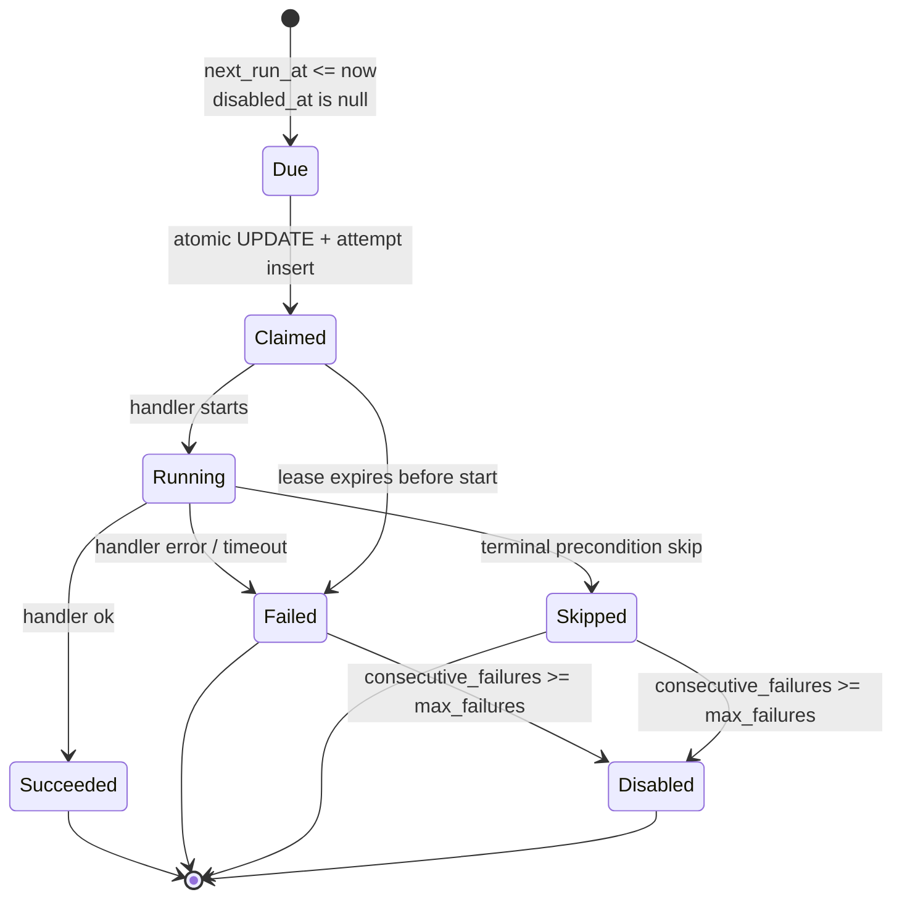
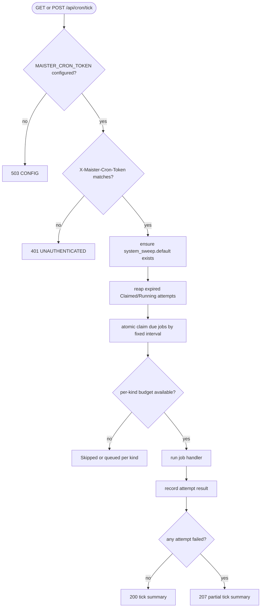
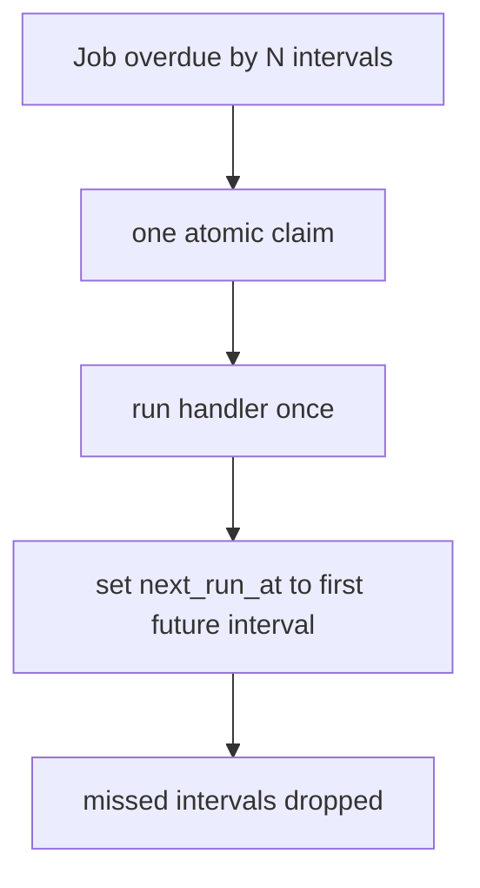
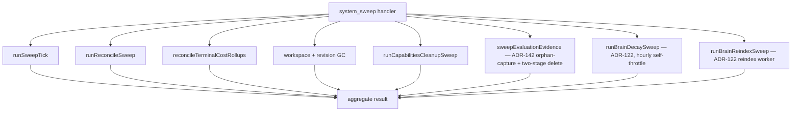
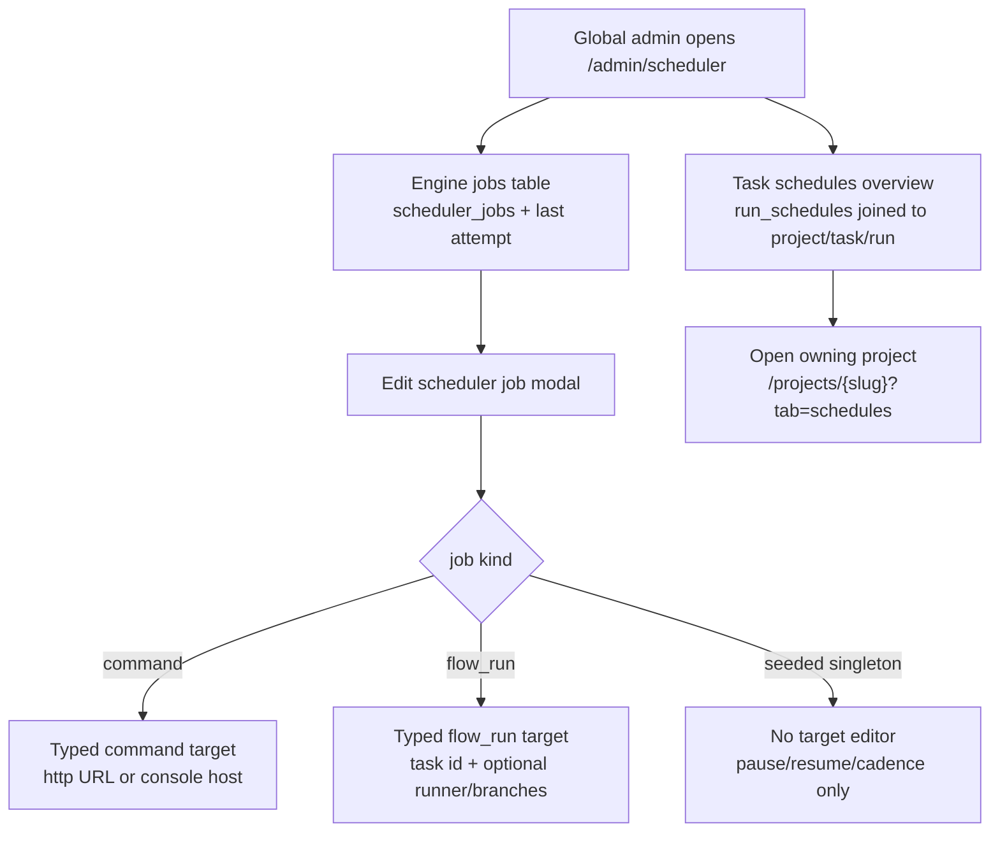

# Scheduler service domain

## ADR-142 workspace cleanup contract (Implemented)

`system_sweep.default` becomes the single periodic owner of workspace cleanup.
The timer, `/api/cron/tick`, and the immediate `/api/cron/gc` compatibility
surface all request/claim the same durable job and execute only through the
fenced scheduler attempt runner. A winner renews its lease while the bounded
bundle runs and persists the exact aggregate summary; a loser returns
`alreadyRunning` without running a duplicate service. The bundle composes
reconciliation, row-backed GC, disk-only reconciliation, and reconstructible
agent-directory cleanup with isolated per-item failures. No compatibility path
may call a GC bundle directly or create a second scheduler state machine.

## Purpose

This domain (**Implemented, M24**) covers MAIster's unified background clock: a
stateless, authorized Next.js tick route that claims due jobs, runs bounded
handlers, and records attempts. It generalizes the existing GC cron route into
one polymorphic scheduler without moving scheduling into the supervisor and
without turning recovery sweeps into live-path polling.

## Domain entities

- **Scheduler job** (`scheduler_jobs`, Implemented, M24) — durable schedule
  definition for one `job_kind`, fixed interval, target payload, next fire time,
  failure counters, and disable state.
- **Scheduler job run** (`scheduler_job_runs`, Implemented, M24) — attempt ledger
  with claim token, terminal status, lease expiry, summary, and error fields.
- **Agent trigger bindings** (`agent_schedules`, M34 — Implemented rework of the
  dead M24 bridge) — per-(agent, project) trigger rows: cron rows
  (`cron_expr` + `timezone` + `next_fire_at`, claimed atomically by the
  dispatcher below) and event rows (`event_match.kinds` consumed by the
  `agent_triggers` outbox consumer). The M24 columns `agent_ref` (text),
  `scheduler_job_id`, and `desired_state` are dropped. See
  [agents.md](agents.md).
- **`agent_tick` dispatcher** (`agent_tick.dispatcher` job, M34 — Implemented,
  ADR-089) — the ONE seeded `agent_tick` job (60s cadence, attempt budget
  hardcoded 1 — singleton like the other dispatchers; the
  `MAISTER_MAX_CONCURRENT_AGENTS` env var is repurposed as the agent-RUN
  budget enforced at `tryStartRun`) whose handler finally gets its
  launcher: it claims due `agent_schedules` cron rows
  (`UPDATE … SET next_fire_at = <next> WHERE id = ? AND next_fire_at <=
  now() RETURNING` — one winner, one catch-up fire, no backfill) and fires
  `launchAgentRun`, then runs `promoteNextPending(kind='agent')` as the
  sanctioned recovery sweep for stranded `Pending` agent runs.
  `createSchedulerJobSchema` now rejects `agent_tick` (seeded-singleton
  precedent: `run_schedule`, `domain_event_dispatch`).
- **Tick route** (`GET`/`POST /api/cron/tick`, Implemented, M24) — token-guarded
  clock entry point. It may filter by `jobKind`.
- **GC compatibility route** (`GET`/`POST /api/cron/gc`, Implemented M19,
  compatibility extension Implemented M24) — keeps current response semantics and
  runs the GC bundle (workspace + revision GC + capabilities cleanup +
  ephemeral-agent cleanup + terminal/missing-run agent-materialization retry +
  the ADR-142 evaluation-evidence sweep)
  only. It
  does NOT run the keepalive or reconcile sweeps, so the GC cron never transitions
  runs to `Crashed`; that live composition belongs to the `system_sweep` job kind.
- **`webhook_delivery` job kind** (Implemented, ADR-077) — singleton outbound-webhook
  drainer (one `webhook_delivery.default` job, 60s cadence, budget `webhookDelivery: 1`)
  whose handler does fanout + drain + prune each tick. See
  [outbound-webhooks.md](outbound-webhooks.md).
- **`domain_event_dispatch` job kind** (Implemented, ADR-086) — singleton
  domain-event dispatcher (one `domain_event_dispatch.default` job, 60s
  cadence, budget `domainEventDispatch: 1`) whose handler advances
  per-consumer cursors over the `domain_events` outbox each tick. Not
  user-creatable — `createSchedulerJobSchema` rejects it (`run_schedule`
  precedent). See [domain-events.md](domain-events.md).
- **`auto_promote` job kind** (Implemented, ADR-126) — singleton auto-promotion
  sweep (one `auto_promote.default` job, 60s cadence, budget `autoPromote: 1`)
  whose handler each tick evaluates lane-bounded `Review` flow runs and promotes
  the eligible ones through the SAME `promoteRun` choke point (system
  attribution, `autoOnReady: true`). `systemManaged`, not user-creatable. A
  terminal give-up CAS-sets `runs.promotion_hold` + posts exactly one system
  comment; a transient failure retries next tick. Gated by the
  `MAISTER_AUTO_PROMOTION` env kill switch AND the project master toggle.
- **`auto_launch_triaged` job kind** (Implemented, ADR-112) — singleton
  triaged-task launcher (one `auto_launch_triaged.default` job, 60s cadence,
  budget `autoLaunchTriaged: 1`) whose handler each tick sweeps tasks that are
  `triage_status='triaged'` AND `launch_mode='auto'` AND have a `flow_id` AND
  classify launchable (no live run, dependency blockers cleared), then launches
  each through the standard `launchRun` path (global cap → `Pending` if full).
  `systemManaged`, not user-creatable — `createSchedulerJobSchema` rejects it
  (`run_schedule` precedent). Its predicate is **disjoint** from the orchestrator
  `auto_launch_run_plan` domain-event consumer (ADR-098), which fires only on
  `parent_of`-under-orchestrator tasks carrying a `delegation_spec.agentId` and
  launches agent runs — this kind launches ordinary triaged FLOW tasks. See
  [triage.md](triage.md).
- **Scheduler admin** (`/admin/scheduler` page + `/api/admin/scheduler-jobs[/{jobId}]`,
  Implemented, M24/M28) — admin-only scheduler
  management. The refined surface separates Engine jobs from Task schedules,
  keeps task schedules read-only with project links, and edits scheduler
  targets through typed fields instead of a primary raw-JSON textarea.
- **Run-schedule dispatcher** (`run_schedule.dispatcher` job, `job_kind =
  'run_schedule'`, Implemented, M28) — the ONE seeded job whose handler claims due
  `run_schedules` rows and fires them through `launchRun`. Cron expressions and
  overlap policy live in the `run_schedules` table, NOT in `scheduler_jobs` —
  see [`run-schedules.md`](run-schedules.md). `createSchedulerJobSchema`
  deliberately rejects this kind (the seeded singleton is the only instance;
  disabling it on `/admin/scheduler` is the global kill switch).
- **One-time task launch dispatch** (Implemented, ADR-139) — the same seeded
  `run_schedule.dispatcher` also scans due `scheduled_task_launches` under
  its existing bounded job budget. Each intent claims and persists a durable
  pre-Git reservation before it enters `launchRun`; this is not a new clock,
  job kind, per-intent job, supervisor concern, or direct `runs` insert. Job
  summaries separately report claimed, launched, retried, failed, late,
  and truncated one-time-intent counts. See
  [`project-automations.md`](project-automations.md).
- **Target payloads** (`scheduler_jobs.target`, Implemented, M24/M28) —
  per-kind JSON payload persisted for engine handlers. `command`
  targets are either `http_ping` (`url`, optional `timeoutMs`) or
  `console_ping` (`host`, optional `timeoutMs`). `flow_run` targets use a
  required task id plus optional `runnerId`, `baseBranch`, and `targetBranch`.
  `system_sweep`, `run_schedule`, `webhook_delivery`,
  `domain_event_dispatch`, `agent_tick`, `auto_launch_triaged`,
  `evaluation_dispatch`, and `evaluation_suite_scan` use `{}`
  in the seeded rows.
- **`repo_delivery_scan` job kind** (**Implemented, ADR-134**) — one
  system-managed job per non-archived project, targeted at `{ projectId }` and
  never creatable from the admin API. It fetches the configured `origin`, then
  scans only `origin/<target branch>` into cached daily repository-delivery
  rollups. Fetch/provider parsing finishes before its one delete-and-replace
  transaction; a failed scan preserves the prior successful cache and native
  `maxFailures=3` isolates the bad project. Archive skips/disables the job;
  unarchive idempotently re-enables/seeds archive-style disabled jobs, but
  never clears a native threshold-poisoned job. This is the sole Git-fetch
  path for agentization—Observatory reads never fetch.
- **`pr_state_scan` job kind** (**Implemented, ADR-140**) — one system-managed job
  per non-archived project (NOT a global singleton), seeded like
  `repo_delivery_scan` via `ensurePrStateScanJobs` invoked from
  `ensureDefaultSchedulerJobs` on every tick; archived projects are disabled via
  `disableArchivedPrStateScanJobs`, and it is never creatable from the admin API.
  A keyset cursor lives in `scheduler_jobs.target->'cursor'` (the `auto_promote`
  idiom); cadence is the `PR_STATE_SCAN_CADENCE_SECONDS = 300` code constant (no
  env var). Each tick pages project workspaces with `pr_url IS NOT NULL AND
  (pr_state IS NULL OR pr_state = 'open')` (backed by a partial index) and reads
  each PR through the `getPrState` capability on the provider adapters
  (`gh`/`glab`/Gitea REST) — provider CLI/REST only, **zero LLM/agent tokens**,
  it **never calls the supervisor client**, and it **never mutates git or
  `runs.merge_commit_sha`** (that column stays owned by `repo_delivery_scan`,
  ADR-134). On each detected PR-state edge it writes the `workspaces` PR columns
  and emits a webhook in one edge-guarded single transaction, idempotent across
  re-scans: merged → `run.pr_merged` + a `run_pr_merged` `task_activity`; closed
  → `run.pr_closed`; conflicts → `run.pr_conflicts`. Poison policy: EVERY failed
  read — missing CLI / network / 5xx, and 404/not-found alike — skips the item
  this tick and leaves `pr_state` untouched (a 404 may be a permission denial,
  not a deleted PR), while the keyset cursor advances past it so no row can stall
  the job and `recordJobAttemptResult` max-failures/backoff protects the job —
  one bad row can never stall the per-project job.
  - Registration fan-out (this kind is `systemManaged` and non-creatable, so it
    is wired, not authored): the `SchedulerJobKind` union plus the
    `schedulerJobs.jobKind` and `schedulerJobRuns.jobKind` enums (3 schema
    edits); `ALL_SCHEDULER_JOB_KINDS` + `SCHEDULER_JOB_KIND_CATALOG`
    (`creatable: false`, `systemManaged: true`, NOT in `SEEDED_SINGLETON_IDS`);
    the `budgets.ts` union + `SchedulerBudgetLimits` + `schedulerBudgetLimits()`;
    the `schedulerBudgetForKind` switch in `jobs.ts`; the `claimDueJobs` CTE; the
    dispatch in `tick-service.ts` (plus its PRECONDITION-is-`Failed` catch
    special-case); and i18n `adminScheduler.kind.pr_state_scan` (EN + RU). The
    admin UI is data-driven (no hardcoded kind list). Handler:
    `web/lib/scheduler/handlers/pr-state-scan.ts`.
- **`evaluation_dispatch` job kind** (**Implemented, ADR-142** — Evaluation Lab
  T3.3) — the ONE seeded singleton evaluation dispatcher
  (`evaluation_dispatch.dispatcher` job, 60s cadence, budget
  `evaluationDispatch: 1`, `max_failures` 3, `systemManaged`, not
  user-creatable). Its handler `runEvaluationDispatchTick`
  (`web/lib/evaluations/dispatcher/tick.ts`) each tick: (1) reaps timed-out
  judge attempts (`running` past the panel-policy `timeoutMs`, anchored at
  `running_at`); (2) drives up to 20 queued `evaluation_executions` through the
  intent-first CAS FSM `queued→capturing→checking→judging` — evidence capture,
  objective checks over the live fact source, then idempotent judge-panel
  launch (a lost `queued→capturing` CAS means another tick owns the row and is
  left untouched); (3) re-checks up to 50 `judging` panels for
  quorum/all-terminal advance (recovery for a judge submit that never fired
  completion and for reaped timeouts). A capture/check step failure poisons the
  execution to terminal `failed` and, within the method's `maxRetries` budget,
  spawns a `retry_of` successor; a judging-phase transient is retried next tick,
  never terminalized. An interactive execution start additionally fires an
  immediate in-process kick (`kickEvaluationDispatch`, fire-and-forget) so the
  FSM does not wait for the 60s cron — the durable singleton tick remains the
  backstop.
- **`evaluation_suite_scan` job kind** (**Implemented, ADR-147** — Evaluation
  Lab T7.2) — the ONE seeded singleton suite scanner
  (`evaluation_suite_scan.dispatcher` job, 60s cadence, budget
  `evaluationSuiteScan: 1`, `max_failures` 3, `systemManaged`, not
  user-creatable). Its handler `runEvaluationSuiteScanTick`
  (`web/lib/evaluations/suites.ts`) scans every enabled `evaluation_suites`
  row via `runEvaluationSuiteScan`: a capped per-tick scan that generates one
  one-task Study per due definition task, idempotent per the
  `(suite_id, task_id, scan_key)` UNIQUE dedup (already-linked tasks are
  filtered BEFORE the cap so tasks past the cap are never starved by
  re-selection), poison-safe per task AND per suite (a failing task/suite is
  counted and skipped, never aborting the tick). A `regression` suite no-ops
  while its watched trigger revision equals `last_trigger_revision`; the
  default tick passes no `resolveTrigger`, so a regression suite scans once per
  definition version until a package-catalog resolver is threaded through.
  Suites ride the M24 clock — there is NO second scheduler.

## State machine

## Process flows

### Authorized tick

### Catch-up without backfill

### System sweep composition

**Cost-rollup backstop reconcile (ADR-117 — Implemented).**
`reconcileTerminalCostRollups` is the completeness
guarantee for `run_cost_rollups`: it keys on `runs.ended_at` (set on every
terminal transition), **not** a status allow-list and **not** a domain event,
because scratch success emits no terminal event and would otherwise never get a
rollup. Progress is tracked by the durable `runs.cost_reconciled_at` marker
(migration `0084`), stamped on every attempt (reconciled / missing-cost / error)
so an unreconcilable run is attempted once and settled instead of monopolizing
the bounded scan, and a pre-`0083` rollup with empty `by_runner` is re-reconciled
once to backfill it. Candidate predicate: `ended_at IS NOT NULL AND ended_at >
now − lookback AND (cost_reconciled_at IS NULL OR cost_reconciled_at < ended_at +
SETTLE_GRACE)`, ordered by `ended_at` and bounded by a per-tick limit (reuses the
existing sweep limit; no new var). `SETTLE_GRACE` (~2 min, a module constant)
forces one extra re-reconcile so the supervisor's async final `cost.jsonl` flush
is captured; once the marker passes `ended_at + SETTLE_GRACE` the run is skipped
(no disk thrash). Lookback comes from
`MAISTER_COST_RECONCILE_LOOKBACK_HOURS` (default 168h = 7-day GC horizon; see
[configuration.md](../configuration.md)). The supported `runs_ended_at_idx`
partial index backs the bounded scan. The `cost-rollup-reconcile` domain-event
consumer (see [domain-events.md](domain-events.md)) is a separate low-latency
fast-path over event-emitting terminals; the sweep owns historical backfill and
every no-event terminal.

### Admin cockpit and typed target editing

The admin screen is an operator cockpit over two related but distinct stores:
fixed-interval engine jobs and user-facing cron schedules.

With Project Automations, it also exposes read-only one-time intent diagnostics
and links to the owning project's Automations tab. It never becomes a member
automation editor and does not expose reservation paths, branch names, or raw
launch payloads.

## Expectations

- The tick route MUST be stateless; all idempotence comes from DB claims and
  attempt leases.
- `scheduler_jobs.cadence_interval_seconds` MUST be the only `scheduler_jobs`
  cadence model — cron expressions live exclusively in `run_schedules`
  (Implemented, M28; see [`run-schedules.md`](run-schedules.md)).
- A due job MUST produce at most one unexpired `Claimed` or `Running` attempt.
- Clock outage catch-up MUST run one attempt only and never backfill missed
  fixed-interval periods.
- The tick service MUST idempotently seed `system_sweep.default` with a 60-second
  cadence so the recovery sweep is live after migration without hand-authored
  SQL; it MUST likewise seed `run_schedule.dispatcher` (60-second cadence,
  `max_failures` 3; Implemented, M28), `webhook_delivery.default`
  (60-second cadence; Implemented, ADR-077), `domain_event_dispatch.default`
  (60-second cadence; Implemented, ADR-086), `agent_tick.dispatcher`
  (60-second cadence; M34 — Implemented, ADR-089), and
  `auto_launch_triaged.default` (60-second cadence; Implemented, ADR-112), and
  `auto_promote.default` (60-second cadence; Implemented, ADR-126), and
  `evaluation_dispatch.dispatcher` + `evaluation_suite_scan.dispatcher`
  (60-second cadence each; Implemented, ADR-142/ADR-147).
- Atomic claim MUST enforce per-kind budgets in SQL before an attempt is created:
  `command` uses `MAISTER_MAX_CONCURRENT_COMMANDS`; `agent_tick` is a hardcoded
  budget of 1 (singleton dispatcher; M34 — Implemented — its former
  `MAISTER_MAX_CONCURRENT_AGENTS` attempt budget is repurposed as the
  agent-run budget at `tryStartRun`, see [agents.md](agents.md)); `flow_run`
  remains delegated to the existing
  Flow run launch/concurrency path; `run_schedule` is a hardcoded budget of 1
  (serial dispatcher, like `system_sweep`; Implemented, M28); `webhook_delivery`
  is a hardcoded budget of 1 (singleton drainer; Implemented, ADR-077);
  `domain_event_dispatch` is a hardcoded budget of 1 (singleton dispatcher;
  Implemented, ADR-086); `auto_launch_triaged` is a hardcoded budget of 1
  (singleton launcher; Implemented, ADR-112); `evaluation_dispatch` and
  `evaluation_suite_scan` are each a hardcoded budget of 1 (singleton
  dispatchers; Implemented, ADR-142/ADR-147).
- `agent_tick` MUST be the seeded `agent_tick.dispatcher` singleton only —
  `createSchedulerJobSchema` rejects the kind (M34 — Implemented; the M24
  "stub without a launcher records `Skipped`/`PRECONDITION`" seam is
  superseded by the real launcher). A claimed cron row MUST fire exactly
  once per due window (atomic `next_fire_at` claim) and a missed window
  MUST fire once, never backfill.
- Terminal attempt writes MUST be fenced by attempt status so a handler that
  returns after lease expiry cannot turn a reaped `Failed` attempt into
  `Succeeded`.
- `system_sweep` MUST remain a recovery/cleanup sweep and NEVER a live
  state-transition poller.
- `pr_state_scan` (**Implemented, ADR-140**) MUST write `workspaces.pr_state`
  ONLY from a successful provider read (a failed read — including 404/not-found —
  MUST leave it untouched), MUST NEVER launch an ACP session or call the
  supervisor client, and MUST run on a per-project cadence of
  `PR_STATE_SCAN_CADENCE_SECONDS` (300s) rather than as a global singleton.
- The fallback timer MUST be off unless `MAISTER_SCHEDULER_TIMER_ENABLED=true`.
- `/api/cron/gc` MUST keep its existing auth and response contract and run the
  shared GC bundle (workspace + revision GC + capabilities cleanup +
  ephemeral-agent cleanup + terminal/missing-run agent-materialization retry +
  the ADR-142 evaluation-evidence sweep)
  only; it MUST
  NOT run the keepalive or reconcile sweeps that `system_sweep` performs.
- `/admin/scheduler` MUST treat `scheduler_jobs` and `run_schedules` as
  separate concepts: Engine jobs are fixed-interval clock work; Task schedules
  are cron rows owned by projects and fired through the single
  `run_schedule.dispatcher` job.
- `/admin/scheduler` MUST show scheduler clock diagnostics for operators:
  fallback timer state, fallback interval, whether `MAISTER_CRON_TOKEN` is
  configured, and an explicit driver state. When the fallback timer is disabled,
  the screen MUST say that an external caller is expected to hit
  `/api/cron/tick`; when neither clock path is configured, it MUST say that no
  tick is configured.
- `/admin/scheduler` MUST show the Brain index queue from `brain_index_jobs`,
  active rows first, with project, source, reason, status, progress, created
  time, source `last_indexed_at`, and source/job error context. The queue is
  drained by `system_sweep.default`, not by a separate Brain-specific worker.
- Scheduler job kind lists MUST share one catalog across parsing, filtering,
  creation, and editing. All DB-supported kinds are visible/filterable:
  `system_sweep`, `command`, `agent_tick`, `flow_run`, `run_schedule`,
  `webhook_delivery`, `domain_event_dispatch`, `auto_launch_triaged`,
  `auto_promote`, `repo_delivery_scan`, `pr_state_scan`,
  `evaluation_dispatch`, and `evaluation_suite_scan`.
- Custom job creation MUST match the admin API schema. The seeded singleton
  kinds `agent_tick`, `run_schedule`, `domain_event_dispatch`,
  `auto_launch_triaged`, `auto_promote`, `evaluation_dispatch`, and
  `evaluation_suite_scan` are not creatable as duplicates. `webhook_delivery`
  policy MUST stay consistent across schema, catalog, docs, and UI.
- The admin editor MUST build `scheduler_jobs.target` from typed fields.
  Raw JSON MUST NOT be the primary write UI; a read-only advanced preview is
  acceptable for diagnostics.
- Engine `flow_run` jobs use a required task id field. Friendly task selection
  stays on the user-facing project schedules tab.
- Seeded singleton rows MUST NOT expose destructive delete in the admin UI.
  Custom/deletable rows require delete confirmation.
- Operator-visible execution failures on the screen MUST come from the last
  `scheduler_job_runs` status/error and existing structured scheduler logs;
  the UI should not invent a second error channel.
- (ADR-121, Implemented) `promoteNextPending` is the unified priority-ordered
  admission gate. On a freed slot it admits the single most-critical eligible unit
  across THREE sources — C1 Pending runs, C3 answered-idle resumables
  (`NeedsInputIdle` + `resume_requested_at`), and C2 eligible fresh Backlog tasks
  (flow pool only, via the `tasks.queue_claimed_at` two-phase claim) — strictly by
  (`weightOf` weight DESC, classRank, FIFO), NOT a blind `started_at` FIFO. The cap
  invariant is unchanged (one admission per call). The 60s `auto_launch_triaged`
  poll is the C2 BACKSTOP (shares `lib/scheduler/c2-eligibility` with the gate), and
  resume is cap-safe (the D2 bypass is removed) — see [`task-queue.md`](task-queue.md).
  Both apply the `MAISTER_TASK_QUEUE_AUTO_RESERVE` / per-project `maxInFlightAuto`
  capacity guards to C2.

## Edge cases

- Missing `MAISTER_CRON_TOKEN` returns `CONFIG`/503 and runs no jobs.
- Token mismatch returns `UNAUTHENTICATED`/401 and never logs the token value.
- Active attempt lease overlap returns no duplicate claim and is not an error.
- Expired attempt lease is reaped as `Failed` before the next claim.
- Budget exhaustion records a bounded refusal/skip result for the affected job
  kind and never consumes a different kind's cap.
- Handler failure records `Failed` with bounded error context and contributes to
  the route's 207 summary.
- `pr_state_scan` poison item (**Implemented, ADR-140**): a deterministic per-item
  failure (404 / deleted PR, or a `generic`/unsupported provider) is absorbed
  INSIDE the handler — the item is stamped and counted in the summary's `skipped`
  (with `reason: "unsupported_provider"` for a generic remote) and the JOB still
  records `Succeeded`. A transient one (missing CLI / token, network, provider
  5xx) skips the item this tick and advances the keyset cursor, while the native
  `consecutive_failures >= max_failures` backoff isolates a genuinely broken
  project — one bad row never stalls the per-project job or fails the tick.
  Note the job status `Skipped` is unreachable for this kind: `pr_state_scan` is
  deliberately EXCLUDED from the tick's `isSkip` predicate, so a project-scoped
  `PRECONDITION` (an unconfigured origin remote) records `Failed` and consumes
  the bounded retry budget rather than degrading silently forever. The per-item
  `skipped` counter and the terminal job status are different things.
- Invalid per-kind admin target payloads return `MaisterError("CONFIG")` as a
  422 route response. The typed editor should prevent common shape errors, but
  `web/lib/scheduler/job-admin.ts` remains the server boundary.
- Attempting to create seeded-only dispatcher kinds through the admin API
  returns `CONFIG`/422; the UI should not present those options.
- Deleting a seeded row through a non-UI client removes the row under the
  current route contract; the tick re-seeds known default jobs. The designed UI
  avoids that sharp path by hiding destructive actions on seeded singletons.

## Linked artifacts

- Spec: [`../../.ai-factory/specs/feature-m24-scheduler-service.md`](../../.ai-factory/specs/feature-m24-scheduler-service.md).
- API: [`../api/web.openapi.yaml`](../api/web.openapi.yaml).
- DB: [`../database-schema.md`](../database-schema.md),
  [`../db/scheduler-domain.md`](../db/scheduler-domain.md), and
  [`../db/erd.md`](../db/erd.md).
- ADR: [ADR-060](../decisions.md#adr-060-unified-scheduler-clock-and-polymorphic-job-budgets).
- User-facing run schedules (Implemented, M28): [`run-schedules.md`](run-schedules.md) +
  [ADR-071](../decisions.md#adr-071-user-facing-run-schedules-on-the-m24-clock).
- Domain-event dispatcher (Implemented, ADR-086): [`domain-events.md`](domain-events.md).
- Triaged-task launcher (Implemented, ADR-112): [`triage.md`](triage.md).
- Platform-agent triggers (M34 — Implemented, ADR-089): [`agents.md`](agents.md).
- Existing recovery/GC domain: [`reconciliation-gc.md`](reconciliation-gc.md).
- Implemented: [ADR-134](../decisions.md#adr-134-observatory-agentization-and-commit-provenance)
  and [`observatory.md`](observatory.md).
- PR lifecycle tracking (Implemented, ADR-140):
  [ADR-140](../decisions.md#adr-140-pr-lifecycle-tracking) — the per-project
  `pr_state_scan` jobKind.
- Evaluation Lab dispatch + suites (Implemented, ADR-142/ADR-147): the
  `evaluation_dispatch` and `evaluation_suite_scan` singleton jobKinds —
  handlers `web/lib/evaluations/dispatcher/tick.ts` and
  `web/lib/evaluations/suites.ts`; DB:
  [`../db/evaluations-domain.md`](../db/evaluations-domain.md).
- Source seams: `web/app/api/cron/gc/route.ts`, `web/lib/scheduler.ts`,
  `web/lib/reconcile.ts`, `web/lib/scheduler/system-sweeps.ts`,
  `web/lib/runs/keepalive-sweeper.ts`,
  `web/lib/capabilities/cleanup.ts`, `web/lib/scheduler/job-admin.ts`,
  `web/lib/scheduler/job-admin-schema.ts`, and
  `web/app/(app)/admin/scheduler/page.tsx`.
