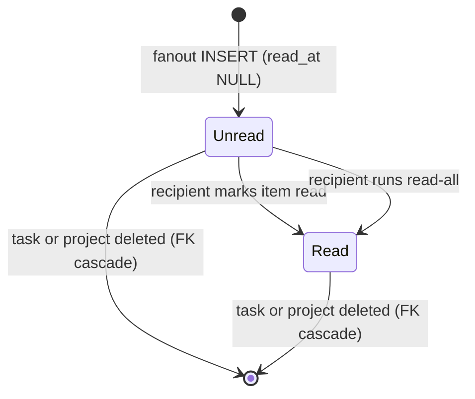
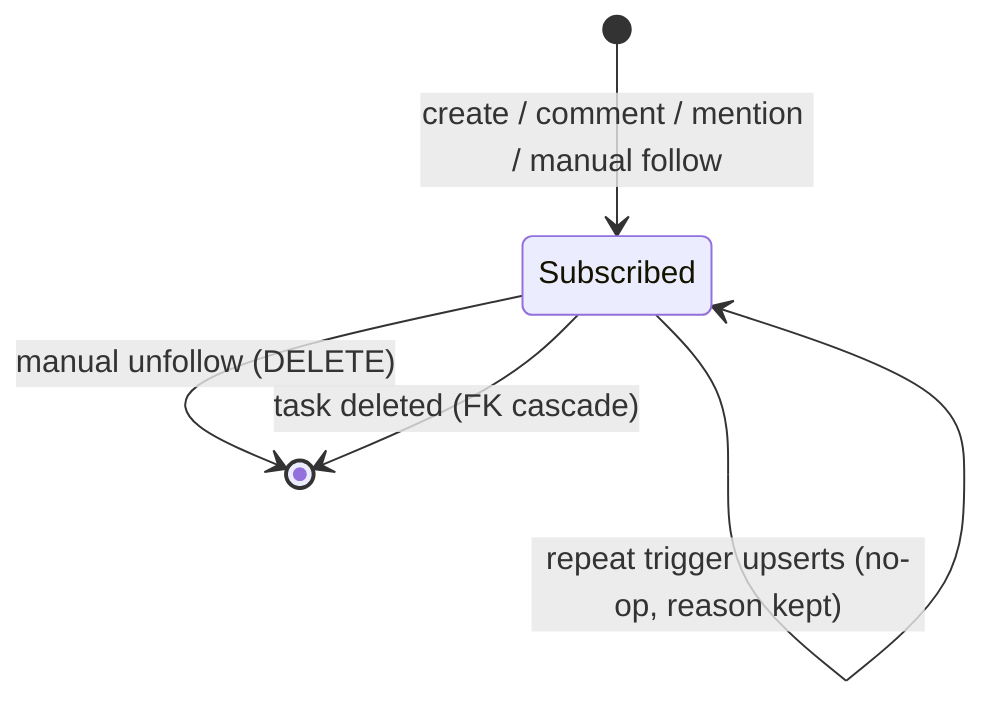
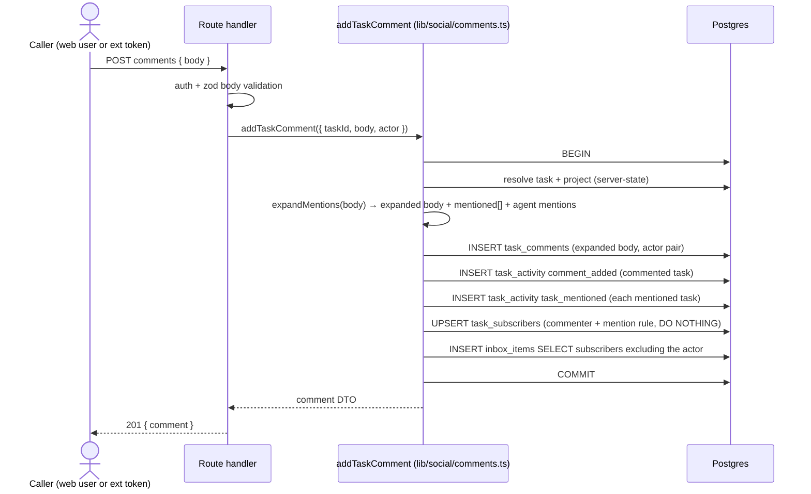
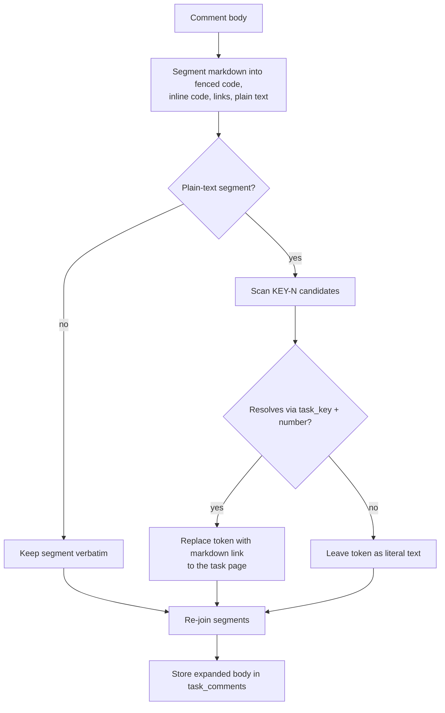
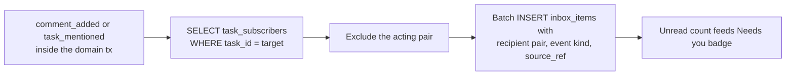
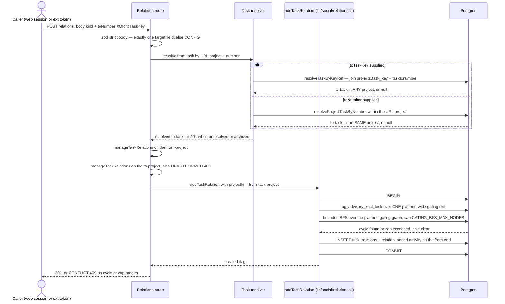

# Social board domain

## Purpose

The social board layer (Stage 1, ADR-083) gives every task a stable
per-project identity (`KEY-N`) and a social substrate around it: markdown
comments with task mentions, domain-written activity, auto-subscriptions,
and a per-recipient inbox. All four social tables
(`task_comments`, `task_activity`, `task_subscribers`, `inbox_items`)
carry a polymorphic actor model (`user | agent | system`); Stage 1 wrote
only `user`/`system` actors — the `agent` actor goes live with the
platform-agent substrate (M34/ADR-089), written by per-launch ephemeral
agent tokens through `socialActorForToken` (`web/lib/tokens/verify.ts`).
Task numbering, typed
relations, and the `"blocked"` launchability gate are documented in
[`tasks.md`](tasks.md); this file owns the comment/activity/subscription/
inbox substrate plus the relation **write path**
(`web/lib/social/relations.ts`) — row ownership, locking, cycle refusal, and
the ADR-155 cross-project rules. (Implemented, incl. cross-project relations)

## Domain entities

- **Task key** — `projects.task_key`, platform-wide unique, matches
  `^[A-Z][A-Z0-9]{1,9}$`. Set at registration (explicit or derived from the
  project name), immutable in Stage 1. See [`tasks.md`](tasks.md).
- **Task number** — `tasks.number`, per-project monotonic, allocated from
  `projects.next_task_number` in the `createTask` transaction. `KEY-N` =
  `task_key` + `number`. See [`tasks.md`](tasks.md).
- **Relation row ownership** (ADR-155 — Implemented) — a `task_relations` row is
  owned by its **from-end**: `task_relations.project_id` is the from-task's
  project, and the to-task MAY live in a different project. Both endpoints are
  FKs to `tasks.id` and uniqueness is `(from_task_id, kind, to_task_id)`, so
  the schema already tolerates a cross-project row — Stage 1's restriction was
  a domain check, not a constraint. ADR-155 supersedes exactly one sentence of
  ADR-083 clause 4 ("same-project only in Stage 1"); canonical one-direction
  rows, `UNIQUE(from_task_id, kind, to_task_id)`, the
  `task_relations_no_self_check` CHECK, and render-time-only inverse labels all
  stand. Cross-project addressing is possible because
  `projects.task_key` is platform-unique (`.notNull().unique()`), which makes
  `KEY-N` a valid global address. Kind vocabulary and the launchability gate
  stay in [`tasks.md`](tasks.md).
- **Actor pair** — `(actor_type, actor_id)` columns on every social table:
  `actor_type ∈ {user, agent, system}`,
  `CHECK ((actor_type = 'system') = (actor_id IS NULL))`, no FK to `users`
  (a deleted user renders as a "former user" fallback).
- **Comment** — `task_comments` row: markdown body stored with mentions
  already expanded, actor pair, append-only (no edit/delete/threading in
  Stage 1).
- **Activity event** — `task_activity` append-only row with
  `event_kind ∈ {task_created, comment_added, task_mentioned,
  relation_added, relation_removed, run_launched, triage_set,
  triage_requeued, agent_quarantined, experiment_concluded,
  run_pr_merged, evaluation_decided, agent_summon_suppressed}` and a jsonb
  `payload`
  (`triage_set`/`triage_requeued`/`agent_quarantined` added by M34 platform
  agents; `experiment_concluded` by ADR-124; `run_pr_merged` added by
  ADR-140/141's `pr_state_scan` merged edge; `evaluation_decided` by
  ADR-142's human verdict mirror; `agent_summon_suppressed` by ADR-151's
  mention branch — see [`agent-mentions.md`](agent-mentions.md)). Written
  only by the domain layer (`web/lib/social/*` via `recordTaskActivity` plus
  the named service write-sites).
- **Subscriber** — `task_subscribers` row: `(task_id, subscriber_type,
  subscriber_id, reason)` with `reason ∈ {creator, commenter, mentioned,
  manual}` and `subscriber_type ∈ {user, agent}` (`system` never
  subscribes).
- **Inbox item** — `inbox_items` row: recipient pair, `project_id`,
  `task_id`, `event_kind`, `source_ref` jsonb
  (`{kind, taskId, commentId, activityId}`), nullable `read_at`.

## State machine

Comments and activity events are append-only and immutable in Stage 1 —
their only lifecycle is FK cascade on task/project deletion. The stateful
pieces are the inbox item read marker and the per-task subscriber set.

Inbox item lifecycle (Implemented):

Subscription lifecycle (Implemented) — one row per `(task, subscriber pair)`,
first reason wins:

## Process flows

### Comment pipeline (Implemented)

One `db.transaction` covers all five steps; no external side-effect runs
inside it (no supervisor call, no filesystem write).

### Mention expansion (Implemented)

Mentions expand at write time; the expanded body is what `task_comments.body`
stores. Rendering never re-resolves (single render path, immutable history;
stale links after a project slug rename are accepted). **(ADR-151 —
Designed)** the same segmentation pass carries a second token family,
`@<agentId>` agent mentions, resolved against the project's summonable agents
and expanded to `[@<agentId>](/agents/<agentId>)`; behavior is owned by
[`agent-mentions.md`](agent-mentions.md).

### Inbox fanout (Implemented)

Fanout runs inside the same transaction as the triggering write, as one
batch `INSERT … SELECT` per target task. Stage-1 triggers: `comment_added`
(the commented task's subscribers) and `task_mentioned` (each mentioned
task's subscribers). `task_created`, `relation_*`, and `run_launched` do
NOT fan out — the project Log page covers them; the inbox stays
high-signal.

### Reading the inbox (Implemented; unified `/inbox` — WI-1)

`GET` surfaces list items for the session user. Today the social inbox renders
on the portfolio home (`InboxPanel`) and the project board section; WI-1 adds a
dedicated cross-project `/inbox` page that reuses the same `getInboxItems` query
and collapses the home blocks into a compact summary card. `PATCH
/api/inbox/[itemId]/read` and `POST /api/inbox/read-all` mutate only rows whose
recipient equals the session user; other users' items answer 404. The "Needs
you (N)" badge is the single canonical `needsYou` count (see Expectations); see
[`hitl.md`](hitl.md) for the HITL half.

### Creating a relation, cross-project included (ADR-155 — Implemented)

Relation mutations take their target either as `toNumber` (resolved strictly
inside the URL project, unchanged) or as the platform-global `toTaskKey`
(`KEY-N`) — exactly one of the two. The diagram traces the added steps: global
target resolution, the second `manageTaskRelations` check on the resolved
target project, the ONE platform-wide gating lock, and the now project-agnostic
bounded cycle BFS. The row is still written with the from-task's `project_id`.

## Expectations

- Every `task_activity` row MUST be written by the domain layer
  (`recordTaskActivity` from `web/lib/social/*` or a named service
  write-site) inside the same transaction as its triggering domain write;
  route handlers MUST NOT insert activity directly. **(ADR-151 restatement —
  Implemented)** `recordTaskActivity` remains the ONLY writer, and a caller is
  either the originating domain transaction or a system-actored async
  consumer/job whose write is idempotent by construction (`pr_state_scan`,
  the mention-summon branch). (Implemented)
- `task_activity.event_kind` MUST be one of `task_created | comment_added |
  task_mentioned | relation_added | relation_removed | run_launched |
  triage_set | triage_requeued | agent_quarantined | experiment_concluded |
  run_pr_merged | evaluation_decided | agent_summon_suppressed`;
  `run_finished` joins only when a `setRunStatus` choke point exists
  (Phase 2). (Implemented; `agent_summon_suppressed` — Implemented, ADR-151)
- Every social-table row MUST satisfy `actor_type ∈ {user, agent, system}`
  and `(actor_type = 'system') = (actor_id IS NULL)`; Stage 1 wrote only
  `user`/`system`, while M34 platform agents write `actor_type = 'agent'`
  rows via per-launch ephemeral agent tokens (`socialActorForToken`).
  (Implemented)
- `addTaskComment` MUST run resolution, comment insert, activity writes,
  subscription upserts, and inbox fanout in exactly ONE `db.transaction`,
  with no external side-effect inside it. (Implemented)
- Comment bodies MUST be stored with mentions already expanded; renderers
  MUST NOT re-resolve `KEY-N` tokens at read time. (Implemented)
- Mention candidates inside fenced code blocks, inline code spans, and
  existing markdown links MUST NOT be expanded; unresolved candidates MUST
  stay literal text. (Implemented)
- Subscription writes MUST be `ON CONFLICT DO NOTHING` against
  `UNIQUE(task_id, subscriber_type, subscriber_id)` — the first reason
  wins and is never overwritten. (Implemented)
- Inbox fanout MUST exclude the acting pair and MUST fire only for
  `comment_added` and `task_mentioned` in Stage 1. (Implemented)
- Inbox read mutations MUST be recipient-owned: a session user can mark
  only their own items; foreign `itemId`s answer 404. (Implemented)
- The "Needs you (N)" badge is one canonical number `needsYou =
  pendingHitlCount + unreadInboxCount`, where `pendingHitlCount` is the
  respondable cross-project HITL count from `getCrossProjectHitlInbox(userId,
  role)` and `unreadInboxCount = getUnreadInboxCount(userId)`. Every surface
  that shows it MUST read this one count: the rail Inbox badge
  (`app/(app)/layout.tsx`), the portfolio `totalNeeds`
  (`lib/queries/portfolio.ts`), the project board header, and the `/inbox`
  page. RBAC scoping is preserved (admin = all visible projects, member = own).
  **(WI-1 — Implemented: all four surfaces read this one count; before it the
  home `totalNeeds` counted HITL only and the rail badge counted needs/waiting
  workspaces.)**
- Comment markdown MUST render through the shared remark-only wrapper
  (no `rehype-raw`): raw HTML in a body renders as text, never as markup.
  (Implemented)
- Ext comment routes MUST reuse `addTaskComment`/`listTaskComments` and
  write a `token_audit_log` row in-tx; user-owned tokens act as
  `('user', ownerUserId)`, ownerless tokens as `('system', NULL)` with
  `{via: 'ext', tokenId}` in the activity payload. (Implemented)
- (ADR-121, Implemented) A gating-kind (`blocks|depends_on|requires`) relation
  whose insert would close a dependency cycle MUST be refused with
  `MaisterError("CONFLICT")` (HTTP 409), evaluated INSIDE the insert transaction
  under the gating advisory lock (no TOCTOU); `parent_of`/`duplicate_of` are
  non-gating and never cycle-checked. See [`task-queue.md`](task-queue.md).
- **(ADR-155 — Implemented)** A `task_relations` row's `project_id` MUST equal the
  from-task's project, and the to-task MAY belong to a different project.
- **(ADR-155 — Implemented)** Creating or removing a relation MUST require
  `manageTaskRelations` on BOTH endpoint projects — the from-end on the URL
  project and the to-end re-checked on the resolved target project.
- **(ADR-155 — Implemented)** Every gating-kind insert MUST serialize on ONE
  platform-wide advisory lock
  (`pg_advisory_xact_lock(RELATION_LOCK_NAMESPACE, 0)`) and NEVER on a
  per-project lock, because pairwise per-project locking only serializes cycles
  of length ≤ 3.
- **(ADR-155 — Implemented)** The gating cycle BFS MUST refuse with
  `MaisterError("CONFLICT")` when its traversal exceeds `GATING_BFS_MAX_NODES`
  (default 5000) rather than commit an unverified edge.
- **(ADR-155 — Implemented)** `toNumber` and `toTaskKey` MUST be mutually exclusive
  on every relation-mutation body: both present or neither present is
  `MaisterError("CONFIG")` — HTTP 400 on the internal route, 422 on the ext
  surface (`httpStatusForExtCode`) — refused before any endpoint resolution.
- **(ADR-155 — Implemented)** `getOpenRelationBlockers` MUST return each blocker's
  OWN `projects.task_key`, and the `blocked` chip MUST render that `KEY-N` —
  removing the named edge is the only mitigation for a wedged `requires`
  dependency.
- **(ADR-155 — Implemented)** `requires` MUST stay success-gated across projects: a
  dependency in another project keeps the dependent blocked while it is
  `Abandoned` or its latest run `Failed`, and only `Done` releases it.
- **(ADR-155 — Implemented)** Relations MAY cross projects but automation MUST NOT:
  `auto_launch_run_plan`, the abandon cascade
  (`getUnlaunchedAutoChildTaskIds`), and C2 admission's `parent_of` exclusion
  (`loadC2CandidateRows`) MUST all scope to the parent's own project — the
  launcher and the exclusion MUST stay a partition, or a cross-project-linked
  task is owned by neither. Board decomposition MUST render each child's OWN
  `KEY-N` and project slug rather than the current board's.
- **(ADR-155 — Implemented)** `resolveTaskByKeyRef` MUST resolve `KEY-N` against
  the platform-unique `projects.task_key`, MUST uppercase the key part before
  querying, and MUST return `null` — never throw — for a malformed,
  over-long, out-of-int4-range, or unknown ref without issuing a query.
- **(ADR-155 — Implemented)** `getTaskRelations` MUST render each end with the
  COUNTERPART's own `projects.task_key`, never the reading task's.
- **(ADR-155 — Implemented)** A gating cycle MUST be refused identically whether
  its legs sit in one project or span several.

## Edge cases

- **(ADR-155 — Implemented) Relation whose `projectId` is not the from-task's
  project** — refused `MaisterError("CONFIG")`. The to-end may differ; the
  from-end defines row ownership and may not.
- **Relation closes a gating cycle** — refused with `MaisterError("CONFLICT")`
  (409) at both the web and ext relations routes (ADR-121; the BFS is
  platform-wide, not project-scoped, from ADR-155 — Implemented).
- **Dangling `actor_id` (user deleted)** — rows survive (no FK); UI renders
  a "former user" fallback label. Not an error.
- **Mention of a since-deleted task** — write-time resolution fails, the
  token stays literal. A previously expanded link to a now-deleted task
  404s on click; the comment body is never rewritten.
- **Unresolved `KEY-N`** (typo, foreign project key) — literal text,
  logged at DEBUG, no error.
- **Unresolved or ambiguous `@<handle>`** — literal text, no error, no
  summon. Resolution and summon behavior are owned by
  [`agent-mentions.md`](agent-mentions.md) (ADR-151 — Implemented).
- **Empty or whitespace comment body** — route zod validation rejects →
  `MaisterError("CONFIG")` → 400.
- **Comment POST against a missing task/number** — server-state resolution
  fails → `MaisterError("PRECONDITION")` → 404-equivalent.
- **Concurrent identical subscriptions** — `ON CONFLICT DO NOTHING`; no
  error, single row, first reason kept.
- **Mutual blocks (`A blocks B` + `B blocks A`)** — both unlaunchable until
  one relation is removed; always recoverable in UI. Owned by
  [`tasks.md`](tasks.md).
- **`requires` success-gate (M37 — Implemented)** — the orchestrator auto-DAG
  wires child tasks with the `requires` relation kind (ADR-098): unlike
  `depends_on`/`blocks` (which release on `Done` **and** `Abandoned`),
  `requires` releases the dependent ONLY on `Done`; `Failed`/`Abandoned`
  keeps it blocked and wakes the orchestrator. Behavior owned by
  [`orchestrator.md`](orchestrator.md).
- **`duplicate_of` non-blocking (ADR-112 — Implemented)** — the triager creates
  a `duplicate_of` relation kind when it flags a task as a duplicate. It is
  **informational only**: `getOpenRelationBlockers` queries solely
  `blocks`/`depends_on`/`requires`, so `duplicate_of` (like `parent_of`)
  is never returned and NEVER gates launch — the `flagged` task status (not
  the relation) holds the duplicate. Launchability owned by
  [`tasks.md`](tasks.md); triager flow by [`triage.md`](triage.md).
- **Hole-y numbering** — task deletion leaves a permanent hole;
  `next_task_number` never decrements. Owned by [`tasks.md`](tasks.md).
- **Foreign inbox item id** — `PATCH …/read` on another user's item → 404
  (`PRECONDITION`), no information leak about existence.

Relation-mutation refusals are an **allow-list** (ADR-155 — Implemented): the
mutation proceeds only when exactly one target field is supplied, the target
resolves, the caller holds `manageTaskRelations` on both endpoint projects, and
the gating BFS clears under the platform-wide lock. Every other outcome is one
of these, in evaluation order:

- **Self-relation (`fromTaskId === toTaskId`)** → `MaisterError("CONFIG")` —
  400 on the internal route, 422 on the ext surface — backstopped by the
  `task_relations_no_self_check` DB CHECK. (Implemented)
- **Both `toNumber` and `toTaskKey`, or neither** → `MaisterError("CONFIG")` —
  400 on the internal route, 422 on the ext surface (`httpStatusForExtCode`
  maps `CONFIG` → 422 across all of `/api/v1/ext/*`) — from the route's
  `.strict()` body schema, before any endpoint is resolved. (Designed)
- **`toTaskKey` that does not resolve** — malformed ref, unknown `task_key`,
  unknown number, or an archived target project → **404**;
  `resolveTaskByKeyRef` returns `null` and never throws. (Designed)
- **Caller lacks `manageTaskRelations` on the resolved target project** →
  `MaisterError("UNAUTHORIZED")` (403). (Designed)
- **Project-bound ext token (`actor.projectId !== null`) targeting a task in
  another project** → `MaisterError("UNAUTHORIZED")` (403) with a
  `token_audit_log` row written — deliberately NOT the existence-hidden 404 the
  ext handler uses for project scoping, because the caller supplied a
  globally-unique `KEY-N` and the refusal must be actionable. (Designed)
- **Insert would close a gating cycle across any project** →
  `MaisterError("CONFLICT")` (409), decided inside the insert transaction under
  the platform-wide lock. (Designed)
- **Gating BFS traversal exceeds `GATING_BFS_MAX_NODES`** →
  `MaisterError("CONFLICT")` (409) + WARN; refusing is the safe direction
  because a missed cycle deadlocks permanently. (Designed)

## Linked artifacts

- ADRs: [ADR-083](../decisions.md#adr-083-social-board-substrate--per-project-task-numbering-typed-relations-polymorphic-actor),
  [ADR-155](../decisions.md#adr-155-cross-project-task-relations)
  (cross-project task relations — Designed).
- Sibling domains: [`agent-mentions.md`](agent-mentions.md) (`@<agentId>`
  resolution + directed summons, ADR-151),
  [`tasks.md`](tasks.md) (numbering, relations,
  launchability gate), [`hitl.md`](hitl.md) (the HITL half of "Needs you"),
  [`run-schedules.md`](run-schedules.md) (dispatcher skip-on-blocked),
  [`external-operations.md`](external-operations.md) (ext comment routes,
  scopes, MCP tools).
- ERD: [`../db/runs-domain.md`](../db/runs-domain.md) and
  [`../db/erd.md`](../db/erd.md).
- API: [`../api/web.openapi.yaml`](../api/web.openapi.yaml).
- Source (Implemented): `web/lib/social/*`, `web/lib/queries/inbox.ts`,
  `web/lib/queries/activity.ts`, `web/app/api/projects/[slug]/tasks/[number]/*`,
  `web/app/api/inbox/*`.

## Inbox projection boundary (Implemented — ADR-137)

Open Plan-review decision children project as actionable Inbox work from the
same `hitl_requests` and assignments substrate. They do not create `inbox_items`
or alter social unread/read counts; once answered or system-closed, the card
disappears from the projection.
