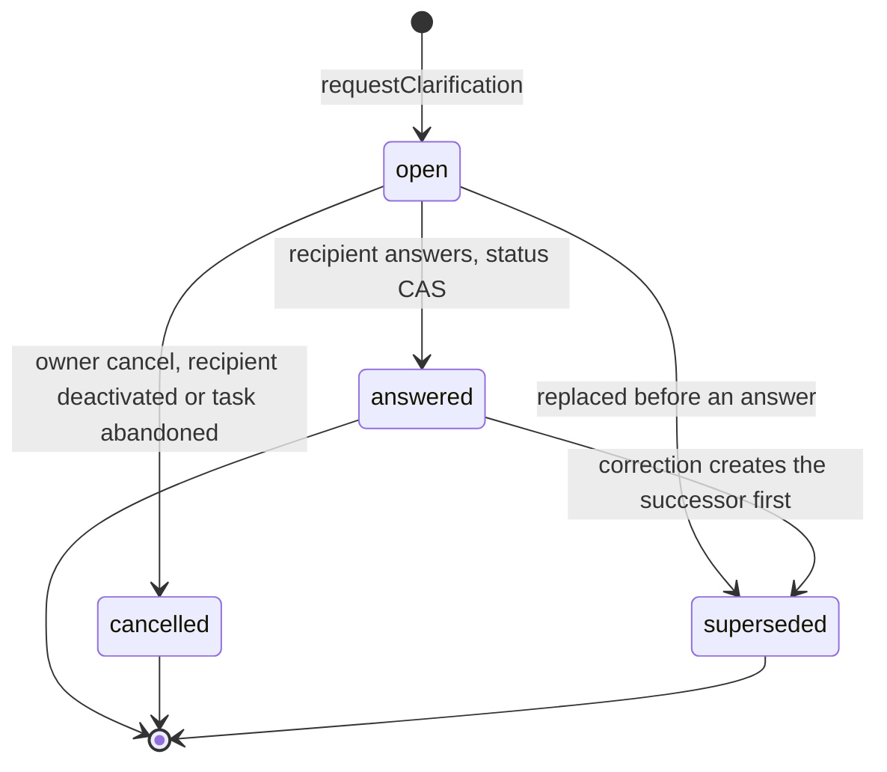
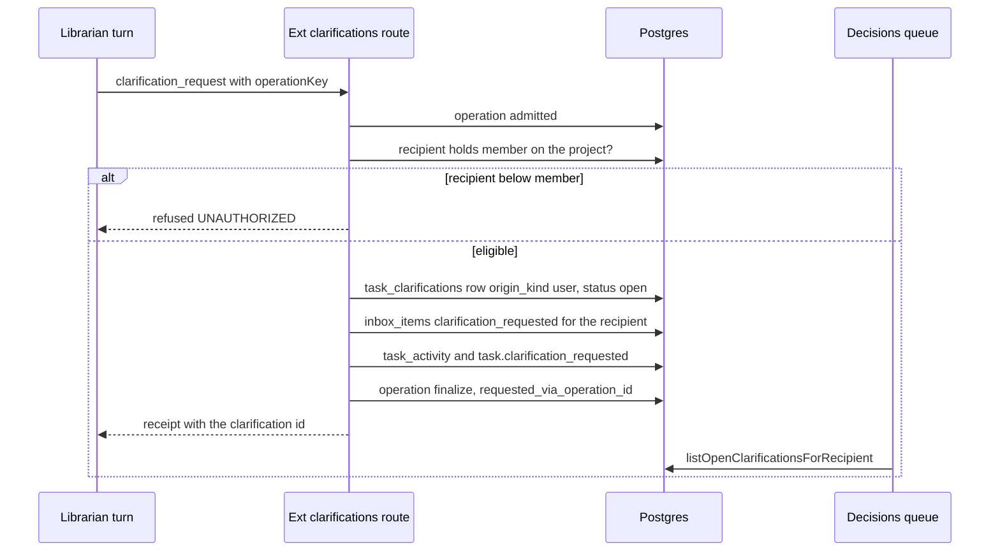
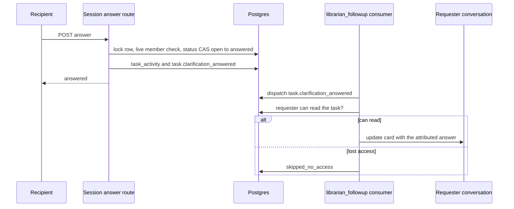
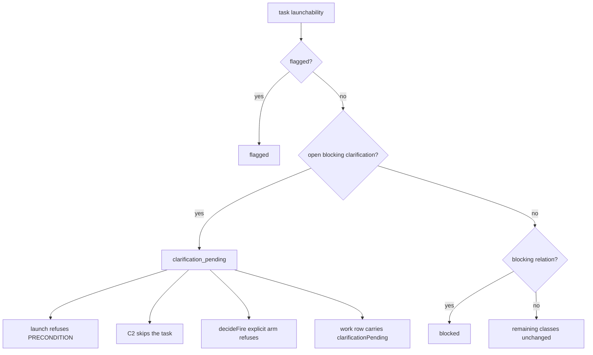
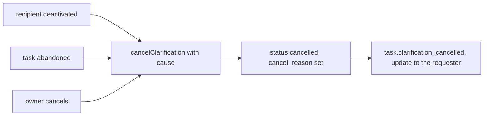

# Task clarifications

## Purpose

**Addressed clarification before execution**: a question a user (usually through the
librarian) puts to a named teammate about a task that has no run yet — or none that
could carry the question. It belongs to the task, reaches the recipient through the
existing inbox and decisions queue, can hold launch while it is blocking, and returns
its answer to the task and to the requester's conversation. The domain owns the
user-origin shape of `task_clarifications`, its lifecycle and cascades, the
`clarification_pending` launchability value, the `clarificationPending` work-stage
attribute, the `clarification` decision kind, and the answer routes. It does **not**
own agent-origin clarifications raised from a running agent (the existing
`ask_human` path in [`hitl.md`](hitl.md) and [`triage.md`](triage.md)), the decisions
counter definition ([`attention.md`](attention.md)), the work-stage classifier
([`work-stages.md`](work-stages.md)) or conversation delivery
([`librarian-operations.md`](librarian-operations.md)). No dummy run and no
`hitl_requests` row is created to address a person. The decision is
[ADR-189](../decisions.md#adr-189-addressed-task-clarification-before-execution),
amending ADR-169 and ADR-170. The whole domain is **Implemented**.

## Domain entities

- **User-origin clarification** (persisted, Implemented) — a widened
  `task_clarifications` row with `origin_kind='user'`, `requester_user_id`,
  `recipient_user_id`, question, `reason`, `answer_format`
  (`text | choice | yes_no`), `blocking`, `status`, `cancel_reason`,
  `superseded_by_clarification_id`, `source_message_id`,
  `requested_via_operation_id`; NULL `origin_run_id`, `origin_agent_id`,
  `source_hitl_request_id`, and `retrigger_mode='none'`. See the
  [librarian ERD](../db/librarian-domain.md).
- **Origin shape** (Implemented) — CHECK `task_clarifications_origin_shape_check`
  discriminating `agent_run` from `user` rows; agent-origin rows are backfilled
  `origin_kind='agent_run'`.
- **Status shape** (Implemented) — CHECK `task_clarifications_status_shape_check`:
  `status='answered'` exactly when `answered_at` is set and `superseded_at` is
  not, `status='superseded'` exactly when `superseded_at` is set (so an answered
  row can still be superseded), and `cancelled` requires `cancel_reason`
  ([ADR-189](../decisions.md#adr-189) D2).
- **Inbox item** (persisted, Implemented) — `inbox_items.event_kind='clarification_requested'`
  with `InboxSourceRef` `{kind:"clarification", taskId, clarificationId, activityId}`.
- **Decision kind `clarification`** (Implemented) — the fifth population of
  `computeDecisionsQueue`, read into the same array as the four existing ones.
- **`clarification_pending`** (Implemented) — a `TaskLaunchability` value, precedence
  after `flagged` and before `blocked`.
- **`clarificationPending`** (Implemented) — a `deriveWorkStage` attribute driven by
  `openBlockingClarificationCount`, beside `blocked`; never a `WorkStage` member and
  never a task status.
- **Events** (persisted, Implemented) — `task_activity` kinds
  `clarification_requested | clarification_answered | clarification_cancelled`;
  domain events `task.clarification_requested`, `task.clarification_answered`,
  `task.clarification_cancelled`. Because the answered and cancelled kinds now
  have a `task_activity` twin, they move OUT of `ATTENTION_EVENT_KINDS` into
  `TASK_ACTIVITY_TWINNED_EVENT_KINDS`, and `task.clarification_requested` joins
  `DECISION_OPENING_EVENT_KINDS`, so one answer counts once in `updates`
  ([ADR-189](../decisions.md#adr-189) D9).
- **Answer routes** (Implemented) —
  `POST /api/projects/{slug}/tasks/{number}/clarifications/{id}/answer` (session) and
  its ext twin requiring exact `hitl:respond:human` on a global personal token.

## State machine

The clarification lifecycle. An answer is never overwritten: a correction first
creates the successor row, then supersedes the answered one (Implemented).

## Process flows

Requesting a clarification. One operation-wrapped transaction writes the row, the
recipient's inbox item, the subscription and the event; the decisions queue reads the
row as its fifth population (Implemented).

The answer and its return path. The answer lands on the task for everyone who can
read it; the requester's conversation receives it only while the requester still can
(Implemented).

Launch hold. An open blocking clarification yields its own launchability value, which
every launch path refuses explicitly (Implemented).

Cancellation cascades. Every cause ends in `cancelled` with a reason and a delivered
update, so no request waits on someone who can no longer answer (Implemented).

## Expectations

- **CLR-01:** A user-origin clarification MUST carry requester, recipient, question, reason, answer format, blocking flag and source message, and `origin_kind='user'` rows MUST have NULL `origin_run_id`, `origin_agent_id`, `source_hitl_request_id` and `retrigger_mode='none'`, enforced by CHECK `task_clarifications_origin_shape_check` (Implemented).
- **CLR-02:** The recipient MUST hold the `answerHitl` action's minimum project role (`member`) at creation and at answer time, enforced by `requestClarification` and `answerClarification` (Implemented).
- **CLR-03:** Creation MUST write an `inbox_items` row (`event_kind='clarification_requested'`) for the recipient and a `clarification` item in the recipient's `decisions` queue, kept in the same array as the four existing populations so count equals list length, enforced by the fifth `computeDecisionsQueue` source under the ADR-169 amendment (Implemented).
- **CLR-04:** The lifecycle MUST be `open → answered | cancelled | superseded`, an answered row's answer MUST NEVER be overwritten, and a correction MUST create a superseding row, enforced by CHECK `task_clarifications_status_shape_check` and the status CAS (Implemented).
- **CLR-05:** An open blocking clarification MUST yield launchability `clarification_pending` and the work-stage attribute `clarificationPending`, launch, C2 and `decideFire` MUST refuse it explicitly, and no task status MAY be added, enforced by `TaskLaunchability` and `deriveWorkStage` (Implemented).
- **CLR-06:** The answer MUST show on task detail and MUST reach the requester's conversation only while the requester can read the task, enforced by the access check in the `librarian_followup` consumer (Implemented).
- **CLR-07:** Answering MUST NEVER change the statement or launch work, and MAY only produce a proposed revision card, enforced by `answerClarification` (Implemented).
- **CLR-08:** Recipient deactivation, task abandonment and owner cancellation MUST each produce `cancelled` with a reason and a delivered update, enforced by `cancelClarification` and its cascade call sites (Implemented).
- **CLR-09:** Only the human recipient MAY answer — through session auth or a global personal token holding exact `hitl:respond:human` — and a librarian or agent token MUST NEVER answer, enforced by the answer routes (Implemented).
- **CLR-10:** `composeEffectivePrompt` MUST fold answered user-origin clarifications exactly like agent-origin ones (Implemented).

## Edge cases

- **EDGE-CLR-01:** Removing a recipient's project membership or downgrading it to `viewer` cancels their open user-origin clarifications in the same transaction, with reason `recipient_access_removed`, activity and a delivered update; deactivation uses `recipient_deactivated`. The live `member` check also refuses an answer attempt with [`MaisterError("UNAUTHORIZED")`](../error-taxonomy.md#codes). A blocking request cannot remain an unaddressable hold (Implemented).
- **EDGE-CLR-02:** Two answers race — the row lock plus status CAS lets one win, the other is refused [`MaisterError("CONFLICT")`](../error-taxonomy.md#codes), and the stored answer is never overwritten (Implemented).

## Linked artifacts

- [ADR-189 — addressed task clarification before execution](../decisions.md#adr-189-addressed-task-clarification-before-execution) · [record](../decisions/adr-189.md)
- [ADR-169 — attention counters](../decisions.md#adr-169) · [ADR-170 — work-stage vocabulary](../decisions.md#adr-170)
- [Librarian requirement traceability](librarian-traceability.md)
- [Product brief — personal librarian](../pv/personal-librarian.md)
- [Librarian ERD](../db/librarian-domain.md)
- [Attention](attention.md) · [Work stages](work-stages.md) · [Tasks](tasks.md) · [Triage](triage.md) · [HITL](hitl.md) · [Social board](social-board.md) · [Domain events](domain-events.md)
- [`web/lib/tasks/clarifications.ts`](../../web/lib/tasks/clarifications.ts) · [`web/lib/queries/task-clarifications.ts`](../../web/lib/queries/task-clarifications.ts) · [`web/lib/queries/decisions.ts`](../../web/lib/queries/decisions.ts)
- [`web/lib/runs/launchability.ts`](../../web/lib/runs/launchability.ts) · [`web/lib/work/stage.ts`](../../web/lib/work/stage.ts) · [`web/lib/scheduler/c2-eligibility.ts`](../../web/lib/scheduler/c2-eligibility.ts) · [`web/lib/run-schedules/dispatch.ts`](../../web/lib/run-schedules/dispatch.ts)
