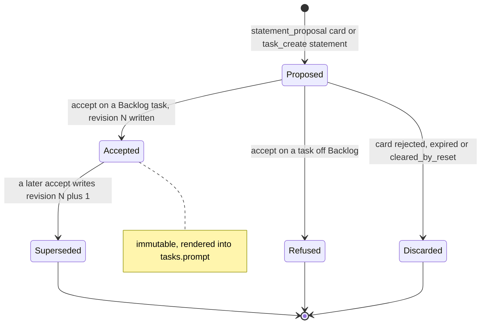
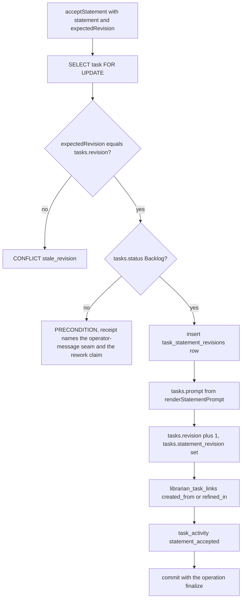
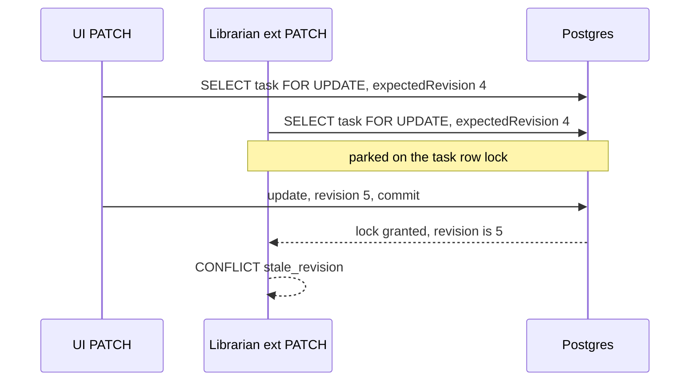
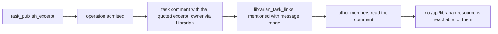

# Task statements

## Purpose

The **agreed task statement** and its provenance: the typed statement a conversation
produces, its immutable accepted revisions, the task-level revision counter that
guards every content write, the deterministic rendering of an accepted statement into
the self-contained `tasks.prompt` an executor reads, the many-to-many links between
conversations and tasks, and the explicit publication of conversation excerpts into
task comments. The domain owns `task_statement_revisions`, `tasks.revision`,
`tasks.statement_revision`, `renderStatementPrompt`, `acceptStatement`,
`librarian_task_links`, excerpt publication and the batched task-chip read model. It
does **not** own task status, the board or launch
([`tasks.md`](tasks.md)), the operation ledger that wraps each write
([`librarian-operations.md`](librarian-operations.md)), or deletion of the private
conversation ([`librarian-memory.md`](librarian-memory.md)). Tasks own work; a
conversation is their source, never their dependency. The decision is
[ADR-186](../decisions.md#adr-186-task-statements-task-revision-and-conversation-provenance).
The whole domain is **Implemented**.

## Domain entities

- **Statement** (Implemented) — `context, goal, acceptance[], constraints[],
  outOfScope[], links[], openQuestions[]`, validated by one zod schema.
- **`task_statement_revisions`** (persisted, Implemented) — PK `(task_id, revision)`,
  `statement`, `author_actor_type`, `author_actor_id`, `via_operation_id`; UPDATE and
  DELETE refused by trigger `task_statement_revisions_immutable` (task deletion
  cascades as today). See the [librarian ERD](../db/librarian-domain.md).
- **`tasks.revision`** (persisted, Implemented) — `integer NOT NULL DEFAULT 0`,
  incremented on every content write; `TaskDTO.revision`; the optional
  `expectedRevision` on the UI and ext PATCH.
- **`tasks.statement_revision`** (persisted, Implemented) — the accepted revision the
  current `tasks.prompt` was rendered from.
- **`renderStatementPrompt`** (Implemented) — pure, deterministic markdown with a fixed
  section order.
- **`librarian_task_links`** (persisted, Implemented) — `meaning`
  (`created_from | refined_in | mentioned`), `from_message_id` / `to_message_id`
  (`ON DELETE SET NULL`), `statement_revision`.
- **Published excerpt** (Implemented) — a task comment quoting conversation text, written
  by the `task_publish_excerpt` operation with a `mentioned` link; it lives under
  task visibility and grants no transcript access.
- **Task chip / linked-work read model** (Implemented) — `getLinkedWork(ownerId)` in
  `web/lib/librarian/read-models.ts`: key and live status, one batched,
  visibility-filtered read.
- **`task_activity` kind `statement_accepted`** (persisted, Implemented).

## State machine

Statement acceptance against the task's status. The accepted revision is immutable;
a newer accept creates revision N+1. Off-Backlog, the `BACKLOG_GATED_FIELDS` gate
refuses the accept and the running work is steered through the existing continuation
seams instead (Implemented).

## Process flows

Accepting a statement is one transaction under the task row lock: the revision check,
the Backlog gate, the immutable revision row, the rendered prompt, the counter bump,
the provenance link and the activity row commit together (Implemented).

Two writers race one revision. The row lock serializes them; the loser re-reads the
advanced counter and is refused rather than overwriting (Implemented).

Publishing an excerpt copies text into task content under task visibility; the
private transcript stays private (Implemented).

## Expectations

- **TST-01:** A statement revision MUST hold `context, goal, acceptance[], constraints[], outOfScope[], links[], openQuestions[]`, and accepted revisions MUST be immutable, enforced by the zod statement schema and trigger `task_statement_revisions_immutable` (Implemented).
- **TST-02:** `tasks.revision` MUST increment on every content write (UI PATCH, ext PATCH, statement accept) under `SELECT … FOR UPDATE`, and a stale `expectedRevision` MUST refuse `CONFLICT{reason:"stale_revision"}`, enforced by `updateTask` (Implemented).
- **TST-03:** Accepting a statement MUST render it deterministically into `tasks.prompt` so an executor never needs the conversation, enforced by the pure `renderStatementPrompt` (Implemented).
- **TST-04:** Conversation↔task links MUST be many-to-many with meaning `created_from | refined_in | mentioned`, message range and statement revision, enforced by `librarian_task_links` (Implemented).
- **TST-05:** Publishing an excerpt MUST be an explicit operation that copies text into a task comment under task visibility, and no link MAY grant access to the transcript, enforced by the `task_publish_excerpt` operation (Implemented).
- **TST-06:** Reset or history deletion MUST NEVER delete tasks, statements or published excerpts, and a link to a deleted message MUST render an explicit unavailable state, enforced by the `ON DELETE SET NULL` message references on `librarian_task_links` (Implemented).
- **TST-07:** Statement accept MUST obey the existing `BACKLOG_GATED_FIELDS` gate, refused `PRECONDITION` unless `tasks.status='Backlog'`, and the receipt MUST name the operator-message seam and the rework claim, because a flow run re-reads `tasks.prompt` at every re-entry, enforced by `acceptStatement` through `updateTask` (Implemented).
- **TST-08:** Task chips and operation receipts MUST render key and live status from one batched, visibility-filtered read, enforced by `getLinkedWork` (Implemented).

## Edge cases

- **EDGE-TST-01:** Statement accept on an `InFlight` task — refused [`MaisterError("PRECONDITION")`](../error-taxonomy.md#codes) by the `BACKLOG_GATED_FIELDS` gate with `tasks.prompt` unchanged; the receipt names the operator-message seam and the rework claim as next steps (Implemented).
- **EDGE-TST-02:** A link whose source message was deleted — `from_message_id` / `to_message_id` are NULL after `ON DELETE SET NULL`, the task and its accepted statement stay intact, and the chip renders the explicit unavailable state instead of failing the read with [`MaisterError("PRECONDITION")`](../error-taxonomy.md#codes) (Implemented).

## Linked artifacts

- [ADR-186 — task statements, task revision and provenance](../decisions.md#adr-186-task-statements-task-revision-and-conversation-provenance) · [record](../decisions/adr-186.md)
- [ADR-185 — operation ledger](../decisions.md#adr-185-librarian-operation-ledger-confirmation-cards-and-launch-intent) · [ADR-160](../decisions.md#adr-160) · [ADR-161](../decisions.md#adr-161)
- [Librarian requirement traceability](librarian-traceability.md)
- [Product brief — personal librarian](../pv/personal-librarian.md)
- [Librarian ERD](../db/librarian-domain.md)
- [Tasks](tasks.md) · [Social board](social-board.md) · [Run continuation](run-continuation.md) · [External operations](external-operations.md)
- [`web/lib/services/tasks.ts`](../../web/lib/services/tasks.ts) · [`mcp/src/tools.ts`](../../mcp/src/tools.ts)
