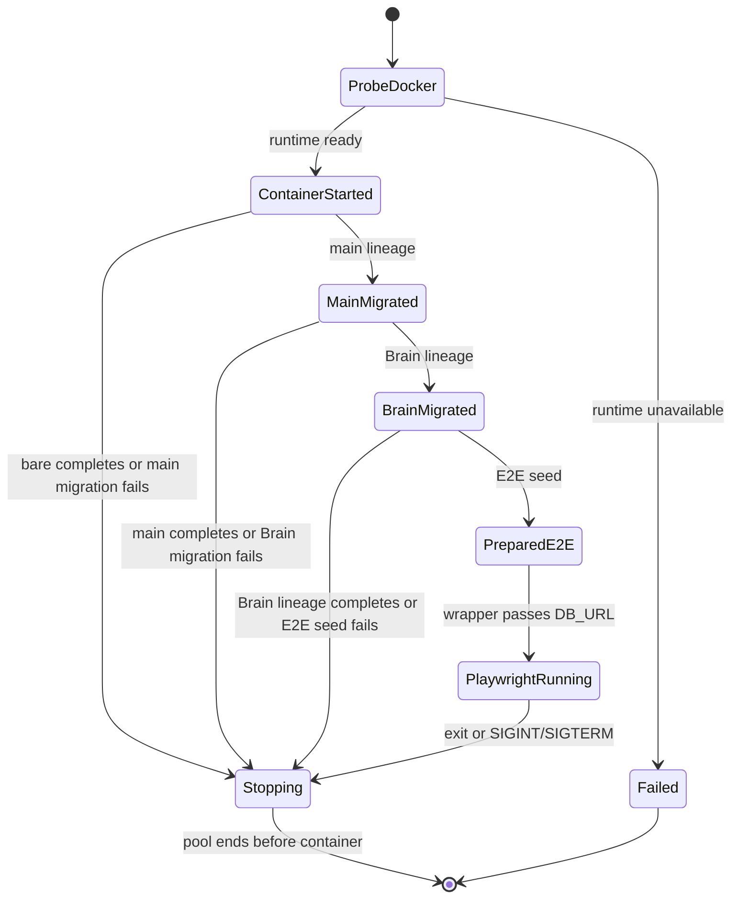
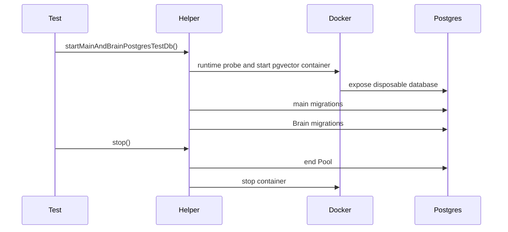
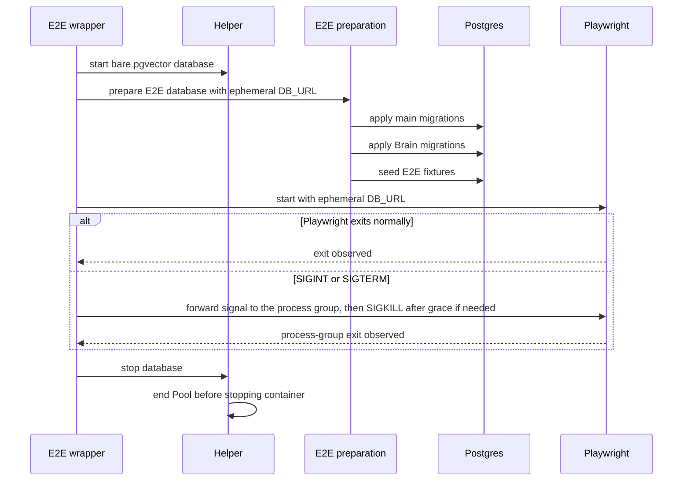
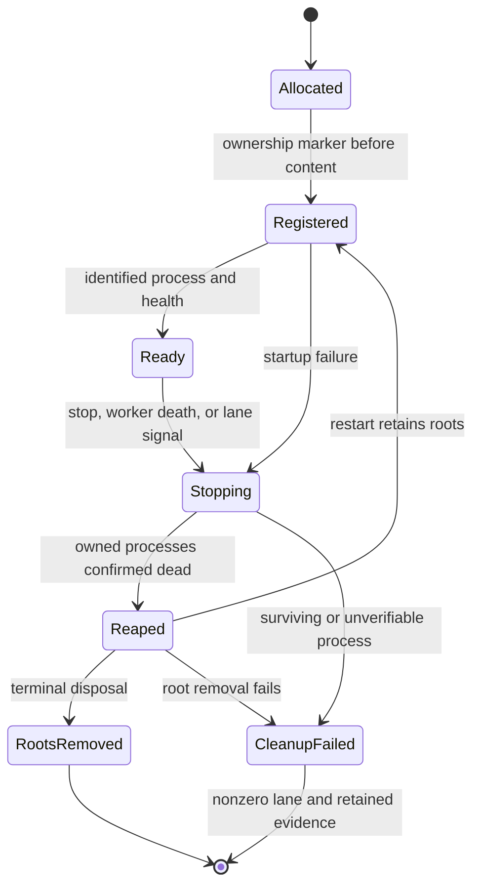

# Test infrastructure

## Purpose

This domain defines ephemeral PostgreSQL ownership for database-backed tests
(Implemented). It isolates test data by process, makes Docker an explicit
integration/E2E dependency, and keeps build/unit lanes database-free. It also
owns real-process isolation, deterministic fault placement and invocation-scoped
cleanup. S5.2 close-out controls below are implemented; qualification remains open until their named evidence
is recorded; the existing denied-root and durable-worker core is Implemented.

## Domain entities

- **Test database helper** — owner of a Testcontainers lifecycle.
- **Bare lineage** — empty PostgreSQL + pgvector database for historical SQL
  replay.
- **Main lineage** — bare database with `lib/db/migrations` applied.
- **Brain lineage** — main lineage followed by `lib/db/brain-migrations`.
- **E2E wrapper** — creates one bare E2E database through the helper, invokes
  E2E preparation with its URL, then starts Playwright with that URL.
- **E2E preparation** — applies main and Brain migrations and seeds E2E
  fixtures through the test-environment command path.

- **Invocation** — one runner-minted process/root cleanup authority.
- **Resource ledger** — atomic process/root identities outside disposable roots.
- **Fault proxy** — test-only HTTP-aware TCP boundary with command-scoped faults.
- **Barrier** — reached evidence plus explicit release or owned-process death.
- **Build handle** — verified immutable production build reused by nested controls.

## State machine



## Process flows



The E2E wrapper owns its complete database lifecycle, including cancellation.



## A/B stabilization isolation and fault injection (implemented; final S5.2 qualification open)

**As built.** `web/test-support/filesystem-ownership.ts` is the operation-scoped scanner: it parses every production source (`.ts/.tsx/.mts/.cts/.js/.mjs/.cjs` under `app`, `lib`, `components`, `scripts`, `i18n`, `config`, `types`, the top-level entrypoints and the shared `../runtime`), role-tags test sources instead of dropping them, resolves `node:fs`, `node:fs/promises`, `node:child_process` and `node:sqlite` bindings through import aliases, `require`/`createRequire`/dynamic-import forms, destructuring and `promisify`, records each callsite as `{source, enclosing function, callee, operation, literal command}`, reports value uses it cannot resolve to a call as `unresolved`, and closes "performs a filesystem effect" over each module's local calls to enumerate exported wrappers. The inventory (`web/lib/execution-host/__tests__/fixtures/runtime-data-boundary-inventory.ts`) classifies 537 callsites in 110 modules and 261 wrappers in 80 modules; wrappers flagged path-generic (`atomicWriteJson`, the config/package loaders, …) have every caller enumerated, and the guard (`runtime-data-boundary-inventory.test.ts`) fails on any unclassified callsite, stale entry, `supervisor-runtime` class, `watch` operation or unexplained unresolved use, and carries three mutation cases (a host-runtime read injected into an already classified mixed file, a new call of a path-generic wrapper, an fs-using `.tsx` page and script). RED evidence: the previous file-level guard, brought current with the tree, passed 4/4 with the same host read injected into an allow-listed file.

`web/test-support/process-isolation.ts` resolves the kernel isolation driver this host can enforce (macOS `sandbox-exec`, denial = `EPERM`; the Linux uid/mount-namespace driver is scheduled with S5.3 and an unsupported host fails loudly) and `web/test-support/real-web.ts` starts the production web (`next build` of the checked-out tree, `server.ts`, production `instrumentation.ts` boot) in its own process group under that driver, with a credentials sign-in over the production Auth.js endpoints. `web/test-support/__tests__/execution-ab-isolation.integration.test.ts` (4/4) is AT-16's core: disjoint private roots for web and supervisor with only the worktrees root shared; the web identity is denied the host's sentinel and its live `state.sqlite` while the harness and the host keep them; a scratch launch with an upload completes through HTTP/Postgres with the real host executing the prompt; the object reads back under the AB-12 policy with the transcript; a SIGKILLed web restarts through production initialization under the same isolation, serves the same history and bytes, and completes a further turn on the still-live host session. It runs alone (`node scripts/run-stage-ab-tests.mjs isolation`, serial slice) with `MAISTER_TEST_EVIDENCE_DIR` keeping build/web/supervisor logs outside the worktree.

### S5.2 close-out protocol (as built; hosted CI qualification pending)

Option B is selected: the real `sandbox-exec` driver runs in a dedicated,
serial GitHub `macos-15-intel` job with Node 24.19.0 and a pinned Colima/Lima
Docker runtime. The local owner Mac is ARM64 and keeps its existing driver;
no Rosetta requirement is imposed locally. The Intel pin is for the hosted
container-runtime recipe. The Linux uid/mount-namespace driver and separate-user
Linux deployment remain S5.3. Unsupported drivers fail loudly. The negative
control expects the driver's documented errno (macOS EPERM); the host positive
control and HTTP readback must still succeed. Testcontainers uses only
`pg-container.ts`, with real runtime/port reachability proved before the lane.
The job runs an independent real-driver/PostgreSQL preflight before its production build, then `test:integration:isolation`. The runner enforces the per-file required-case manifest and rejects missing, duplicate, skipped or failed controls. CI uploads the actual `vitest.json`, safe traces and timings; total cold
setup/build/tests/cleanup/upload must measure below 60 minutes. Missing runner
execution or an unavailable kernel driver is unqualified, never a local-pass
substitute. Qualification records revision, image, architecture and Node version.

The implemented invocation lifecycle preserves roots across restart and disposes
of them only after the last owned process using them is dead.



`web/test-support/supervisor-fault-proxy.ts` implements an HTTP-aware
TCP proxy on loopback between the production web and the real supervisor.
Production web receives `MAISTER_SUPERVISOR_URL=proxy.url`; the proxy alone
forwards to the real supervisor. Harness-only receipt/health/metadata probes
use the real supervisor URL and are separately attributed. Observe one stable
`hostKey`, with boot ID changing only on an actual supervisor restart.
Never proxy SQLite or host filesystem operations.

Its typed selector includes `{caseId, method, path, commandId, assignmentEpoch}` (or
`objectId`/`streamId` for those protocols), an explicit action type, and
explicit operations `arm`, `awaitReached`, `release`, `cut`, `ownedProcessKilled`, `assertDrained`,
`close`. Capture an auto-minted command ID from its durable row/envelope before
forwarding it; never reconstruct it from timing. Pass unselected traffic
unchanged. Keep bounded metadata/frame buffers and redact bodies/secrets.

Distinguish a single-shot hold/cut from a persistent partition. P1 consumes one
ACK-drop action and observes the downstream response socket close with no
headers sent and no completed response. A later receipt lookup alone is not
proof of ACK loss: normal reconciliation can issue that lookup after an ACK. P2 keeps dropping **every retry ACK for the selected command**
and blocking its receipt route until explicit release; each matched attempt is
counted without consuming the partition. Duplicate single-shot consumption is
an error; repeated matches on a persistent partition are expected. No boolean
multi-mode helper: use typed actions with separate handlers.

D3 uses persistent `hold-responses` for the exact uploaded object. It holds
each retry ACK across individual HTTP deadlines until explicit release, with
bounded retained bytes and observations. An upstream `ECONNRESET` from an owned
supervisor death is forwarded as a reset, not recorded as a proxy defect. A
single-shot client's early close is an error unless the test records its owned
process kill before disposal; persistent receipt/response partitions tolerate
individual request expiry without disposing the partition.

D1 drives checkpointing through the existing authenticated `POST /api/cron/gc`
endpoint and its durable scheduler claim, after observing the unavailable
permission response and again after supervisor restart. The standalone legacy
30-second sweeper is not a production boot hook. The fixture only arranges the
run's past keepalive deadline and configures the normal cron credential; it does
not invoke reducers, add a timer or implement S5.3's permission deadline.

Barrier states: `armed → reached → released | owned_process_killed`.
An explicit drop/cut is a release with that recorded fault disposition, not an
untracked socket close. Disposal of an unresolved barrier fails before cleanup.
`unreached`, `unreleased`, selector mismatch, client abort without disposition,
or invalid repeated single-shot consumption fails the test. `finally` destroys sockets,
rejects pending waits, releases DB locks and removes test triggers while retaining
the original failure. Timeout diagnoses failure; it never releases a barrier or
proves a window. Production retry deadlines and lease expiry still run normally.

| ID / required window | Mechanism and owning scope | Mandatory evidence before action |
| --- | --- | --- |
| B1 host acceptance / before HTTP ACK | Hold the exact upstream command response before any downstream ACK bytes; direct receipt lookup confirms committed acceptance; explicitly drop the downstream connection. | Same command ID/request digest on host receipt; no downstream ACK; host remains healthy. |
| B2 canonical commit / before owner apply | Test-only, row-scoped trigger in the disposable PG database at the selected owner's domain write; harness holds its advisory key. Use separate observer connection. Do not hold a broad run-row lock that also blocks ingest. | Canonical terminal row visible to observer; claim belongs to intended worker; `pg_locks` waiter identified; domain result and `completion_applied_at` absent. |
| B3 consumer claim / before failing apply | Scoped projector-domain-write trigger after committed consumer claim; identify waiting backend and terminate that exact backend or the owned web PGID. | Durable consumer claim/token + `pg_stat_activity`/`pg_locks` waiter; failure rolls back effect and cursor together. |
| B4 object seal / before catalogue ACK | Hold target upload response and target seal-event delivery, or block the exact catalogue reducer with a scoped PG trigger. Define ACK as manager catalogue commit; upload response alone is not this boundary. | Direct host metadata proves sealed generation/hash; manager catalogue still pending; neither HTTP nor SSE has bypassed the barrier. |

DB barrier helper: `web/test-support/fault-barriers.ts`, extracting only needed
patterns from `web/lib/execution-host/events/__tests__/event-claim-lock.integration.test.ts:298–325,402–484`.
Each lock key is unique to invocation/case/resource; triggers match that same
resource. `projectionTransaction` has a real 5-second cumulative deadline:
after observing the waiter, release or kill within it. Hold long partitions in
the network proxy, never inside these transactions. If the deadline expires
before the chosen action, fail the control as a missed window.

Authorship is mandatory: reuse `durable-workers-ledger.ts` and existing
ADR-176/177 witnesses; record worker/boot/claim owner and exact terminal evidence
digest. Where claims are cleared on commit, a disposable-PG audit trigger records
the successful writer transaction and the null→timestamp application edge.
Do not seed expected final outcomes or invoke recovery/apply directly from the
harness in a production control. Claim count may exceed one after recovery;
committed domain result and completion application must be singular. Assert
successor/current rows as well as the source command, not just a pass log.

The runner mints a fresh `MAISTER_TEST_WORKTREE_INVOCATION_ID` **before** spawning
Vitest and propagates it unchanged to every descendant. Do not adopt a caller's
possibly shared ID as cleanup authority. Nested O-controls get their own runner
ID. Preserve `vitest.workspace.ts` standalone behavior, but its fallback minting
must not replace the runner's ID. Per-worker root suffixes do not change the
environment tag used by the sweep.

**Build ownership is separate from process ownership.** `real-web.ts`
keys its `.next` build stamp by invocation ID and returns a verified
`ProductionWebBuild` handle (revision, build ID, artifact path, invocation ID)
for nested controls. `startRealWeb` validates the handle before reuse, so a
nested O-control neither rebuilds nor mutates a running web's `.next`.
All nested cleanup invocations reuse the outer lane's one build,
but retain separate cleanup IDs and ports. No unverified skip-build flag and no
production server change. Register build subprocesses too. Build-lock ownership
uses PID/start identity: reclaim a proved dead owner rather than waiting for the
current age-only stale threshold. Never delete the worktree's `.next` as a temp
root. A startup-failure/worker-death control must prove no build descendant or
dead-owner lock obstructs the next run.

`process-invocation.ts` keeps its resource ledger outside disposable roots: atomic per-resource
records avoid shared-file lost updates. Record process PID/PGID, UID, start time,
role, expected parent identity, root ownership and boot/case identity before
reporting readiness. Root ownership records precede content. Enumerate live
processes by OS environment data, match the **exact environment entry** and
validate start identity before signaling; a command-line substring is not
environment ownership. Linux can read `/proc/<pid>/environ`; macOS needs an
environment-aware reader (e.g. `sysctl KERN_PROCARGS2`, with the argv/env split
parsed explicitly), bundled in test support and qualified on the CI image.
Failure to inspect an owned candidate is an error, not an empty process list.
Do not print collected environments. No `pgrep -f` or binary-name kill.

The macOS implementation uses the bundled `process-environment.c` reader;
its compilation is itself owned by a parent-death wrapper. The fixture watchdog
checks parent and runner identities immediately and every 500 ms; owned-group
termination, including a TERM-resistant adapter, is verified within five seconds.
`execution-ab-process-cleanup.integration.test.ts` runs 13 controls in the serial
isolation slice. Local ARM64 qualification passed the full 40-case/six-suite
slice in 836.089 s with zero sweep leaks. Sweep-disabled and watchdog-disabled
controls each fail their independent owning assertion. The Linux environment
reader and parent-death wrapper passed the real Linux ARM64/Node 24.19 container
smoke (`linux-helper-final.log`), including exact-tag sibling protection and
542 ms parent-death termination without a sweep. Hosted Intel CI is still
pending; the Linux isolation driver remains S5.3.

Container ownership is independent of Ryuk's shared session. The sole
`pg-container.ts` constructor records allocation before start, labels its
container with `maister.test.invocation=<minted ID>`, then records the returned
container ID. After owned client processes have exited, terminal runner cleanup
enumerates only that exact label, revalidates it and removes only those IDs.
This also covers death between Docker creation and ledger registration. Normal
pool-before-container teardown remains first; a container found by the terminal
runner cleanup is a failed lane even when removal succeeds. After runner
SIGKILL, the surviving outer control/CI finalizer performs this same recorded
cleanup after proving watchdog termination. Never prune a shared Docker daemon
or stop its shared Ryuk container. The installed Testcontainers implementation
can reuse one reaper across invocations; its liveness is not per-lane evidence.

Sweep authority is exactly one minted invocation ID. Exclude the runner and its
short-lived inspection helpers explicitly. Validate registered groups and their
members before group signals; escaped tagged descendants are also caught by the
environment scan. Any mixed/unverifiable group fails closed for group signaling;
terminate only individually verified owned PIDs and report the anomaly. PID/PGID
reuse, permission errors and unexpected owners never authorize wider cleanup.

Three enforcement levels:

1. **Runner:** await cleanup in `finally` and SIGINT/SIGTERM/error paths; async
   cleanup cannot live in Node's synchronous `exit` callback. Forward signals to
   the owned Vitest group, wait bounded grace, discover tagged survivors, report
   each, TERM/KILL as needed, and recheck. Any survivor discovered by the final
   sweep makes the lane non-zero even if killed successfully. Preserve an
   original failed exit/signal and combine cleanup diagnostics, not mask it.
   Spawn errors, reporter parse errors, missing reports and discovery failures
   still sweep. Signals are handled idempotently, with bounded escalation.
2. **Fixture parent death:** preload a watchdog only through test-support spawn
   arguments (`--import` test-support module), preserving the direct production
   Node child and its detached process group. Do not interpose a pnpm/tsx shim.
   Capture expected parent and runner identities before boot, check immediately
   and then on a bounded poll; macOS reparenting to PID 1 or loss of either owner
   terminates the owned group. Runner death must also be detected while a Vitest
   worker remains alive. Linux uses the same poll for this increment. Parent-loss
   handling uses immediate group SIGKILL after identity validation: a preload
   cannot TERM itself and reliably remain alive to escalate against resistant
   adapters. Ordinary fixture SIGTERM/drain tests retain their existing behavior.
   Termination reaches adapter descendants, not only the supervisor leader. Production
   `supervisor/src/main.ts` and `web/server.ts` stay untouched. Polling here is
   test-process liveness only, not a product state-transition mechanism.
   Pass expected identities via test-only spawn metadata, not production config.
   Also preload the owned Vitest Node entrypoint from the test runner so runner
   SIGKILL does not leave its worker group alive. The outer O-control observes
   self-termination of worker and fixture groups; emergency cleanup is only
   containment after a failed assertion, never the evidence of success.
3. **Roots:** remove only invocation-owned runtime/worktree roots after groups
   are confirmed dead **and the fixture/invocation is terminal**. A kill for
   `restart()` preserves the same roots and host identity. Track multiple live
   consumers before disposal; never remove a root still used by another owned
   web instance. Caller-supplied/shared roots are never recursively deleted
   without explicit ownership registration by their creating test.
   Store logs/report/ledger outside removable roots; copy default fixture logs
   before deletion. Parent-death cleanup and runner cleanup are idempotent.
   Never delete by `eh-web-rt-*` glob. Preserve ownership markers on failure so
   an explicit same-invocation recovery can retry; root deletion failure is red.

Runner SIGKILL cannot execute a finalizer. The watchdog must handle its orphaned
fixture processes; normal/failure/catchable-signal runner paths own root cleanup.
For CI cancellation, `always()` cleanup consumes the same recorded invocation
ledger; do not promise cleanup after host power loss. O-controls must prove
their claimed boundaries separately rather than one mechanism masking another.
On runner SIGKILL, the outer control/CI finalizer removes that recorded
invocation's roots only after watchdog exits are proved. An uncontrolled manual
SIGKILL without a surviving owner can leave inert roots/ledger; document this
limit rather than pretending an uncatchable signal ran a finalizer. It must
leave no live owned process. Test-run success always requires zero owned roots.

Common log record: `{invocationId, caseName, event, role, pid, pgid, parentPid,
runtime, rootRole, rootId, bootId, outcome}` plus command/epoch/claim/barrier IDs
where relevant. INFO: start/stop/kill/release and sweep result; WARN: retries,
forced shutdown and detected survivors; ERROR: failed invariant/cleanup. Raw
temporary root paths may appear only in private evidence/ownership ledger;
publish role/opaque IDs and safe traces. Every failure carries bounded
supervisor/web `logTail`, proxy transcript and relevant ledger/PG observations.

`events/__tests__/event-claim-lock.integration.test.ts` also blocks a real stream
claim row, confirms its PostgreSQL lock waiter, and aborts before releasing the
barrier. It requires a typed cancellation, no SSE open, and immediate successor
claim acquisition; it does not extend shutdown or lease timeouts.

## A/B stabilization test lanes

S0 first writes complete requirements, route/message schemas, owner/refusal/recovery-window tables, state machines, schema constraints and primary acceptance mapping in the canonical docs. Mark missing behavior Designed, preserving accepted guarantees. No production implementation begins with unresolved required owner arms, a contradictory budget or an undefined destructive recovery window.

For every behavior task: **RED** executes its named primary scenario against the defect and records the discriminating failure; **GREEN** makes the minimal correction; **REFACTOR** stays within changed ownership boundaries while all affected tests remain green. If RED already passes, produce concrete counterevidence and update the finding, or prove the guard with a focused local mutation that the test kills. Do not weaken safety assertions to match broken behavior. No future-increment intentionally failing tests are committed as active tests in an earlier deployable increment.

Test inventory and mutation intent:

| Lane | Owner / runner | Planned file or existing suite to extend | Primary responsibility |
| --- | --- | --- | --- |
| Host output/pressure | E; supervisor Vitest `integration` | Existing `supervisor/src/__tests__/{runtime-event-outbox,runtime-event-pressure,runtime-storage,runtime-file-budget,output-memory}.integration.test.ts`; fixtures under `supervisor/test/fixtures/` | AT-01/02 with real ACP child, SQLite restart, actual bounded pipe behavior. |
| Canonical worker | E; web Vitest `integration` + real PG | Existing `web/lib/execution-host/events/__tests__/ingest.integration.test.ts`; new `projection-worker.integration.test.ts` | AT-03/04 real scheduling/claim/apply, first cursor failure, two consumers/runs, restart without new event. |
| Command reducer/transport | C/Q; web Vitest `integration` + real supervisor/PG | Existing `web/lib/execution-host/__tests__/{command-recovery,deliverer,lifecycle-regression}.integration.test.ts` | AT-06/07/08/10/17. Replace V3 receipt-only failure and keep V7b as minimum-runtime regression. |
| Owner restart | C; web Vitest `integration` + real peer/PG | New `web/lib/execution-host/__tests__/prompt-owner-recovery.integration.test.ts`, split by domain only when setup/size requires; existing gate/consensus/agent/scratch/sync suites | AT-05 full variant matrix; run real owner entrypoints, not invented fixture-only dispatch functions. |
| Object reconciliation/retention | O; web Vitest `integration` + PG/real peer | `runtime-object-retention.integration.test.ts`, real-peer `runtime-object-lifecycle.integration.test.ts` and `runtime-object-declarations-migration.integration.test.ts` under `web/lib/execution-host/__tests__/` | AT-09/14, event order and more-than-page retention, reference/delete race. S3.5 crash gaps: host restart completes sealed/tombstoned receipts and discards partial spools; the manager recovers lost upload/delete acknowledgements across a real restart and redelivers an accepted-but-effectless delete. S3.6 fair GC: protected pages, durable keyset wrap, reference-versus-delete race, delivery and required-evidence holds, lost-delete retry. |
| Host object integrity | O; supervisor Vitest `integration` | Existing `supervisor/src/__tests__/runtime-objects.integration.test.ts` | AT-13: 18 real-file/HTTP/SQLite cases cover distinct producer seals, no-follow/inode/hash checks, bounded response spools, concurrent mutation, cancellation, durable failure rollback and version-12 upgrade. AT-15 also verifies actual full/range digest headers. |
| Manager object integrity | O/Q; web Vitest `integration` + PG/real HTTP/host, Chromium | `supervisor-client-binary.integration.test.ts`, `runtime-object-lifecycle.integration.test.ts`, `e2e/execution-ab-content.spec.ts` | AT-15: actual body hashes, catalogue generation/representation agreement, malformed headers, compression/full-body fallback refusal, bounded spool/cancellation and typed truncated responses. |
| Historical upgrade | M; web Vitest `integration` + real PG/peer | Existing `web/scripts/__tests__/import-legacy-execution-data-plane.integration.test.ts`, `web/lib/db/__tests__/migration-0135-canonical-data-plane-cutover.integration.test.ts`; `web/lib/db/__tests__/staged-migrate-cli.integration.test.ts` and the pure `migration-stages.test.ts` (S4.1); `web/scripts/__tests__/legacy-import-inventory.integration.test.ts` and the pure `web/scripts/legacy-import/__tests__/{sources,inventory}.test.ts` (S4.2); `web/scripts/__tests__/legacy-import-copy.integration.test.ts` against a REAL supervisor booted in import mode, `web/lib/execution-host/__tests__/import-maintenance.test.ts`, and supervisor `src/__tests__/{import-admin,import-progress,import-manifest}.test.ts` + `import-listener.integration.test.ts` (S4.3); `web/scripts/__tests__/legacy-import-associate.integration.test.ts` (S4.4); new forward migration suite | AT-11 CLI invocation/interrupt/readback, complete historical source preservation, unchanged guards and fresh/upgrade paths. S4.1 covers the three operator stages end to end on a real 0130 baseline: additive stops before the destructive cut-over, a drifted ledger and an out-of-order stage refuse, active legacy work blocks the association stage, and the importer refuses outside its staged window. S4.2 adds the inventory phase: ordinary and nested step logs, scratch uploads and duplicate artifact references are accounted for rather than refused, an unclassified or non-regular source blocks the run, a missing association payload blocks its lane, an absent lane carries an inspected-empty proof, raw paths reach only the host-private manifest, and a changed source or an already-complete lane refuses. S4.3 adds the copy phase end to end: the operator CLI drives a real supervisor's maintenance socket, every inventoried source is sealed into an ordinary runtime object that reads back byte-exact through the normal content route, a partially committed item resumes at the host's offset instead of replaying, a re-run seals nothing, and a stale generation, a changed source or a request on the supervisor's TCP port refuses without touching a byte. The manifest digest both packages derive independently is pinned by one shared vector asserted verbatim on each side. S4.4 adds the association phase: an artifact locator and a scratch attachment are repointed at the objects their bytes became with every other column intact, a row edited after the inventory refuses and is left alone, an unsealed item refuses before any write, a re-run changes nothing, a multi-assignment scratch mirror is bound to the one assignment evidence proves owned it while an unevidenced one refuses — and the UNMODIFIED `0134` SQL, executed directly rather than through the migrator, refuses before the phase and succeeds after it with both assignments still present. S4.6 replaces the default one-shot path with the `rows` phase, exercised by the rewritten `web/scripts/__tests__/import-legacy-execution-data-plane.integration.test.ts`: a step log no longer refuses the run, the phase completes nothing and only advances the events cursor, a re-run is a no-op recognised from the rows' own identities even after a re-inventory, a directory that drifted from the freeze, a run the manifest never saw, a completed lane and rows that no longer match all refuse, and an invocation that names no phase refuses; the verify suite gains the two row-evidence refusals. S4.6 also proves, in the pure classifier and inventory suites and in the inventory CLI suite, that a file an artifact row references is inventoried as evidence whatever its name, while an unreferenced unrecognised file still blocks. AT-11 itself is `web/scripts/__tests__/legacy-import-cutover.integration.test.ts`: a Stage A installation built through 0130 by drizzle (so the ledger is the one an upgrade starts from) with ordinary, empty and >25 MiB logs, nested evidence, a produced `.tar.gz` artifact, two artifact rows over one file, uploads, several sessions with checkpoint metadata and a run that crashed before any cost — migrated by the REAL `db:migrate --stage` for every stage and the REAL importer CLI for every phase against a real supervisor in import mode. It proves the positive migration with every source byte untouched, a copy killed by process group while the large log is in flight that resumes at the host's committed offset across a supervisor crash (the stale generation refuses, at most one chunk is re-sent), a changed source refused at the copy boundary before a byte lands and at the verify boundary after the seal, duplicates that change nothing, the inventory refusing after `associate` and after 0134 without touching the frozen manifest, a coordinated four-part snapshot (`pg_dump`, host runtime root, manifest directory, sources) taken with every writer stopped before 0134 that restores to disposable storage and completes the cut-over, and a fresh install on which the whole chain applies and the importer refuses `already_canonical`. S4.7 adds `web/lib/db/__tests__/migration-0169-cutover-writer-floor.integration.test.ts` (0169 refuses over unproven `complete` rows and alters nothing, installs the floor over proven ones, refuses an undeclared and a below-floor writer by class, accepts a declared writer while refusing a malformed or reopened complete record, and the web client declares the capability on every connection), the ahead-of-binary case in `check-migrations.integration.test.ts`, the boot-boundary case in the instrumentation unit suite, and AT-11's post-finalize refusal of an undeclared writer on the real chain. S4.8 adds the host-bound catalogue: the supervisor listener suite proves the progress body names the host, `legacy-import-associate` proves every sealed object is catalogued on that host under its mapped kind (six rows for a transcript, a cost file, a log as history and as artifact payload, an upload as history and as attachment) and that a manager knowing no such host refuses before any write, `legacy-import-verify` proves a missing or disagreeing catalogue row refuses the proof, the pure `catalog.test.ts` pins the kind mapping, and AT-11 reads an imported artifact and upload through the ORDINARY web path with the legacy root offline after the finalize stage. |
| Boundary inventory | Q; web Vitest `unit` | Existing `web/lib/execution-host/__tests__/runtime-data-boundary-inventory.test.ts` and fixture | AT-16 supplementary pure source classification; prohibited added operation in an already allowed mixed file kills guard. |
| Isolated processes | Q; web Vitest `integration` | New `web/test-support/__tests__/execution-ab-isolation.integration.test.ts` plus real harness | AT-16 real permissions/namespaces and process death; uses ordinary production web initialization, worker and transport. |
| Browser outcomes | Q/O; dedicated Playwright real-supervisor config/project | New `web/e2e/execution-ab-lifecycle.spec.ts` and `execution-ab-content.spec.ts`; retain existing `execution-host-contract.spec.ts` as supporting fake-peer coverage | AT-12 and user-visible history/HITL/cancel/resume/completion with unsafe artifact MIME. |
| Pure invariants only | Owning maintainer; existing unit projects | Only canonical request/identity transformation, bounded framing, range/digest parsing, pure reducer tables where stable | No mock-only replica of a real integration scenario; minimum added unit coverage. |

Current `web/vitest.workspace.ts` discovers lib/app/scripts/test-support/e2e integration tests and has `passWithNoTests` scripts. Supervisor integration discovers `src/**/*.integration.test.ts`. Playwright default `AUTHED_SPEC` is an explicit regex; new names do not automatically join authenticated tests. S0/S5 must wire the new real project and prove discovery. `vitest list` and `playwright test --list` must show each promised file/case; an empty successful run fails acceptance.

Phase gates use the actual package scripts, as separate commands:

```bash
pnpm --filter maister-web typecheck
pnpm --filter @maister/supervisor typecheck
pnpm --filter maister-web exec eslint .
pnpm --filter @maister/supervisor exec eslint .
pnpm --filter maister-web test:unit
pnpm --filter maister-web test:integration
pnpm --filter @maister/supervisor test:unit
pnpm --filter @maister/supervisor test:integration
pnpm validate:contracts
pnpm validate:docs
pnpm --filter maister-web db:erd --check
```

Run full unit/integration suites at each completed increment, on the selected supported runtime; scoped new tests first. Build the web/qualified image when runtime/startup/transport/deployment changes; run dedicated real-browser scenarios in S3/S5. Tests introduced under new families require a runner include/config change in that same increment. Use the supported minimum/runtime matrix for AT-17 and affected binary tests. Do not rerun all tests repeatedly without intervening changes or unresolved failures.

Baseline failures are tracked by exact test names/error signatures and environment, never count deltas. Fix A/B failures in scope. A genuinely unrelated harness failure needs a narrowly scoped quarantine with explicit reason and tracked follow-up, reviewed in the phase gate; never quarantine AT-01–17 or claim the original full suite is green while quarantined failures remain. Existing notes about dirty-resolution/recursive harness/E2E failures are historical hints, not current verified exclusions. Qualify tests on disposable roots/DBs and capture stdout/stderr/reports as verifier artifacts outside the code worktree; do not use structured result transport as report storage.

### S5.2 contract and schema disposition

No permanent schema migration is required. Command identity, transport state,
receipt/canonical evidence and owner application use existing execution ledgers;
projection cursor/domain changes remain one transaction. Test-only audit
triggers and advisory-lock functions exist only in the disposable database and
are removed on disposal. No production column, historical migration, journal or
snapshot changes merely to expose a barrier. A demonstrated persistent-state
fix first amends its canonical specification and follows the migration-number,
forward-SQL/journal/snapshot/schema and fresh/populated-upgrade gates.

The HTTP meanings are owned by [supervisor OpenAPI](../api/supervisor.openapi.yaml)
and [web OpenAPI](../api/web.openapi.yaml); admission 202 is not completion,
receipt 404 is not transport unavailability, and HITL 503 retains response intent
without a delivery marker. Ordered exclusive replay is owned by
[execution events](../api/async/execution-host-events.asyncapi.yaml). Recovery
and epoch semantics live in [prompt lifecycle](execution-prompt-lifecycle.md),
[event plane](execution-event-plane.md) and [HITL](hitl.md). The
[S5.2 implementation plan](../../.ai-factory/plans/s5-2-closeout.md) maps each
requirement to its RED/GREEN/falsification and phase gate.

### S5.2 P4 concrete response window (2026-09-22 specification amendment)

P4 holds the first operator `POST /sessions/{id}/checkpoint` response after
host commit. A second ordinary node interrupt parks the observed attempt;
answering that interrupt with `restart_node` / `workspacePolicy=keep` mints
N+1. Hold N+1's first prompt before forwarding, snapshot current authority and
install a scoped domain-write audit, then release the original checkpoint ACK
while its 30-second request is still alive. Require the original web handler's
409 CONFLICT and zero current run/session/attempt writes. Old attempt closure
and historical command receipt settlement are permitted. Release successor
prompt and complete it through the controlled ACP fixture. A response arriving
after its HTTP deadline is not a passing stale-response control. This uses the
existing checkpoint contract, not an unqualified delayed session-create ACK.

## Expectations

1. Unit/build tests MUST NOT require a reachable Docker runtime.
2. Integration/E2E checks MUST fail with `TestDatabaseDockerUnavailableError`
   and the documented Docker-boundary message when Docker is unavailable,
   including a Docker failure that occurs after the runtime probe.
3. Every helper-created database MUST be unique to its test process and
   disposed through pool-before-container teardown; container shutdown MUST
   still be attempted if pool shutdown fails.
4. Raw historical SQL replay MUST start from the bare lineage only.
5. Main migrations MUST precede Brain migrations in every applicable lineage.
6. E2E MUST pass only its ephemeral `DB_URL` to Playwright and MUST NEVER
   mutate a developer database or reset a schema.
7. On E2E interruption, Playwright's process-group exit MUST be observed before the wrapper
   tears down its database.
8. A lane runner MUST exit non-zero when any invocation-tagged process
   survives its final sweep, even when the sweep killed it successfully, and
   each reclaimer (processes, containers, roots) MUST run even if an earlier
   one throws. Both rules live in ONE composition, `releaseInvocation` in
   `web/test-support/process-invocation.ts`, which the A/B runner
   `scripts/run-stage-ab-tests.mjs` and the E2E wrapper `web/e2e/run.ts` both
   call — enforced by `web/test-support/__tests__/invocation-release.test.ts`
   (the composition),
   `web/test-support/__tests__/execution-ab-process-cleanup.integration.test.ts`
   (the real A/B lane) and `web/e2e/__tests__/run.test.ts` (the wrapper fails
   its lane on the release's errors and stops its database only after it).
9. Disposing a fault barrier that is still `armed` or `reached` MUST fail
   before cleanup — enforced by `assertDrained()` in
   `web/test-support/supervisor-fault-proxy.ts`, which `close()` calls, and
   exercised by `web/test-support/__tests__/execution-ab-partitions.integration.test.ts`.

### S5.2 partition and process-death acceptance (implemented controls; final gate open)

The full local qualification report is
`/private/tmp/maister-s52-20260922/maister-ab-isolation-B4QR4S/vitest.json`:
40/40 required controls across all six isolation files, exit 0, zero skips or
runtime errors, zero process/container leaks, 836.089 s including cleanup.
Runtime: Darwin ARM64/Node 24.15.0 with `sandbox-exec`; invocation
`19274cea-53f9-4083-841c-c2c39abca4cc`. Source: `7566ba10` (now `1651f6c8`) plus the implementation
working tree recorded by `qualified-source-sha256.json` under that evidence
root, now incorporated in `c191e3dc` (now `259f6ae5`). The implementation plan records the exact fault/guard falsification
assertions and their restored source hashes. This local report does not supply
the still-required hosted Intel CI run, artifact or total-job duration.
Accepted in-process web rows are qualified by
`maister-ab-isolation-wA8ncn/vitest.json` under the same evidence root:
445/445 tests in all 33 web A/B files, invocation
`c4899dcf-7407-40da-b105-8ed9421f52d6`, 2,987.540 s, zero skips/errors/leaks.
Its runner used the serial pool; its semantic lane remains **web / in-process**,
including ADR-175/176/177, rather than production isolation. The remaining
463-file web inventory passes 3,939 tests in `maister-ab-isolation-JYlNmS/vitest.json`
(1,681.864 s, zero skips/errors/leaks); together with the refreshed one-case
preflight in `maister-ab-isolation-jgGRMZ/vitest.json`, the four disjoint primary
gates cover all 503 integration files and 4,425 tests. This remains local evidence.

All new controls run through production `startRealWeb`, `startRealSupervisor`
and `pg-container.ts`. Every row names its lane, file and distinguishing
observation. Existing in-process proofs are accepted only for the stated
service semantics; they are never relabelled production boot. Elapsed sleeps
cannot establish a fault window. Every barrier must be resolved in teardown.

| Test / window | Barrier | Lane / file | Mandatory distinguishing observation and RED target |
| --- | --- | --- | --- |
| **P1: ACK dropped after host commit → web SIGKILL + restart → exactly one result, no duplicate session.prompt** | B1 reached; drop ACK and observe downstream close with no headers/completed response; SIGKILL web PGID after committed acceptance, restart same DB/roots through production boot; release target event hold to settle. | isolation; `web/test-support/__tests__/execution-ab-partitions.integration.test.ts`, P1 | Original immutable command/request, exactly one host ACP effect and one domain result/application. RED target: second `session.prompt` or lost result. Preserve AT-07's parent-plan sentence: “Unknown remains recoverable through web restart; reconnect yields one correct result and no duplicate prompt”. |
| **P2: receipts unavailable beyond the 5× budget, then evidence resumes** | Persistent ACK loss plus route-specific hold of `GET /commands/{id}` across dispatch retries; hold this command's accepted **and** terminal SSE evidence so neither can acknowledge/settle it early. Keep health, unrelated commands and unrelated SSE flowing. Await actual lookup exhaustion and persisted reconciliation state before release. | isolation; `web/test-support/__tests__/execution-ab-partitions.integration.test.ts`, P2 | `transport_state=unknown` during uncertainty; exhausted command has `state=queued`, `transport_state=reconciliation_required`, never fabricated failure; release yields agreeing receipt/canonical evidence and one application. Five receipt attempts are **per dispatch**, separate from the current three-dispatch prompt budget. Record both counters and actual deadlines; an arrival is not exhaustion. Sibling health/receipt control remains available. RED target: fabricated failure or unknown stuck after evidence returns. |
| **P3: cut SSE mid-replay and mid-live** (two named subcases) | Record high-water at stream open; cut both upstream and downstream after selected frame or selected partial frame. Replay frame ≤ frozen high-water; live frame > it. Reconnect from last fully committed exclusive cursor. Explicitly inject one previously forwarded complete frame for the duplicate subcontrol. | isolation; `web/test-support/__tests__/execution-ab-partitions.integration.test.ts`, P3 replay and P3 live | No missing canonical sequence, partial frame never ingested, duplicate classified as `duplicate` by production ingest (log evidence — `execution_events.ingest_disposition` carries no `duplicate` value) and durably proved by the absence of a second row for that sequence, without another effect, monotone committed/consumer watermarks and advanced `last_seen_at`. A clean exclusive reconnect alone is not duplicate evidence. RED target: gap, replayed effect or unadvanced watermark. Budget each subcase ≥90 s, accounting for 30 s claims and 250 ms reconnect floor; waits prove rows/frames, not log timing. |
| **P4: delayed old response arrives after successor epoch** | Hold epoch N response on a still-live downstream request; prove N+1 committed via ordinary operator/production path; capture successor authority/domain fields before release. Use B2 to distinguish canonical arrival from owner application where needed. | isolation; `web/test-support/__tests__/execution-ab-partitions.integration.test.ts`, P4 | Prove the late body reaches its intended handler before the unchanged request deadline, not merely a write to an aborted socket. N settles fenced/historically only; no stale-authored change to N+1 assignment/session/incarnation/domain owner fields; successor produces its own result once. RED target: current-owner write from N evidence (EVT-05 / ADR-167 D4). |

| Death window / test | Barrier or evidence trigger | Lane / exact file | Sufficiency and mandatory distinguishing observation |
| --- | --- | --- | --- |
| Web SIGKILL mid-prompt — flow | Accepted, unapplied `flow_node_attempt` command; actual web PGID dies. | isolation; `web/test-support/__tests__/durable-workers-boot.integration.test.ts:320`, `applies the flow_node_attempt owner after the production web restarts` | Existing production proof accepted: restart worker applies once; no second prompt. |
| Web SIGKILL mid-prompt — agent | Same, `agent_turn`. | isolation; `web/test-support/__tests__/durable-workers-boot.integration.test.ts`, `applies the agent_turn owner after the production web restarts` | Existing production proof accepted; one correct agent domain result. |
| Web SIGKILL mid-prompt — scratch | Same, `scratch_message`. | isolation; `web/test-support/__tests__/durable-workers-boot.integration.test.ts`, `applies the scratch_message owner after the production web restarts` | Existing production proof accepted; one reply from intended owner. |
| Web SIGTERM with held claim | Durable held claim before SIGTERM. | isolation; `web/test-support/__tests__/durable-workers-concurrency.integration.test.ts:283`, `E: SIGTERM while a claim is held either releases it in the drain or fails shutdown loudly` | Existing production proof accepted: confirmed release or explicit failed drain; one application after restart. |
| Two web instances | Dead instance's unapplied command; two live production claimants. | isolation; `web/test-support/__tests__/durable-workers-concurrency.integration.test.ts:241`, `D2: two production web instances on one database apply a dead instance's command exactly once` | Existing production proof accepted; winner attributed, losing claimant does not apply. Preserve D1 too. |
| Web SIGKILL + restart under denied roots | I1 negative control then I3 restart; I4 host control. | isolation; `web/test-support/__tests__/execution-ab-isolation.integration.test.ts:335`, I3 | Existing production proof accepted with I1–I4: same history/object bytes, further turn, supervisor untouched, driver-specific errno. |
| Supervisor SIGKILL mid-turn | Accepted real prompt, `sup.restart()`, receipt/canonical ordering variants. | web; `web/lib/execution-host/__tests__/command-recovery.integration.test.ts:766`, `RED 1/3 — SIGKILL mid-prompt + restart, ... → Crashed turn-lost, attempt closed, command discharged, recoverable` | **In-process proof accepted** for ADR-177 classification/evidence-order semantics: real host dies, turn_lost → Crashed, Recover → Done, one new prompt. Production worker activation is separately proven by boot suites; do not duplicate the 14-case family. |
| Adapter SIGKILL mid-turn | Exact adapter PID belonging to run/host; persisted crash evidence. | web; `web/lib/flows/graph/__tests__/prompt-owners.integration.test.ts:3319`, `owner-flow-crash-recover: a crashed agent node recovers to a terminal state with one new prompt under the new epoch`; supporting controls and `crash-recover-continuation.integration.test.ts` | **In-process proof accepted** for ADR-175 domain/epoch semantics: real adapter killed; Recover → Done; one new prompt, zero when agreeing terminal source already exists. Keep all named subvariants. |
| Supervisor restart during NeedsInput — checkpoint/idle | Durable permission + NeedsInput; kill owned host before checkpoint succeeds; hold checkpoint traffic at a reached route barrier while exercising the unavailable-host response, then restart same host root and release. | isolation; `web/test-support/__tests__/execution-ab-process-death.integration.test.ts`, D1 | Production proof qualified locally: respond while unavailable returns 503 EXECUTOR_UNAVAILABLE, stored option survives and `responded_at` stays null; checkpoint transport unavailability retains NeedsInput. After restart, definitive missing-session checkpoint permits NeedsInputIdle/released assignment; idle retry resumes through 202 and eventually records delivery/continuation. Observe checkpoint handle and epoch. No arbitrary typed-error pass, new deadline or UI behavior. |
| Supervisor restart during session create — W2, before host effect | Hold original create **before forwarding**; prove durable create intent and absent host receipt; kill/restart host, terminate the blocked attempt and release for production retry. | isolation; `web/test-support/__tests__/execution-ab-process-death.integration.test.ts`, D2a | Production proof qualified locally: owning driver reissues original intent/ID once, host creates one logical session, binding committed once. Generic reconciliation must not manufacture private create payload. Existing web `command-recovery.integration.test.ts:202` ACK-write error lacks restart. |
| Supervisor restart during session create — W2, after host commit | B1 holds committed create ACK; direct matching receipt/intent witness, restart host with same root, drop old ACK. | isolation; `web/test-support/__tests__/execution-ab-process-death.integration.test.ts`, D2b | Existing receipt is folded into the original binding; **no extra create is required** to obtain a new ACK. One logical session/intent, one binding application; do not demand that a dead pre-restart adapter remains live. Recovery path must match stored receipt rather than blindly reissue. |
| Supervisor restart during session create — W2, receipt accepted, turn unfinished | Strand the create with the request lost in flight (one spent attempt, no manager-side outcome), then re-enter against the restarted host's `accepted` receipt with `inflight: false`. | web; `web/lib/execution-host/__tests__/command-recovery.integration.test.ts`, D2c | The lost turn is recorded on the original command and ONE replacement generation is issued from the stored bytes (`generation: 1`, `supersedesCommandId` = original), which the real host answers with exactly one live session and one binding. `preparePayload` is never called again. The split is on `inflight`: a live incarnation still owning the turn defers instead. |
| Postgres connection loss during projection | B3: committed consumer claim, identified backend blocked at its domain write; terminate that backend. | isolation; `web/test-support/__tests__/execution-ab-process-death.integration.test.ts`, D3; retain web `web/lib/execution-host/events/__tests__/projection-worker.integration.test.ts:163,201` | Existing tests prove failed **shutdown cleanup**, not loss during apply. Production control proves effect/cursor rollback together, original failure visible, successor claim retries and projects once without new event. Preserve cleanup tests' EXECUTOR_UNAVAILABLE/retained-claim assertions. |
| Web death between create ACK and first prompt | Create ACK and binding committed; proxy holds first prompt before upstream forwarding. Kill web group, then restart. | isolation; `web/test-support/__tests__/execution-ab-process-death.integration.test.ts`, D4 | Production proof qualified locally. Same create intent/session recovered, zero host prompts at death, one prompt/application after restart. Existing `web/lib/flows/graph/__tests__/prompt-owners.integration.test.ts:1015` before_admission/before_effect/**before_ack** windows do not prove this post-ACK window. |

Non-browser lifecycle acceptance also retains
`web/lib/execution-host/__tests__/lifecycle-regression.integration.test.ts:329`
E1 (permission → checkpoint → idle → response, epoch fencing and cleanup) and
`:540` E2 (retryable resume spawn failure rolls back/reclaims its generation).
Their in-process proof is sufficient for these service semantics; new D1/D2
cover missing production restart boundaries. I1–I4 cover production launch,
history and object readback. **L1 active cancellation** runs at isolation/production
boot in `execution-ab-process-death.integration.test.ts`: it holds an accepted live
ACP turn, uses the ordinary authenticated scratch interrupt route and observes fenced
cancel ACK `cancelled: true`, canonical terminal `stopReason=cancelled` and one
owner application. It signals the adapter after settlement and proves the
applied terminal, its evidence and its single application are unchanged — a
late SUCCESSFUL overwrite is not provable at this seam, because one ACP prompt
yields exactly one response — then sends one subsequent turn through the same
live session. Existing
`deliverer.integration.test.ts:281` cancels after its prompt completed and checks
only a boolean; `scratch-runs/__tests__/scratch-placement.integration.test.ts:292`
Q2 uses a fake host. Those retain their narrower coverage and do not substitute
for active cancellation. This is the requested non-browser lifecycle row, not
AT-17. Browser half stays open under S5.3.


## Edge cases

- A Docker probe timeout produces `TestDatabaseDockerUnavailableError` without
  exposing a connection-string password.
- A container startup failure after a successful Docker probe still produces
  `TestDatabaseDockerUnavailableError` without exposing a connection-string
  password.
- Migration or E2E seed failure still attempts to stop the pool and container.
- The E2E child receives the ephemeral `DB_URL`; its Next server keeps its
  normal runtime `NODE_ENV`.
- `SIGINT` and `SIGTERM` abort the wrapper, terminate the detached Playwright
  process group with bounded SIGKILL escalation, then follow the same database
  teardown path.
- The E2E wrapper mints its own process invocation before the database starts,
  registers the Playwright child under it (an unverifiable child fails the
  lane) and hands its tag to Playwright, so everything Playwright spawns is
  owned. After Playwright exits it releases the invocation (tagged survivors,
  then invocation-owned containers, then roots), then stops the database; a
  survivor fails the lane even when the sweep reaped it.

## Linked artifacts

- [ADR-135](../decisions.md#adr-135-testcontainers-only-ephemeral-postgres-for-database-backed-tests)
- [`pg-container.ts`](../../web/test-support/pg-container.ts)
- [`run.ts`](../../web/e2e/run.ts)
- [`pg-container.integration.test.ts`](../../web/test-support/__tests__/pg-container.integration.test.ts)
- [`run.test.ts`](../../web/e2e/__tests__/run.test.ts)
- [feature specification](../../.ai-factory/specs/feature-unified-test-database-testcontainers.md)

The mandatory S1 CI lane runs `test:integration:ab` in both application packages on Node 24.15.0 and 24.19.0. Its explicit suite inventory is `scripts/run-stage-ab-tests.mjs`; missing files, empty discovery, failed or skipped cases fail the lane. The same runner owns the serial `isolation` slice (AT-16 core, above) and the AT-12 browser lane is `pnpm --filter maister-web test:e2e:execution-ab` (`playwright.execution-ab.config.ts`: a REAL supervisor started by `e2e/execution-ab-global-setup.ts` behind a `next dev` web server; `e2e/execution-ab-content.spec.ts`). The real-supervisor fixture refuses to start without a process invocation, so the lane's wrapper `web/e2e/run.ts` mints one the way the A/B runner does and replaces any caller-supplied `MAISTER_TEST_WORKTREE_INVOCATION_ID`; the Playwright process, the web server, the supervisor and its adapters all carry the tag and are released through the same `releaseInvocation` as the A/B lanes when the lane ends. That lane must run on an otherwise idle host — concurrent CPU load or file writes under `web/` livelocked the dev server's edge-instrumentation recompile at boot (observed before the 2026-09-08 instrumentation split: ~135k warning lines and a 180 s readiness timeout versus ~3k lines and readiness in ~15 s when idle). `web/instrumentation.ts` now reaches its Node-only body (`web/instrumentation-node.ts`) solely through the `NEXT_RUNTIME === "nodejs"` branch, so the Edge instrumentation entry no longer bundles the server graph and a dev boot plus page compile prints none of those warnings; the idle-host requirement has not been re-measured since. The isolation slice is wired to the mandatory `execution-isolation` macOS Intel job; its actual hosted run and sub-60-minute budget remain unqualified. The browser lane stays with S5.3. A separate mandatory image job builds the pinned Dockerfile, exercises real binary HTTP and runs `web/scripts/smoke-production-image.ts` through the default image ENTRYPOINT/CMD with a migrated PostgreSQL container. It verifies HTTP readiness, SIGTERM completion and no remaining web PostgreSQL sessions. The browser runtime/image matrix remains part of S5.3.

Admin browser specs are opt-in alternatives in `AUTHED_SPEC`; discovery is a
contract because any omitted filename falls into the unauthenticated Chromium
project. `admin-execution-host.spec.ts` and `admin-scheduler.spec.ts` are named
explicitly and must list only in `authed`. The execution-host spec owns literal
HTTP 403 for a member and a live-demoted admin, absence of diagnostic content,
the safe poison rearm command, EN/RU copy, and expanded/collapsed/mobile links.
