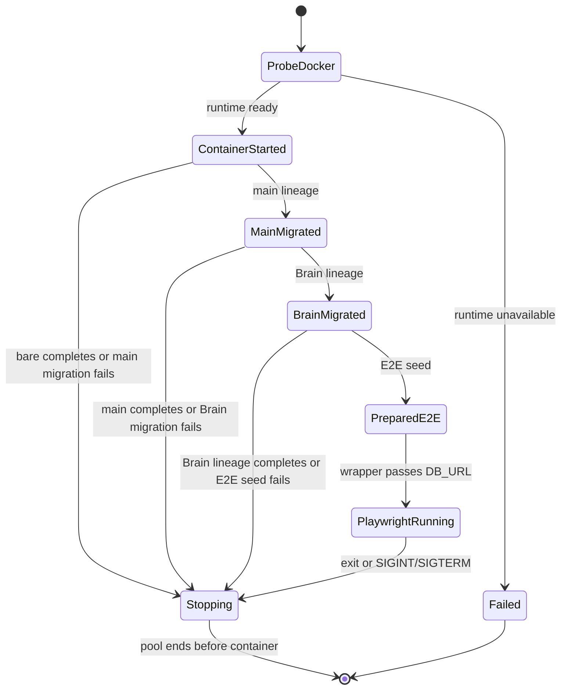
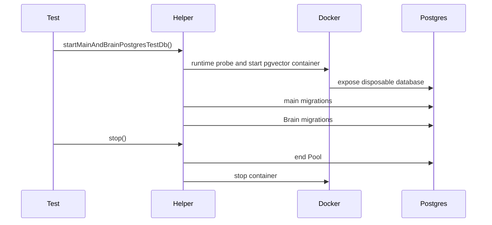
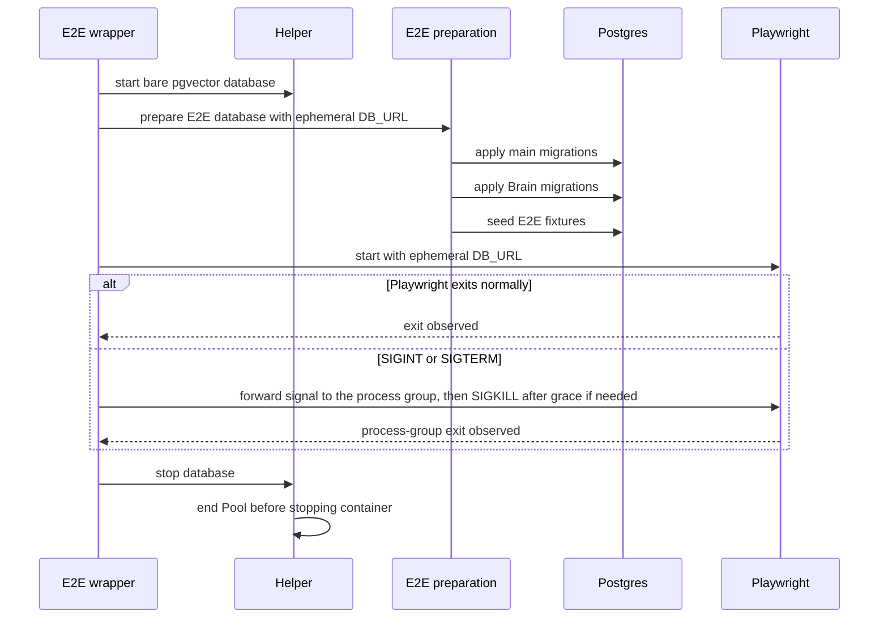

# Test database infrastructure

## Purpose

This domain defines ephemeral PostgreSQL ownership for database-backed tests
(Implemented). It isolates test data by process, makes Docker an explicit
integration/E2E dependency, and keeps build/unit lanes database-free.

## Domain entities

- **Test database helper** — owner of a Testcontainers lifecycle.
- **Bare lineage** — empty PostgreSQL + pgvector database for historical SQL
  replay.
- **Main lineage** — bare database with `lib/db/migrations` applied.
- **Brain lineage** — main lineage followed by `lib/db/brain-migrations`.
- **E2E wrapper** — creates one bare E2E database through the helper, invokes
  E2E preparation with its URL, then starts Playwright with that URL.
- **E2E preparation** — applies main and Brain migrations and seeds E2E
  fixtures through the test-environment command path.

## State machine



## Process flows



The E2E wrapper owns its complete database lifecycle, including cancellation.



## A/B stabilization isolation and fault injection (Designed)

Replace file-level allowlisting with entries keyed by source file + enclosing function + resolved filesystem/child-process callee + operation kind + ownership class + rationale. Scan `.ts`, `.tsx`, `.mts`, `.cts`, `.js`, `.mjs` production roots, including `web/app`, `web/lib`, components that can import server utilities, scripts, instrumentation and imported shared helpers. Enumerate aliases/wrappers and child-process filesystem effects. Use TypeScript AST where practical; unresolved dynamic calls require explicit classification. Tests and migration-only sources are separately identified, not silently excluded from the ownership model.

Classes: manager-owned DB/config/package/evaluation artifacts; supervisor runtime bytes/state; repository/worktree/Git operations retained for Stage C; temporary operator import only. Mixed files contain multiple entries. A new host-runtime read in an already approved file must fail the guard. This static test supplements a real denied-access environment; it cannot prove isolation by itself.

Use disjoint private roots under separate process identities or Linux mount namespaces. Shared repository/worktree access remains permitted; supervisor SQLite/log/object/adapter-private roots are absent or inaccessible to web. Merely choosing different path strings or chmod under the same root user is insufficient. Negative control: a web-process access attempt to a seeded known private sentinel returns EACCES/ENOENT; positive controls prove supervisor access and authorized HTTP object read still work. Test harness may manage both roots; production web may not.

Extend `web/test-support/real-supervisor.ts` and add one real web-process harness with isolated ports, DBs, process groups and persistent restart roots. Reuse `web/test-support/pg-container.ts` as the sole Postgres constructor; no shared development database/ports or broad process killing. A test-only network proxy can drop ACKs, block receipts/SSE, delay old responses and cut streams deterministically without changing production branches. Fake ACP is permitted for deterministic protocol effects; the supervisor, HTTP stack, SQLite, Postgres, projector and owner entrypoints must be real.

Fault synchronization uses explicit fixture barriers after host acceptance/before HTTP ACK, after canonical commit/before owner apply, after consumer claim/before failing apply, and after object seal/before catalog ACK. Tests release barriers or terminate the owned process group; elapsed sleeps never prove that a failure window was reached. Each invocation uses unique ports, database, private roots and an artifact directory outside the worktree.

## A/B stabilization test lanes

S0 first writes complete requirements, route/message schemas, owner/refusal/recovery-window tables, state machines, schema constraints and primary acceptance mapping in the canonical docs. Mark missing behavior Designed, preserving accepted guarantees. No production implementation begins with unresolved required owner arms, a contradictory budget or an undefined destructive recovery window.

For every behavior task: **RED** executes its named primary scenario against the defect and records the discriminating failure; **GREEN** makes the minimal correction; **REFACTOR** stays within changed ownership boundaries while all affected tests remain green. If RED already passes, produce concrete counterevidence and update the finding, or prove the guard with a focused local mutation that the test kills. Do not weaken safety assertions to match broken behavior. No future-increment intentionally failing tests are committed as active tests in an earlier deployable increment.

Test inventory and mutation intent:

| Lane | Owner / runner | Planned file or existing suite to extend | Primary responsibility |
| --- | --- | --- | --- |
| Host output/pressure | E; supervisor Vitest `integration` | Existing `supervisor/src/__tests__/{runtime-event-outbox,runtime-event-pressure,runtime-storage,runtime-file-budget,output-memory}.integration.test.ts`; fixtures under `supervisor/test/fixtures/` | AT-01/02 with real ACP child, SQLite restart, actual bounded pipe behavior. |
| Canonical worker | E; web Vitest `integration` + real PG | Existing `web/lib/execution-host/events/__tests__/ingest.integration.test.ts`; new `projection-worker.integration.test.ts` | AT-03/04 real scheduling/claim/apply, first cursor failure, two consumers/runs, restart without new event. |
| Command reducer/transport | C/Q; web Vitest `integration` + real supervisor/PG | Existing `web/lib/execution-host/__tests__/{command-recovery,deliverer,lifecycle-regression}.integration.test.ts` | AT-06/07/08/10/17. Replace V3 receipt-only failure and keep V7b as minimum-runtime regression. |
| Owner restart | C; web Vitest `integration` + real peer/PG | New `web/lib/execution-host/__tests__/prompt-owner-recovery.integration.test.ts`, split by domain only when setup/size requires; existing gate/consensus/agent/scratch/sync suites | AT-05 full variant matrix; run real owner entrypoints, not invented fixture-only dispatch functions. |
| Object reconciliation/retention | O; web Vitest `integration` + PG/real peer | Existing `runtime-object-retention.integration.test.ts`; new `runtime-object-lifecycle.integration.test.ts` under `web/lib/execution-host/__tests__/` | AT-09/14, event order and more-than-page retention, reference/delete race. |
| Host object integrity | O; supervisor Vitest `integration` | Existing `supervisor/src/__tests__/runtime-objects.integration.test.ts` | AT-13/15 no-follow/inode/hash/range/actual body evidence and restart after seal/tombstone. |
| Historical upgrade | M; web Vitest `integration` + real PG/peer | Existing `web/scripts/__tests__/import-legacy-execution-data-plane.integration.test.ts`, `web/lib/db/__tests__/migration-0135-canonical-data-plane-cutover.integration.test.ts`; new forward migration suite | AT-11 CLI invocation/interrupt/readback, complete historical source preservation, unchanged guards and fresh/upgrade paths. |
| Boundary inventory | Q; web Vitest `unit` | Existing `web/lib/execution-host/__tests__/runtime-data-boundary-inventory.test.ts` and fixture | AT-16 supplementary pure source classification; prohibited added operation in an already allowed mixed file kills guard. |
| Isolated processes | Q; web Vitest `integration` | New `web/test-support/__tests__/execution-ab-isolation.integration.test.ts` plus real harness | AT-16 real permissions/namespaces and process death; uses ordinary production web initialization, worker and transport. |
| Browser outcomes | Q/O; dedicated Playwright real-supervisor config/project | New `web/e2e/execution-ab-lifecycle.spec.ts` and `execution-ab-content.spec.ts`; retain existing `execution-host-contract.spec.ts` as supporting fake-peer coverage | AT-12 and user-visible history/HITL/cancel/resume/completion with unsafe artifact MIME. |
| Pure invariants only | Owning maintainer; existing unit projects | Only canonical request/identity transformation, bounded framing, range/digest parsing, pure reducer tables where stable | No mock-only replica of a real integration scenario; minimum added unit coverage. |

Current `web/vitest.workspace.ts` discovers lib/app/scripts/test-support/e2e integration tests and has `passWithNoTests` scripts. Supervisor integration discovers `src/**/*.integration.test.ts`. Playwright default `AUTHED_SPEC` is an explicit regex; new names do not automatically join authenticated tests. S0/S5 must wire the new real project and prove discovery. `vitest list` and `playwright test --list` must show each promised file/case; an empty successful run fails acceptance.

Phase gates use the actual package scripts, as separate commands:

```bash
pnpm --filter maister-web typecheck
pnpm --filter @maister/supervisor typecheck
pnpm --filter maister-web exec eslint .
pnpm --filter @maister/supervisor exec eslint .
pnpm --filter maister-web test:unit
pnpm --filter maister-web test:integration
pnpm --filter @maister/supervisor test:unit
pnpm --filter @maister/supervisor test:integration
pnpm validate:contracts
pnpm validate:docs
pnpm --filter maister-web db:erd --check
```

Run full unit/integration suites at each completed increment, on the selected supported runtime; scoped new tests first. Build the web/qualified image when runtime/startup/transport/deployment changes; run dedicated real-browser scenarios in S3/S5. Tests introduced under new families require a runner include/config change in that same increment. Use the supported minimum/runtime matrix for AT-17 and affected binary tests. Do not rerun all tests repeatedly without intervening changes or unresolved failures.

Baseline failures are tracked by exact test names/error signatures and environment, never count deltas. Fix A/B failures in scope. A genuinely unrelated harness failure needs a narrowly scoped quarantine with explicit reason and tracked follow-up, reviewed in the phase gate; never quarantine AT-01–17 or claim the original full suite is green while quarantined failures remain. Existing notes about dirty-resolution/recursive harness/E2E failures are historical hints, not current verified exclusions. Qualify tests on disposable roots/DBs and capture stdout/stderr/reports as verifier artifacts outside the code worktree; do not use structured result transport as report storage.

## Expectations

1. Unit/build tests MUST NOT require a reachable Docker runtime.
2. Integration/E2E checks MUST fail with `TestDatabaseDockerUnavailableError`
   and the documented Docker-boundary message when Docker is unavailable,
   including a Docker failure that occurs after the runtime probe.
3. Every helper-created database MUST be unique to its test process and
   disposed through pool-before-container teardown; container shutdown MUST
   still be attempted if pool shutdown fails.
4. Raw historical SQL replay MUST start from the bare lineage only.
5. Main migrations MUST precede Brain migrations in every applicable lineage.
6. E2E MUST pass only its ephemeral `DB_URL` to Playwright and MUST NEVER
   mutate a developer database or reset a schema.
7. On E2E interruption, Playwright's process-group exit MUST be observed before the wrapper
   tears down its database.

## Edge cases

- A Docker probe timeout produces `TestDatabaseDockerUnavailableError` without
  exposing a connection-string password.
- A container startup failure after a successful Docker probe still produces
  `TestDatabaseDockerUnavailableError` without exposing a connection-string
  password.
- Migration or E2E seed failure still attempts to stop the pool and container.
- The E2E child receives the ephemeral `DB_URL`; its Next server keeps its
  normal runtime `NODE_ENV`.
- `SIGINT` and `SIGTERM` abort the wrapper, terminate the detached Playwright
  process group with bounded SIGKILL escalation, then follow the same database
  teardown path.

## Linked artifacts

- [ADR-135](../decisions.md#adr-135-testcontainers-only-ephemeral-postgres-for-database-backed-tests)
- [`pg-container.ts`](../../web/test-support/pg-container.ts)
- [`run.ts`](../../web/e2e/run.ts)
- [`pg-container.integration.test.ts`](../../web/test-support/__tests__/pg-container.integration.test.ts)
- [`run.test.ts`](../../web/e2e/__tests__/run.test.ts)
- [feature specification](../../.ai-factory/specs/feature-unified-test-database-testcontainers.md)

The mandatory S1 CI lane runs `test:integration:ab` in both application packages on Node 24.15.0 and 24.19.0. Its explicit suite inventory is `scripts/run-stage-ab-tests.mjs`; missing files, empty discovery, failed or skipped cases fail the lane. A separate mandatory image job builds the pinned Dockerfile, exercises real binary HTTP and runs `web/scripts/smoke-production-image.ts` through the default image ENTRYPOINT/CMD with a migrated PostgreSQL container. It verifies HTTP readiness, SIGTERM completion and no remaining web PostgreSQL sessions. The broader owner, import and browser/isolation lanes remain part of later stabilization increments.
