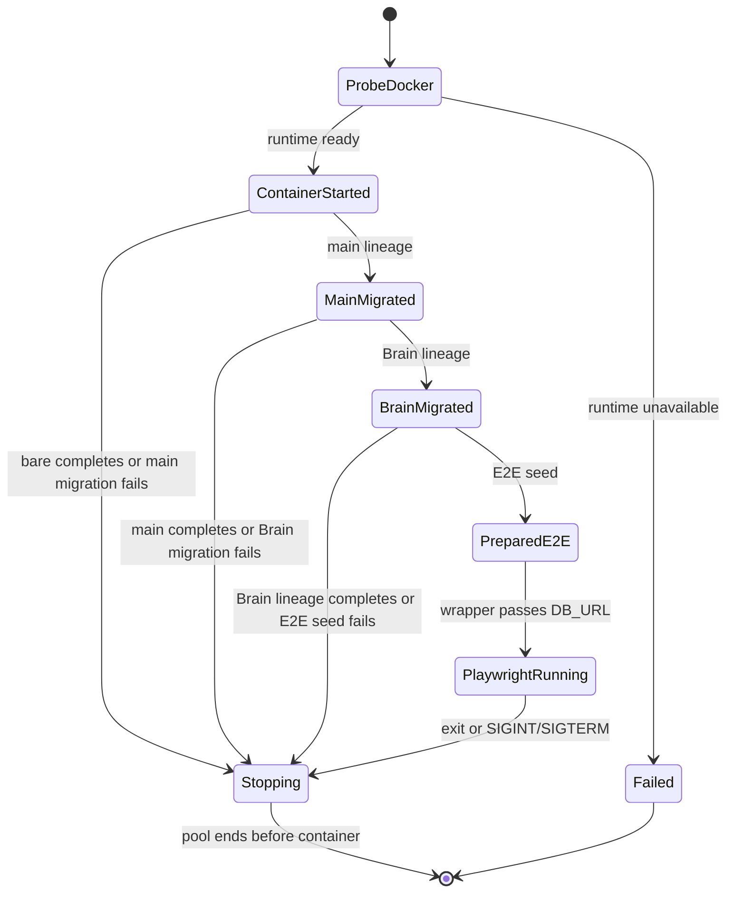
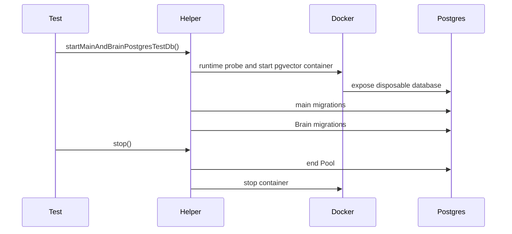
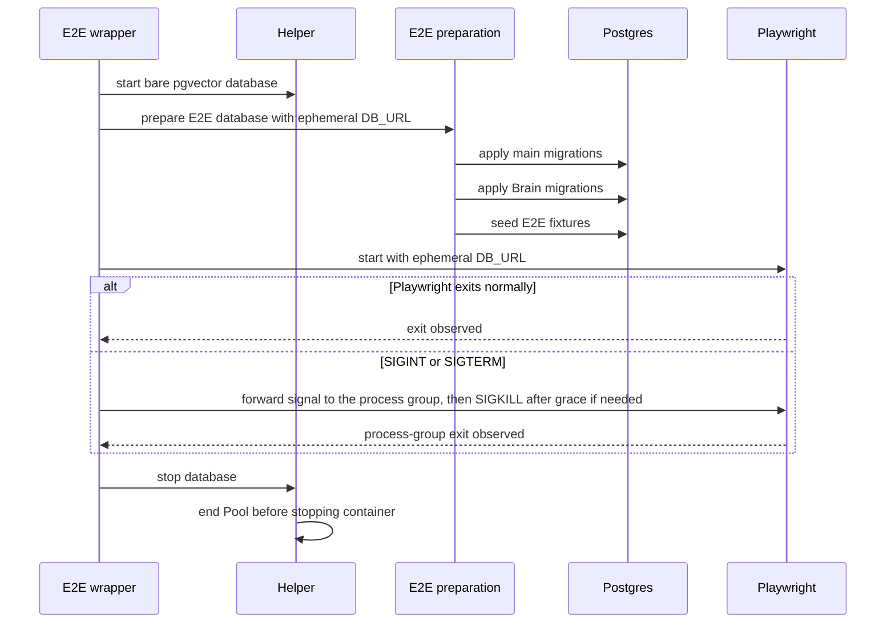

# Test database infrastructure

## Purpose

This domain defines ephemeral PostgreSQL ownership for database-backed tests
(Implemented). It isolates test data by process, makes Docker an explicit
integration/E2E dependency, and keeps build/unit lanes database-free.

## Domain entities

- **Test database helper** — owner of a Testcontainers lifecycle.
- **Bare lineage** — empty PostgreSQL + pgvector database for historical SQL
  replay.
- **Main lineage** — bare database with `lib/db/migrations` applied.
- **Brain lineage** — main lineage followed by `lib/db/brain-migrations`.
- **E2E wrapper** — creates one bare E2E database through the helper, invokes
  E2E preparation with its URL, then starts Playwright with that URL.
- **E2E preparation** — applies main and Brain migrations and seeds E2E
  fixtures through the test-environment command path.

## State machine

## Process flows

The E2E wrapper owns its complete database lifecycle, including cancellation.

## Expectations

1. Unit/build tests MUST NOT require a reachable Docker runtime.
2. Integration/E2E checks MUST fail with `TestDatabaseDockerUnavailableError`
   and the documented Docker-boundary message when Docker is unavailable,
   including a Docker failure that occurs after the runtime probe.
3. Every helper-created database MUST be unique to its test process and
   disposed through pool-before-container teardown; container shutdown MUST
   still be attempted if pool shutdown fails.
4. Raw historical SQL replay MUST start from the bare lineage only.
5. Main migrations MUST precede Brain migrations in every applicable lineage.
6. E2E MUST pass only its ephemeral `DB_URL` to Playwright and MUST NEVER
   mutate a developer database or reset a schema.
7. On E2E interruption, Playwright's process-group exit MUST be observed before the wrapper
   tears down its database.

## Edge cases

- A Docker probe timeout produces `TestDatabaseDockerUnavailableError` without
  exposing a connection-string password.
- A container startup failure after a successful Docker probe still produces
  `TestDatabaseDockerUnavailableError` without exposing a connection-string
  password.
- Migration or E2E seed failure still attempts to stop the pool and container.
- The E2E child receives the ephemeral `DB_URL`; its Next server keeps its
  normal runtime `NODE_ENV`.
- `SIGINT` and `SIGTERM` abort the wrapper, terminate the detached Playwright
  process group with bounded SIGKILL escalation, then follow the same database
  teardown path.

## Linked artifacts

- [ADR-135](../decisions.md#adr-135-testcontainers-only-ephemeral-postgres-for-database-backed-tests)
- [`pg-container.ts`](../../web/test-support/pg-container.ts)
- [`run.ts`](../../web/e2e/run.ts)
- [`pg-container.integration.test.ts`](../../web/test-support/__tests__/pg-container.integration.test.ts)
- [`run.test.ts`](../../web/e2e/__tests__/run.test.ts)
- [feature specification](../../.ai-factory/specs/feature-unified-test-database-testcontainers.md)
