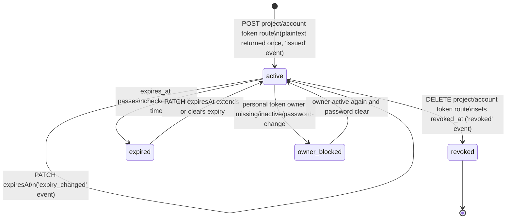
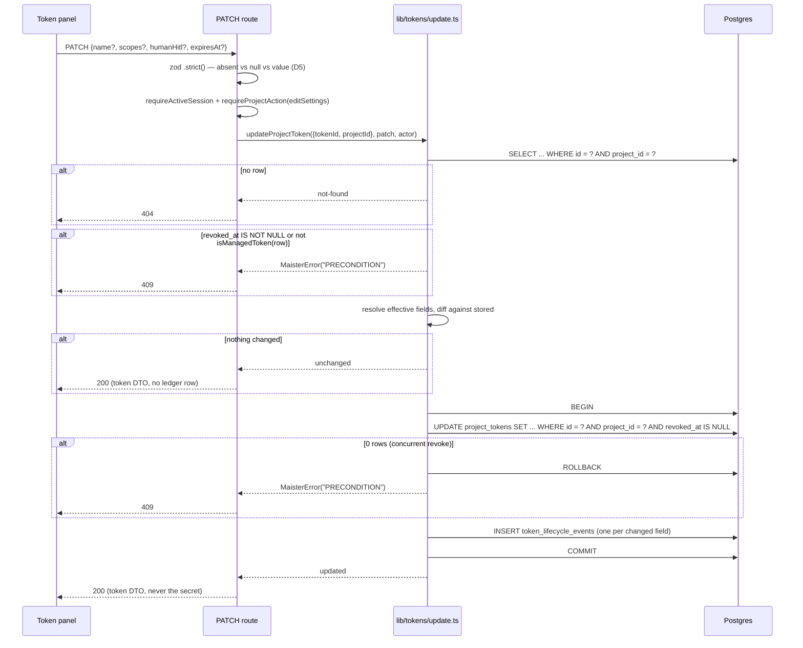
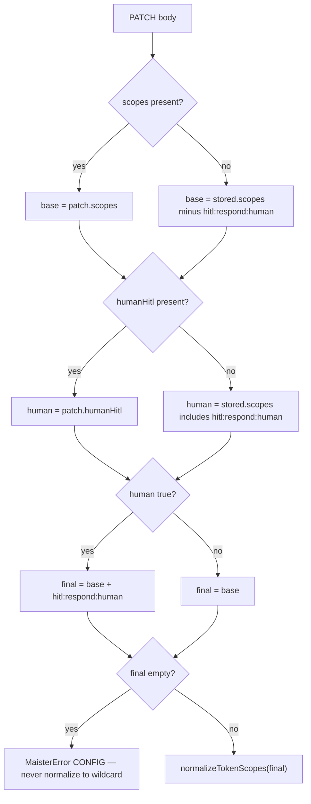

# Token lifecycle domain

> **Status: Designed ([ADR-168](../decisions.md#adr-168-post-issuance-mutation-of-api-tokens)).**
> Issue → edit → revoke/expire for API tokens, the `token_lifecycle_events`
> ledger, and who may change what. The `/api/v1/ext` surface those tokens
> authenticate against — routes, per-call scope enforcement, `token_audit_log`,
> the MCP facade — stays in
> [`external-operations.md`](external-operations.md).
> Prior locked decisions: [ADR-046](../decisions.md#adr-046) (token model),
> [ADR-089](../decisions.md#adr-089) (ephemeral agent tokens),
> [ADR-098](../decisions.md#adr-098) (run-bound orchestrator tokens).

## Purpose

This domain covers the life of a `project_tokens` row from issuance to its
terminal state, and — new in ADR-168 — the **post-issuance edit** that was
missing from the original model. A token issued with the wrong scope set had
exactly one remedy before this: a hand-written `UPDATE` against Postgres.
ADR-168 records that immutability was never a decision (nothing in ADR-046
forbids mutation, and `bumpTokenLastUsed` already `UPDATE`s the row on every
authenticated call) and builds the missing write path.

Three fields are mutable — `scopes`, `expires_at`, `name` — and each change is
recorded in an append-only `token_lifecycle_events` ledger. Everything that
identifies the credential or repudiates it (`token_hash`, `prefix`,
`project_id`, `token_kind`, `owner_user_id`, `agent_id`, `revoked_at`) is
frozen.

Domain boundary: the mutability matrix, the managed-token predicate, the
partial-update semantics, the lifecycle ledger, and the authorization gate on
each editing surface. Out of scope: per-call verification and audit
(`external-operations.md`), secret rotation (deferred — no decision exists yet
about the old secret's fate or an overlap window), and un-revoking (refused by
design).

## Domain entities

- **`project_tokens`** — one row per issued token; the entity this domain
  mutates. Column-level narrative in
  [`../database-schema.md`](../database-schema.md); ERD in
  [`../db/integrations-domain.md`](../db/integrations-domain.md).
  (Implemented)
- **`token_lifecycle_events`** — append-only ledger of every managed-token
  lifecycle change: `issued | scopes_changed | renamed | expiry_changed |
  revoked`. Carries `before`/`after` JSON for the changed field, the acting
  user (`actor_user_id`, nullable) and a durable `actor_label`. Never carries
  `token_hash`, `prefix`, or the plaintext secret. (Designed)
- **Managed token** — a durable, human-issued credential: the rows the token
  management UIs create and list. Editable; covered by the ledger.
- **Non-managed token** — a machine-minted, run-bound credential revoked by its
  own lifecycle: every `token_kind='agent'` row, plus the `token_kind='project'`
  rows named `orchestrator-run:<runId>` that `issueOrchestratorRunToken` mints
  ([ADR-098](../decisions.md#adr-098)). Never editable; never in the ledger.
- **Editing actor** — a session user. A project token is edited by a project
  admin (`editSettings`); a personal token by its owner. No token may edit a
  token: the PATCH routes are session-auth only, like the POST and DELETE
  routes beside them.

## State machine

A token is `active` from issuance until it is revoked or expires. ADR-168 adds
the three `active → active` self-transitions; the terminal transitions are
unchanged. `revoked` stays terminal — un-revoking would re-arm a repudiated
secret — while `expired` is reachable back to `active`, because expiry is a
policy timer and not a repudiation.

Transitions:
- `[*] → active`: session-auth `POST /api/projects/{slug}/tokens` or
  `POST /api/account/tokens`. Writes an `issued` lifecycle row in the same
  transaction as the `project_tokens` INSERT. (Designed)
- `active → active`: `PATCH /api/projects/{slug}/tokens/{tokenId}` or
  `PATCH /api/account/tokens/{tokenId}`. One row per **changed** field; a patch
  that changes nothing writes nothing. (Designed)
- `active → revoked`: the existing `DELETE` routes, now also writing a
  `revoked` lifecycle row. An already-revoked row writes no second row.
  (Designed)
- `active → expired`: `expires_at` is compared at verify time; past expiry →
  401. No sweeper. (Implemented)
- `expired → active`: a PATCH extending or clearing `expires_at`. The prior
  value is preserved in the ledger's `before`, so the revival is legible.
  (Designed)
- `active → owner_blocked`: evaluated at verification time; no row mutation.
  (Implemented)

## Process flows

### Edit a managed token

The route resolves the project and the gate; the service owns every semantic
refusal and the single transaction. The order matters: the scoping predicate
runs before the managed-token predicate, so a token outside the caller's scope
is existence-hidden rather than told why it is uneditable.

### Resolving effective scopes on the account route

`POST /api/account/tokens` refuses `hitl:respond:human` inside `scopes` and
takes it through a separate `humanHitl` boolean. PATCH mirrors its own
surface's POST, so the effective set is recomputed from the **stored** row —
otherwise a patch that touched only `scopes` would silently drop an existing
human-HITL grant.

## Expectations

- A managed token's `project_tokens.scopes`, `name`, and `expires_at` MUST be
  mutable through the PATCH routes, and `token_hash`, `prefix`, `project_id`,
  `token_kind`, `owner_user_id`, `agent_id`, and `revoked_at` MUST NEVER be —
  enforced by the field allow-list in `lib/tokens/update.ts` (I1, I2).
- `isManagedToken` MUST be the single predicate deciding BOTH editability and
  `token_lifecycle_events` membership, and MUST classify every
  `token_kind='agent'` row and every row whose `name` matches
  `^(orchestrator-run|agent-run):` as non-managed — enforced by one exported
  helper with two call sites (I6, I7, I21).
- A PATCH MUST execute the `project_tokens` UPDATE and every implied
  `token_lifecycle_events` INSERT in ONE `db.transaction`, so a failure
  discards both (I4, I5).
- The UPDATE MUST carry `isNull(revoked_at)` as a CAS predicate and MUST raise
  `MaisterError("PRECONDITION")` on a zero-row result rather than reporting
  success (I8).
- A patch whose resolved fields all equal the stored values MUST write no
  `token_lifecycle_events` row and MUST report `unchanged` (I3).
- An empty resolved scope set MUST be refused `MaisterError("CONFIG")` in
  `lib/tokens/update.ts` BEFORE `normalizeTokenScopes` is called, never
  delegated to route validation, because `normalizeTokenScopes([])` returns
  `["*"]` and would silently grant full access (I10).
- A `name` matching `^(orchestrator-run|agent-run):` (case-insensitive) MUST be
  refused `MaisterError("CONFIG")` on both PATCH routes AND both POST routes,
  and the guard MUST live at the route/service layer and NEVER as a table CHECK,
  because `issueOrchestratorRunToken` and `issueAgentRunToken` legitimately
  write those names (I11, I12).
- Every service query MUST re-assert the caller's scoping columns —
  `project_id` for the project path, `owner_user_id` + `token_kind='user'` +
  `project_id IS NULL` for the account path — so a token outside that scope is
  `not-found` and never a mutation (I13, I14).
- `PATCH /api/projects/{slug}/tokens/{tokenId}` MUST require
  `requireProjectAction(projectId, "editSettings")` and
  `PATCH /api/account/tokens/{tokenId}` MUST require an active session whose
  user owns the row — the same gates that already govern minting that authority
  (I15, I16, I17).
- An absent body field MUST preserve stored state, `expiresAt: null` MUST clear
  expiry, `name`/`scopes`/`humanHitl` MUST reject `null`, and a body with no
  field present MUST be refused `MaisterError("CONFIG")` (I19, I20, I22).
- `token_lifecycle_events` MUST be append-only — never updated, never deleted
  except by the `project_tokens` cascade — and MUST NEVER carry `token_hash`,
  `prefix`, or the plaintext secret in `before` or `after`.
- A committed edit MUST be in force on the next `/api/v1/ext` request with no
  cache invalidation step, because `verifyToken` re-reads `project_tokens` by
  `prefix` on every call.

## Edge cases

- **Agent token edited** (`token_kind='agent'`) → `PRECONDITION` (409). Its
  lifecycle belongs to the run that minted it.
- **Run-bound project token edited** (`token_kind='project'` named
  `orchestrator-run:<runId>`) → `PRECONDITION` (409). The kind alone does not
  classify it; the name does.
- **Revoked token edited** → `PRECONDITION` (409). Revocation is terminal.
- **Concurrent revoke during an edit** (CAS matches zero rows) →
  `PRECONDITION` (409); the transaction rolls back, so no ledger row survives.
- **Reserved-prefix `name`** (`orchestrator-run:` / `agent-run:`, any case) →
  `CONFIG` (422), on PATCH and on POST alike.
- **Unknown scope value** → `CONFIG` (422) from `normalizeTokenScopes`.
- **Resolved scope set empty** → `CONFIG` (422) from the service guard, never
  a silent `["*"]`.
- **Body with no field present** → `CONFIG` (422). Nothing to do is a client
  error, not a silent 200.
- **`name: null`, `scopes: null`, or `humanHitl: null`** → `CONFIG` (422).
  Only `expiresAt` is nullable, where `null` means "clear expiry".
- **`hitl:respond:human` inside `scopes` on the account PATCH** → `CONFIG`
  (422), mirroring that surface's POST; it is granted through `humanHitl`.
- **Cross-project `tokenId`** → 404 `NOT_FOUND`; the service WHERE re-asserts
  `project_id`, so the row is existence-hidden, never mutated.
- **Another user's personal token via the account path** → 404 `NOT_FOUND`.
- **Non-admin project member patches a project token** → 403 `UNAUTHORIZED`
  from `requireProjectAction`.
- **Expired token given a new expiry** → allowed; the token verifies again. The
  ledger's `before` records the lapsed instant, so the revival is auditable.
- **Two admins edit the same token concurrently** → no `MaisterError`. Last
  write wins on field values, deliberately: there is no `If-Match` and no
  version column. Both edits write ledger rows, so the sequence is
  reconstructible after the fact.
- **Token issued before the lifecycle ledger existed** → no `issued` row, and
  none is synthesized. The trail starts at its migration; a fabricated
  provenance row would be worse than an absent one.

## Linked artifacts

- ADRs: [ADR-168](../decisions.md#adr-168-post-issuance-mutation-of-api-tokens)
  (post-issuance mutation — mutability matrix, managed-token predicate, the
  reserved-name guard, accepted last-write-wins residual),
  [ADR-046](../decisions.md#adr-046) (project API token model),
  [ADR-089](../decisions.md#adr-089) (ephemeral agent tokens),
  [ADR-098](../decisions.md#adr-098) (run-bound orchestrator tokens).
- DB ERD: [`../db/integrations-domain.md`](../db/integrations-domain.md),
  [`../db/erd.md`](../db/erd.md).
- DB narrative: [`../database-schema.md`](../database-schema.md)
  (`project_tokens`, `token_lifecycle_events` sections).
- API: [`../api/web.openapi.yaml`](../api/web.openapi.yaml)
  (`PATCH /api/projects/{slug}/tokens/{tokenId}`,
  `PATCH /api/account/tokens/{tokenId}`).
- Error taxonomy: [`../error-taxonomy.md`](../error-taxonomy.md)
  (`PRECONDITION` → 409, `CONFIG` → 422).
- Related domains: [`external-operations.md`](external-operations.md)
  (per-call verification, scope enforcement, `token_audit_log`, MCP facade),
  [`identity-access.md`](identity-access.md) (`requireActiveSession`,
  `requireProjectAction`), [`agents.md`](agents.md) (ephemeral agent tokens and
  their own revoke lifecycle).
- Source files: `web/lib/tokens/` (`update.ts`, `issue.ts`, `revoke.ts`,
  `scopes.ts`, `verify.ts`), `web/lib/agents/tokens.ts`,
  `web/app/api/projects/[slug]/tokens/[tokenId]/route.ts`,
  `web/app/api/account/tokens/[tokenId]/route.ts`,
  `web/lib/db/schema.ts` + migration `0163_token_lifecycle_events.sql`.
