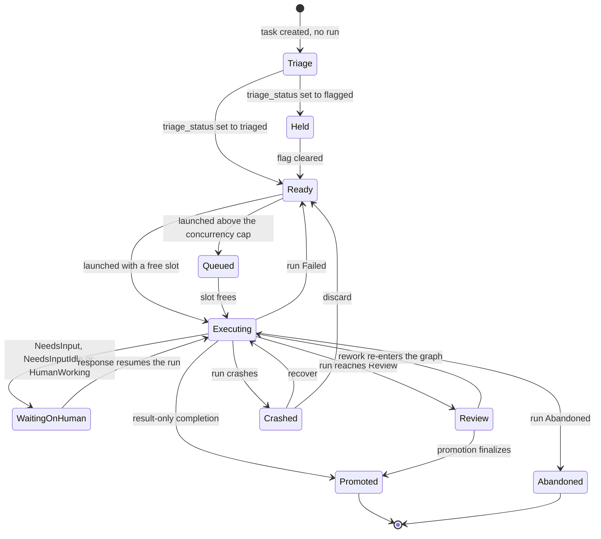
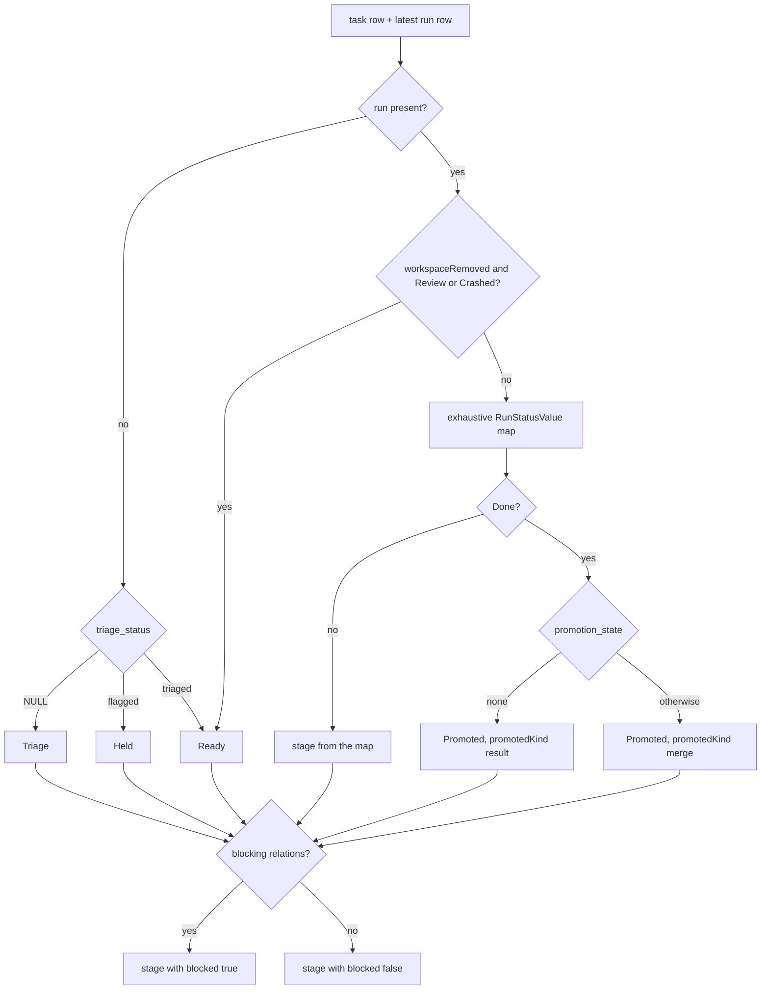
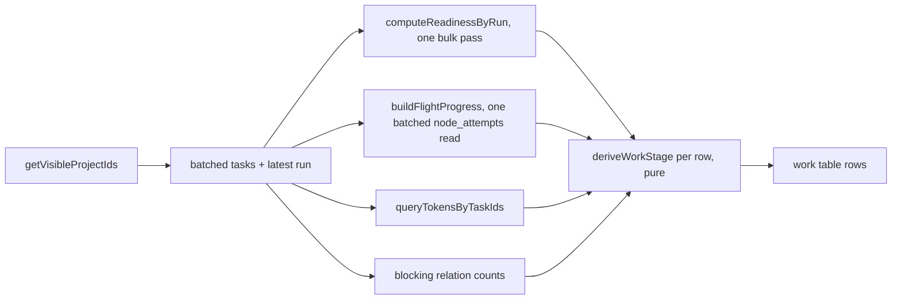

# Work stages

## Purpose

The derived **work-stage vocabulary** — one comparable answer to "where is this
piece of work" for every task in the portfolio, whether or not it has ever
launched a run — and the cross-project work table that renders it. The domain
owns `WorkStage`, the pure classifier `deriveWorkStage`, and the batched read
model behind `/work`. It does **not** own the Kanban board's seven
`BoardColumn` values, the persisted `tasks.stage` column, or the inbox card's
node `StageChip`; [ADR-169](../decisions.md#adr-169-derived-work-stage-vocabulary-distinct-from-the-board-columns)
is the map between those four vocabularies. Nothing here is persisted. The
domain is **Implemented**.

## Domain entities

- **`WorkStage`** — the derived vocabulary: `Triage`, `Held`, `Ready`, `Queued`,
  `Executing`, `WaitingOnHuman`, `Review`, `Crashed`, `Promoted`, `Abandoned`.
  In-memory only; no column, no enum, no migration.
- **`deriveWorkStage`** — the pure classifier producing
  `{ stage, blocked, progress, promotedKind }`.
- **`blocked`** — a boolean attribute riding beside `stage`, set from the task's
  blocking relation count. Never a `WorkStage` member.
- **`promotedKind`** — `"merge" | "result"`, distinguishing a promoted branch
  from an ADR-165 result-only completion.
- **`tasks`** (persisted) — supplies `status`, `stage`, `triage_status`.
  See the [ERD](../db/erd.dbml).
- **`runs`** (persisted) — supplies `status`, `run_kind`, `promotion_state`.
- **`task_relations`** (persisted) — supplies the blocking count behind `blocked`.

## State machine

`WorkStage` is derived per read, so this diagram describes the observable
progression of a task through the vocabulary rather than a persisted FSM. The
authoritative per-status mapping is the normative table in ADR-169 D2.

## Process flows

Classification of a single row. The run-status axis is an exhaustive
`satisfies Record<RunStatusValue, ...>` map, so an unmapped status is a compile
error rather than a runtime fallthrough.

The `/work` read model resolves visibility once, then batches. Its query count is
fixed by the number of read models it composes, never by the number of rows.

## As built

- **Three of the nine classifier inputs are read by no branch.**
  `taskStatus`, `taskStage` and `runKind` are part of the signature ADR-169 D1
  fixes normatively, and none is consulted today: the run axis dominates
  whenever a run exists, and the task axis answers only the no-run case, where
  `triageStatus` is the discriminant. They are kept so a future divergence — a
  task abandoned under a live run, a `scratch` run that must not read as
  `Executing` — lands as a branch rather than as a new parameter threaded
  through both call sites.
- **`progress` is meaningful on one of the two call sites.** `/work` passes the
  node spine's k/N; the board passes `null` and forwards only `stage`,
  `blocked` and `promotedKind` to its cards, because the board renders node
  progress through its own existing surface.

## Expectations

- **STG-01:** `deriveWorkStage` MUST be total over `RUN_STATUS_VALUES` × task status × `triage_status`, enforced at compile time by an exhaustive `satisfies Record<RunStatusValue, ...>` map.
- **STG-02:** `deriveWorkStage` MUST be pure — no database handle, no clock read, and no `server-only` import.
- **STG-03:** A `Done` run with `promotion_state='none'` MUST yield `Promoted` with `promotedKind:"result"`, never `Executing` and never `Review`.
- **STG-04:** A `Failed` run MUST yield `Ready`; a `Crashed` run MUST yield `Crashed`.
- **STG-05:** `blocked` MUST be an attribute beside `stage` and MUST NEVER be a `WorkStage` member.
- **STG-06:** `Intake` and `Delivered` MUST NOT be `WorkStage` members until the PO-intake and delivery-report work ships.
- **STG-07:** No `WorkStage` value is ever persisted — no column, no enum, and no write path may store one.
- **STG-08:** `/work` MUST issue a number of queries that is independent of the number of rows returned.
- **STG-09:** `/work` MUST list tasks only from projects returned by `getVisibleProjectIds` for the requesting user.
- **STG-10:** Every `WorkStage` member MUST have both an EN and an RU label, and the two MUST differ.
- **STG-11:** A task whose own status is terminal (`Done`/`Abandoned`) MUST classify as settled (`Promoted`/`Abandoned`) even when it never launched a run — the task axis decides the no-run case before triage does.

## Edge cases

- **EDGE-STG-01:** A task with several runs is classified from its **latest** run only; older runs contribute no stage. Earlier attempts remain visible in run history and the activity feed.
- **EDGE-STG-02:** `workspaceRemoved` together with a `Review` or `Crashed` run yields `Ready`, matching the existing board rule that a user-removed workspace turns a parked result into history and returns the task to a relaunchable lane.
- **EDGE-STG-03:** A task with no run is classified from its own STATUS first and from `triage_status` only if that status is still live. `abandonUnlaunchedTasks` sets `Abandoned` with `notExists(runs)` in its WHERE, so a run-less terminal task is not a corner case — it is the only shape that path produces, and reading it through triage alone rendered finished work as `Triage`/`Held`/`Ready` with working next-action links.

## Linked artifacts

- [ADR-169 — derived work-stage vocabulary](../decisions.md#adr-169-derived-work-stage-vocabulary-distinct-from-the-board-columns)
- [ADR-168 — the two canonical attention counters](../decisions.md#adr-168-two-canonical-attention-counters-decisions-and-updates)
- [M51 requirement traceability](m51-traceability.md)
- [Tasks and the board](tasks.md)
- [Screen reference — `/work`](../screens/work.md)
- [`web/lib/runs/run-status-values.ts`](../../web/lib/runs/run-status-values.ts)
- [`web/lib/board.ts`](../../web/lib/board.ts)
