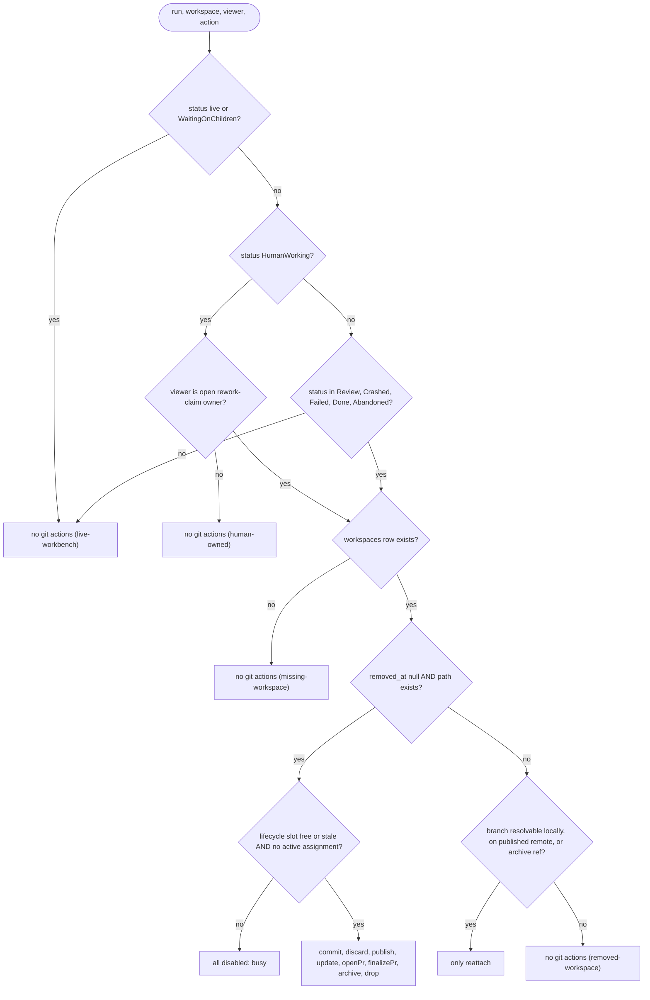
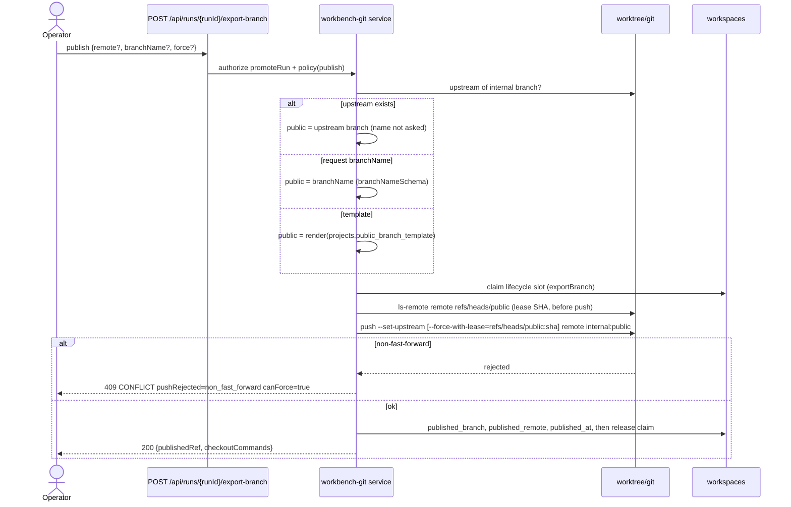
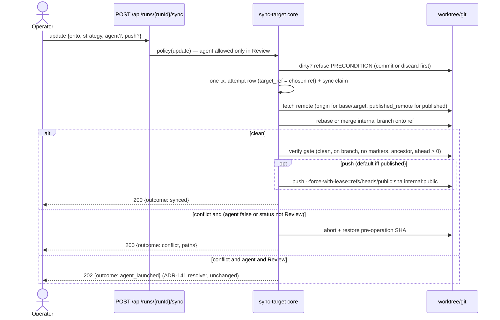
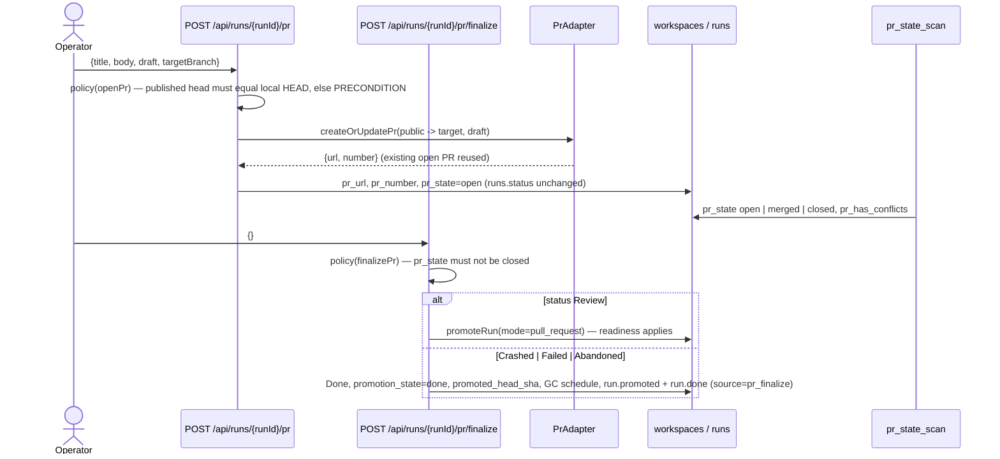
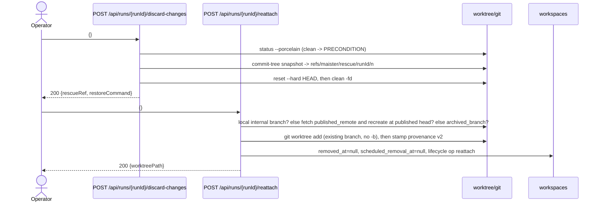

# Workbench git operations domain

> **Status: Designed (ADR-181).** This contract replaces the status-gated
> Export dialog, the ReviewPanel sync dialog and the scratch promote block with
> one git panel per run. It reuses the workbench lifecycle claim, the ADR-141
> sync core, the ADR-049 `PrAdapter`, and the `worktree.ts` primitives; nothing
> here changes `runs.status` except the explicit PR finalize.

## Purpose

Workbench git operations are the operator's git actions on a run's worktree
whenever no agent is writing to it: commit, discard, publish under a public
branch name, update from base/target/the published remote branch, open a PR
before any promotion, finalize a PR-backed run, and re-attach a removed
worktree. The boundary is the run worktree and its branch on the host; it does
NOT cover promotion (`promoteRun`, [`workspaces.md`](workspaces.md)), the AI
conflict resolver and reopen ([`branch-sync.md`](branch-sync.md)), archive/drop
semantics ([`workbench-lifecycle.md`](workbench-lifecycle.md)), or graph
re-entry ([`run-continuation.md`](run-continuation.md)).

## Domain entities

- **Git state** — the lazy read model of one worktree: internal branch, public
  name + upstream, remotes, dirty counts (tracked + untracked), ahead/behind
  against base, target and `<published_remote>/<published_branch>`, unpushed
  commits, PR fields, the busy lifecycle op, worktree presence, re-attach
  sources, rescue refs. Not persisted; served only by `GET /api/runs/{runId}/git-state`.
- **Internal branch** — `workspaces.branch`, the run's identity
  (`<prefix>task-<uuid>/attempt-N`, agent and scratch shapes). Never renamed.
- **Public branch** — `workspaces.published_branch` + `published_remote` +
  `published_at` (Designed, migration): the name the branch carries on the
  remote. Resolved upstream → request `branchName` → project template.
- **Public branch template** — `projects.public_branch_template`, default
  `feature/{task_key}-{slug}`, mirrored as `project.public_branch_template` in
  `maister.yaml`. Placeholders `{task_key}` (`run-<8hex>` without a task),
  `{slug}` (transliterated title, `[a-z0-9-]`, ≤ 40), `{attempt}`.
- **Rescue ref** — `refs/maister/rescue/<runId>/<n>`: a detached snapshot commit
  of the dirty tree written before any discard. Repo-scoped, survives
  archive/drop.
- **Lifecycle operation** — the shared `workspaces.lifecycle_operation_*` claim
  (see [`workbench-lifecycle.md`](workbench-lifecycle.md)); TS-only names
  `exportBranch` (publish), `sync` (update), `discard`, `reattach`, `prOpen`,
  `prFinalize`, beside the existing `archive | drop | snapshotCommit | handoffBranch`.
- **PR fields** — `workspaces.pr_url`, `pr_number`, `pr_state`,
  `pr_has_conflicts` (ADR-140); written by open-PR and finalize, scanned by
  `pr_state_scan`.

## State machine

Transitions are operation-driven, so a state-and-action matrix stands in for
the run side. Two orthogonal workspace axes carry the git-level state.

| `runs.status` | commit / discard / publish / update / openPr / finalizePr | reattach | archive / drop |
| --- | --- | --- | --- |
| `Pending`, `Running`, `NeedsInput`, `NeedsInputIdle`, `WaitingOnChildren` | no (`live-workbench`) | no | no (stop paths only) |
| `HumanWorking`, viewer = rework-claim owner | yes | yes | no (`human-owned`) |
| `HumanWorking`, any other viewer | no (`human-owned`) | no | no |
| `Review`, `Crashed`, `Failed`, `Done`, `Abandoned` | yes while the worktree is usable | yes while NOT usable and a source resolves | yes while usable |
| unknown | no | no | no |

"Usable" = `workspaces.removed_at IS NULL` AND the worktree path exists on disk.
`finalizePr` additionally requires `pr_url` set and `pr_state ∈ {NULL, open,
merged}`; `update` with `agent:true` additionally requires `Review`.

## Process flows

**Policy** (one predicate for every git action):

**Publish** (public name, upstream, explicit-SHA lease):

**Update** (onto base | target | published, abort on conflict):

**Open PR, then finalize** (run status untouched until finalize):

**Discard** (preserve-first) and **Re-attach**:

## Route contracts

| Route | Purpose | Authz | Body |
| --- | --- | --- | --- |
| `GET /api/runs/{runId}/git-state` | Read model for the panel | `recoverRun` (member) | none |
| `POST /api/runs/{runId}/snapshot-commit` | Commit dirty work (existing) | `promoteRun` | `{commitMessage}` |
| `POST /api/runs/{runId}/discard-changes` | Rescue ref, then reset + clean | `promoteRun` | `{}` |
| `POST /api/runs/{runId}/export-branch` | Publish (existing route, extended) | `promoteRun` | `{remote?, branchName?, force?, snapshotDirty?, commitMessage?}` |
| `POST /api/runs/{runId}/sync` | Update (existing route, extended) | `promoteRun` | `{onto?, strategy?, agent?, push?, runnerId?}` |
| `POST /api/runs/{runId}/pr` | Open or find the provider PR | `promoteRun` | `{title?, body?, draft?, targetBranch?}` |
| `POST /api/runs/{runId}/pr/finalize` | Finalize a PR-backed run to `Done` | `promoteRun` | `{}` |
| `POST /api/runs/{runId}/reattach` | Re-create a removed worktree | `recoverRun` | `{}` |

`runId` is the only trusted locator; branch, paths, remotes, target and PR
identity are DB or git state. Strict JSON schemas reject unknown fields.

## Expectations

- Every git action MUST be admitted by exactly one predicate over `runs.status`,
  the open rework-claim `owner_user_id`, `workspaces.removed_at`, worktree
  presence, the active `execution_assignments` row and the lifecycle slot;
  unknown statuses admit nothing.
- `HumanWorking` MUST admit the full git set only when `viewerUserId` equals
  the open `review_rework_claim` row's `owner_user_id`; every other viewer sees
  `human-owned`, and cards/rail never expose `HumanWorking` git actions.
- Every mutating action MUST run under the `workspaces.lifecycle_operation_*`
  claim; two concurrent actions on one workspace MUST yield one success and one
  `MaisterError("CONFLICT")`.
- Publish MUST push `refs/heads/<internal>:refs/heads/<public>` with
  `--set-upstream`, lease against the `ls-remote` SHA captured BEFORE the push,
  and write `published_branch`, `published_remote`, `published_at` in the same
  operation; a non-fast-forward rejection MUST be `CONFLICT` with
  `pushRejected:"non_fast_forward"` and `canForce:true`.
- The public name MUST resolve upstream → request `branchName` → project
  template, in that order; a template that renders a `branchNameSchema`-invalid
  name MUST refuse `MaisterError("CONFIG")`.
- `isBranchPublished` and the rework-claim return ingest MUST read
  `published_branch`/`published_remote` before probing upstream, so a published
  branch without a PR counts as published.
- Update MUST abort and restore the pre-operation SHA on any conflict unless
  `agent:true` AND `runs.status='Review'`; `agent:true` in any other status MUST
  refuse `MaisterError("PRECONDITION")`.
- Open PR MUST be idempotent by `(published_branch, targetBranch)`, MUST refuse
  `PRECONDITION` when the published head differs from the local HEAD, MUST NOT
  change `runs.status`, and MUST write `pr_url`, `pr_number`, `pr_state='open'`.
- Finalize from `Review` MUST be `promoteRun(mode:'pull_request')`; from
  `Crashed | Failed | Abandoned` it MUST set `runs.status='Done'`,
  `promotion_state='done'`, `promoted_head_sha` and `scheduled_removal_at`, and
  emit `run.promoted` + `run.done` with `attribution.source='pr_finalize'`;
  `pr_state='closed'` MUST refuse `PRECONDITION`.
- Discard MUST write the rescue ref before `reset --hard` + `clean -fd`, MUST
  refuse a clean tree with `PRECONDITION`, and the ref MUST survive
  archive/drop of the workspace.
- Reattach MUST be admitted only while the worktree is not usable, MUST try the
  local internal branch, then `<published_remote>/<published_branch>`, then
  `archived_branch`, and MUST null `removed_at` and `scheduled_removal_at` only
  after `git worktree add` succeeds and provenance v2 is stamped.
- `Failed` MUST be listed wherever `Crashed` is (portfolio, project workspace
  list, rail without TTL) and MUST NOT be counted by the ADR-169 attention
  counters; git state MUST be served only by its own route, never computed in a
  page RSC.

## Edge cases

- Project without a remote → publish, open PR and `onto:"published"` refuse
  `MaisterError("PRECONDITION")`; commit, discard, update onto base/target
  (local refs) still work.
- Public name exists on the remote at another head (a prior attempt) →
  `MaisterError("CONFLICT")` with `pushRejected:"non_fast_forward"`; retry with
  `force:true` uses the explicit-SHA lease; a lease rejection is `CONFLICT` and
  the local branch is kept.
- Template renders an invalid or empty name → `MaisterError("CONFIG")`; the
  dialog falls back to the editable field.
- Provider `generic` (or no `gh`/`glab`/token) → open PR refuses
  `MaisterError("PRECONDITION")` exactly as `pull_request` promotion does.
- PR closed on the provider → finalize refuses `PRECONDITION`; open PR creates a
  new PR for the same head/base (the dedup lists open PRs only).
- Dirty tree on update or open PR → `MaisterError("PRECONDITION")` naming
  commit and discard as remediation.
- Git identity unresolvable on commit or rescue snapshot →
  `MaisterError("CONFIG")` `workspace_git_identity_invalid`, nothing written.
- Another lifecycle op (`sync`, `archive`, `drop`, …) holds the slot →
  `MaisterError("CONFLICT")`; the panel shows the busy op from `git-state`.
- Reattach with no resolvable source (branch deleted locally and on the remote,
  no archive ref) → `MaisterError("PRECONDITION")`; a foreign directory at the
  worktree path → `MaisterError("CONFLICT")`, nothing removed.
- `Crashed` classified `worktree-gone` with `removed_at IS NULL` → `git-state`
  reports `worktreePresent:false` and the policy admits only `reattach`.
- Transient push or provider failure → `MaisterError("EXECUTOR_UNAVAILABLE")`
  (503); the claim stays retryable.
- Viewer role → `MaisterError("UNAUTHORIZED")` (403) on every mutating route;
  `git-state` is readable at member level.
- Crash between a successful push/PR/reattach and its DB write → the retry is
  idempotent: the push is a no-op, the PR is found by head/base, the worktree is
  reconstructed by the workspace reconciler.

## Linked artifacts

- ADR: [ADR-181](../decisions.md#adr-181-run-git-panel-status-independent-worktree-git-operations-public-branch-names-and-pr-before-promotion)
  (Accepted); builds on [ADR-049](../decisions.md#adr-049-pr-promotion-via-a-hybrid-provider-pradapter-credential-model-b-reverses-the-gh-is-never-invoked-invariant),
  [ADR-140](../decisions.md#adr-140-pr-lifecycle-tracking),
  [ADR-141](../decisions.md#adr-141-branch-sync-with-ai-conflict-resolver-and-reopen),
  [ADR-148](../decisions.md#adr-148-run-workspace-lifecycle-cleanup-and-reconciliation),
  [ADR-160](../decisions.md#adr-160-review-run-rework-claim-with-fast-forward-only-handoff-round-trip).
- API: [`../api/web.openapi.yaml`](../api/web.openapi.yaml) (Designed routes
  `git-state`, `discard-changes`, `pr`, `pr/finalize`, `reattach`; extended
  `export-branch` and `sync`).
- ERD: [`../db/runs-domain.md`](../db/runs-domain.md) (`workspaces.published_*`,
  `projects.public_branch_template` — Designed migration).
- Error taxonomy: [`../error-taxonomy.md`](../error-taxonomy.md).
- Related domains: [`workbench-lifecycle.md`](workbench-lifecycle.md),
  [`branch-sync.md`](branch-sync.md), [`git-integration.md`](git-integration.md),
  [`workspaces.md`](workspaces.md), [`scratch-runs.md`](scratch-runs.md),
  [`run-continuation.md`](run-continuation.md), [`attention.md`](attention.md).
- Source (Designed): `web/lib/workbench-git/{policy,read-model,service}.ts`,
  `web/components/workbench/git-panel.tsx`, extensions in
  `web/lib/workbench-lifecycle/service.ts`, `web/lib/runs/sync-target.ts`,
  `web/lib/runs/pr-adapter.ts`, `web/lib/runs/branch-published.ts`,
  `web/lib/runs/rework-claim-ingest.ts`, `web/lib/worktree.ts`.
