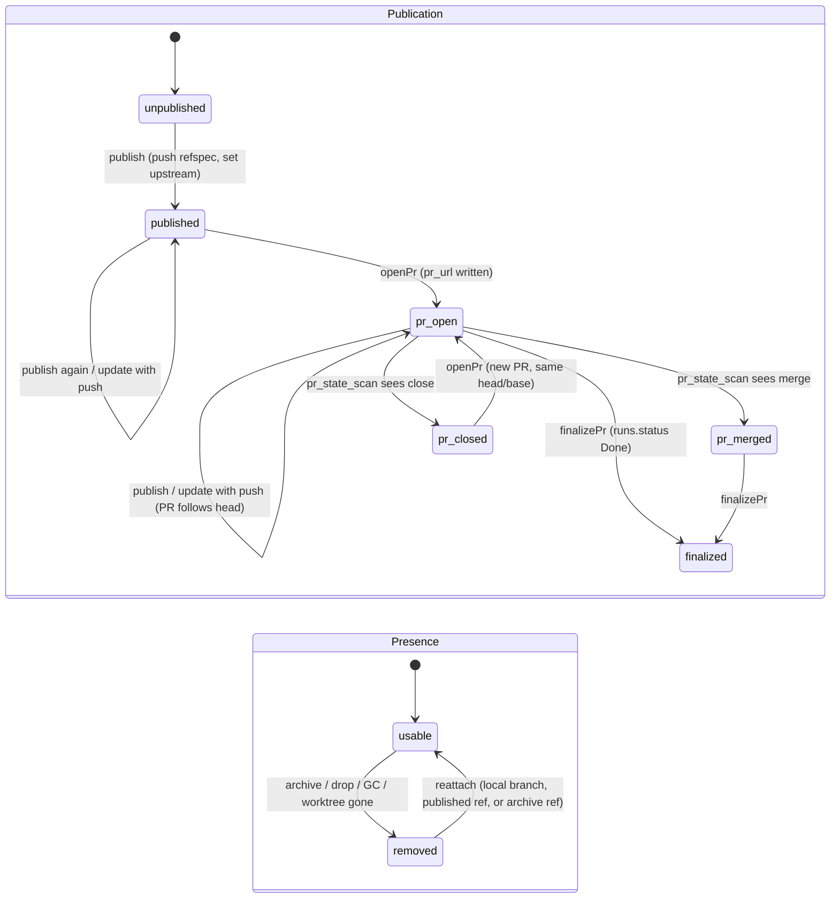
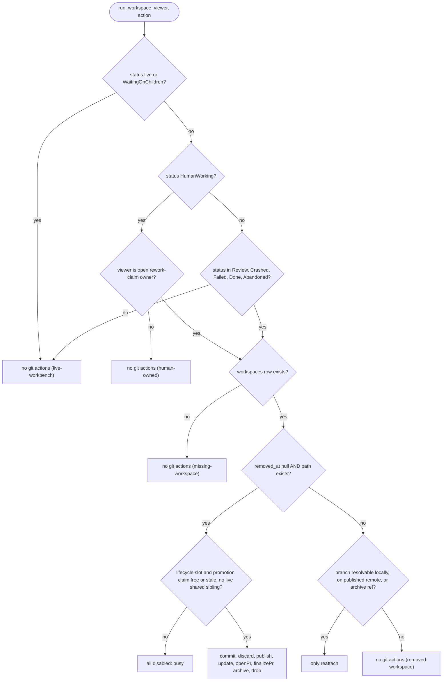
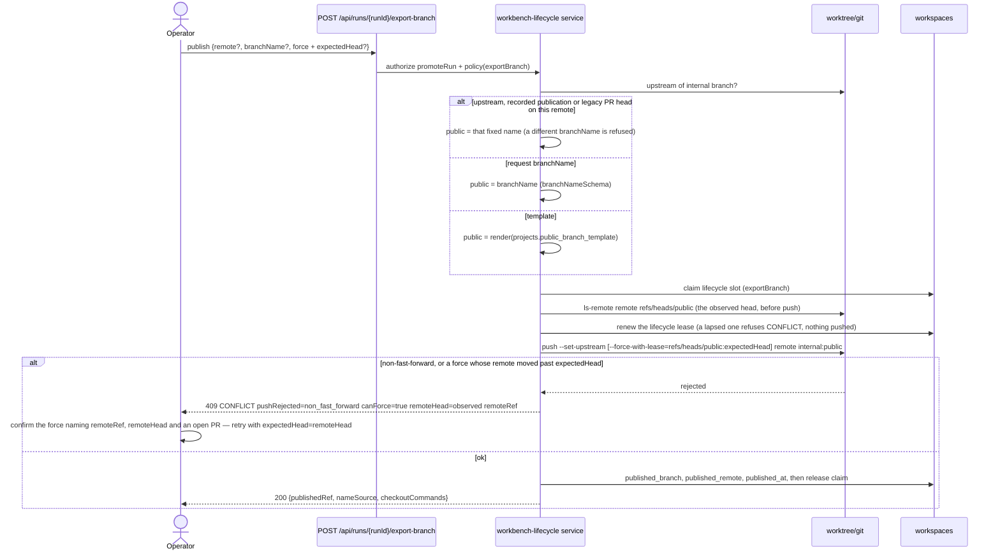
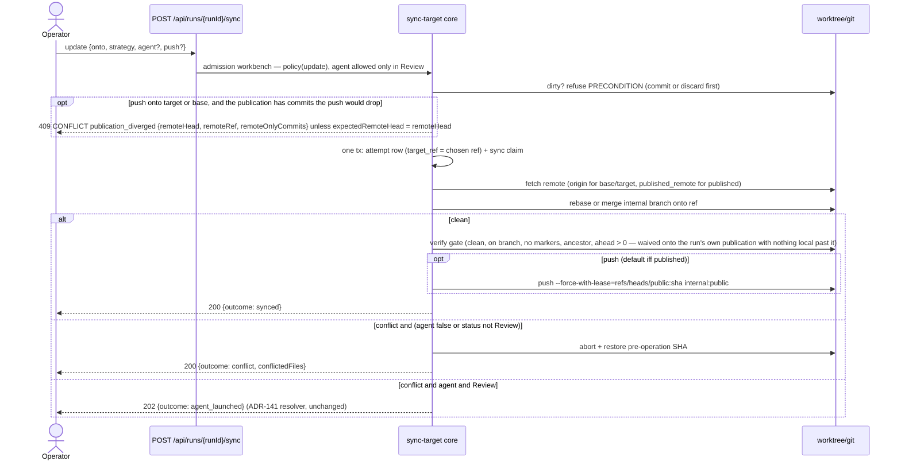
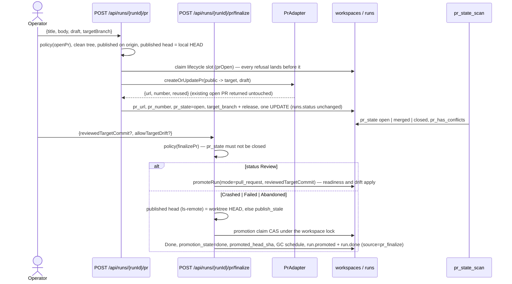
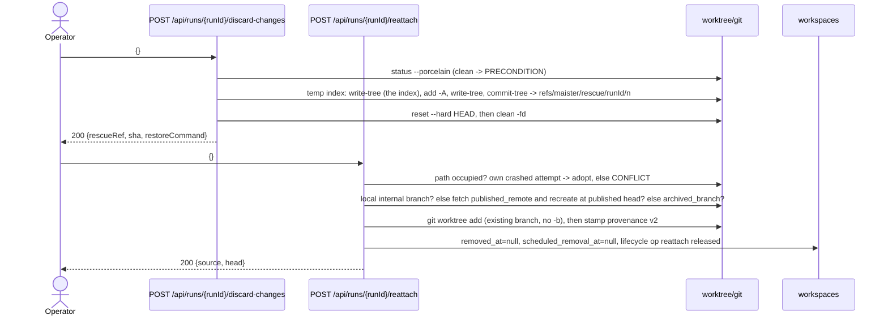

# Workbench git operations domain

> **Status: Implemented (ADR-181).** This contract replaces the status-gated
> Export dialog, the ReviewPanel sync dialog and the scratch promote block with
> one git panel per run. It reuses the workbench lifecycle claim, the ADR-141
> sync core, the ADR-049 `PrAdapter`, and the `worktree.ts` primitives; nothing
> here changes `runs.status` except the explicit PR finalize.

## Purpose

Workbench git operations are the operator's git actions on a run's worktree
whenever no agent is writing to it: commit, discard, publish under a public
branch name, update from base/target/the published remote branch, open a PR
before any promotion, finalize a PR-backed run, and re-attach a removed
worktree. The boundary is the run worktree and its branch on the host; it does
NOT cover promotion (`promoteRun`, [`workspaces.md`](workspaces.md)), the AI
conflict resolver and reopen ([`branch-sync.md`](branch-sync.md)), archive/drop
semantics ([`workbench-lifecycle.md`](workbench-lifecycle.md)), or graph
re-entry ([`run-continuation.md`](run-continuation.md)).

## Domain entities

- **Git state** — the lazy read model of one worktree, served only by
  `GET /api/runs/{runId}/git-state` and never persisted: internal branch, public
  name + published remote + `published_at`, the configured upstream, remotes,
  worktree presence, `HEAD` and the target head, dirty counts (tracked +
  untracked), unpushed commits, ahead/behind against base, target and
  `<published_remote>/<published_branch>`, the `ls-remote` head of the public
  branch and whether the remote was reachable, PR fields, the busy operation,
  the informational `hasActiveAssignment` and `hasLiveSharedSibling` flags,
  re-attach sources, rescue refs, the policy's `actions`, copyable commands,
  and `warnings` naming every sub-read that degraded to null. Shape:
  `GitStateResponse` in [`../api/web.openapi.yaml`](../api/web.openapi.yaml).
- **Internal branch** — `workspaces.branch`, the run's identity
  (`<prefix>task-<uuid>/attempt-N`, agent and scratch shapes). Never renamed.
- **Public branch** — `workspaces.published_branch` + `published_remote` +
  `published_at` (migration `0179`; co-null by CHECK): the name the branch
  carries on the remote. An existing name wins — the upstream on this remote,
  else the recorded `published_*` on it, else a pre-ADR-181 PR's head (the
  internal name on `origin`) — then the request `branchName`, then the project
  template; written only after a successful push.
- **Public branch template** — `projects.public_branch_template`, default
  `feature/{task_key}-{slug}`, mirrored as `project.public_branch_template` in
  `maister.yaml`. `{task_key}` is `<projects.task_key>-<tasks.number>` (or
  `run-<8hex>` without a task); `{slug}` is the task title transliterated
  Cyrillic → Latin by a fixed table, lower-cased, `[a-z0-9-]`, at most 40
  characters; `{attempt}` is the flow branch's `attempt-N` suffix, `1` for agent
  and scratch runs. A template must contain `{task_key}` and render a valid name
  both with a task and without one, or registration refuses it
  (`public_branch_template_invalid`); attempts of one task share their name.
- **Rescue ref** — `refs/maister/rescue/<runId>/<n>`: a detached snapshot commit
  of the dirty tree written before any discard, and by the preserve step of
  every removal (GC, archive, drop) when a path is staged and then changed
  again in the tree. When the index held something
  that tree does not (a file staged at one version and edited to another, a
  staged file since deleted), the index as it stood is the commit's second
  parent (`<ref>^2`), stash-style. Repo-scoped, survives archive/drop, not
  garbage-collected by this domain.
- **Lifecycle operation** — the shared `workspaces.lifecycle_operation_*` claim
  (see [`workbench-lifecycle.md`](workbench-lifecycle.md)). TS-only names
  `exportBranch` (publish), `sync` (update), `discardChanges`, `reattach` and
  `prOpen` sit beside `archive | drop | snapshotCommit | handoffBranch` and the
  existing crashed-run removal `discard`. A PR finalize takes the promotion
  claim (`promotion_state` / `promotion_attempt_id`), not this slot.
- **Workbench git policy** — one pure predicate (`deriveWorkbenchGitActions`)
  over facts assembled by one loader (`loadWorkbenchGitFacts`). Its output is
  the ordered action list with a disabled reason from a closed set.
- **PR fields** — `workspaces.pr_url`, `pr_number`, `pr_state`,
  `pr_has_conflicts` (ADR-140); written by open-PR and finalize, scanned by
  `pr_state_scan`.

## State machine

Transitions are operation-driven, so a state-and-action matrix stands in for
the run side. Two orthogonal workspace axes carry the git-level state.

| `runs.status` | commit / discard / publish / update / openPr | finalizePr | reattach | archive / drop |
| --- | --- | --- | --- | --- |
| `Pending`, `Running`, `NeedsInput`, `NeedsInputIdle`, `WaitingOnChildren` | no (`live-workbench`) | no (`live-workbench`) | no | no (stop paths only) |
| `HumanWorking`, viewer = rework-claim owner | yes | no (`human-owned`) | yes | no (`human-owned`) |
| `HumanWorking`, any other viewer | no (`human-owned`) | no (`human-owned`) | no | no |
| `Review`, `Crashed`, `Failed`, `Abandoned` | yes while the worktree is usable | yes while usable, with a recorded, non-closed PR | yes while NOT usable and a source resolves | yes while usable |
| `Done` | yes while usable; `update` no once promoted (`promoted`) | no (`unsupported-status`) | yes while NOT usable and a source resolves | yes while usable |
| unknown | no | no | no | no |

"Usable" = `workspaces.removed_at IS NULL` AND the worktree path exists on disk.
`busy` (a live lifecycle claim, a live promotion claim, or a shared-tree child
still writing the allocator's tree) disables every action. `update` is also
refused for a scratch run, an orchestrator child, a shared tree and a launched
evaluation participant (`unsupported-run`); `openPr` needs a publication
(`not-published`); `publish` and `openPr` need a remote (`no-remote`); `update`
with `agent:true` additionally requires `Review`.

## Process flows

**Policy** (one predicate for every git action; per-action reasons apply after
the "All" node):

**Publish** (public name, upstream, explicit-SHA lease):

**Update** (onto base | target | published, abort on conflict):

**Open PR, then finalize** (run status untouched until finalize):

**Discard** (preserve-first) and **Re-attach**:

## Route contracts

| Route | Purpose | Authz | Body |
| --- | --- | --- | --- |
| `GET /api/runs/{runId}/git-state` | Read model for the panel | `recoverRun` (member) | none |
| `POST /api/runs/{runId}/snapshot-commit` | Commit dirty work (existing) | `promoteRun` | `{commitMessage}` |
| `POST /api/runs/{runId}/discard-changes` | Rescue ref, then reset + clean (op `discardChanges`) | `promoteRun` | `{}` |
| `POST /api/runs/{runId}/export-branch` | Publish (existing route, extended) | `promoteRun` | `{remote?, branchName?, force?, snapshotDirty?, commitMessage?}` |
| `POST /api/runs/{runId}/sync` | Update (existing route, extended) | `promoteRun` | `{onto?, strategy?, agent?, push?, runnerId?}` |
| `POST /api/runs/{runId}/pr` | Open or find the provider PR | `promoteRun` | `{title?, body?, draft?, targetBranch?}` |
| `POST /api/runs/{runId}/pr/finalize` | Finalize a PR-backed run to `Done` | `promoteRun` | `{reviewedTargetCommit?, allowTargetDrift?}` (`Review` only) |
| `POST /api/runs/{runId}/reattach` | Re-create a removed worktree | `recoverRun` | `{}` |

`runId` is the only trusted locator; branch, paths, remotes, target and PR
identity are DB or git state. Strict JSON schemas reject unknown fields (400 on
the workbench routes, 422 on `sync`). Every error body carries `details`; a
policy refusal's `details.reason` is the disabled reason in snake_case (`busy`
is `CONFLICT`, the rest `PRECONDITION`), and an unknown run is 404 with
`run_not_found`. The ext twin `POST /api/v1/ext/runs/sync` keeps
`status='Review'` eligibility and has no `onto`.

## Expectations

- Every git action MUST be admitted by exactly one predicate over `runs.status`,
  the open rework-claim `owner_user_id`, `workspaces.removed_at`, worktree
  presence, the lifecycle slot and the promotion claim; a parked status is the
  no-live-writer witness and an `active` `execution_assignments` row is never an
  admission condition; unknown statuses admit nothing (enforced by
  `deriveWorkbenchGitActions`, gated by `requireActionAllowed` on every mutating
  route).
- `HumanWorking` MUST admit the git set except `archive | drop | stop |
  finalizePr` only when `viewerUserId` equals the open `review_rework_claim`
  row's `owner_user_id`; every other viewer sees `human-owned`, and cards/rail
  never expose `HumanWorking` git actions (enforced by the policy's owner arm
  and `lifecycleActionsForWorkspace`'s null viewer). Under the run's row lock
  the lifecycle claim and the sync claim MUST re-check that the actor still
  owns the open claim: a return and a re-claim between admission and claim
  keep the status `HumanWorking` but change the owner, and the former owner
  gets `PRECONDITION` `details.reason:"human_owned"` with nothing written
  (enforced by `requireReworkClaimOwner`); a system caller — the reconciler
  recording a vanished tree — names no actor and is not owner-gated.
- Every mutating action MUST run under the `workspaces.lifecycle_operation_*`
  claim, which MUST refuse a live promotion claim and decide on the admitted
  `runs.status` under the run's row lock, while `promoteRun` refuses any live
  lifecycle claim and both recovers (`resumeCrashedRun`, the scratch recover
  route) refuse `CONFLICT` `details.reason:"busy"` while either claim is live;
  two concurrent writers on one workspace MUST yield one success and one
  `MaisterError("CONFLICT")` (enforced by `claimLifecycleOperation`, the
  promotion reverse fence and `workbenchClaimHolder` — the one "who holds the
  tree" rule the facts' `busy` and both recovers read — the `workspaces` row
  lock before the `runs` row lock).
- Publish MUST push `refs/heads/<internal>:refs/heads/<public>` with
  `--set-upstream` and write `published_branch`, `published_remote`,
  `published_at` only after the push succeeded; a non-fast-forward rejection
  MUST be `CONFLICT` with `pushRejected:"non_fast_forward"`, `canForce:true` and
  the observed `remoteHead` + `remoteRef`, and a force MUST carry the confirmed
  `expectedHead` and lease exactly it, never a head re-read at retry time
  (enforced by the `export-branch` body schema, `exportWorkbenchBranch`,
  `pushBranch` and `recordPublished`, the one writer of `published_*`).
- The public name MUST resolve an existing name first (the upstream, the
  recorded `published_*`, a pre-ADR-181 PR head — each on the pushed remote)
  → request `branchName` → project template, in that order; a template that
  renders a `branchNameSchema`-invalid name MUST refuse `MaisterError("CONFIG")`,
  and the three `published_*` columns MUST be all set or all null (enforced by
  `resolvePublishName`, `renderPublicBranchName` and CHECK
  `workspaces_published_shape_check`).
- `isBranchPublished` and the rework-claim return ingest MUST read
  `published_branch`/`published_remote` before probing upstream, so a published
  branch without a PR counts as published (enforced by
  `web/lib/runs/branch-published.ts` and `rework-claim-ingest.ts`).
- Update MUST abort and restore the pre-operation SHA on any conflict unless
  `agent:true` AND `runs.status='Review'`; `agent:true` in any other status MUST
  refuse `MaisterError("PRECONDITION")`, and `agent` MUST default to `true` only
  in `Review` (enforced by `syncRunTarget`'s workbench admission).
- Open PR MUST be idempotent by `(published_branch, targetBranch)`, MUST refuse
  `PRECONDITION` when the tree is dirty, the branch is unpublished or published
  elsewhere than `origin`, or the published head differs from the local HEAD,
  MUST NOT change `runs.status`, and MUST write `pr_url`, `pr_number`,
  `pr_state='open'` only after the provider answered (enforced by
  `openPullRequest`).
- Finalize from `Review` MUST be `promoteRun(mode:'pull_request')` with the
  operator's `reviewedTargetCommit`; from `Crashed | Failed | Abandoned` it MUST
  set `runs.status='Done'`, `promotion_state='done'`, `promoted_head_sha` and
  `scheduled_removal_at`, and emit `run.promoted` + `run.done` with
  `attribution.source='pr_finalize'`; `pr_state='closed'` MUST refuse
  `PRECONDITION` (enforced by `finalizePullRequestRun` and
  `finalizeParkedPullRequest`, under the promotion claim CAS).
- Discard MUST write the rescue ref before `reset --hard` + `clean -fd` without
  touching the worktree's real index, MUST keep the index as it stood as the
  rescue's second parent whenever it differs from both `HEAD` and the rescued
  tree, MUST refuse a clean tree with
  `PRECONDITION`, and the ref MUST survive archive/drop of the workspace
  (enforced by `discardWorkbenchChanges` and `writeRescueRef`).
- Reattach MUST be admitted only while the worktree is not usable, MUST try the
  local internal branch, then `<published_remote>/<published_branch>`, then
  `archived_branch`, and MUST null `removed_at` and `scheduled_removal_at` only
  after `git worktree add` succeeded and provenance v2 is stamped (enforced by
  `reattachWorkbench`; the reconciler's `workspace_reattached` arm completes a
  crashed attempt).
- `Failed` MUST be listed wherever `Crashed` is (portfolio, project workspace
  list, rail) with its worktree TTL countdown, its worktree MUST be collected
  like a `Done` one (`gcAgeDays` after `ended_at`, preserved first) while its
  runtime objects are not, and it MUST NOT be counted by the ADR-169 attention
  counters; git state MUST be served only by its own route, never computed in a
  page RSC (enforced by `ACTIVE_RUN_STATUSES`, `WORKTREE_TTL_RUN_STATUSES` and
  the `read-model.ts` import boundary).

## Edge cases

- Project without a remote → publish and open PR are disabled (`no-remote`) and
  refused `MaisterError("PRECONDITION")`; `onto:"published"` refuses
  `not_published`; commit, discard and update onto base/target (local refs)
  still work.
- Public name exists on the remote at another head (a prior attempt) →
  `MaisterError("CONFLICT")` with `pushRejected:"non_fast_forward"` naming
  `remoteHead`; the confirmed retry sends `force:true` + `expectedHead`, and a
  remote that moved past it is the same refusal naming the new head — the local
  branch is kept and nothing is recorded. `force` without `expectedHead` (or
  the reverse) is `MaisterError("CONFIG")` (400).
- The publication carries commits the update's push would drop (a reviewer's
  fixup, a suggestion committed on the PR) → `MaisterError("CONFLICT")`
  `publication_diverged` naming the head, the ref and the count, before
  anything moves; the panel offers updating onto the publication first, or
  confirming exactly that head (`expectedRemoteHead`). Commits the update's ref
  brings anyway (a provider's "Update branch" merge) and the run's own
  commits — any head the run branch's reflog records, a rebased copy by its
  patch — do not count. A merge counts when it is not exactly what git makes of
  its two parents: it resolved a conflict or carries an edit of its own. A
  squashing PR promotion refuses the same way, before
  the squash, and releases its claim.
- A request `branchName` git would refuse (a trailing `.`, `//`, a component
  starting with `.` or ending in `.lock`) → `MaisterError("CONFIG")` (400) at the
  route, before any claim: `branchNameSchema` refuses every name
  `git check-ref-format --branch` refuses.
- A request `branchName` that differs from the name an upstream already fixes →
  `MaisterError("PRECONDITION")` `public_name_fixed`; the dialog hides the field
  when an upstream exists.
- Template renders an invalid or empty name → `MaisterError("CONFIG")`
  `public_branch_template_invalid`; the dialog falls back to the editable field.
- Provider `generic` (or no `gh`/`glab`/token) → open PR refuses
  `MaisterError("PRECONDITION")` `provider_unsupported`, exactly as
  `pull_request` promotion does (one resolution, `preflightedPrAdapter`).
- A scratch run's Open PR targets its locked branch
  (`scratch_runs.target_branch ?? base_branch`), as its promotion does; another
  target is refused `MaisterError("PRECONDITION")` `target_locked` (enforced by
  `scratchPromotionTarget`, shared with the promotion), so a later finalize from
  `Review` finds the same PR by head/base. The panel shows that target
  read-only.
- Branch published to a remote other than `origin` → open PR refuses
  `MaisterError("PRECONDITION")` `published_remote_not_origin`; cross-repository
  PRs are out of scope.
- An open PR for the same head/base already exists → it is returned untouched
  (`reused:true`); the request's title, body and draft are not applied. A
  different PR than the stored one clears the old PR's ADR-140 fields.
- PR closed on the provider → finalize refuses `PRECONDITION` `pr_closed`; open
  PR creates a new PR for the same head/base (the dedup lists open PRs only).
- Published head differs from local HEAD on open PR or finalize →
  `MaisterError("PRECONDITION")` `publish_stale` ("publish first"); a
  published branch that vanished from `origin` reads `not_published` on open PR
  and `publish_stale` on finalize.
- A shared-tree allocator finalized from `Failed` settles the tree's `Review`
  siblings with it; a sibling still writing the tree makes finalize `busy`
  (`CONFLICT`), under the policy and again under the claim's row lock.
- Dirty tree on update or open PR → `MaisterError("PRECONDITION")`
  `dirty_worktree`, naming commit and discard as remediation.
- `agent:true` outside `Review` → `MaisterError("PRECONDITION")`
  `agent_requires_review`; `onto:"base"` with no recorded base branch →
  `base_branch_unknown`.
- A promoted `Done` run's update → refused `promoted` (the ADR-141 promotion
  fence); reopen is the way back.
- Finalize body carrying `reviewedTargetCommit` / `allowTargetDrift` for a run
  that is not `Review` → `MaisterError("CONFIG")` `review_only_field` (400); the
  target advanced since the panel rendered it → `PRECONDITION` `target_drift`,
  and "Finalize anyway" sends `allowTargetDrift`.
- Git identity unresolvable → never on commit or rescue snapshot (both supply
  the default identity through `commitIdentityArgs`); it remains the
  archive/drop preservation refusal `MaisterError("CONFIG")`
  `workspace_git_identity_invalid`, nothing removed.
- Another lifecycle op (`sync`, `archive`, `drop`, …) or a promotion holds the
  worktree → `MaisterError("CONFLICT")` `busy`; the panel shows the owning
  operation from `git-state`.
- Reattach with no resolvable source (branch deleted locally and on the remote,
  no archive ref) → `MaisterError("PRECONDITION")` `no_reattach_source`; a
  directory at the worktree path that is not this run's own crashed attempt →
  `MaisterError("CONFLICT")` `worktree_path_occupied`, nothing removed.
- A reattach that crashed after `git worktree add` → its retry adopts the
  registered worktree whose provenance names the run; the reconciler holds a
  removed row with a live lifecycle claim and completes one whose stale or
  failed claim is `reattach` (`workspace_reattached`), instead of removing the
  worktree.
- `Crashed` classified `worktree-gone` with `removed_at IS NULL` → `git-state`
  reports `worktreePresent:false` and the policy admits only `reattach`.
- `ls-remote` of the public branch fails → `git-state` answers 200 with
  `remoteReachable:false`, `publishedRemoteHead:null` and a warning; the route
  never errors on a degraded sub-read.
- The remote listing or a re-attach source probe fails → `git-state` answers
  200 and names `remotes` / `reattachSources` in `warnings`; the policy reads
  the fact as not probed, so Publish, Open PR and Re-attach stay offered and the
  action re-probes (a re-attach with nothing resolvable still refuses
  `no_reattach_source`). "No source" needs every probe to have answered.
- Transient push, fetch or provider failure → `MaisterError("EXECUTOR_UNAVAILABLE")`
  (503); the claim stays retryable and no after-side row is written.
- Viewer role → `MaisterError("UNAUTHORIZED")` (403) on every route, including
  `git-state` (member level); an unknown run → 404 `run_not_found`.
- Crash between a successful push/PR/reattach and its DB write → the retry is
  idempotent: the push is a no-op, the PR is found by head/base, the worktree is
  adopted or completed by the reconciler.
- The providers' draft handling is proven at the adapter boundary (argv and the
  Gitea request body) and end to end against a fake `gh`, not against live
  GitHub / GitLab / Gitea: a Gitea-family server that ignores the `WIP:` title
  convention opens a ready PR. The live check is owner-executed (see Linked
  artifacts).
- A `Failed` worktree past its TTL is collected like a `Done` one (owner,
  2026-09-23): preserved first (a snapshot commit and `maister/archive/<runId>`),
  so the panel then offers only Reattach, which restores from that ref, and the
  run leaves the rail, portfolio and project lists. A `Failed` REUSER of a
  shared tree still holds the tree — it has no row of its own to count down —
  while a `Failed` allocator no longer holds its own.

## Linked artifacts

- ADR: [ADR-181](../decisions.md#adr-181-run-git-panel-status-independent-worktree-git-operations-public-branch-names-and-pr-before-promotion)
  (Implemented, with amendments); builds on [ADR-049](../decisions.md#adr-049-pr-promotion-via-a-hybrid-provider-pradapter-credential-model-b-reverses-the-gh-is-never-invoked-invariant),
  [ADR-140](../decisions.md#adr-140-pr-lifecycle-tracking),
  [ADR-141](../decisions.md#adr-141-branch-sync-with-ai-conflict-resolver-and-reopen),
  [ADR-148](../decisions.md#adr-148-run-workspace-lifecycle-cleanup-and-reconciliation),
  [ADR-160](../decisions.md#adr-160-review-run-rework-claim-with-fast-forward-only-handoff-round-trip),
  [ADR-166](../decisions.md#adr-166-local-execution-host-contract--durable-host-identity-epoch-fenced-assignments-command-ledger-opaque-adopted-workspaces).
- API: [`../api/web.openapi.yaml`](../api/web.openapi.yaml) (routes
  `git-state`, `discard-changes`, `pr`, `pr/finalize`, `reattach`; extended
  `export-branch` and `sync`); webhook `run.promoted.source` in
  [`../api/async/outbound-webhooks.asyncapi.yaml`](../api/async/outbound-webhooks.asyncapi.yaml).
- ERD: [`../db/runs-domain.md`](../db/runs-domain.md) (`workspaces.published_*`,
  `projects.public_branch_template` — migration `0179`).
- Error taxonomy: [`../error-taxonomy.md`](../error-taxonomy.md).
- Screens: [`../screens/runs/git-panel.md`](../screens/runs/git-panel.md).
- Related domains: [`workbench-lifecycle.md`](workbench-lifecycle.md),
  [`branch-sync.md`](branch-sync.md), [`git-integration.md`](git-integration.md),
  [`workspaces.md`](workspaces.md), [`scratch-runs.md`](scratch-runs.md),
  [`run-continuation.md`](run-continuation.md), [`attention.md`](attention.md).
- Source: `web/lib/workbench-git/{policy,facts,read-model,service,publication,public-branch-name,presence,pull-request,panel-link}.ts`,
  `web/components/workbench/git-panel{,-kit,-tree,-publish,-update,-pr,-commands,-reattach}.tsx`, the routes
  `web/app/api/runs/[runId]/{git-state,discard-changes,pr,pr/finalize,reattach}/route.ts`,
  and extensions in `web/lib/workbench-lifecycle/service.ts`,
  `web/lib/runs/{sync-target,sync-ref,sync-recovery,promote,pr-adapter,branch-published,rework-claim-ingest,revive-worktree,reopen}.ts`,
  `web/lib/gc/workspace-reconciler.ts`, `web/lib/worktree.ts`.
- Tests: `web/lib/workbench-git/__tests__/` (policy, publication, publish,
  discard, lifecycle-race, reattach, pr-finalize), the `git-state` and `pr`
  route suites,
  `sync-target.integration.test.ts`, `pr-adapter.test.ts`,
  `promote-{pr,service}.test.ts`, `git-panel.dom.test.ts`, and the e2e smoke
  `web/e2e/workbench-git.spec.ts` (fake `gh`).
- Manual live evidence (plan T4.2, owner-executed, ADR-049 style): pending —
  `gh pr create --draft` (GitHub), `glab mr create --draft` (GitLab) and the
  Gitea/GitVerse `WIP:` title against real remotes, with the provider CLI or
  server version and the outcome of: draft honoured, the second Open PR finds
  the same PR, finalize marks `Done`, `pr_state_scan` sees `open` → `merged`.
