# Workspaces domain

## Purpose

A **workspace** is the git worktree where a run executes. Every run
gets a fresh worktree under `.maister/<slug>/runs/<runId>/`, isolated
from other concurrent runs on the same project. Workspace lifecycle
covers creation, active workspace visibility, promotion, archival, and
reconciliation on host or process restart.

## Domain entities

- **Workspace row** — `workspaces` table. One row per run.
- **Worktree path** — absolute filesystem path, globally UNIQUE.
- **Branch** — derived by the launcher. Task runs use the project branch
  prefix plus a task/run slug. Scratch runs may use a validated
  operator-provided branch/workspace name.
- **Base branch** — branch selected at launch; the run branch is created from
  this branch's launch-time commit. Validated against `listBranches` before use.
- **Base commit** — the resolved launch-time commit of the base branch
  (`resolveBaseCommit`), recorded as `workspaces.base_commit` and passed as the
  `startPoint` to `git worktree add`. The run branch forks from this exact commit.
- **Target branch** — branch selected for promotion. Defaults to the base
  branch but can differ for engineer-controlled workflows. For **flow** runs M18
  relaxes the scratch hard-lock that pinned the target to the base
  (`assertPromotionTargetAllowed`). Must exist (validated on launch and promote).
- **Promotion mode** — `local_merge | pull_request` (`workspaces.promotion_mode`).
  Resolved at launch from the override chain (launch override > project
  `promotion.mode` > default `local_merge`); a per-run snapshot, not live-synced.
- **Delivery policy** (Designed, ADR-085) — typed run snapshot resolving
  project default -> launch override -> promote-time override. It supersedes
  `promotion_mode` for new Flow runs while preserving legacy compatibility:
  `local_merge` maps to `strategy=merge`, `pull_request` maps to
  `strategy=pull_request`. Scratch runs keep legacy M18 promotion semantics in
  this slice.
- **Durable promotion claim (Implemented, M18)** — the serialization point for
  idempotent promotion, held on the workspace row (1:1 with the run):
  - `promotion_state` — `none | claiming | done | failed | reopened`. CAS'd to `claiming`
    in a short tx **committed BEFORE any side-effect**; the single concurrency
    gate (not a held row lock).
  - `promotion_attempt_id` — a fresh opaque token (e.g. `crypto.randomUUID()`)
    minted on each claim. The finalize transaction is keyed on it, so a slow or
    crashed attempt whose token was re-minted by a stale reclaim cannot
    double-finalize.
  - `promotion_claimed_at` — claim timestamp; a `claiming` row older than
    `MAISTER_PROMOTION_CLAIM_TIMEOUT_SECONDS` (default 300) is reclaimable.
  - `promotion_owner_user_id` — actor who claimed the promotion.
  - `pr_url` / `pr_number` — recorded on a successful `pull_request` promotion
    (**Implemented, M18**); `pr_url` is also the
    idempotency key that turns a re-promote into a PR update rather than a
    duplicate.
  - `promoted_at` — set in the finalize tx alongside `runs.status = Done`.
- **Parent repo** — `projects.repo_path`. The worktree shares `.git`
  with the parent.
- **Active workspace group** — Implemented. The left rail groups active Flow
  and scratch workspaces by project. Each group shows project name, active
  count, latest activity, and a project-scoped scratch `+` action.
- **Active workspace row** — Implemented. A visible run/workspace row with
  branch or scratch name, run kind, executor profile, launched-by user, status
  label, status dot, relative time, and run/scratch detail link.
- **Read-only range git ops (M11b — Implemented)** — `logRange`
  (`git log <base>..<branch>`), `diffRange` (`git diff <base>..<branch>`), and
  `resolveBaseRef` (`git merge-base <mainBranch> <branch>`) in
  `web/lib/worktree.ts`, used by the manual-takeover return to capture the
  human's commits + diff against the existing worktree. No merge, push, or
  checkout-switch. See [`manual-takeover.md`](manual-takeover.md).
- **PR lifecycle state (Implemented, ADR-140)** — five workspace columns track the
  provider state of a MAIster-created PR (`workspaces.pr_url`), polled by the
  `pr_state_scan` scheduler job (provider CLI/REST only — no git mutation, zero
  agent tokens): `pr_state` (`open | merged | closed`, NULL = never checked),
  `pr_has_conflicts` (NULL = unknown), `pr_merged_at`, `pr_merge_commit_sha`
  (the **provider** merge commit — provenance only, NEVER `runs.merge_commit_sha`,
  which stays owned by the ADR-134 delivery scan). `pr_state` is written ONLY from
  a SUCCESSFUL read — a failed one (including a 404, which may be a permission
  denial rather than a deleted PR) leaves it untouched. Each state edge emits a
  webhook and the merged edge also writes a `run_pr_merged` task-activity entry;
  the conflict flag raises the reopen affordance. Scan cadence, edge guards, and
  provider reads live in [`branch-sync.md`](branch-sync.md) (R7).
- **Reopen (Implemented, ADR-141)** — a `Done` top-level (`parent_run_id IS NULL`)
  `flow | agent` run whose PR is still open or conflicted can be flipped
  `Done → Review`, which sets `workspaces.promotion_state = 'reopened'` (an
  app-level value, no PG CHECK), clears `scheduled_removal_at`, and re-stamps
  `runs.review_entered_at`. `reopened` is reclaimable by `promoteRun` but is
  EXCLUDED from auto-promotion; a GC'd worktree is re-attached to the existing
  run branch (no `-b`). Reopen flow detail lives in
  [`branch-sync.md`](branch-sync.md) (R7).
- **Sync lifecycle claim (Implemented, ADR-141)** — "sync with target" is a 6th
  `workspaces.lifecycle_operation_name` value `sync` (app-level, no PG CHECK)
  claiming the existing `lifecycle_operation_*` slot, so it is mutually exclusive
  with `archive | drop | exportBranch | snapshotCommit | handoffBranch` for free.
  Because promotion and lifecycle claims do not otherwise cross-guard, an explicit
  **double fence** is added: the sync claim tx refuses when
  `promotion_state ∈ {claiming, done}` (unless `reopened`), and `promoteRun`'s
  claim tx refuses when an active `lifecycle_operation_name = 'sync'` claim exists.
  The sync pipeline, attempt ledger (`run_sync_attempts`), and AI conflict
  resolver session are specified in [`branch-sync.md`](branch-sync.md) (R7 — not
  restated here).

## Lifecycle state machine

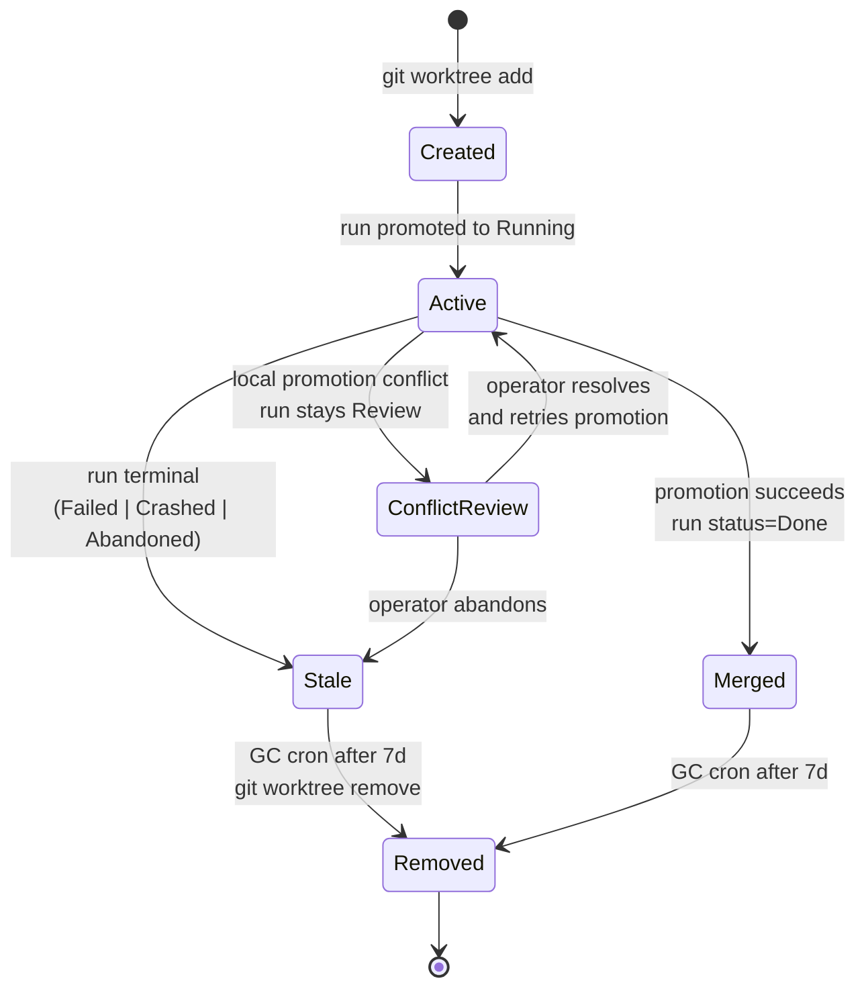

### M19 graceful GC lifecycle (Designed)

M19 ([ADR-035](../decisions.md#adr-035)) refines the terminal tail of the
lifecycle above into a **preserve-then-prune** countdown. On the `Abandoned`/
`Done` transition the run stamps `workspaces.scheduled_removal_at = ended_at +
MAISTER_GC_AGE_DAYS` (default 14); the worktree then sits in a TTL countdown,
is **archived** (preserved) by the GC sweep, and only then **pruned**. Full GC
domain detail — both delivery surfaces, the cron route, and the preserve
flowchart — lives in [`reconciliation-gc.md`](reconciliation-gc.md). The GC
state is **derived** from `scheduled_removal_at`, `archived_at`, and
`removed_at` (no `gc_state` enum column).

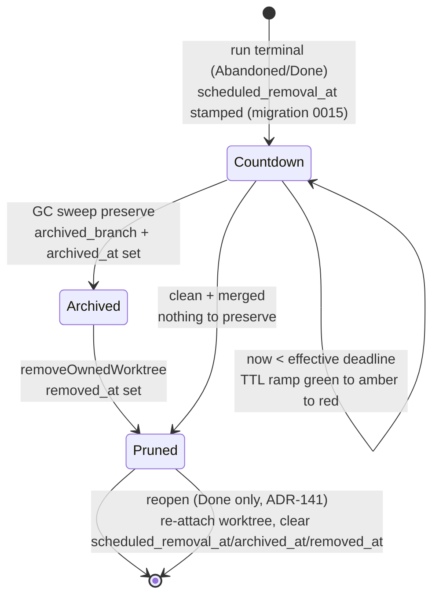

## Process flows

### Create a worktree (Implemented)

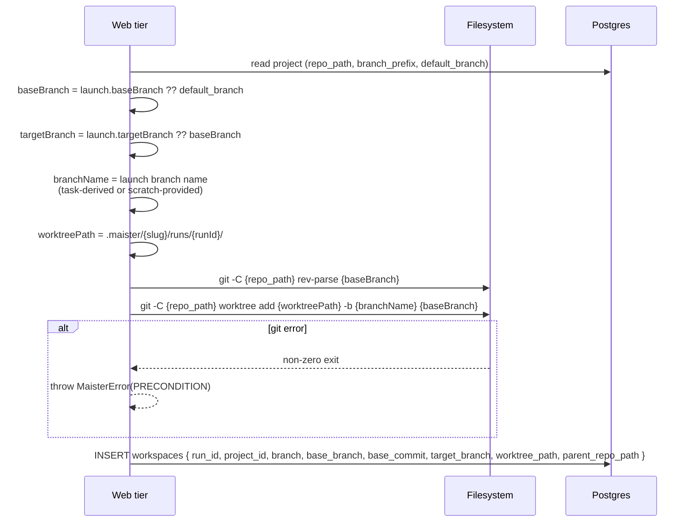

### Promote on Review — shared service over both run kinds (Implemented, M18)

Promotion is the product action after `Review`. M18
([ADR-058](../decisions.md#adr-058-branch-targeting-at-launch-shared-promotion-service-promote-time-readiness-re-gate-m18m15-carve))
introduces a **shared `promoteRun` service** that drives **both** scratch and
flow run kinds for `local_merge`; the `pull_request` mode
([ADR-049](../decisions.md#adr-049-pr-promotion-via-a-hybrid-provider-pradapter-credential-model-b-reverses-the-gh-is-never-invoked-invariant))
is **Implemented (M18)**. Both modes terminate at the existing
`Done` (no new `runs.status`). The service is retry-safe through a **durable
promotion claim**: a fresh `promotion_attempt_id` is minted and
`promotion_state` is CAS'd to `claiming` in a short transaction **committed
BEFORE any git/PR side-effect**, then the side-effect runs with **no lock
held**, then a finalize transaction **keyed on the attempt token** flips `Done`.
The claim — not a held row lock — is the single serialization point
(§ *Concurrent promote & stale-claim reclaim* below).

#### `local_merge` promotion (Implemented, M18)

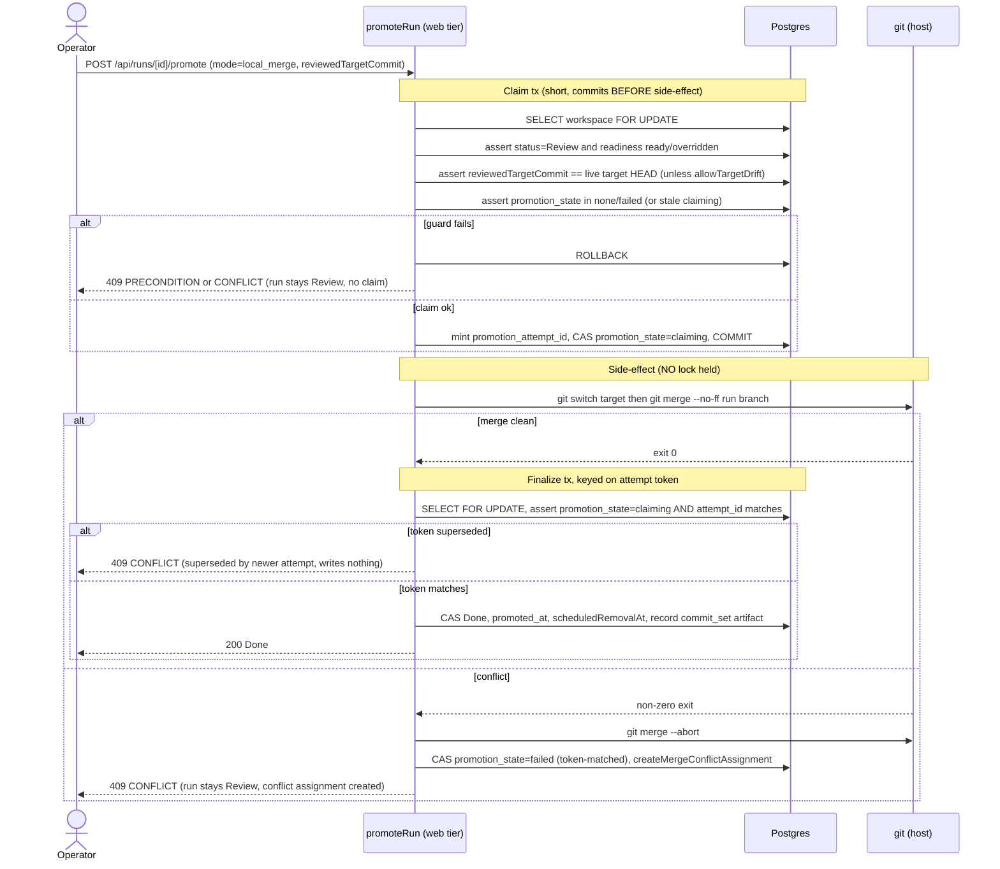

#### `pull_request` promotion (Implemented, M18)

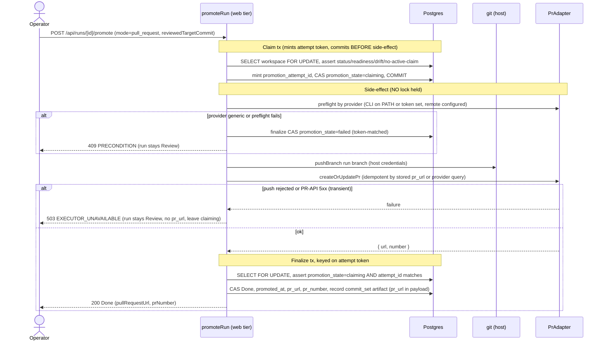

#### Promotion outcomes (Implemented, M18; both `local_merge` and `pull_request` rows)

| Outcome | HTTP | Run / claim effect |
|---------|------|--------------------|
| Success (`local_merge` clean / PR created-or-updated) | 200 | `runs.status = Done`, `promotion_state = done`, `promoted_at` set; PR mode adds `pr_url`/`pr_number` |
| Readiness not ready/stale | 409 `PRECONDITION` | no claim; run stays `Review` (retry after gate passes/overridden) |
| Target advanced since review (drift, no override) | 409 `PRECONDITION` | no claim; run stays `Review` (re-review, then `allowTargetDrift`) |
| Target branch invalid/missing | 409 `PRECONDITION` | run stays `Review` |
| `local_merge` conflict | 409 `CONFLICT` | `promotion_state = failed`; run stays `Review` + conflict assignment (no auto-resolve) |
| PR preflight fail (CLI/token/remote missing, `generic` provider) | 409 `PRECONDITION` | `promotion_state = failed`; run stays `Review` |
| Concurrent promote (a fresh active `claiming` already present) | 409 `CONFLICT` | unchanged; wait for the in-flight promotion |
| Push rejected / PR-API 5xx (transient) | **503 `EXECUTOR_UNAVAILABLE`** | leaves `claiming`; run stays `Review`, **no `pr_url`**; idempotently retryable |
| Finalize superseded by a same-user stale reclaim | 409 `CONFLICT` | superseded attempt writes NOTHING; the reclaiming attempt owns finalize |
| Already `Done` / non-`Review` (retry after success) | 409 | terminal — no re-attempt |

No new `MaisterError` code is added — the closed union
([ADR-008](../decisions.md#adr-008-typed-error-taxonomy-maistererror)) already
covers `PRECONDITION`, `CONFLICT`, and `EXECUTOR_UNAVAILABLE`.

#### Delivery-policy promotion (Designed, ADR-085)

New Flow runs snapshot a `DeliveryPolicy`:

```ts
type DeliveryPolicy = {
  strategy: "merge" | "rebase_merge" | "pull_request" | "ai_rebase_merge";
  push: "never" | "on_success";
  trigger: "manual" | "auto_on_ready";
  targetBranch?: string;
};
```

Promotion still uses the M18 durable claim and per-attempt token. Policy changes
only choose the side-effect path and the default UI selection:

| Strategy | Side effect | Claim/finalize model |
| --- | --- | --- |
| `merge` | `git merge --no-ff` from run branch into target branch | Existing `local_merge` claim, readiness re-gate, target-drift token, conflict assignment, finalize CAS. |
| `pull_request` | Push run branch and create/update provider PR/MR | Existing PR claim and idempotent PR lookup/update. |
| `rebase_merge` | Rebase run branch onto target, then merge | Same claim and finalize token; on conflict abort/restore and surface command/path/status. |
| `ai_rebase_merge` | Rebase run branch onto target, resolver-backed (ADR-141, Implemented) | Clean rebase → finalize to `Done` exactly like `rebase_merge`. Conflict → delegate to the branch-sync AI resolver under the **sync** lifecycle claim (NOT the promotion claim, so no promotion crash window); with `autoFinalize=false` (default) the run returns to `Review` for a manual clean re-promote (two-step), with `autoFinalize=true` a best-effort chained `promoteRun(rebase_merge)` finalizes to `Done` (failure degrades to the clean-`Review` two-step, benign W6). See [branch-sync.md](branch-sync.md). |

`push=on_success` means push the successfully delivered target or run branch only
after the local side-effect succeeds. Push rejection is a degradation/refusal
state surfaced with the failing command and path context; it never silently
marks the run `Done` unless the Phase A contract for that exact strategy says
local success is final.

`trigger=auto_on_ready` fires only from `Review` after the readiness gate is
ready/overridden. If readiness is stale/not-ready or any command fails, the run
stays `Review`, the policy degrades to manual for that run, and the UI shows the
typed reason. The run-detail banner can cancel auto-delivery by CAS-ing the run
snapshot from `auto_on_ready` to `manual`; project defaults are untouched.

#### Concurrent promote & stale-claim reclaim (Implemented, M18)

The durable claim + per-attempt token guarantees **exactly one side-effect** per
promotion even under concurrency and crash. Two mechanisms compose: the
attempt-token CAS prevents a **double finalize**; the stored `pr_url` (+ a
provider query) prevents a **double side-effect** for PR mode (**Implemented,
M18**). A `local_merge` re-merge of an already-merged
source is a no-op (`Already up to date`).

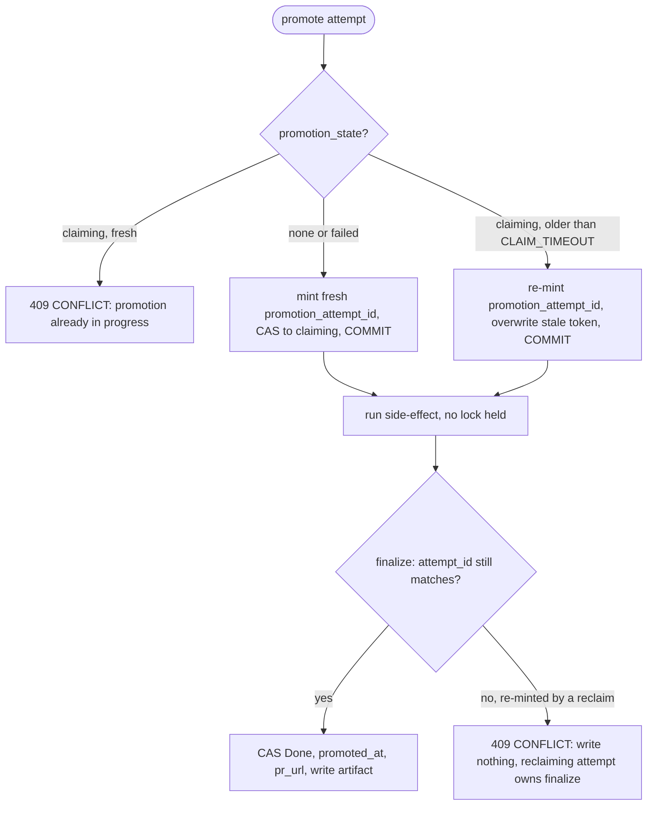

Two crash windows live **between the claim commit and the finalize commit**,
recovered by the timeout reclaim + idempotent side-effect (no held lock, no
background sweeper):

- **`local_merge`** — the target may already carry the `--no-ff` merge commit
  while the run is still `Review`, `promotion_state = claiming`. Once the claim
  ages past `MAISTER_PROMOTION_CLAIM_TIMEOUT_SECONDS`, a re-promote reclaims it;
  the re-merge is a no-op and the attempt finalizes `Done`.
- **`pull_request`** (**Implemented, M18**) — the PR may
  be pushed/created while `pr_url` is not yet stored, `promotion_state =
  claiming`. The reclaiming re-promote's `createOrUpdatePr` detects the existing
  PR for `(run branch → target)` via the provider (`gh pr list --head` / `glab
  mr list` / Gitea `GET …/pulls`) and **updates instead of duplicating**, then
  finalizes. `pr_url`/`promoted_at` are AFTER-side writes, so a crash never
  strands a half-recorded PR.

A stale reclaim **re-mints** `promotion_attempt_id` and overwrites the prior
token, so even if the crashed/slow original attempt later resumes, its finalize
CAS no longer matches and is refused `409 CONFLICT` — a second `Done` or `pr_url`
is impossible.

### Reconciliation on startup (Designed)

Compares three sources of truth:

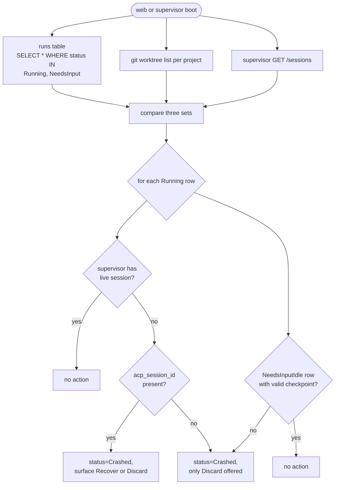

> M19 ([ADR-033](../decisions.md#adr-033)) makes this reconcile **allow-list
> `Running`-only** and adds a grace guard plus a retry-safety split (read-only
> `check`/`judge` gate nodes re-dispatch; `cli` nodes crash). The
> "runs vs `git worktree list`" branch becomes the `worktree-gone → Crashed`
> classification. The full classifier and the GC lifecycle live in
> [`reconciliation-gc.md`](reconciliation-gc.md).

### Project-grouped active workspaces (Implemented)

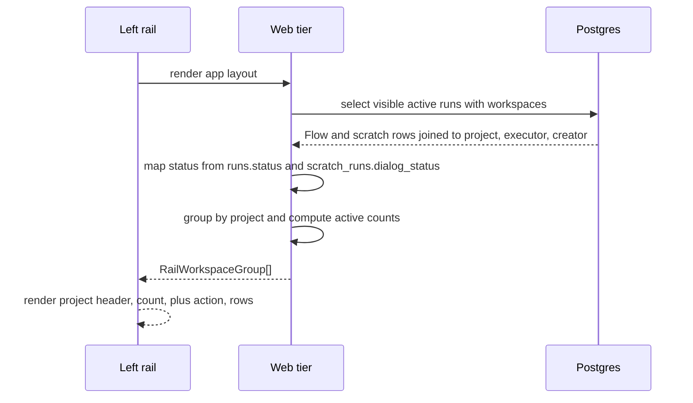

Active workspace rows use `runs.status` for Flow rows and combine
`runs.status` with `scratch_runs.dialog_status` for scratch rows. Scratch
`WaitingForUser` is displayed as its own label even though the shared
`runs.status` remains `Running`.

### Garbage collection

A cron route GCs worktrees older than 7d in terminal state.

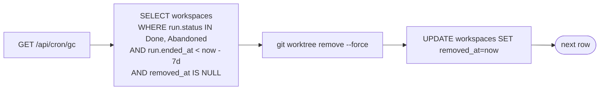

### M19 preserve-then-prune GC (Designed)

M19 ([ADR-035](../decisions.md#adr-035)) replaces the single-step removal above
with a graceful, destructive-safe sweep delivered BOTH as a background
`globalThis`-singleton sweeper (`MAISTER_GC_SWEEP_INTERVAL_SECONDS`, default
3600) and the token-guarded cron route. The candidate select uses the
**effective deadline** so pre-0015 terminal runs (null `scheduled_removal_at`)
are still collected. Every removal is gated on preserve success; GC archives a
branch, it NEVER merges to main/target.

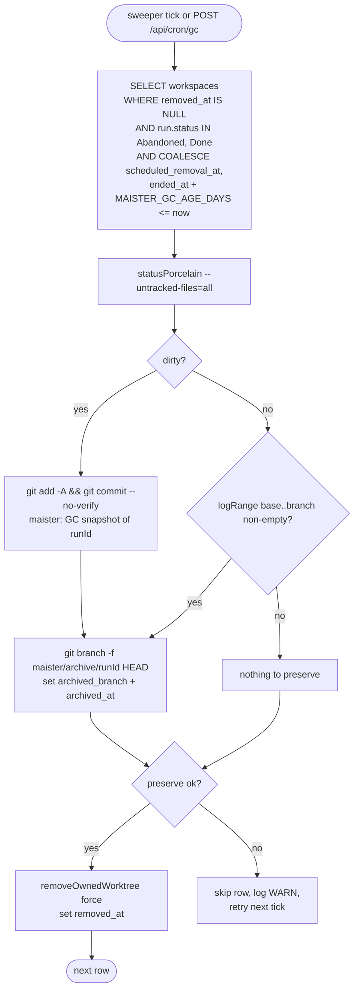

### M19 worktree TTL color ramp (Designed)

Read models surface a derived `ttlState` for `Abandoned`/`Done` workspaces so
the portfolio rail, board, and run-detail can render a countdown to GC removal.
The effective deadline mirrors the GC sweep exactly:
`effectiveRemovalAt = scheduled_removal_at ?? (ended_at + MAISTER_GC_AGE_DAYS)`.

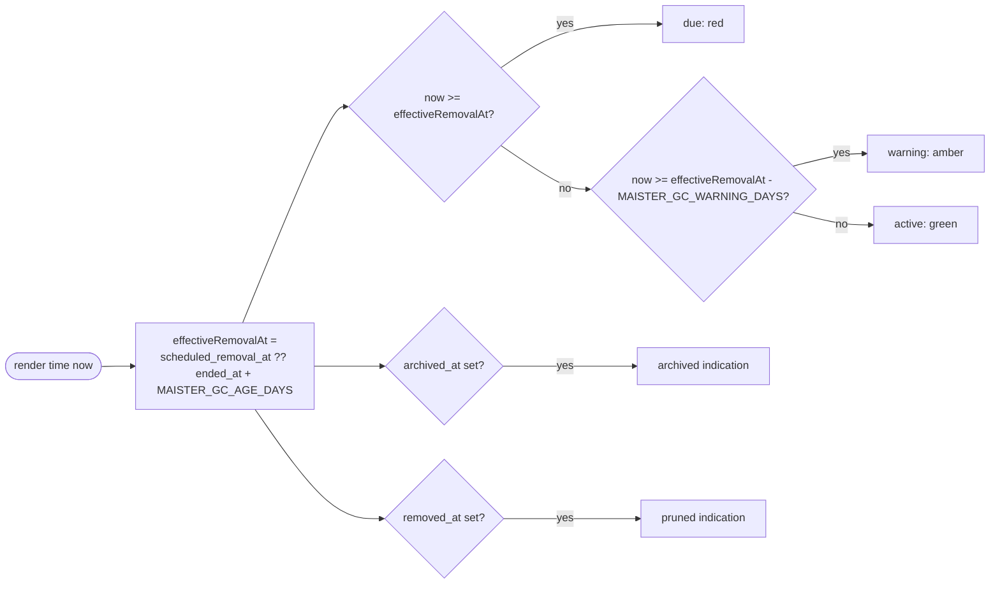

## Expectations

- Exactly one worktree per run, rooted at
  `.maister/<slug>/runs/<runId>/`; no cross-project bleed.
- Standalone agent package materialization is session-owned even when the cwd is
  shared: per-run ownership and a cwd index prevent one terminal run from
  deleting another run's adapter files. The `runs.agent_workspace` snapshot,
  not a mutable agent definition, selects terminal cleanup behavior.
- `workspaces.worktree_path` is globally UNIQUE across all projects;
  enforced at the DB layer.
- Branch names are validated before reaching `git worktree add ... -b`; task
  runs are generated from server state and scratch runs may use a validated
  launch-time name.
- Launch can select `base_branch` and optional `target_branch`.
  `target_branch` defaults to `base_branch`; `base_branch` defaults to
  `project.default_branch`.
- Worktree creation records `base_branch`, `base_commit`,
  `branch`, `target_branch`, and promotion mode in the run ledger. Runs are not
  hard-coded to start from or promote to `main`.
- Worktree creation runs preconditions (clean parent, branch free,
  path free) BEFORE the `git worktree add` call; failure throws
  `PRECONDITION` with no filesystem side effect.
- Worktree shares `.git` with the parent repo at
  `projects.repo_path`; the parent is the single source of truth.
- Local promotion merge policy is `git merge --no-ff` ONLY; conflict always
  invokes `git merge --abort`, leaves the run in `Review`, and creates a
  manual-resolution assignment.
- **(Implemented, M18)** A **flow** run MUST be promotable from `Review` through
  the shared `promoteRun` service; `local_merge` finalizes at the existing `Done`
  (no new `runs.status`) and the scratch path stays behavior-identical
  (regression-pinned). `pull_request` also finalizes at `Done`.
- **(Implemented, M18)** Promotion MUST be idempotent: a fresh `promotion_attempt_id`
  is minted and `promotion_state` is CAS'd to `claiming` and **committed BEFORE**
  any git/PR side-effect; the finalize tx is keyed on that token so a superseded
  attempt writes NOTHING. `pr_url` is the PR dedup key (re-promote
  updates, never duplicates).
- **(Implemented, M18)** Two concurrent promotes of the same run MUST yield exactly
  ONE side-effect — one `Done`, one `409 CONFLICT`; a `claiming` claim older than
  `MAISTER_PROMOTION_CLAIM_TIMEOUT_SECONDS` is reclaimable and re-minting the
  token blocks a crashed/slow original from double-finalizing.
- **(Implemented, M18)** Promotion MUST refuse `PRECONDITION` (no claim, run stays
  `Review`) when readiness is not ready/stale (`assertEvidenceReady(runId,
  "review")`, overridden gates satisfy it) or when the target advanced since
  review (`reviewedTargetCommit` ≠ live target HEAD) unless `allowTargetDrift`.
- **(Implemented, M18)** Pull-request promotion is provider-dispatched through the
  hybrid `PrAdapter` (github→`gh`, gitlab→`glab`, gitea+gitverse→Gitea REST API,
  generic→`PRECONDITION`); PR creation MUST be idempotent (existing PR updated, not
  duplicated). The provider boundary (`gh`/`glab` exec + Gitea-API `fetch`) is
  MOCKED in CI and exercised live in manual verification (see
  [`git-integration.md`](git-integration.md)).
- Full Flow reconciliation across Next.js boot, supervisor boot, git worktrees,
  and live sessions is designed. Scratch recovery is implemented through the
  explicit recover route for crashed scratch sessions.
- GC removes worktrees of runs in `Done | Abandoned` older than 7 d;
  GC failures log and continue without setting `removed_at`.
- **(Designed, M19)** GC MUST select terminal candidates by
  `COALESCE(workspaces.scheduled_removal_at, runs.ended_at + MAISTER_GC_AGE_DAYS) <= now()`
  (default age 14 d) and MUST preserve before pruning: dirty tracked + untracked
  state is snapshot-committed onto `maister/archive/<runId>`, and
  `removeOwnedWorktree` runs ONLY when preserve succeeds. See
  [`reconciliation-gc.md`](reconciliation-gc.md).
- **(Designed, M19)** GC MUST NOT merge into main/target; preservation is the
  archive branch (+ optional push when `MAISTER_GC_ARCHIVE_PUSH=true`, default
  `false`) only.
- **(Implemented, M27)** Operator archive/drop/export/snapshot/handoff actions
  use the same workspace row and preserve/remove helpers but are explicit UI
  lifecycle actions, not background GC. Their allow-list, durable operation
  claim, and trust boundary live in
  [`workbench-lifecycle.md`](workbench-lifecycle.md).
- Workspace lifecycle ends at `Removed`; rows are NEVER hard-deleted —
  `removed_at` is set instead.
- Active workspace rail groups MUST include both `flow` and `scratch` runs
  visible to the current user and MUST keep task board queries filtered to
  `runs.run_kind = 'flow'`.
- Active workspace status labels MUST distinguish `Running`,
  `WaitingForUser`, `NeedsInput`, `NeedsInputIdle`, `HumanWorking`, `Review`,
  and `Crashed`; `WaitingForUser` is scratch-specific and maps from
  `scratch_runs.dialog_status` while `runs.status = 'Running'`.
- Each project group MUST expose a scratch launch `+` action with that project
  preselected and MUST show launched-by display when `runs.created_by_user_id`
  or legacy scratch creator metadata is available.
- **(Implemented, M11b)** The manual-takeover return reads the EXISTING worktree
  through read-only range ops (`logRange`/`diffRange`/`resolveBaseRef`) ONLY; it
  creates NO new branch/target/PR and performs no push, merge, or
  checkout-switch (the worktree is already on the run branch). A failed git op
  raises `CONFLICT`. See [`manual-takeover.md`](manual-takeover.md).
- **(Implemented, ADR-141)** A `sync` lifecycle claim and a `promoteRun` promotion
  claim MUST be mutually exclusive on the same workspace: the sync claim refuses
  `CONFLICT` when `promotion_state ∈ {claiming, done}` unless it is `reopened`,
  and `promoteRun` refuses when an active `lifecycle_operation_name = 'sync'`
  claim exists — the double fence is enforced and tested in both directions.

## Edge cases

- **`PRECONDITION`** — dirty parent repo (uncommitted changes), branch
  already exists, worktree path already exists.
- **Worktree path collision across projects** — globally UNIQUE
  enforcement at the DB layer.
- **Parent repo deleted** — reconciliation flags every active run on
  the project as `Crashed`; project transitions to a degraded state
  (Phase 2 will define).
- **`CONFLICT`** — `git merge --no-ff` exited non-zero. Run stays
  `Review`, worktree stays Active, parent repo is restored via
  `git merge --abort`. **(Implemented, M18)** a stale-claim reclaim that finalizes
  after a same-user re-mint also surfaces `CONFLICT` ("superseded by a newer
  attempt") and writes nothing.
- **`git worktree remove` fails** (locked worktree, missing dir) — GC
  logs and continues; row stays without `removed_at`. Operator can
  force-cleanup manually.
- **(Implemented, M18) Concurrent promotions of the same run** — serialized by the
  durable `promotion_state` claim keyed on `promotion_attempt_id` (committed
  before the side-effect); exactly one finalizes `Done`, the other gets `409
  CONFLICT`. Supersedes the prior single-writer assumption.
- **(Implemented, M18) Target advanced since review (drift)** — `reviewedTargetCommit`
  ≠ live target HEAD → `PRECONDITION`. **(Implemented, M18)** the panel re-renders against
  the new HEAD and offers "Promote anyway" (`allowTargetDrift`).
- **(Implemented, M18) Crash between claim and finalize** — a durable
  `promotion_state='claiming'` row; reclaimable past
  `MAISTER_PROMOTION_CLAIM_TIMEOUT_SECONDS`, the idempotent side-effect makes the
  re-promote a no-op (local merge) — or a PR update (provider query) for
  `pull_request` — then it finalizes `Done`.
- **(Implemented, M18) Legacy pre-M18 workspace (null branch metadata)** — promote
  derives fallbacks (`target_branch ?? project.default_branch`, diff base via
  `resolveBaseRef`) or refuses `PRECONDITION` ("relaunch to promote"); never a
  silent null into git.
- **(Implemented, M27) Concurrent lifecycle action** — archive/drop/export/
  snapshot/handoff are serialized by `workspaces.lifecycle_operation_*`. A
  losing claim returns `409 CONFLICT`; a transient push failure leaves the
  operation retryable rather than marking promotion done.

## Implemented: delivery-root evidence and worktree provenance (ADR-134)

**Status: Implemented.** A workspace remains the mutable worktree lifecycle row;
final delivery evidence belongs to `runs` because a shared workspace can serve
several runs. An own workspace's promoted run is its delivery root. In shared
mode exactly one root run owns the tree-level SHA/stat and its run kind bucket;
sibling rows stay null rather than receiving a fabricated line split. The same
root owns a shared-tree PR's body and provisional source head; all tree children
settle together, but only that root can receive scanner-finalized evidence.

Every common worktree-creation path (flow, scratch, and worktree agent)
atomically write managed run metadata, enable Git worktree configuration, and
install the worktree-local trailer hook/template. Shared-worktree reuse keeps
root metadata; entering a graph node may update only the optional Node pointer.
GC can remove a worktree without removing persisted final evidence. Installation
failure compensates the new branch/worktree before it returns a typed error.

## Linked artifacts

- ADRs: [ADR-011 Workspace lifecycle](../decisions.md#adr-011-workspace-lifecycle-via-git-worktree),
  [ADR-012 Local promotion merge policy](../decisions.md#adr-012-local-promotion-merge-policy---no-ff-abort-on-conflict),
  [ADR-058 Branch targeting + shared promotion + promote-time readiness re-gate](../decisions.md#adr-058-branch-targeting-at-launch-shared-promotion-service-promote-time-readiness-re-gate-m18m15-carve)
  (Implemented, M18),
  [ADR-049 PR promotion via a hybrid provider `PrAdapter`](../decisions.md#adr-049-pr-promotion-via-a-hybrid-provider-pradapter-credential-model-b-reverses-the-gh-is-never-invoked-invariant)
  (Implemented, M18),
  [ADR-140 PR lifecycle tracking](../decisions.md#adr-140-pr-lifecycle-tracking)
  (Implemented),
  [ADR-141 Branch sync with AI conflict resolver and reopen](../decisions.md#adr-141-branch-sync-with-ai-conflict-resolver-and-reopen)
  (Implemented).
- ERD: [`../db/runs-domain.md`](../db/runs-domain.md) (workspaces table — base/
  target/promotion claim columns from M18, lifecycle operation claim columns
  from M27, and the Implemented ADR-140 PR-state columns + ADR-141
  `run_sync_attempts` ledger).
- Config reference: [`../configuration.md`](../configuration.md)
  (`promotion.mode`, `MAISTER_PROMOTION_CLAIM_TIMEOUT_SECONDS`).
- Related: [`runs.md`](runs.md) (flow `Review → Done` promotion path),
  [`branch-sync.md`](branch-sync.md) (Implemented — PR lifecycle scan, target
  sync, AI conflict resolver, reopen; ADR-140/141),
  [`projects.md`](projects.md),
  [`git-integration.md`](git-integration.md) (push + provider PR dispatch),
  [`workbench-lifecycle.md`](workbench-lifecycle.md) (operator stop/archive/
  drop/snapshot/export/handoff actions),
  [`artifacts.md`](artifacts.md) (promotion `commit_set`/`diff` artifact),
  [`workbench.md`](workbench.md) (M22 — the worktree is the **tracked-file
  source** for the read-only file-tree + base→run diff).
- Source: `web/lib/worktree.ts`; scratch recovery routes under
  `web/app/api/scratch-runs/[runId]/recover/`. **(Implemented, M18)**
  `web/lib/runs/promote.ts` (shared `promoteRun`), `web/lib/runs/pr-adapter.ts`.
  Full Flow reconciliation remains designed.

## Auto-promotion lanes (ADR-126, Implemented)

### Purpose

Auto-promotion lanes remove the human click on `promoteRun` for **project-scoped,
path/content-bounded diff classes** while changing nothing else about promotion.
A system sweep (`auto_promote` scheduler job) evaluates every `Review` flow run
each tick and, when the run's whole diff falls inside exactly one enabled lane
(`docs | tests | deps | config`) and readiness is green, promotes it through the
**same** `promoteRun` choke point used by humans. Everything outside an enabled
lane behaves exactly as today. The boundary of this section is the lane
config, the eligibility predicate, the sweep, and the promotion attribution
delta; it does NOT touch readiness, gate, delivery-policy, or `promoteRun`
merge/PR semantics (those live above and in [`readiness.md`](readiness.md) /
[`execution-policy.md`](execution-policy.md)). Everything here is **Designed**.

### Domain entities

- **Auto-promotion config** — `projects.auto_promotion` jsonb (validated by
  `autoPromotionConfigSchema`). NULL ⇒ shipped defaults with the master toggle
  OFF; malformed ⇒ treated as disabled (fail-closed). See ERD
  [`../db/runs-domain.md`](../db/runs-domain.md).
- **Lane** — one of `docs | tests | deps | config` with `enabled`, optional
  `mode`, `delayMinutes` (default 10), `requireExternalCheckId`, and
  `excludeGlobs`. Fixed built-in path-glob sets per class; `BUILT_IN_LANES` ships
  all four enabled.
- **Hard deny-list** — `HARD_DENY_GLOBS`, a non-configurable security boundary
  (`.github/workflows/**`, `.env*`, `maister.yaml`, `CLAUDE.md`/`AGENTS.md`/
  `GEMINI.md`, `.claude/**`/`.codex/**`/`.agents/**`/`.ai-factory/**`), evaluated
  before lane matching against both `path` and rename `oldPath`.
- **Promotion hold** — `runs.promotion_hold` jsonb
  (`{source:'user'|'system'|'launch', reason?, createdAt}`); NULL ⇒ no hold.
  Never cleared by state transitions (survives rework).
- **Review anchor** — `runs.review_entered_at` timestamptz, stamped at every flow
  Review-flip, read by PK, consumed by no domain-event consumer; the grace-window
  origin. NULL ⇒ fail-closed.
- **Promotion lane marker** — `workspaces.promotion_lane` text, written by
  `promoteRun` finalize when the input carries auto-promotion attribution; the
  queryable "auto" glyph datum.
- **Evaluation verdict** — `AutoPromotionEvaluation`, the discriminated result of
  the ONE shared `evaluateAutoPromotion` function (the sweep decision AND the
  run-detail panel DTO): `eligible | held | ineligible | disabled |
  not_applicable`.

### Verdict state machine

The classifier that both the sweep and the run-detail panel call. A `Review`
flow run is evaluated each tick and lands in exactly one verdict family; every
non-`eligible` verdict is fail-to-manual (the human Promote button is
unaffected). `Promoted` is terminal for the sweep — the candidate predicate
excludes `Done` runs.

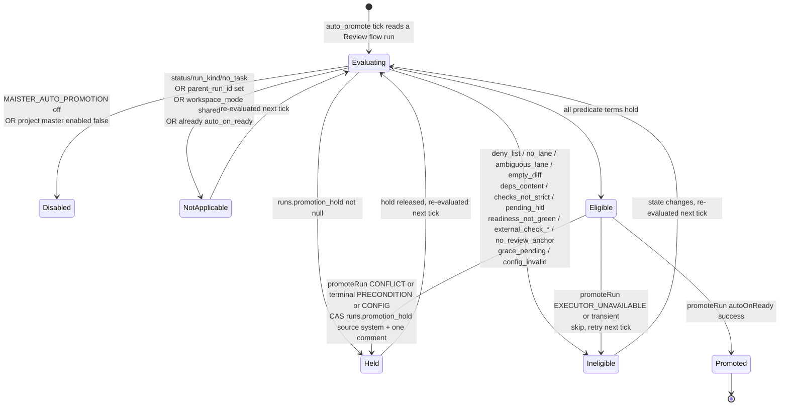

### Process flow — the sweep

The `auto_promote` handler mirrors `auto_launch_triaged`: a cheap SQL prefilter,
a FULL re-evaluation per candidate at claim time, then a single call into
`promoteRun` with system attribution. Cross-caller race safety is `promoteRun`'s
existing claim token; the sweep's own singleton lease (budget 1) prevents
overlapping ticks during a long merge.

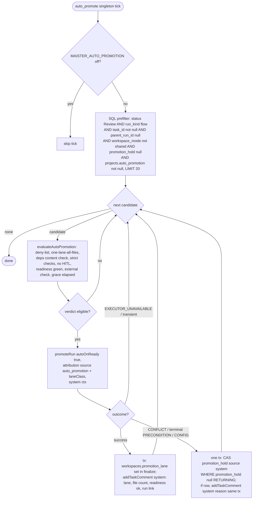

### Expectations

- Auto-promotion MUST call the SAME `promoteRun` with the same
  `assertEvidenceReady("review")` re-gate and blocking-gate checks; there is no
  second promotion path and no evidence/readiness rule is relaxed (the
  `autoOnReady: true` waiver is the pre-existing system-promotion semantics).
  (INV-1)
- `HARD_DENY_GLOBS` MUST be evaluated before lanes, MUST NOT be configurable, and
  a deny-listed file — including a rename target OR source (`oldPath`) — MUST
  defeat EVERY lane, with the offending files named on the panel. (INV-2)
- The predicate MUST be fail-closed: unknown/zero/ambiguous lane, malformed
  config, missing `runs.review_entered_at` anchor, non-strict checks
  (`checksFromSnapshot(execution_policy) !== 'strict'`), pending HITL, or a
  stale/failed/missing blocking gate ⇒ not eligible, silently, and always
  fail-to-manual (the human Promote is unaffected). (INV-3)
- A blocking `human_review` gate MUST NEVER be satisfied by this feature. (INV-4)
- Exactly one promotion MUST win under concurrency (sweep vs human vs ext): the
  loser gets `MaisterError("CONFLICT")`; there is exactly one terminal
  transition, guaranteed by `promoteRun`'s existing `promotion_attempt_id` claim
  token. (INV-5)
- Conflict give-up MUST equal today's manual conflict semantics PLUS
  `runs.promotion_hold={source:'system'}` PLUS exactly ONE system comment,
  CAS-guarded on `promotion_hold IS NULL`; a held run MUST NEVER be retried until
  explicitly released. (INV-6)
- The `deps` lane MUST admit ONLY registry-version-specifier value changes on
  both-sided dependency-block keys; non-version specifiers
  (`file:`/`link:`/`portal:`/`git`/`github:`/`ssh:`/`http(s)`/`workspace:`/
  `npm:`-alias/path), additions/removals/out-of-block changes/parse failures, AND
  lockfile-only diffs (no manifest change) MUST disqualify without throwing; a
  lockfile riding a validated manifest passes a best-effort non-registry-resolution
  scan (full per-format consequence-proof is a Phase-2 residual, R4). (INV-7)
- Scratch, orchestrator-child (`parent_run_id IS NOT NULL`), shared-workspace
  (`workspace_mode='shared'`), and — once its substrate lands — non-concluded-
  experiment-member runs MUST NEVER be candidates, by design. (INV-8)
- Grace timing MUST derive from `runs.review_entered_at` (stamped at each
  Review-flip, consumed by no domain-event consumer); rework re-entry re-stamps
  and restarts the window; NULL ⇒ not eligible. (INV-9)
- The sweep and the run-detail panel MUST render from ONE `evaluateAutoPromotion`
  function — byte-identical verdicts for identical state. (INV-10)
- `MAISTER_AUTO_PROMOTION=off` AND the project master toggle MUST each stop NEW
  promotions within one tick while in-flight `promoteRun` calls complete; the
  master default is OFF; a never-configured project gets the four shipped lanes +
  10-minute grace the moment the master flips ON. (INV-11)
- Every auto-promotion MUST be attributable from the task thread alone (one
  system comment: lane, file count, readiness ✓, run link) AND from data
  (`workspaces.promotion_lane` non-null, system actor on the existing
  `run.done` webhook/domain events); all new strings ship EN+RU and this feature
  adds exactly one migration and no new `MaisterError` code. (INV-12, INV-13)

### Edge cases

- **`empty_diff` (E1)** — a zero-file diff ⇒ ineligible, skipped; no promotion,
  no error. Fail-to-manual.
- **`CONFLICT` / target branch deleted (E2)** — the promote aborts, the run stays
  `Review`, the give-up hold+comment names the missing target branch. Maps to
  `MaisterError("CONFLICT")`.
- **`external_check_missing` (E3)** — a lane's `requireExternalCheckId` is not
  declared in the compiled FlowGraph gate set at all ⇒ ineligible with the misconfig
  surfaced on the panel (distinct from `external_check_not_passed`, where the id is
  declared but its `gate_results` latest status is not passed/overridden). Fail-to-manual.
- **Lane disabled between ticks (E4)** — the full re-evaluation at claim time
  re-reads config, so a lane an operator disabled mid-grace skips on the next
  tick; no promotion fires under a since-disabled lane.
- **Manual promote during grace (E5)** — a human promotes while the run is in its
  grace window; the candidate is gone (status no longer `Review`) on the next
  tick, so there is no double comment or double promotion. Serialized by the
  `promoteRun` claim; loser (if any) gets `MaisterError("CONFLICT")`.
- **Hold across rework (E6)** — `runs.promotion_hold` is never cleared by state
  transitions, so a `{source:'launch'}` or `{source:'user'}` hold survives a
  rework loop and the run stays out of the sweep until explicitly released.
- **Promotion-mode change mid-grace (E7)** — the current lane config is read at
  claim time, so a lane `mode` changed during the grace window takes effect on
  the promoting tick (no stale snapshot).
- **Singleton lease vs long merge (E8)** — the `auto_promote` job is a budget-1
  systemManaged singleton; its `claimDueJobs` CAS prevents a second tick from
  overlapping an in-flight long merge.
- **Deny via rename (E9)** — a rename INTO `.claude/` (or any deny path) from an
  allowed path is caught because the deny-list checks both `path` and rename
  `oldPath`; the whole diff is disqualified. Fail-to-manual.
- **i18n verbatim files (E10)** — `files`/`detail` in a verdict are rendered
  untranslated (verbatim paths); only the `reasonCode` labels are translated
  (EN+RU).
- **Terminal `PRECONDITION` give-up** — stale/not-green readiness at promote time
  after an eligible evaluation is treated as terminal give-up (needs human eyes):
  hold + one comment, mapping to `MaisterError("PRECONDITION")`. A transient
  `MaisterError("EXECUTOR_UNAVAILABLE")` instead skips with no hold and retries.

### Linked artifacts

- ADR: [ADR-126 Auto-promotion lanes](../decisions.md#adr-126-auto-promotion-lanes)
  (Proposed). Full requirements, predicate terms 1–17, invariants INV-1…13, edge
  cases E1…E10, and the test matrix live in the SDD plan
  `.ai-factory/plans/auto-promotion-lanes.md`.
- Boundary docs (no duplication, R7):
  [`execution-policy.md`](execution-policy.md) (the C1 `auto_on_ready` autopilot
  that OR-combines with lanes — such runs are `not_applicable`),
  [`readiness.md`](readiness.md) (the readiness gate lanes read, never relax),
  [`scheduler.md`](scheduler.md) (the `auto_promote` job kind).
- Source (all Implemented): `web/lib/auto-promotion/config.ts` (schemas +
  `BUILT_IN_LANES` + `resolveAutoPromotionConfig` + `autoPromotionEnabledFromEnv`),
  `web/lib/auto-promotion/classify.ts` (deny-list + lane classifier),
  `web/lib/auto-promotion/deps-check.ts` (manifest + lockfile content check),
  `web/lib/auto-promotion/evaluate.ts` (the ONE shared `evaluateAutoPromotion`),
  `web/lib/scheduler/handlers/auto-promote.ts` (the sweep), plus the
  attribution delta in `web/lib/runs/promote.ts`.
- DB: migration `0089_auto_promotion_lanes` (four columns —
  `projects.auto_promotion`, `runs.promotion_hold`, `runs.review_entered_at`,
  `workspaces.promotion_lane`) — [`../db/runs-domain.md`](../db/runs-domain.md).
- API: `PATCH /api/projects/{slug}/settings` (`autoPromotion`),
  `PUT|DELETE /api/runs/{runId}/promotion-hold`,
  `GET /api/runs/{runId}/auto-promotion`, and the `auto_promote` `jobKind` on
  `GET|POST /api/cron/tick` — [`../api/web.openapi.yaml`](../api/web.openapi.yaml).
- Config: [`../configuration.md`](../configuration.md) (`MAISTER_AUTO_PROMOTION`).
- Error taxonomy: [`../error-taxonomy.md`](../error-taxonomy.md) (`CONFLICT` /
  `PRECONDITION` — the sweep reuses these; no new code).
